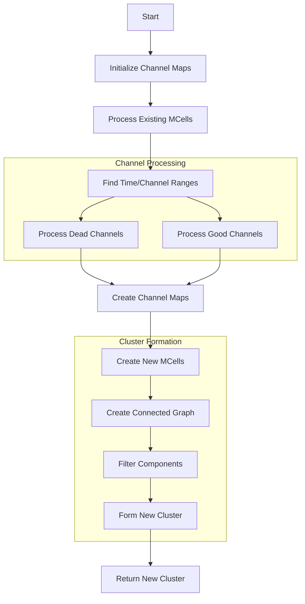

# Understanding the PR3DCluster_1 Improvement Algorithm

## Overview
The `Improve_PR3DCluster_1` function is designed to improve 3D clusters by handling dead channels and enhancing channel connectivity. It focuses on working with time slices and channel maps to create more accurate merged cells.

## Flow Diagram


## Key Data Structures

### 1. Channel Maps
```cpp
// Time-based channel maps
std::map<int,std::set<int>> u_time_chs; // U plane
std::map<int,std::set<int>> v_time_chs; // V plane
std::map<int,std::set<int>> w_time_chs; // W plane

// Charge maps
std::map<std::pair<int,int>,double> time_ch_charge_map;
std::map<std::pair<int,int>,double> time_ch_charge_err_map;
```

### 2. Time Range Tracking
```cpp
int min_time = 1e9;
int max_time = -1e9;
int min_uch = 1e9;
int max_uch = -1e9;
// Similar for v and w channels
```

## Key Steps Explained

### 1. Initialize and Process Existing MCells
```cpp
void process_existing_mcells(SMGCSelection& mcells) {
    for (auto it = mcells.begin(); it != mcells.end(); it++) {
        SlimMergeGeomCell *mcell = (*it);
        int time_slice = mcell->GetTimeSlice();
        
        // Process U wires
        for (auto wire : mcell->get_uwires()) {
            double charge = mcell->Get_Wire_Charge(wire);
            u_time_chs[time_slice].insert(wire->channel());
            time_ch_charge_map[{time_slice, wire->channel()}] = charge;
        }
        // Similar for V and W wires
    }
}
```

### 2. Handle Dead Channels
```cpp
void process_dead_channels(ToyCTPointCloud& ct_point_cloud) {
    // Get dead channel ranges
    auto dead_uch_ranges = ct_point_cloud.get_overlap_dead_chs(
        min_time, max_time, min_uch, max_uch, 0, false
    );
    
    for (int time_slice = min_time; time_slice <= max_time; time_slice++) {
        for (auto range : dead_uch_ranges) {
            for (int ch = range.first; ch <= range.second; ch++) {
                // Check if channel is within relevant distance
                if (is_channel_relevant(time_slice, ch)) {
                    u_time_chs[time_slice].insert(ch);
                    time_ch_charge_map[{time_slice, ch}] = 0;
                }
            }
        }
    }
}
```

### 3. Process Good Channels
```cpp
void handle_good_channels(ToyCTPointCloud& ct_point_cloud) {
    auto map_u_tcc = ct_point_cloud.get_overlap_good_ch_charge(
        min_time, max_time, min_uch, max_uch, 0
    );
    
    for (auto& [time_ch, charge_info] : map_u_tcc) {
        int time_slice = time_ch.first;
        int channel = time_ch.second;
        double charge = charge_info.first;
        
        if (charge > 0) {
            u_time_chs[time_slice].insert(channel);
            time_ch_charge_map[{time_slice, channel}] = charge;
        }
    }
}
```

### 4. Create New Merged Cells
```cpp
void create_merged_cells(WCP2dToy::WCPHolder *holder) {
    for (auto& [time_slice, uchs] : u_time_chs) {
        WCP2dToy::LowmemTiling tiling(time_slice, gds, *holder);
        tiling.init_good_cells_with_charge(
            u_time_chs, 
            v_time_chs, 
            w_time_chs, 
            time_ch_charge_map, 
            time_ch_charge_err_map
        );
    }
}
```

### 5. Form Connected Components
```cpp
void create_connectivity_graph(const GeomCellSelection& cells) {
    const int N = cells.size();
    boost::adjacency_list<boost::setS, boost::vecS, boost::undirectedS,
        boost::no_property, boost::property<boost::edge_weight_t, double>>
        temp_graph(N);
        
    // Add edges between overlapping cells
    for (auto it = cells.begin(); it != cells.end(); it++) {
        SlimMergeGeomCell *mcell1 = *it;
        for (auto it2 = it + 1; it2 != cells.end(); it2++) {
            SlimMergeGeomCell *mcell2 = *it2;
            if (mcell1->Overlap_fast(mcell2)) {
                add_edge(
                    map_mcell_index[mcell1],
                    map_mcell_index[mcell2],
                    1,
                    temp_graph
                );
            }
        }
    }
}
```

## Example Usage

Here's how to use the improvement function:

```cpp
// Example usage of the cluster improvement
void improve_cluster_example() {
    // Create input cluster
    WCPPID::PR3DCluster* input_cluster = new WCPPID::PR3DCluster(1);
    
    // Setup necessary components
    ToyCTPointCloud ct_point_cloud;
    WCPSst::GeomDataSource gds;
    WCP2dToy::WCPHolder holder;
    
    // Improve the cluster
    WCPPID::PR3DCluster* improved_cluster = 
        WCPPID::Improve_PR3DCluster_1(
            input_cluster,
            ct_point_cloud,
            gds,
            &holder
        );
    
    // Work with improved cluster
    std::cout << "Original MCells: " << input_cluster->get_mcells().size() 
              << std::endl;
    std::cout << "Improved MCells: " << improved_cluster->get_mcells().size() 
              << std::endl;
}
```

## Important Considerations

### 1. Dead Channel Handling
- Identifies dead channels in detector regions
- Creates placeholder charges for interpolation
- Maintains connectivity across dead regions

### 2. Charge Processing
- Handles both positive and zero charges
- Manages charge error estimation
- Maintains charge consistency across planes

### 3. Connectivity
- Ensures proper cell connectivity in time slices
- Handles overlapping cells
- Maintains track continuity

### 4. Performance Optimization
- Uses efficient data structures for lookups
- Minimizes redundant calculations
- Optimizes memory usage for large datasets

## Best Practices

1. **Input Validation**
   - Verify cluster data integrity
   - Check channel range validity
   - Validate time slice consistency

2. **Error Handling**
   - Handle missing channel data
   - Manage edge cases in connectivity
   - Validate charge values

3. **Memory Management**
   - Clean up temporary structures
   - Manage large channel maps
   - Handle resource allocation

## Common Challenges and Solutions

### 1. Dead Channel Regions
- **Challenge**: Large gaps in detector coverage
- **Solution**: Interpolation and connectivity preservation

### 2. Charge Consistency
- **Challenge**: Maintaining charge balance
- **Solution**: Careful charge mapping and error tracking

### 3. Time Slice Alignment
- **Challenge**: Ensuring proper time alignment
- **Solution**: Rigorous time slice tracking and validation

## Conclusion
The PR3DCluster_1 improvement algorithm provides a robust method for handling dead channels and improving cluster reconstruction. Its systematic approach to channel mapping and connectivity ensures reliable track reconstruction even in challenging detector regions.