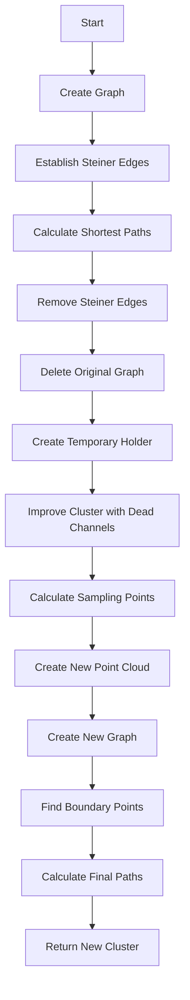

# Understanding the PR3DCluster Improvement Algorithm

## Overview
The `Improve_PR3DCluster_2` function is designed to enhance and refine 3D clusters in particle tracking. It takes an existing PR3DCluster and improves it by establishing better connections between points and handling dead/noisy channels.

## Flow Diagram


## Key Steps

### 1. Initial Graph Creation
The function starts by creating a graph representation of the cluster:

```cpp
cluster->Create_graph(ct_point_cloud);
```

see [Establish Graph](../graph/create_graph.md)

This establishes connections between points in the cluster based on their spatial relationships.

### 2. Steiner Tree Integration
The algorithm then establishes Steiner edges to optimize connectivity:

```cpp
cluster->establish_same_mcell_steiner_edges(gds);
```
see [Establish Same MCell Steiner Edges](../steiner/establish_same_mcell_steiner_edges.md)


Steiner edges help in:
- Connecting isolated components
- Optimizing path lengths
- Handling geometric constraints

### 3. Path Calculation
The function calculates the shortest paths between boundary points:

```cpp
std::pair<WCPointCloud<double>::WCPoint,WCPointCloud<double>::WCPoint> wcps1 = 
    cluster->get_two_boundary_wcps();
cluster->dijkstra_shortest_paths(wcps1.first);
cluster->cal_shortest_path(wcps1.second);
```

### 4. Dead Channel Handling
The algorithm specifically handles dead channels through:

```cpp
WCPPID::PR3DCluster *temp_cluster = WCPPID::Improve_PR3DCluster_1(
    cluster,
    ct_point_cloud, 
    gds,
    temp_holder1
);
```

see [Improve_PR3DCluster_1](../Improve_PR3DCluster_1.md)


This step:
- Identifies dead channels
- Creates alternative paths around them
- Maintains track continuity

### 5. Point Cloud Refinement
The cluster's point cloud is refined through sampling and reconstruction:

```cpp
WCPPID::calc_sampling_points(
    gds,
    temp_cluster,
    nrebin, 
    frame_length, 
    unit_dis,
    false
);
```
see [Calc_sampling_points](../graph/calc_sampling_points.md)


## Important Data Structures

### 1. Graph Structure
```cpp
typedef adjacency_list<setS, vecS, undirectedS, VertexProp, EdgeProp> MCUGraph;
```

### 2. Point Cloud
```cpp
class ToyPointCloud {
    WCPointCloud<double> cloud;
    // ... other members
};
```

## Example Usage

Here's a typical usage example:

```cpp
// Create a cluster improver
WCPPID::PR3DCluster* improve_cluster(WCPPID::PR3DCluster* original_cluster) {
    // Setup geometry
    WCPSst::GeomDataSource gds;
    WCP2dToy::WCPHolder holder;
    
    // Configuration parameters
    int nrebin = 4;
    int frame_length = 1000;
    double unit_dis = 0.1;
    
    // Improve the cluster
    WCPPID::PR3DCluster* improved = 
        WCPPID::Improve_PR3DCluster_2(
            original_cluster,
            ct_point_cloud,
            gds,
            &holder,
            nrebin,
            frame_length,
            unit_dis
        );
    
    return improved;
}
```

## Algorithm Benefits

1. **Improved Connectivity**
   - Better handling of gaps and dead channels
   - More robust path finding

2. **Enhanced Accuracy**
   - Better point cloud representation
   - More accurate track reconstruction

3. **Noise Reduction**
   - Filtering of spurious connections
   - Better handling of detector noise

4. **Path Optimization**
   - Shorter, more efficient paths
   - Better handling of complex geometries

## Common Challenges and Solutions

### 1. Dead Channels
- **Challenge**: Missing information in detector regions
- **Solution**: Path interpolation and alternative routing

### 2. Noise
- **Challenge**: False signals and connections
- **Solution**: Filtering and validation of connections

### 3. Path Finding
- **Challenge**: Complex geometries and multiple paths
- **Solution**: Steiner tree optimization and shortest path algorithms

## Performance Considerations

1. **Memory Usage**
   - Graph structure storage
   - Point cloud data
   - Temporary holders

2. **Computation Time**
   - Path finding algorithms
   - Point cloud operations
   - Graph manipulations

## Best Practices

1. **Input Validation**
   - Check cluster validity
   - Verify geometry data
   - Validate parameters

2. **Error Handling**
   - Handle missing data
   - Check for null pointers
   - Validate results

3. **Resource Management**
   - Clean up temporary structures
   - Manage memory allocation
   - Delete intermediate results

## Conclusion
The PR3DCluster improvement algorithm provides a robust way to enhance 3D cluster reconstruction by optimizing connectivity, handling dead channels, and improving path finding. Its modular design allows for future enhancements and adaptations to different detector configurations.