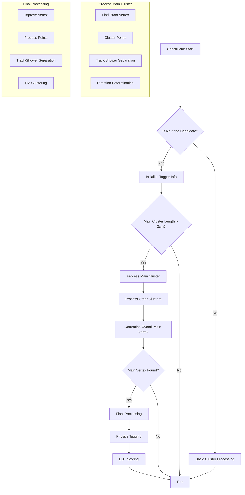

# NeutrinoID Class Documentation

## Overview
The NeutrinoID class is a comprehensive neutrino event reconstruction and classification system used in particle physics analysis. It processes detector data to identify neutrino interactions, reconstruct particle trajectories, and classify event types.

## Data Structures

### WCPointTree Structure
Used for storing point-level reconstruction information:
```cpp
struct WCPointTree {
    Double_t reco_x, reco_y, reco_z;          // Reconstructed position
    Double_t reco_dQ, reco_dx;                // Charge and length measurements
    Double_t reco_chi2, reco_ndf;             // Fit quality
    Double_t reco_pu, reco_pv, reco_pw, reco_pt; // Projections
    Double_t reco_reduced_chi2;               // Reduced chi-square
    Int_t reco_flag_vertex;                   // Vertex flag
    Int_t reco_mother_cluster_id;             // Parent cluster ID
    Int_t reco_cluster_id;                    // Current cluster ID
    Int_t reco_proto_cluster_id;              // Proto segment ID
    Int_t reco_particle_id;                   // Particle type ID
    Int_t reco_flag_track_shower;             // Track/shower classification
    Double_t reco_flag_track_shower_charge;   // Charge-based classification
};
```

### WCRecoTree Structure
Used for storing event-level reconstruction information:
```cpp
struct WCRecoTree {
    int mc_Ntrack;                            // Number of tracks
    int mc_id[1000];                          // Track IDs
    int mc_pdg[1000];                         // Particle PDG codes
    int mc_process[1000];                     // Process codes
    int mc_mother[1000];                      // Mother track IDs
    int mc_included[1000];                    // Energy inclusion flags
    int mc_dir_weak[1000];                    // Direction confidence
    int mc_stopped[1000];                     // Stopping particle flags
    float mc_length[1000];                    // Track lengths
    float mc_kine_range[1000];                // Kinetic energy by range
    float mc_kine_dQdx[1000];                // Kinetic energy by dQ/dx
    float mc_kine_charge[1000];               // Kinetic energy by charge
    float mc_startXYZT[1000][4];              // Start position/time
    float mc_endXYZT[1000][4];                // End position/time
    float mc_startMomentum[1000][4];          // Initial 4-momentum
    float mc_endMomentum[1000][4];            // Final 4-momentum
    std::vector<std::vector<int>> *mc_daughters; // Daughter track IDs
};
```

### KineInfo Structure
Used for storing kinematic information:
```cpp
struct KineInfo {
    // Neutrino vertex
    float kine_nu_x_corr, kine_nu_y_corr, kine_nu_z_corr;
    
    // Energy reconstruction
    float kine_reco_Enu;                      // Reconstructed neutrino energy
    float kine_reco_add_energy;               // Additional energy
    std::vector<float> kine_energy_particle;  // Per-particle energy
    std::vector<int> kine_energy_info;        // Energy reconstruction type
    std::vector<int> kine_particle_type;      // Particle types
    std::vector<int> kine_energy_included;    // Energy inclusion flags
    
    // Pi0 reconstruction
    float kine_pio_mass;                      // Pi0 mass
    int kine_pio_flag;                        // Pi0 reconstruction status
    float kine_pio_vtx_dis;                   // Distance to vertex
    float kine_pio_energy_1, kine_pio_energy_2; // Photon energies
    float kine_pio_theta_1, kine_pio_theta_2;   // Photon angles theta
    float kine_pio_phi_1, kine_pio_phi_2;       // Photon angles phi
    float kine_pio_dis_1, kine_pio_dis_2;       // Photon distances
    float kine_pio_angle;                     // Opening angle
};
```

## Key Internal Variables

### Core Infrastructure
- `ct_point_cloud`: Point cloud for clustering
- `global_wc_map`: Wire-cell global map
- `flash_time`: Time of the flash
- `offset_x`: X coordinate offset
- `fid`: Fiducial volume definition

### Mapping and Organization
- `map_cluster_vertices`: Maps clusters to vertex sets
- `map_vertex_cluster`: Maps vertices to their clusters
- `map_cluster_segments`: Maps clusters to segment sets
- `map_segment_cluster`: Maps segments to their clusters
- `residual_segment_candidates`: Holds unassigned segments
- `charge_2d_u/v/w`: 2D charge projections

### Reconstruction State
- `flag_neutrino_id_process`: Process control flag
- `flag_dl_vtx`: Deep learning vertex flag
- `dl_vtx_cut`: Vertex cut parameter
- `match_isFC`: Fiducial volume match parameter

## Main Functions

### Initialization and Setup
```cpp
NeutrinoID(PR3DCluster* main_cluster, 
           std::vector<PR3DCluster*>& other_clusters,
           std::vector<PR3DCluster*>& all_clusters,
           ...);  // Constructor

void init_tagger_info();
void organize_vertices_segments();
```

[init_info](./NeutrinoID/fill_info.md)

[organize_vertices_segments](./NeutrinoID/organize_vertices_segments.md)

### Event Processing
```cpp
void process_main_cluster();
void process_other_clusters();
void find_proto_vertex(PR3DCluster* cluster, bool flag_break_track, int nrounds);
void break_segments(std::vector<ProtoSegment*>& segments, PR3DCluster* cluster);
void examine_vertices(PR3DCluster* cluster);
```

[process_main_cluster (not really used)](./NeutrinoID/NeutrinoID_cxx.md.md)

[process_other_clusters (not really used)](./NeutrinoID/NeutrinoID_cxx.md)

### Vertex Finding and Improvement
```cpp
void determine_direction(PR3DCluster* cluster);
void determine_main_vertex(PR3DCluster* cluster);
void determine_overall_main_vertex();  [more details](./NeutrinoID/determine_overall_main_vertex.md)
bool determine_overall_main_vertex_DL();
void improve_vertex(PR3DCluster* cluster, bool search_activity, bool final_vertex);
bool examine_vertex_position(ProtoVertex* vertex);
```

[determine_overall_main_vertex_DL](./NeutrinoID/NeutrinoID_DL.md)

### Track/Shower Separation
```cpp
void separate_track_shower();
void shower_clustering_with_nv();
void shower_determing_in_main_cluster();
void examine_showers();
```

### Graph Management
```cpp
bool del_proto_vertex(ProtoVertex* pv);
bool del_proto_segment(ProtoSegment* ps);
bool add_proto_connection(ProtoVertex* pv, ProtoSegment* ps, WCPPID::PR3DCluster* cluster);
bool del_proto_connection(ProtoVertex* pv, ProtoSegment* ps);

// Segment/Vertex Finding
ProtoSegment* init_first_segment(PR3DCluster* cluster, bool flag_back_search = true);
void init_point_segment(PR3DCluster* cluster);
ProtoVertex* find_vertex_other_segment(PR3DCluster* cluster, bool flag_forward, WCPointCloud<double>::WCPoint& wcp);
std::tuple<ProtoVertex*, ProtoSegment*, Point> check_end_point(PR3DCluster* cluster, PointVector& tracking_path, bool flag_front = true);

// Vertex/Segment Relationship
WCPPID::ProtoSegment* find_segment(ProtoVertex* v1, ProtoVertex* v2);
std::pair<ProtoVertex*, ProtoVertex*> find_vertices(ProtoSegment* sg);
ProtoVertex* find_other_vertex(ProtoSegment* sg, ProtoVertex* v1);
ProtoVertexSelection find_vertices(PR3DCluster* cluster);
ProtoSegmentSelection find_segments(PR3DCluster* cluster);
std::pair<ProtoVertex*, ProtoVertex*> get_start_end_vertices(ProtoSegment* seg);
```

### Vertex/Segment Examination and Modification
```cpp
bool examine_vertices_1(PR3DCluster* cluster);
bool examine_vertices_2(PR3DCluster* cluster);
bool examine_vertices_3();
bool examine_vertices_4(PR3DCluster* cluster);
bool examine_vertices_4(ProtoVertex* v1, ProtoVertex* v2);

bool modify_vertex_isochronous(ProtoVertex* vtx, ProtoVertex* v1, ProtoSegment* sg, ProtoVertex* v2, PR3DCluster* cluster);
bool modify_segment_isochronous(ProtoSegment* sg1, ProtoVertex* v1, ProtoSegment* sg, ProtoVertex* v2, PR3DCluster* cluster);

void examine_partial_identical_segments(PR3DCluster* cluster);
bool examine_structure_final(PR3DCluster* cluster);
bool examine_structure_final_1(PR3DCluster* cluster);
bool examine_structure_final_1p(PR3DCluster* cluster);
bool examine_structure_final_2(PR3DCluster* cluster);
bool examine_structure_final_3(PR3DCluster* cluster);

void examine_structure(PR3DCluster* cluster);
bool examine_structure_1(PR3DCluster* cluster);
bool examine_structure_2(PR3DCluster* cluster);
bool examine_structure_3(PR3DCluster* cluster);
bool examine_structure_4(ProtoVertex* vertex, PR3DCluster* cluster, bool flag_final_vertex = false);
```

### Map Management and Analysis
```cpp
void improve_maps_one_in(PR3DCluster* cluster, bool flag_strong_check = true);
void fix_maps_shower_in_track_out(int cluster_id);
void fix_maps_multiple_tracks_in(int cluster_id);
void improve_maps_shower_in_track_out(int cluster_id, bool flag_strong_check = true);
void improve_maps_multiple_tracks_in(int cluster_id);
void improve_maps_no_dir_tracks(int cluster_id);
void judge_no_dir_tracks_close_to_showers(int cluster_id);
void examine_good_tracks(int cluster_id);

bool examine_maps(PR3DCluster* cluster);
bool examine_maps(ProtoVertex* vertex);
bool examine_maps(int cluster_id);
float calc_conflict_maps(ProtoVertex* vertex);
```

### Shower Analysis
```cpp
void examine_all_showers(PR3DCluster* cluster);
std::pair<int, double> calculate_num_daughter_showers(ProtoVertex* vtx, ProtoSegment* sg, bool flag_count_shower = true);
std::pair<int, double> calculate_num_daughter_tracks(ProtoVertex* vtx, ProtoSegment* sg, bool flag_count_shower = false, double length_cut = 0);
void change_daughter_type(ProtoVertex* vtx, ProtoSegment* sg, int particle_type, double mass);

// Shower Pattern Recognition
bool gap_identification(ProtoVertex* vertex, ProtoSegment* sg, bool flag_single_shower = false);
bool mip_quality(ProtoVertex* vertex, ProtoSegment* sg, WCShower* shower);
bool stem_direction(WCShower* shower, double energy);
bool bad_reconstruction(WCShower* shower);
bool low_energy_overlapping(WCShower* shower);
bool high_energy_overlapping(WCShower* shower);
```

### Debugging and Information
```cpp
void print_segs_info(PR3DCluster* cluster);
void print_segs_info(ProtoVertex* vertex);
void print_segs_info(int cluster_id, ProtoVertex* spec_vertex = 0);
```

### Particle Identification
```cpp
bool cosmic_tagger();
std::pair<bool, double> numu_tagger();
bool nue_tagger(double muon_kine_energy = 0);
bool singlephoton_tagger(double muon_kine_energy = 0);
```

### Additional Shower Analysis Functions
```cpp
bool stem_length(WCShower* shower, double energy);
bool compare_muon_energy(WCShower* shower, double energy, double muon_length);
bool single_shower_pio_tagger(WCShower* shower, bool flag_single_shower);
bool shower_to_wall(WCShower* shower, double shower_energy, bool flag_single_shower);
bool broken_muon_id(WCShower* shower);
bool track_overclustering(WCShower* shower);
bool multiple_showers(WCShower* shower, double max_energy);
bool vertex_inside_shower(WCShower* shower);
bool angular_cut(WCShower* shower, double energy, double angle);
bool single_shower(WCShower* shower, bool flag_single_shower);
bool low_energy_michel(WCShower* shower);
```

### Direction and Clustering Functions
```cpp
TVector3 calc_dir_cluster(int cluster_id, Point& test_p, double dis_cut);
std::pair<ProtoSegment*, ProtoVertex*> find_cont_muon_segment(ProtoSegment* sg, ProtoVertex* vtx, bool flag_ignore_dQ_dx = false);
std::pair<ProtoSegment*, ProtoVertex*> find_cont_muon_segment_nue(ProtoSegment* sg, ProtoVertex* vtx, bool flag_ignore_dQ_dx = false);
void find_other_segments(PR3DCluster* cluster, bool flag_break_track = true, double search_range = 1.5*units::cm);
```

[calc_dir_cluster](./NeutrinoID/NeutrinoID_cxx.md)

### Helper Functions
```cpp
double cal_corr_factor(Point& p, double offset_u, double slope_yu, double slope_zu, 
                      double offset_v, double slope_yv, double slope_zv,
                      double offset_w, double slope_yw, double slope_zw);
void swap_main_cluster(PR3DCluster* new_main_cluster); [more details](./NeutrinoID/determine_overall_main_vertex.md)
int get_num_segments(ProtoVertex* pv);
void check_switch_main_cluster(); [more details](./NeutrinoID/determine_overall_main_vertex.md)
void check_switch_main_cluster(ProtoVertex* temp_main_vertex, PR3DCluster* max_length_cluster); [more details](./NeutrinoID/determine_overall_main_vertex.md)
```

[get_num_segments](./NeutrinoID/NeutrinoID_cxx.md)

### BDT Scoring Functions
```cpp
// General BDT scores
float cal_bdts();
float cal_bdts_xgboost();
float cal_numu_bdts();
float cal_numu_bdts_xgboost();

// Individual component BDT scores
float cal_mipid_bdt(float default_val = 0.5);
float cal_gap_bdt(float default_val = 0.5);
float cal_hol_lol_bdt(float default_val = 0.5);
float cal_cme_anc_bdt(float default_val = 0.5);
float cal_mgo_mgt_bdt(float default_val = 0.5);
float cal_br1_bdt(float default_val = 0.5);
float cal_br3_bdt(float default_val = 0.5);
float cal_br3_3_bdt(float default_val = 0.5);
float cal_br3_5_bdt(float default_val = 0.5);
float cal_br3_6_bdt(float default_val = 0.5);
float cal_stemdir_br2_bdt(float default_val = 0.5);
float cal_trimuon_bdt(float default_val = 0.5);
float cal_br4_tro_bdt(float default_val = 0.5);
float cal_mipquality_bdt(float default_val = 0.5);
float cal_pio_1_bdt(float default_val = 0.5);
float cal_pio_2_bdt(float default_val = 0.5);
float cal_stw_spt_bdt(float default_val = 0.5);
float cal_vis_1_bdt(float default_val = 0.5);
float cal_vis_2_bdt(float default_val = 0.5);
float cal_stw_2_bdt(float default_val = 0.5);
float cal_stw_3_bdt(float default_val = 0.5);
float cal_stw_4_bdt(float default_val = 0.5);
float cal_sig_1_bdt(float default_val = 0.5);
float cal_sig_2_bdt(float default_val = 0.5);
float cal_lol_1_bdt(float default_val = 0.5);
float cal_lol_2_bdt(float default_val = 0.5);
float cal_tro_1_bdt(float default_val = 0.5);
float cal_tro_2_bdt(float default_val = 0.5);
float cal_tro_4_bdt(float default_val = 0.5);
float cal_tro_5_bdt(float default_val = 0.5);

// Cosmic tagger BDTs
float cal_cosmict_2_4_bdt(float default_val);
float cal_cosmict_3_5_bdt(float default_val);
float cal_cosmict_6_bdt(float default_val);
float cal_cosmict_7_bdt(float default_val);
float cal_cosmict_8_bdt(float default_val);
float cal_cosmict_10_bdt(float default_val);

// Numu specific BDTs
float cal_numu_1_bdt(float default_val);
float cal_numu_2_bdt(float default_val);
float cal_numu_3_bdt(float default_val);
```cpp
float cal_numu_bdts();
float cal_numu_bdts_xgboost();
float cal_bdts();
float cal_bdts_xgboost();
```

### Output Generation [more details](./NeutrinoID/fill_info.md)
```cpp
void fill_reco_tree(ProtoSegment* seg, WCRecoTree& rtree);
void fill_reco_tree(WCShower* shower, WCRecoTree& rtree);
void fill_kine_tree(KineInfo& ktree);
void fill_skeleton_info(int mother_cluster_id, WCPointTree& ptree, TTree* T);
```

### Pi0 Reconstruction
```cpp
void id_pi0_with_vertex();
void id_pi0_without_vertex();
std::pair<int, int> fill_pi0_reco_tree(WCShower* shower, WCRecoTree& rtree);
```

### Support Functions
```cpp
TVector3 get_dir(ProtoVertex* vtx, double dis_cut = 5*units::cm);
void collect_2D_charges();
double cal_kine_charge(ProtoSegment* sg);
double cal_kine_charge(WCShower* shower);
```

[get_dir](./NeutrinoID/NeutrinoID_cxx.md)

## Usage Example

```cpp
// Initialize NeutrinoID
WCPPID::NeutrinoID neutrino_id(
    main_cluster,
    other_clusters,
    all_clusters,
    fiducial_volume,
    geometry,
    parameters...
);

// Process clusters
neutrino_id.process_main_cluster();
neutrino_id.process_other_clusters();

// Find and improve vertex
neutrino_id.determine_main_vertex(main_cluster);
neutrino_id.improve_vertex(main_cluster, true, true);

// Perform particle identification
bool is_cosmic = neutrino_id.cosmic_tagger();
auto numu_result = neutrino_id.numu_tagger();
bool is_nue = neutrino_id.nue_tagger();

// Calculate BDT scores
float numu_score = neutrino_id.cal_numu_bdts();
float nue_score = neutrino_id.cal_bdts();

// Fill output trees
WCRecoTree reco_tree;
KineInfo kine_info;
neutrino_id.fill_particle_tree(reco_tree);
neutrino_id.fill_kine_tree(kine_info);
```

[more details](./NeutrinoID/fill_info.md)

[Use find_incoming_segment](./NeutrinoID/find_incoming_segment.md)

## Dependencies
- WCPData: Core data structures
- WCPPID: Particle identification
- WCPSst: Signal processing
- ROOT: Data analysis framework
- Boost: Graph algorithms
- Eigen: Linear algebra

## Note on Performance
The class is optimized for reconstructing neutrino interactions in liquid argon time projection chambers (LArTPCs). It uses sophisticated algorithms for:
- 3D reconstruction
- Track/shower separation
- Particle identification
- Energy reconstruction
- Pi0 reconstruction

Performance can be tuned through various parameters in the constructor and configuration methods.

# NeutrinoID Constructor Analysis

## Overview
The NeutrinoID constructor is a complex function that initializes a neutrino identification system in a Wire-Cell Pattern Recognition framework. It processes clusters of points representing particle tracks and showers to identify neutrino interactions.

## Main Components

### 1. Input Parameters
```cpp
WCPPID::NeutrinoID::NeutrinoID(
    WCPPID::PR3DCluster *main_cluster1,                // Main cluster of points
    std::vector<WCPPID::PR3DCluster*>& other_clusters1,// Other clusters
    std::vector<WCPPID::PR3DCluster*>& all_clusters1,  // All clusters
    WCPPID::ToyFiducial* fid,                         // Fiducial volume
    WCPSst::GeomDataSource& gds,                      // Geometry data
    int nrebin, int frame_length,                     // Binning parameters
    float unit_dis,                                   // Unit distance
    ToyCTPointCloud* ct_point_cloud,                  // Point cloud
    std::map<int,std::map<const GeomWire*, SMGCSelection>>& global_wc_map,
    double flash_time,                                // Flash timing
    double offset_x,                                  // X offset
    int flag_neutrino_id_process,                    // Processing flags
    int flag_bdt,
    bool flag_dl_vtx,
    double dl_vtx_cut,
    float match_isFC,
    bool is_neutrino_candidate
)
```

### 2. Core Processing Steps

#### a. Initialization
```cpp
// Map cluster IDs
map_id_cluster[main_cluster->get_cluster_id()] = main_cluster;
main_cluster->create_steiner_graph(*ct_point_cloud, gds, nrebin, frame_length, unit_dis);

// Calculate cluster length
std::pair<WCP::WCPointCloud<double>::WCPoint,WCP::WCPointCloud<double>::WCPoint> two_wcps = 
    main_cluster->get_two_boundary_wcps();
map_cluster_length[main_cluster] = sqrt(pow(two_wcps.first.x - two_wcps.second.x, 2) + 
                                      pow(two_wcps.first.y - two_wcps.second.y, 2) + 
                                      pow(two_wcps.first.z - two_wcps.second.z, 2));
```

#### b. Process Other Clusters
```cpp
for (auto it = other_clusters.begin(); it!=other_clusters.end(); it++) {
    // Map cluster IDs
    map_id_cluster[(*it)->get_cluster_id()] = *it;
    
    // Create Steiner graphs for pattern recognition
    (*it)->create_steiner_graph(*ct_point_cloud, gds, nrebin, frame_length, unit_dis);
    
    // Calculate cluster lengths
    std::pair<WCP::WCPointCloud<double>::WCPoint,WCP::WCPointCloud<double>::WCPoint> two_wcps = 
        (*it)->get_two_boundary_wcps();
    double length = sqrt(pow(two_wcps.first.x - two_wcps.second.x, 2) + 
                        pow(two_wcps.first.y - two_wcps.second.y, 2) + 
                        pow(two_wcps.first.z - two_wcps.second.z, 2));
    map_cluster_length[*it] = length;
}
```

### 3. Main Processing Flow
For neutrino candidates (is_neutrino_candidate == true):

1. Initialize tagger information
2. Process main cluster if length > 3cm:
   - Find proto vertices
   - Cluster points
   - Separate tracks/showers
   - Determine directions
   - Process showers
   - Determine main vertex

3. Process other clusters:
   - For clusters > 6cm: full processing
   - For smaller clusters: simplified processing
   - Perform deghosting

4. Determine overall main vertex
5. If main vertex found:
   - Improve vertex fitting
   - Process points
   - Examine direction
   - Separate tracks/showers
   - Calculate 2D charges
   - Cluster EM showers

### 4. Called Functions

Major functions called during processing:

```cpp
// Vertex/Segment Processing
find_proto_vertex()
init_point_segment()
clustering_points()
separate_track_shower()
determine_direction()
shower_determing_in_main_cluster()
determine_main_vertex()
improve_vertex()
determine_overall_main_vertex()

// Pattern Recognition
collect_2D_charges()
shower_clustering_with_nv()
examine_direction()

// Physics Taggers
cosmic_tagger()
numu_tagger()
nue_tagger()
singlephoton_tagger()

// BDT Scoring
cal_numu_bdts_xgboost()
cal_bdts_xgboost()
cal_bdts()
```

[clustering_point](./NeutrinoID/clustering_point.md)

## Flow Diagram


## Key Concepts

1. **Proto Vertices/Segments**: Basic building blocks representing track/shower segments and their connection points.

2. **Steiner Graphs**: Used for pattern recognition to connect related points in 3D space.

3. **Track/Shower Separation**: Distinguishes between track-like (muons, protons) and shower-like (electrons, photons) particle signatures.

4. **Vertex Finding**: Identifies interaction vertices where particles originate.

5. **Physics Tagging**: Identifies specific physics processes (cosmic rays, νμCC, νeCC, etc.).

## Usage Example

```cpp
// Create required input objects
WCPPID::PR3DCluster* main_cluster = /* ... */;
std::vector<WCPPID::PR3DCluster*> other_clusters = /* ... */;
std::vector<WCPPID::PR3DCluster*> all_clusters = /* ... */;
WCPPID::ToyFiducial* fid = /* ... */;
WCPSst::GeomDataSource gds = /* ... */;
ToyCTPointCloud* ct_point_cloud = /* ... */;

// Initialize NeutrinoID
WCPPID::NeutrinoID nid(
    main_cluster,
    other_clusters,
    all_clusters,
    fid,
    gds,
    5,    // nrebin
    2400, // frame_length
    0.5,  // unit_dis
    ct_point_cloud,
    global_wc_map,
    0.0,  // flash_time
    0.0,  // offset_x
    1,    // flag_neutrino_id_process
    1,    // flag_bdt
    true, // flag_dl_vtx
    2.0,  // dl_vtx_cut
    1.0,  // match_isFC
    true  // is_neutrino_candidate
);

// Access results
auto main_vertex = nid.get_main_vertex();
auto neutrino_type = nid.get_neutrino_type();
```

