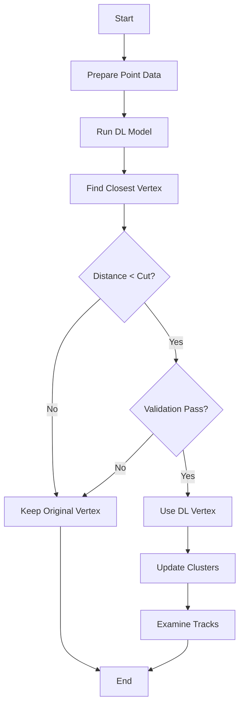

# Deep Learning Vertex Determination Function Analysis

## Overview

The `determine_overall_main_vertex_DL` function is part of the Wire-Cell neutrino reconstruction system. Its primary purpose is to determine the neutrino interaction vertex using deep learning techniques, potentially overriding traditional reconstruction methods.

## Function Flow

1. **Data Preparation**
   - Sets up scaling parameters for charge (dQ/dx) data
   - Creates vectors to store x,y,z coordinates and charge information
   - Collects vertex and segment point data into these vectors

2. **Vertex Candidate Collection**
   - Creates a list of candidate vertices from the existing map_vertex_segments

3. **Deep Learning Inference**
   - Uses SCN (Sparse Convolutional Network) model for vertex prediction
   - Model path: "./input_data_files/scn_vtx/t48k-m16-l5-lr5d-res0.5-CP24.pth"
   - Returns predicted x,y,z coordinates in centimeters

4. **Vertex Selection**
   - Finds the closest existing vertex to the DL prediction
   - Uses Euclidean distance calculation:
   ```cpp
   double dis = sqrt(pow(vtx->get_fit_pt().x - x_reg,2) + 
                    pow(vtx->get_fit_pt().y - y_reg,2) + 
                    pow(vtx->get_fit_pt().z - z_reg,2));
   ```

5. **Validation Checks**
   - Performs multiple validation checks on the selected vertex:
     - Examines connected segments
     - Checks track directionality
     - Validates charge distributions
   - Example validation code:
   ```cpp
   if (length > 15*units::cm && (!current_sg->is_dir_weak()) && 
       (!flag_start) && medium_dQ_dx > dQ_dx_cut * 43e3/units::cm) {
       num_bad++;
   }
   ```

6. **Final Decision**
   - Changes to DL vertex if validation passes
   - Updates main cluster if necessary
   - Performs additional examinations of connected tracks

## Key Decision Points



## Key Functions Called

1. **Data Reading Functions**
   - `window.fs.readFile`: Used for file I/O operations
   - `WCPPyUtil::read_npz`: Reads numpy data files
   - `WCPPyUtil::SCN_Vertex`: Performs deep learning inference

2. **Vertex Analysis Functions**
   - `examine_direction`: Validates vertex direction [more details](./examine_direction.md)
   - `calculate_num_daughter_showers`: Counts connected showers [more details](./calculate_num_daughter_showers.md)
   - `swap_main_cluster`: Updates main cluster assignment [more details](./determine_overall_main_vertex.md)

3. **Geometry Functions**
   - `inside_fiducial_volume`: Checks if points are within detector bounds [more details](../ToyFiducial/inside_fiducial_volume.md)
   - `cal_4mom`: Calculates 4-momentum [more details](../pattern_recognition/protosegment_kinematics.md)
   - `get_medium_dQ_dx`: Gets charge deposition information [more details](../pattern_recognition/protosegment_get_dQ_dx.md)

## Important Parameters

1. **Scale Parameters**
   ```cpp
   double dQdx_scale = 0.1;
   double dQdx_offset = -1000;
   ```

2. **Distance Cuts**
   - Vertex distance cut (dl_vtx_cut): Typically 2cm
   - Track length thresholds: 15cm for long tracks
   - Charge thresholds: 43e3/units::cm for dQ/dx

## Error Handling

The function includes several error checks:
- Validates DL model output size
- Checks for null pointer cases
- Validates vertex distances
- Ensures proper cluster assignments

## Return Values

- Returns boolean indicating if vertex was changed
- `true`: DL vertex was accepted and used
- `false`: Original vertex was kept

## Usage Example

```cpp
WCPPID::NeutrinoID nuid(...);
bool vertex_changed = nuid.determine_overall_main_vertex_DL();
if (vertex_changed) {
    // Handle updated vertex case
} else {
    // Handle original vertex case
}
```

## Key Data Structures Used

1. **Point Vector Storage**
```cpp
std::vector<std::vector<float>> vec_xyzq;
vec_xyzq.resize(4);  // x,y,z,charge
```

2. **Vertex Maps**
```cpp
std::map<WCPPID::ProtoVertex*, WCPPID::ProtoSegmentSet> map_vertex_segments;
std::map<WCPPID::PR3DCluster*, WCPPID::ProtoVertex*> map_vertex_cluster;
```

## Performance Considerations

- Function runtime depends on cluster size and complexity
- Deep learning inference is computationally intensive
- Memory usage scales with number of points
- Should be called only once per event reconstruction