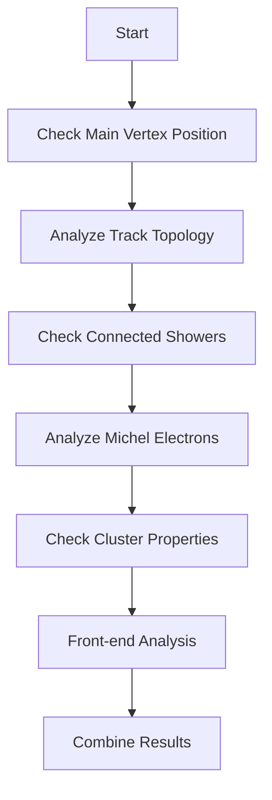
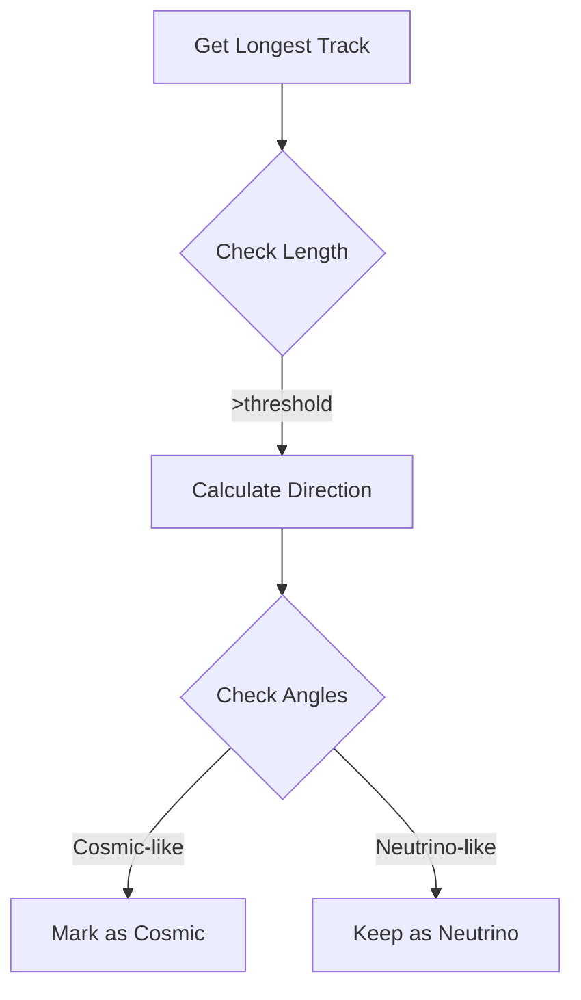

# NeutrinoID::cosmic_tagger Function Analysis

## Overview
The cosmic_tagger function identifies cosmic ray tracks in neutrino interactions by analyzing track characteristics and topology.

## Key Components

### 1. Direction Vectors
```cpp
// Standard direction vectors used for angle calculations
TVector3 dir_beam(0,0,1);      // Beam direction
TVector3 dir_drift(1,0,0);     // Drift direction
TVector3 dir_vertical(0,1,0);  // Vertical direction
```

### 2. Cosmic Ray Flags
The function uses 10 different cosmic ray identification criteria:
```cpp
bool flag_cosmic_1;  // Main vertex outside fiducial volume
bool flag_cosmic_2;  // Single muon track topology
bool flag_cosmic_3;  // Long muon track characteristics
bool flag_cosmic_4;  // Connected shower topology
bool flag_cosmic_5;  // Long muon with shower
bool flag_cosmic_6;  // Multiple track topology
bool flag_cosmic_7;  // Michel electron topology
bool flag_cosmic_8;  // Track length criteria
bool flag_cosmic_9;  // Cluster characteristics
bool flag_cosmic_10; // Front-end topology
```

## Main Algorithm Flow



### 1. Main Vertex Check
```cpp
// Check if main vertex is outside fiducial volume
double tmp_dis = calculate_vertex_displacement();
if (!fid->inside_fiducial_volume(test_p, offset_x, &stm_tol_vec)) {
    flag_cosmic_1 = true;
}
```

### 2. Track Analysis Flow

#### Single Muon Analysis


#### Michel Electron Check
```cpp
struct MichelCheck {
    double energy;
    TVector3 direction;
    double angle_to_muon;
    bool is_attached;
};
```

## Key Algorithms

### 1. Track Length Analysis
```cpp
void analyze_track_length() {
    // Get longest track
    double max_length = 0;
    for (auto segment : segments) {
        if (segment.length > max_length) {
            max_length = segment.length;
            longest_track = segment;
        }
    }
    // Check against thresholds
    if (max_length > 100*units::cm && 
        !is_contained(longest_track)) {
        flag_cosmic = true;
    }
}
```

### 2. Angle Analysis
```cpp
bool is_cosmic_direction(TVector3& track_dir) {
    double angle_to_vertical = track_dir.Angle(dir_vertical);
    double angle_to_beam = track_dir.Angle(dir_beam);
    
    return (angle_to_vertical < 30*deg || 
            angle_to_beam > 150*deg);
}
```

### 3. Cluster Analysis
```cpp
struct ClusterMetrics {
    int num_tracks;
    double total_length;
    double shower_fraction;
    double highest_point;
    vector<double> track_angles;
};
```

## Key Thresholds

1. **Distance Thresholds**
   - Fiducial volume tolerance: 1.5 cm
   - Track length minimum: 2.5 cm
   - Long track threshold: 100 cm

2. **Angle Thresholds**
   - Vertical cosmic: < 30°
   - Beam-aligned: > 150°
   - Multiple track separation: > 165°

3. **Energy Thresholds**
   - Michel electron: < 70 MeV
   - Shower energy: > 150 MeV
   - Connected shower: > 60 MeV

## Called Functions

1. **Geometry Functions**
   - `inside_fiducial_volume()` [more details](../ToyFiducial/inside_fiducial_volume.md)
   - `get_closest_dead_chs()`

2. **Track Analysis**
   - `cal_dir_3vector()` [more details](../pattern_recognition/protosegment_kinematics.md)
   - `get_length()` [more details](../pattern_recognition/protosegment_get_length.md)
   - `is_dir_weak()`
   - `get_medium_dQ_dx()` [more details](../pattern_recognition/protosegment_get_dQ_dx.md)

3. **Shower Analysis**
   - `get_kine_best()` [more details](../pattern_recognition/wcshower_kinematics.md)
   - `get_kine_charge()`
   - `bad_reconstruction()` [more details](./bad_reconstruction.md)

4. **Cluster Analysis**
   - `Calc_PCA()`
   - `get_PCA_axis()`
   - `calculate_num_daughter_tracks()` 
   - `calculate_num_daughter_showers()` [more details](./calculate_num_daughter_showers.md)

## Output Structure

```cpp
struct TaggerInfo {
    // Cosmic flags
    bool cosmict_flag_1;
    bool cosmict_flag_2;
    // ... more flags ...
    
    // Metrics
    double cosmict_2_angle_beam;
    double cosmict_2_length;
    // ... more metrics ...
    
    // Counts
    int cosmic_n_solid_tracks;
    int cosmic_n_direct_showers;
    // ... more counts ...
};
```

## Performance Considerations

1. **Memory Management**
   - Uses references for large data structures
   - Minimizes vector copying
   - Efficient map lookups

2. **Computational Efficiency**
   - Pre-calculated directions
   - Cached length calculations
   - Early exit conditions

3. **Algorithm Complexity**
   - Track analysis: O(n) where n is number of tracks
   - Cluster analysis: O(m) where m is number of points
   - Overall: O(n + m)
