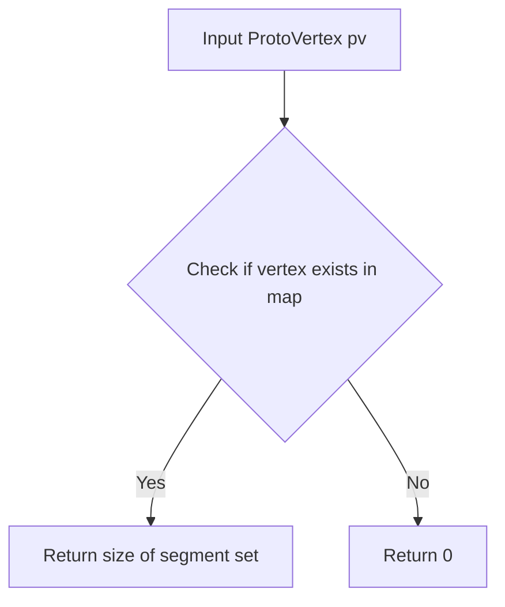
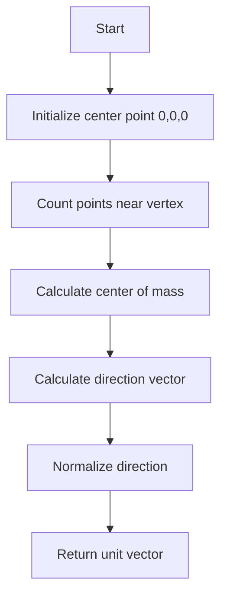
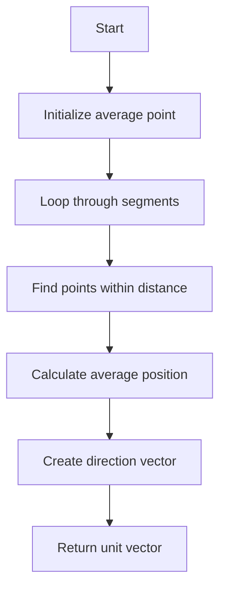
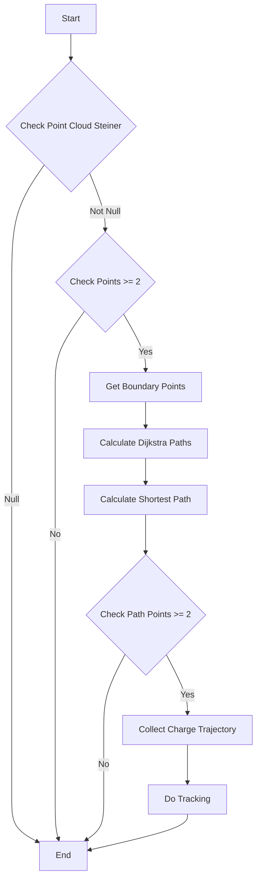
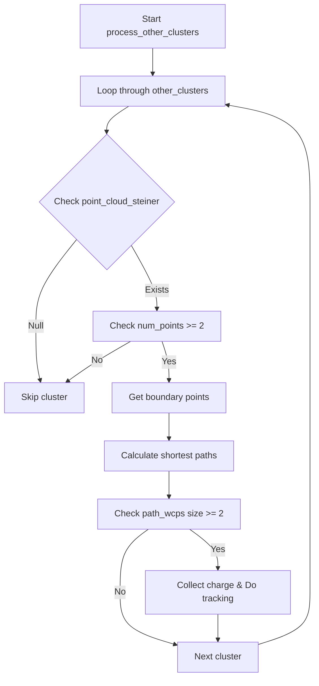

# Function Analysis - Wire Cell Neutrino ID Functions

## 1. get_num_segments()

### Purpose
Returns the number of segments connected to a given vertex in the neutrino reconstruction.

### Logic Flow


### Code Analysis
```cpp
int WCPPID::NeutrinoID::get_num_segments(WCPPID::ProtoVertex *pv){
  if (map_vertex_segments.find(pv) != map_vertex_segments.end()){
    return map_vertex_segments[pv].size();
  }else{
    return 0;
  }
}
```

The function:
1. Takes a ProtoVertex pointer as input
2. Checks if the vertex exists in map_vertex_segments using find()
3. If found, returns the size of the segment set associated with that vertex
4. If not found, returns 0

### Dependencies
- Uses the map_vertex_segments data structure
- No function calls

## 2. get_dir()

### Purpose
Calculates a unit direction vector for a given vertex by analyzing nearby points within a specified distance cut.

### Logic Flow


### Code Analysis
```cpp
TVector3 WCPPID::NeutrinoID::get_dir(WCPPID::ProtoVertex *vtx, double dis_cut){
  Point center(0,0,0);
  int ncount = 0;

  // Loop through segments to find nearby points
  for (auto it = map_segment_vertices.begin(); it!= map_segment_vertices.end(); it++){
    WCPPID::ProtoSegment *sg = it->first;
    if (sg->get_cluster_id() != vtx->get_cluster_id()) continue;
    PointVector& pts = sg->get_point_vec();
    // Add points within distance cut
    for (size_t i=1;i+1<pts.size();i++){
      double dis = sqrt(pow(pts.at(i).x - vtx->get_fit_pt().x,2)+
                       pow(pts.at(i).y - vtx->get_fit_pt().y,2)+
                       pow(pts.at(i).z - vtx->get_fit_pt().z,2));
      if (dis < dis_cut){
        center.x += pts.at(i).x;
        center.y += pts.at(i).y; 
        center.z += pts.at(i).z;
        ncount ++;
      }
    }
  }

  // Calculate average position
  center.x /= ncount;
  center.y /= ncount;
  center.z /= ncount;

  // Calculate direction vector from vertex to center
  TVector3 dir(center.x - vtx->get_fit_pt().x,
               center.y - vtx->get_fit_pt().y,
               center.z - vtx->get_fit_pt().z);
               
  // Return normalized direction              
  return dir.Unit();
}
```

Key steps:
1. Initialize center point at (0,0,0)
2. Loop through all segments in the cluster
3. For each segment, find points within dis_cut of the vertex
4. Calculate center of mass of nearby points
5. Calculate direction vector from vertex to center
6. Normalize and return direction vector

### Dependencies
- Uses map_segment_vertices data structure
- Uses TVector3 from ROOT
- No direct function calls

## 3. calc_dir_cluster()

### Purpose
Calculates a direction vector for a cluster by analyzing points near a given origin point.

### Logic Flow


### Code Analysis
```cpp
TVector3 WCPPID::NeutrinoID::calc_dir_cluster(int tmp_cluster_id, 
                                             WCP::Point& orig_p, 
                                             double dis_cut){
  Point ave_p(0,0,0);
  int num = 0;

  // Loop through segments
  for (auto it = map_segment_vertices.begin(); it!=map_segment_vertices.end(); it++){
    WCPPID::ProtoSegment *sg = it->first;
    if (sg->get_cluster_id() != tmp_cluster_id) continue;
    WCP::PointVector& pts = sg->get_point_vec();
    
    // Find points within distance cut
    for (size_t i=1;i+1<pts.size();i++){
      double dis = sqrt(pow(pts.at(i).x - orig_p.x,2) + 
                       pow(pts.at(i).y - orig_p.y,2) + 
                       pow(pts.at(i).z - orig_p.z,2));
      if (dis < dis_cut){
        ave_p.x += pts.at(i).x;
        ave_p.y += pts.at(i).y;
        ave_p.z += pts.at(i).z;
        num ++;
      }
    }
  }

  // Include vertices in calculation
  for (auto it = map_vertex_segments.begin(); it != map_vertex_segments.end(); it++){
    WCPPID::ProtoVertex *vtx = it->first;
    if (vtx->get_cluster_id() != tmp_cluster_id) continue;
    double dis = sqrt(pow(vtx->get_fit_pt().x - orig_p.x,2) + 
                     pow(vtx->get_fit_pt().y - orig_p.y,2) + 
                     pow(vtx->get_fit_pt().z - orig_p.z,2));
    if (dis < dis_cut){
      ave_p.x += vtx->get_fit_pt().x;
      ave_p.y += vtx->get_fit_pt().y;
      ave_p.z += vtx->get_fit_pt().z;
      num ++;
    }
  }

  TVector3 dir(0,0,0);
  
  if (num > 0){
    // Calculate average position
    ave_p.x /= num;
    ave_p.y /= num;  
    ave_p.z /= num;

    // Create direction vector
    dir.SetXYZ(ave_p.x - orig_p.x, 
               ave_p.y - orig_p.y, 
               ave_p.z - orig_p.z);
    dir = dir.Unit();
  }
  
  return dir;
}
```

Key steps:
1. Initialize average point and counter
2. Loop through segments in cluster to find nearby points
3. Loop through vertices in cluster
4. Calculate average position of all nearby points/vertices
5. Create direction vector from origin to average position
6. Normalize and return direction vector

### Dependencies
- Uses map_segment_vertices and map_vertex_segments data structures
- Uses TVector3 from ROOT
- No direct function calls

## Key Differences Between get_dir() and calc_dir_cluster()

1. **Scope**:
   - get_dir(): Focuses on points around a specific vertex
   - calc_dir_cluster(): Considers all points in a cluster around an origin point

2. **Input**:
   - get_dir(): Takes a ProtoVertex pointer
   - calc_dir_cluster(): Takes a cluster ID and origin point

3. **Point Selection**:
   - get_dir(): Only uses segment points
   - calc_dir_cluster(): Uses both segment points and vertex points

4. **Return Handling**:
   - get_dir(): Always returns a normalized vector
   - calc_dir_cluster(): Returns zero vector if no points found


# Process Main Cluster Documentation

## Overview
The `process_main_cluster` function is a key component in the NeutrinoID class that handles the processing of the main cluster in a neutrino interaction. It performs several important steps to analyze and reconstruct tracks from point clouds.

## Function Definition
```cpp
void WCPPID::NeutrinoID::process_main_cluster() {
    WCPPID::PR3DCluster *temp_cluster = main_cluster;
    if (temp_cluster->get_point_cloud_steiner()!=0) {
        if (temp_cluster->get_point_cloud_steiner()->get_num_points() >= 2) {
            std::pair<WCPointCloud<double>::WCPoint,WCPointCloud<double>::WCPoint> wcps = 
                temp_cluster->get_two_boundary_wcps(2); 
            temp_cluster->dijkstra_shortest_paths(wcps.first,2); 
            temp_cluster->cal_shortest_path(wcps.second,2);
        }
        if (temp_cluster->get_path_wcps().size()>=2) {
            temp_cluster->collect_charge_trajectory(*ct_point_cloud);
            temp_cluster->do_tracking(*ct_point_cloud, global_wc_map, 
                                    flash_time*units::microsecond);
        }
    }
}
```

## Logical Flow



## Detailed Steps

1. **Initial Check**
   - Gets reference to main cluster as temp_cluster
   - Checks if the Steiner point cloud exists

2. **Point Cloud Processing**
   - If point cloud has at least 2 points:
     - Gets two boundary points using `get_two_boundary_wcps(2)`
     - These represent the extremes of the cluster

3. **Path Calculation**
   - Calculates shortest paths using Dijkstra's algorithm from first boundary point
   - Calculates path to second boundary point
   - Uses a "2" parameter indicating the graph construction type

4. **Track Processing**
   - If valid path exists (≥2 points):
     - Collects charge information along trajectory
     - Performs tracking with timing information

## Key Function Calls

1. **get_point_cloud_steiner()**
   - Returns the Steiner point cloud for the cluster
   - Used for graph construction and path finding

2. **get_two_boundary_wcps()**
   - Parameters: int (graph type)
   - Returns: pair of boundary points
   - Finds extreme points in the cluster

3. **dijkstra_shortest_paths()**
   - Parameters: start point, graph type
   - Calculates all shortest paths from start point

4. **cal_shortest_path()**
   - Parameters: end point, graph type
   - Calculates specific path to end point

5. **collect_charge_trajectory()** [more details](../track_fitting/collect_charge_trajectory.md)
   - Parameters: point cloud
   - Collects charge information along path

6. **do_tracking()**  [more details](../track_fitting/do_tracking.md)
   - Parameters: point cloud, wire-cell map, flash time
   - Performs final track reconstruction

## Important Data Structures

1. **PR3DCluster**
   ```cpp
   class PR3DCluster {
       // Main cluster representation
       WCPointCloud<double>* point_cloud_steiner;
       std::vector<WCPointCloud<double>::WCPoint> path_wcps;
       // ...
   };
   ```

2. **WCPointCloud**
   ```cpp
   template<typename T>
   class WCPointCloud {
       struct WCPoint {
           T x, y, z;  // Coordinates
           // Additional point data
       };
       // Point cloud operations
   };
   ```

## Error Handling and Edge Cases

1. **Null Point Cloud**
   - Function returns if Steiner point cloud is null
   - Prevents processing invalid clusters

2. **Insufficient Points**
   - Checks for minimum 2 points before processing
   - Ensures valid path calculation

3. **Path Validation**
   - Verifies path contains enough points before tracking
   - Prevents processing invalid paths

## Usage Example

```cpp
WCPPID::NeutrinoID neutrino_id(/* parameters */);
neutrino_id.process_main_cluster();
```

## Performance Considerations

1. **Memory Usage**
   - Point clouds can be memory intensive
   - Steiner points add additional memory overhead

2. **Computational Complexity**
   - Dijkstra's algorithm: O(E log V)
   - Path calculation is computationally intensive
   - Consider cluster size impact on performance

## Additional Notes

- The function is part of the larger neutrino identification process
- Works in conjunction with other cluster processing functions
- Critical for track reconstruction and analysis

# Analysis of process_other_clusters Function

## Overview
The `process_other_clusters` function is responsible for processing all non-main clusters in a neutrino interaction reconstruction. It handles track and shower reconstruction for secondary clusters, applying similar algorithms as used for the main cluster but with some different parameters.

## Detailed Logic Flow



## Main Processing Steps

### 1. Cluster Iteration
The function iterates through each cluster in `other_clusters` vector:
```cpp
for (auto it1 = other_clusters.begin(); it1 != other_clusters.end(); it1++) {
    WCPPID::PR3DCluster *temp_cluster = (*it1);
    // Process each cluster...
}
```

### 2. Point Cloud Validation
For each cluster, it checks if there's a valid Steiner point cloud:
```cpp
if (temp_cluster->get_point_cloud_steiner() != 0)
```

### 3. Boundary Point Analysis
If the point cloud has at least 2 points, it:
- Gets the two boundary points using `get_two_boundary_wcps()`
- Uses these to calculate paths through the cluster

### 4. Path Calculation
For valid clusters, it performs:
1. Dijkstra shortest path calculation
2. Path collection
3. Charge trajectory collection
4. Track reconstruction

## Key Function Calls

1. `get_point_cloud_steiner()`
   - Returns: Steiner point cloud for the cluster
   - Purpose: Provides geometric representation of the cluster

2. `get_two_boundary_wcps(2)`
   - Returns: Pair of boundary points
   - Purpose: Identifies cluster endpoints
   - Parameter 2: Indicates clustering method

3. `dijkstra_shortest_paths(wcps.first, 2)`
   - Purpose: Calculates shortest paths through cluster
   - Uses: Dijkstra's algorithm
   - Parameters:
     - wcps.first: Starting point
     - 2: Method identifier

4. `cal_shortest_path(wcps.second, 2)`
   - Purpose: Calculates specific path to end point
   - Parameters:
     - wcps.second: Endpoint
     - 2: Method identifier

5. `collect_charge_trajectory()` [more details](../track_fitting/collect_charge_trajectory.md)
   - Purpose: Gathers charge information along track
   - Uses: Point cloud for measurements

6. `do_tracking()`   [more details](../track_fitting/do_tracking.md)
   - Purpose: Performs final track reconstruction
   - Parameters:
     - ct_point_cloud: Point cloud reference
     - global_wc_map: Wire cell map
     - flash_time: Timing information

## Important Data Structures

1. PR3DCluster
   - Main data structure representing particle clusters
   - Contains:
     - Point clouds
     - Track information
     - Charge data

2. WCPointCloud
   - Represents geometric points in 3D space
   - Used for:
     - Path calculations
     - Charge measurements
     - Track fitting

## Performance Considerations

1. Point Cloud Checks
   - Early validation prevents unnecessary processing
   - Minimum point requirements ensure meaningful paths

2. Path Calculations
   - Only performed on valid clusters
   - Multiple validation steps reduce computational waste

3. Memory Management
   - No explicit memory allocation in function
   - Relies on existing cluster data structures

## Use Cases

1. Secondary Track Processing
   - Handles particle tracks not in main interaction
   - Example: Delta rays, secondary interactions

2. Shower Processing
   - Processes electromagnetic showers
   - Handles branching particle cascades

3. Fragment Processing
   - Processes small cluster fragments
   - Helps reconstruct broken tracks

## Error Handling

The function implements several validation checks:
1. Null point cloud check
2. Minimum point count check
3. Path size validation

This prevents processing of invalid clusters and ensures robust operation.

## Integration Points

The function integrates with:
1. Main cluster processing
2. Charge reconstruction
3. Track fitting algorithms
4. Global event reconstruction