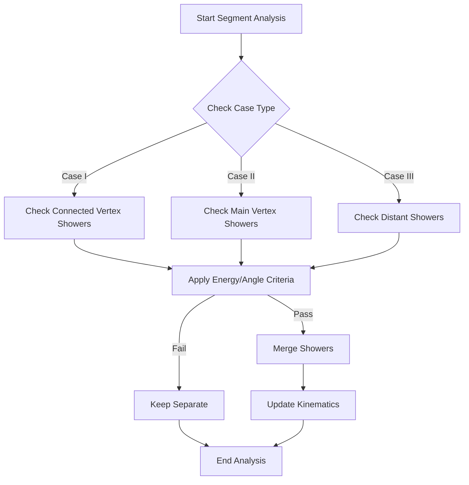
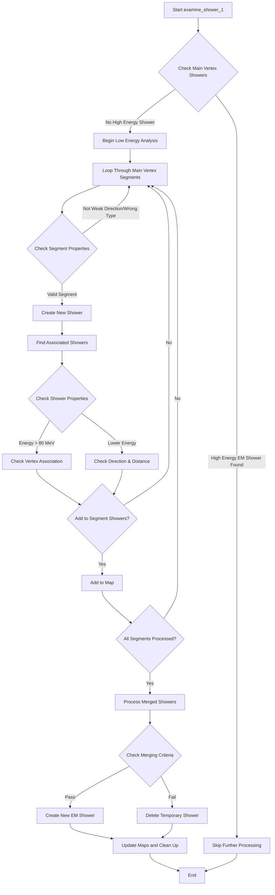

# Analysis of examine_showers Functions

## Overview

The examine_showers functions are part of a neutrino event reconstruction system, specifically focused on analyzing and classifying electromagnetic (EM) showers. The code contains two main functions:

1. `examine_showers()`
2. `examine_shower_1()`

## examine_showers() Function

### Purpose
The main purpose is to identify and merge electromagnetic shower segments that are likely part of the same shower event.

### Key Components

#### 1. Initial Setup
```cpp
std::map<WCPPID::ProtoSegment *, WCPPID::WCShower*> map_merge_seg_shower;
TVector3 drift_dir(1,0,0);
std::set<WCPPID::WCShower*> del_showers;
```

#### 2. Main Processing Loop
The function loops through segments connected to the main vertex and processes them in three cases:

##### Case I: Connected Vertex Showers
- Checks segments connected to vertices that already have associated showers
- Analyzes angles and energies to determine if segments should be merged
- Key criteria:
  ```cpp
  if (Eshower > 800*units::MeV && tmp_angle < 30
      || Eshower > 150*units::MeV && tmp_angle < 10
      || Eshower > 150*units::MeV && tmp_angle < 18 && pair_result.second == 1
      ...)
  ```

##### Case II: Main Vertex Showers
- Examines showers directly connected to the main vertex
- Merges segments if they meet angle and energy criteria
- Example criteria:
  ```cpp
  if (shower->get_kine_charge() > 80*units::MeV && dir1.Angle(dir2)/3.1415926*180. < 10
      || shower->get_kine_charge() > 50*units::MeV && dir1.Angle(dir2)/3.1415926*180. < 3
      ...)
  ```

##### Case III: Distant Showers
- Looks for showers not directly connected to main vertex
- Uses directional and energy criteria for merging

### Shower Merging Process


## examine_shower_1() Function

### Process Flow


### Purpose
Handles cases where multiple gamma rays or low-energy showers need to be analyzed, particularly when no single shower has enough energy to be clearly classified.

### Key Features

#### 1. Initial Check
```cpp
bool flag_skip = false;
if (it != map_vertex_to_shower.end()){
    // Check for high energy EM showers (>80 MeV)
    // Skip further processing if found
}
```

#### 2. Shower Association Process
1. Creates maps of segments to showers
2. Forms new showers from weakly directional segments
3. Associates nearby showers based on angle and distance criteria

### Merging Criteria for Low Energy Showers
```cpp
if (total_length < 70*units::cm && 
    (n_tracks == 1 && total_length < 60*units::cm ||
     n_tracks == 1 && total_length < 65*units::cm && 
     num_showers > 3 && total_energy > 150*units::MeV || 
     total_length < n_tracks * 36*units::cm) && 
    (total_energy > 50*units::MeV || 
     total_energy/units::MeV > total_length/units::cm * 0.75) && 
    (!flag_skip))
```

### Energy Calculation
The system uses charge-based energy reconstruction:
- Considers charge in three wire planes (U, V, W)
- Applies correction factors for dead regions
- Uses recombination factors based on particle type

## Key Parameters and Thresholds

### Energy Thresholds
- High energy shower: > 800 MeV
- Medium energy shower: > 150 MeV
- Low energy shower: > 50 MeV

### Angular Thresholds
- Close alignment: < 10 degrees
- Moderate alignment: < 30 degrees
- Weak alignment: < 40 degrees

### Distance Thresholds
- Close proximity: < 6 cm
- Moderate proximity: < 18 cm
- Extended proximity: < 36 cm

## Performance Considerations

1. **Charge Collection**
   - Uses three wire planes for redundancy
   - Applies correction factors for detector effects
   - Handles dead regions and noise

2. **Track/Shower Differentiation**
   - Uses length, energy density, and directional information
   - Considers topology and connectivity
   - Accounts for detector resolution

3. **Energy Resolution**
   - Better at high energies (>100 MeV)
   - More uncertain at low energies (<50 MeV)
   - Uses multiple planes for improved accuracy

## Common Edge Cases

1. **Low Energy Merging**
   - Multiple small showers near vertex
   - Weak directional information
   - Energy sharing between segments

2. **Overlapping Showers**
   - Similar directions but different vertices
   - Energy separation challenges
   - Complex topology

3. **Dead Regions**
   - Missing wire plane information
   - Charge collection inefficiencies
   - Reconstruction uncertainties