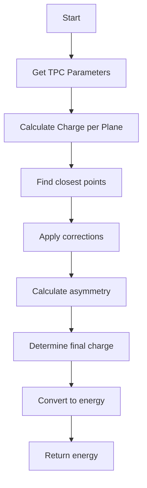

# Technical Documentation: Neutrino Charge Collection and Calculation

## Algorithm Overview

### Key Concepts
1. **Wire Plane Geometry**: 
   - Three wire planes (U, V, W) at different angles
   - Each plane provides a 2D projection view
   - Combined to reconstruct 3D information

2. **Charge Collection**:
   - Time slices and channel ranges define collection windows
   - Dead regions and known problematic areas handled with corrections
   - Multiple views used for redundancy and accuracy

3. **Energy Reconstruction**:
   - Conversion from charge to energy using ionization factors
   - Various corrections applied for different particle types
   - Asymmetry handling between different wire plane views

## Overview
This document details the implementation and logic of three key functions in the NeutrinoID class that handle charge collection and energy calculations:
- `collect_2d_charges()`
- `cal_kine_charge(WCShower* shower)` and `cal_kine_charge(ProtoSegment* sg)`
- `cal_corr_factor(WCP::Point& p, ...)`

## 1. collect_2d_charges()

### Purpose
Collects and organizes 2D charge information from detector readout planes (U, V, W views) for all clusters in the event.

### Detailed Algorithm

#### 1. Finding Time and Channel Ranges
```
Algorithm FindRanges:
Input: main_cluster, other_clusters
Output: min/max boundaries for time and channels

1. Initialize boundaries to extreme values
2. For main_cluster:
   a. Get time_ch_range results
   b. Update global min/max for each dimension
3. For each other_cluster:
   a. Get time_ch_range results
   b. Expand boundaries by adding buffer (-1, +1)
4. Return updated boundaries
```

#### 2. Charge Collection Algorithm
```
Algorithm CollectCharges:
Input: time/channel boundaries, point_cloud
Output: charge_2d_u, charge_2d_v, charge_2d_w maps

1. For each view (U, V, W):
   a. Get overlap_good_ch_charge within boundaries
   b. Store results in respective charge_2d map
2. For main_cluster and each other_cluster:
   a. Fill dead channel information
   b. Update charge maps accordingly
```

### Flow
1. Find time and channel ranges:
   ```cpp
   // Initialize boundaries
   double min_ts=1e9, max_ts=-1e9;
   double min_uch=1e9, max_uch=-1e9;
   double min_vch=1e9, max_vch=-1e9;
   double min_wch=1e9, max_wch=-1e9;

   // Get ranges from main cluster
   std::vector<float> results = main_cluster->get_time_ch_range();
   // Update boundaries from main cluster
   
   // Loop through other clusters and expand boundaries
   for (auto it = other_clusters.begin(); it!= other_clusters.end(); it++){
     results = (*it)->get_time_ch_range();
     // Update boundaries
   }
   ```

2. Collect charge information:
   ```cpp
   // Get charge overlaps for each view
   charge_2d_u = ct_point_cloud->get_overlap_good_ch_charge(
     min_ts, max_ts, min_uch, max_uch, 0); // U view
   charge_2d_v = ct_point_cloud->get_overlap_good_ch_charge(
     min_ts, max_ts, min_vch, max_vch, 1); // V view  
   charge_2d_w = ct_point_cloud->get_overlap_good_ch_charge(
     min_ts, max_ts, min_wch, max_wch, 2); // W view
   ```

3. Fill charge information:
   ```cpp
   // Fill main cluster
   main_cluster->fill_2d_charge_dead_chs(
     charge_2d_u, charge_2d_v, charge_2d_w);
   
   // Fill other clusters
   for (auto it = other_clusters.begin(); it!= other_clusters.end(); it++){
     (*it)->fill_2d_charge_dead_chs(
       charge_2d_u, charge_2d_v, charge_2d_w);
   }
   ```

### Function Calls
- `cluster->get_time_ch_range()`
- `ct_point_cloud->get_overlap_good_ch_charge()`
- `cluster->fill_2d_charge_dead_chs()`

### Data Structures
Stores charge information in three maps:
```cpp
std::map<std::pair<int,int>, std::pair<double,double>> charge_2d_u;
std::map<std::pair<int,int>, std::pair<double,double>> charge_2d_v;
std::map<std::pair<int,int>, std::pair<double,double>> charge_2d_w;
```

## 2. cal_kine_charge()

This function exists in two variants:
- For WCShower objects
- For ProtoSegment objects

### Kinetic Energy Calculation Algorithm

#### 1. Initialization and Parameter Setup
```
Algorithm InitializeParameters:
Input: particle_type
Output: correction_factors

1. Set base factors:
   fudge_factor = 0.95
   recom_factor = 0.7

2. Adjust based on particle type:
   if is_shower:
      recom_factor = 0.5
      fudge_factor = 0.8
   else if is_proton:
      recom_factor = 0.35
```

#### 2. Charge Calculation Algorithm
```
Algorithm CalculateChargePerPlane:
Input: point_cloud, charge_2d_maps
Output: plane_charges[U,V,W]

For each plane (U,V,W):
    1. Initialize charge_sum = 0
    2. For each charge in charge_2d_map:
        a. Convert time/channel to 2D point
        b. Find closest point in point_cloud
        c. If distance < 0.6 cm:
           - Calculate correction factor
           - Add corrected charge to sum
    3. Store final sum in plane_charges
```

#### 3. Asymmetry Handling
```
Algorithm HandleAsymmetry:
Input: plane_charges[U,V,W]
Output: final_charge

1. Find min, max, and median charges
2. Calculate asymmetries:
   min_asy = |median - min|/(median + min)
   max_asy = |median - max|/(median + max)

3. If max_asy > 0.04:
   final_charge = weighted_average(median, min)
else:
   final_charge = weighted_average(all_charges)
```

### Common Parameters
```cpp
double fudge_factor = 0.95;      // General correction factor
double recom_factor = 0.7;       // Recombination factor
// Adjusted based on particle type:
// Shower: recom_factor = 0.5, fudge_factor = 0.8
// Proton: recom_factor = 0.35
```

### Logical Flow
1. Get TPC parameters (wire pitches, angles, offsets)
2. Calculate charge for each plane (U, V, W)
3. Apply corrections and calculate final energy



### Energy Calculation
```cpp
kine_energy = overall_charge/recom_factor/fudge_factor * 23.6/1e6 * units::MeV
```

### Function Calls
- `shower->rebuild_point_clouds()`
- `shower->get_associated_pcloud()`
- `shower->get_fit_pcloud()`
- `cal_corr_factor()`

## 3. cal_corr_factor()

### Purpose
Applies corrections to charge measurements based on detector geometry and known issues.

### Parameters
```cpp
Point& p                 // 3D point
double offset_u/v/w      // Wire plane offsets
double slope_yu/zu       // U plane slopes
double slope_yv/zv       // V plane slopes  
double slope_yw/zw       // W plane slopes
```

### Correction Factor Algorithm

#### 1. Wire Plane Corrections
```
Algorithm CalculateCorrection:
Input: Point p, plane_parameters
Output: correction_factor

1. Calculate central U position:
   central_U = offset_u + (slope_yu * p.y + slope_zu * p.z)

2. Apply base correction (factor = 1.0)

3. Check special regions:
   if central_U in problematic_ranges:
      factor /= 0.7

4. Apply additional geometry corrections if enabled:
   if correction_flag:
      factor *= geometry_correction_factor
```

#### 2. Special Region Handling
```
Problematic U wire ranges:
- 296-327: factor /= 0.7
- 336-337: factor /= 0.7
- 343-351: factor /= 0.7
- 376-400: factor /= 0.7
- 410-484: factor /= 0.7
- 501-524: factor /= 0.7
- 536-671: factor /= 0.7
```

### Implementation
```cpp
double factor = 1;

// Special correction for specific U wire regions
double central_U = offset_u + (slope_yu * p.y + slope_zu * p.z);
if (central_U >= 296 && central_U <= 327 ||
    central_U >= 336 && central_U <= 337 ||
    /* other ranges... */) {
    factor = factor/0.7;
}

// Apply additional corrections if enabled
if (mp.get_flag_corr()) {
    factor *= mp.get_corr_factor(p, ...);
}
```

### Function Calls
- `mp.get_flag_corr()`
- `mp.get_corr_factor()`

## Key Calculations

### 1. Point-to-Wire Distance Calculation
The distance from a 3D point to each wire plane is calculated using:
```cpp
double distance_u = offset_u + (slope_yu * y + slope_zu * z)
double distance_v = offset_v + (slope_yv * y + slope_zv * z)
double distance_w = offset_w + (slope_yw * y + slope_zw * z)
```

### 2. Energy Conversion
The final energy calculation follows:
```cpp
kine_energy = (total_charge / recom_factor / fudge_factor) * (23.6/1e6) * units::MeV
```
Where:
- 23.6 eV is the ionization energy in liquid argon
- recom_factor accounts for charge recombination
- fudge_factor is an empirical correction

### 3. Weighted Charge Average
The weighted average calculation:
```cpp
weight[U,V,W] = {0.25, 0.25, 1.0}
overall_charge = (Σ weight[i] * charge[i]) / (Σ weight[i])
```

## Important Notes

1. The charge collection uses multiple views (U, V, W) to reconstruct the 3D charge distribution.

2. Several correction factors are applied:
   - Recombination effects
   - Detector geometry
   - Known problematic regions
   - Fudge factors for different particle types

3. Special handling for:
   - Showers vs tracks 
   - Dead regions
   - Asymmetric charge distributions

4. Energy conversion uses 23.6 eV per ionization with additional corrections applied through the recombination and fudge factors.