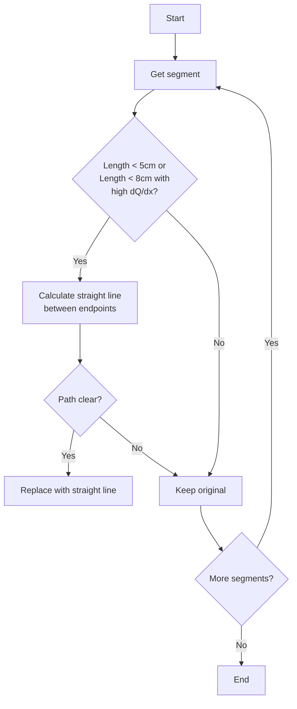

# WCPPID NeutrinoID Structure Examination Functions Analysis

## Overview

The examine_structure functions implement algorithms for optimizing 3D particle track reconstruction by analyzing geometric patterns and cleaning up track segments. The key goals are to:

1. Identify and straighten unnecessarily curved track segments
2. Merge short track segments that should be single tracks
3. Connect track segments that are clearly part of the same particle trajectory
4. Find missing track segments, particularly near interaction vertices

These optimizations help improve the physics reconstruction quality by removing artifacts from the initial tracking and adding missing track components.

## Core Algorithm Concepts

### Track Straightness Analysis
The algorithms analyze track straightness by:
1. Comparing the actual track path to a straight line between endpoints
2. Checking if intervening space is free of obstacles using point cloud data
3. Calculating deviations in multiple 2D projections (U, V, W wire planes)

### Track Merging Criteria 
Tracks are considered for merging when:
1. They meet at a common vertex
2. The angle between them is small
3. A straight line connecting their outer endpoints is physically viable
4. The merged track maintains consistency with detector data

### Point Cloud Integration
The algorithms make heavy use of point cloud data structures to:
1. Find nearest neighbors for track association
2. Check track path viability through detector space
3. Validate proposed track modifications against real detector hits

### Vertex Analysis
Special attention is paid to vertices where:
1. Multiple tracks meet
2. Track segments appear to be missing
3. Track patterns suggest incorrect segmentation

## Detailed Algorithms

The examine_structure functions in the NeutrinoID class are responsible for analyzing and potentially modifying the structure of particle tracks and segments in 3D space. These functions help clean up and optimize the track reconstruction by applying various geometric and physical criteria.

## examine_structure_1() Algorithm

### Purpose
The primary goal is to identify track segments that can be simplified into straight lines without losing physics information. This helps remove reconstruction artifacts that create unnecessary curvature.

### Algorithm Steps
1. Track Selection
   ```cpp
   if (length < 5*units::cm || 
       (length < 8*units::cm && medium_dQ_dx > 1.5)) {
       // Track is candidate for straightening
   }
   ```
   - Short tracks are primary candidates
   - Slightly longer tracks with high charge density are also considered
   - This targets tracks that are likely MIP-like particles (e.g., muons)

2. Path Viability Analysis
   - Create test points along straight line between endpoints
   - Space points evenly at 0.6cm intervals
   - Check each point against point cloud:
   ```cpp
   for (int i=1; i<ncount; i++) {
       Point test_p = calculate_point_on_line(i, ncount);
       if (!ct_point_cloud->is_good_point(test_p, 0.2*units::cm)) {
           n_bad++;
       }
   }
   ```

3. Track Replacement
   - If <= 1 bad point found, proceed with replacement
   - Create new track segment using straight line points
   - Maintain connections to existing vertices
   - Update point cloud and segment maps

### Quality Controls
1. Dead Region Checking
   - Verify straight path doesn't cross dead detector regions
   - Check separate U, V, W wire planes for consistency

2. Charge Consistency
   - Track must maintain consistent charge density
   - High dQ/dx tracks get additional scrutiny

3. Vertex Connection Preservation
   - Maintain all vertex associations
   - Preserve track hierarchy in cluster

## examine_structure_2() Algorithm

### Purpose
Identifies and merges pairs of short track segments that meet at a vertex when they should be a single straight track.

### Algorithm Steps
1. Vertex Selection
   ```cpp
   if (vtx->get_cluster_id() == temp_cluster->get_cluster_id() && 
       it->second.size() == 2) {
       // Vertex is candidate for track merging
   }
   ```
   - Find vertices with exactly 2 connected segments
   - Both segments must belong to same cluster

2. Geometric Analysis
   - Calculate straight line between outer vertices
   - Check feasibility of straight path:
   ```cpp
   Point start_p = vtx1->get_fit_pt();
   Point end_p = vtx2->get_fit_pt();
   int ncount = round(distance/step_size);
   for (int i=1; i<ncount; i++) {
       Point test_p = interpolate_point(start_p, end_p, i, ncount);
       if (!is_path_viable(test_p)) {
           flag_replace = false;
           break;
       }
   }
   ```

3. Track Reconstruction
   - Create new merged track if path is viable
   - Transfer vertex connections to new track
   - Remove old segments and intermediate vertex

### Quality Controls
1. Path Validation
   - Check each point along proposed path
   - Verify detector response consistency
   - Ensure no crossing of dead regions

2. Topology Preservation
   - Maintain overall track connectivity
   - Preserve cluster structure
   - Update all relevant maps and indices

## examine_structure()

This is the main orchestrator function that calls other examine_structure functions in sequence.

```cpp
void examine_structure(WCPPID::PR3DCluster *temp_cluster) {
    // First try to merge tracks (examine_structure_2)
    if (examine_structure_2(temp_cluster))
        temp_cluster->do_multi_tracking(...);
        
    // Then try to straighten tracks (examine_structure_1)  
    if (examine_structure_1(temp_cluster))
        temp_cluster->do_multi_tracking(...);
}
```

Called functions:
- examine_structure_1()
- examine_structure_2() 
- do_multi_tracking() (from PR3DCluster) [more details](../track_fitting/multi_trajectory_fit.md)

## examine_structure_1()

Purpose: Analyzes individual segments to determine if they can be replaced with straighter tracks.

Logic flow:
1. For each segment in the cluster:
   - Check if segment is short enough (< 5cm or < 8cm with high dQ/dx)
   - Calculate straight line between endpoints
   - Check if straight path is valid (not blocked)
   - If valid, replace original track with straight line



Called functions:
- get_length()  [more details](../pattern_recognition/protosegment_get_length.md)
- get_medium_dQ_dx() [more details](../pattern_recognition/protosegment_get_dQ_dx.md)
- is_good_point() (from ct_point_cloud)
- get_closest_wcpoint() (from point_cloud_steiner)

## examine_structure_2()

Purpose: Attempts to merge pairs of short segments that meet at a vertex into single straight segments.

Logic flow:
1. Find vertices with exactly 2 segments
2. For each such vertex:
   - Calculate straight line between outer endpoints
   - Check if straight path is valid
   - If valid, merge segments into one straight segment

```cpp
// Example key check in examine_structure_2
if (flag_replace) {
    // Create new straight segment
    WCPPID::ProtoSegment *sg3 = new WCPPID::ProtoSegment(
        acc_segment_id, 
        wcps, 
        temp_cluster->get_cluster_id()
    );
    
    // Connect to outer vertices
    add_proto_connection(vtx1, sg3, temp_cluster);
    add_proto_connection(vtx2, sg3, temp_cluster);
    
    // Remove old segments and middle vertex
    del_proto_segment(sg1);
    del_proto_segment(sg2);
    del_proto_vertex(vtx);
}
```

Called functions:
- find_other_vertex() [more details](./find_other_vertex.md)
- add_proto_connection() [more details](./add_other_connection.md)
- del_proto_segment()
- del_proto_vertex()
- get_closest_wcpoint()

## examine_structure_3() Algorithm

### Purpose
Identifies and merges track segments that are nearly collinear but were split during initial reconstruction. This handles cases where tracks were artificially segmented.

### Algorithm Steps
1. Initial Filtering
   ```cpp
   // Must have exactly 2 segments at vertex
   if (vtx->get_cluster_id() != temp_cluster->get_cluster_id() || 
       it->second.size() != 2) continue;
   ```

2. Direction Analysis
   - Calculate track directions at two scales:
   ```cpp
   // Long-range direction (10cm)
   TVector3 dir1 = sg1->cal_dir_3vector(vtx->get_fit_pt(), 10*units::cm);
   TVector3 dir2 = sg2->cal_dir_3vector(vtx->get_fit_pt(), 10*units::cm);
   
   // Short-range direction (3cm)
   TVector3 dir3 = sg1->cal_dir_3vector(vtx->get_fit_pt(), 3*units::cm);
   TVector3 dir4 = sg2->cal_dir_3vector(vtx->get_fit_pt(), 3*units::cm);
   ```
   - Check angles at both scales:
     - Long range must be < 18°
     - Short range must be < 27°
   - Two scales help ensure smooth track connection

3. Track Merging
   - Create merged track maintaining point ordering
   - Handle all possible point orientations:
     - front-to-front
     - front-to-back
     - back-to-front
     - back-to-back
   - Update vertex connections

### Quality Controls
1. Angle Consistency
   - Verify angles are consistent at different scales
   - Ensure smooth track transition at merge point

2. Point Ordering
   - Maintain correct spatial sequence of points
   - Preserve track direction information

## examine_structure_4() Algorithm

### Purpose
Identifies and adds missing track segments, particularly around interaction vertices. This helps recover tracks that were missed in initial reconstruction.

### Algorithm Steps
1. Vertex Analysis
   ```cpp
   std::vector<WCP::WCPointCloud<double>::WCPoint> candidate_wcps = 
       pcloud->get_closest_wcpoints(vtx->get_fit_pt(), 6*units::cm);
   ```
   - Examine region around vertex (6cm radius)
   - Find terminal points that could connect to vertex

2. Path Validation
   For each candidate endpoint:
   ```cpp
   // Check separation from existing tracks
   if (min_dis > 0.9*units::cm && 
       min_dis_u + min_dis_v + min_dis_w > 1.8*units::cm &&
       (min_dis_u > 0.8*units::cm && min_dis_v > 0.8*units::cm ||
        min_dis_u > 0.8*units::cm && min_dis_w > 0.8*units::cm ||
        min_dis_v > 0.8*units::cm && min_dis_w > 0.8*units::cm))
   ```
   - Must be sufficiently separated from existing tracks
   - Check separation in each wire plane view
   - Verify path viability with small steps (0.3cm)

3. Track Addition
   - Create new track to valid endpoint
   - Add track to vertex connections
   - Update cluster structure

### Quality Controls
1. Wire Plane Consistency
   - Check track visibility in multiple planes
   - Verify consistent detector response

2. Path Clearance
   - Ensure new track doesn't overlap existing ones
   - Check for dead regions or obstacles

3. Distance Thresholds
   - Minimum 0.9cm from other tracks
   - Sufficient separation in wire views
   - Maximum path length considerations

Purpose: Merges pairs of segments that have very similar directions (small angle between them).

Key criteria:
- Segments meet at a vertex
- Angle between segments < 18° at 10cm scale
- Angle between segments < 27° at 3cm scale

Called functions:
- cal_dir_3vector() [more details](../pattern_recognition/protosegment_kinematics.md)
- add_proto_connection() [more details](./add_other_connection.md)
- del_proto_segment()
- del_proto_vertex()

## examine_structure_4()

Purpose: Searches for and adds missing track segments near vertices, particularly around the main interaction vertex.

Logic flow:
1. For each vertex:
   - Find nearby terminal points
   - Check if paths to these points are valid
   - Add new segments if valid paths found

Key criteria:
- Distance > 0.9cm from existing segments
- Clear path (no dead regions)
- Sufficient separation in wire planes

Called functions:
- get_dir() [more details](./NeutrinoID_cxx.md)
- get_closest_wcpoints()
- get_closest_2d_dis()
- is_good_point()
- add_proto_connection() [more details](./add_other_connection.md)

## Common Helper Functions Used

Throughout these functions, several common helper functions are used:

- Geometry Functions:
  - get_closest_point()
  - get_closest_wcpoint()
  - get_closest_2d_dis()
  - cal_dir_3vector()
  - get_dir()

- Track Management:
  - add_proto_connection() [more details](./add_other_connection.md)
  - del_proto_segment()
  - del_proto_vertex()
  - find_other_vertex()

- Quality Checks:
  - is_good_point()
  - get_medium_dQ_dx() [more details](../pattern_recognition/protosegment_get_dQ_dx.md)

## Key Parameters

Important parameters used across these functions:

```cpp
// Common distance thresholds
double step_size = 0.6 * units::cm;  // Step size for track discretization
double dis_cut = 1.2 * units::cm;    // Distance cut for point association

// Angle thresholds (examine_structure_3)
double angle_threshold_10cm = 18;  // degrees
double angle_threshold_3cm = 27;   // degrees

// Track quality thresholds
double min_track_length = 5 * units::cm;
double high_dQdx_length = 8 * units::cm;
double dQdx_threshold = 1.5;  // Relative to MIP
```

These functions work together to clean up and optimize the 3D track reconstruction, applying physical constraints and geometric criteria to improve the overall reconstruction quality.