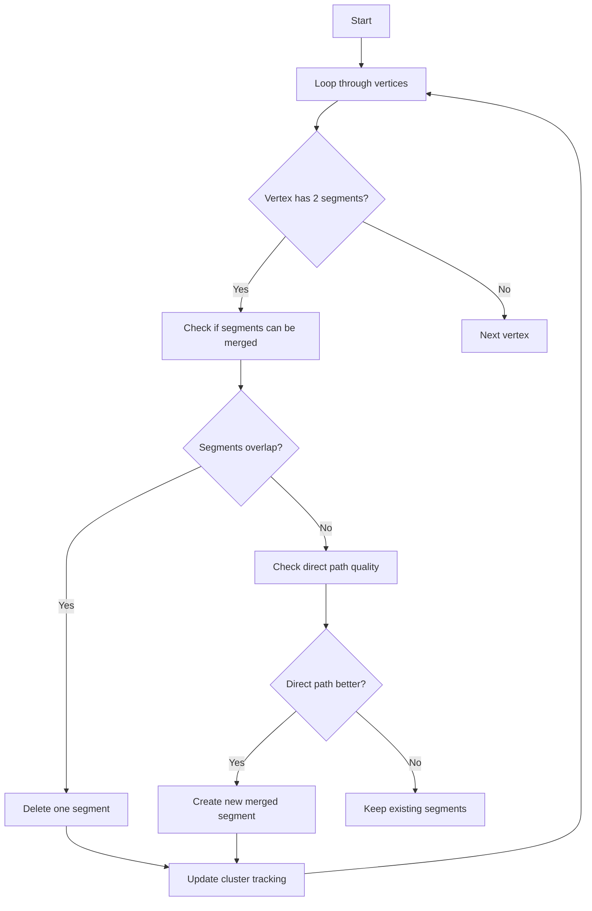

# NeutrinoID Final Structure Analysis Functions Documentation

## Overview

The examine_structure_final functions are part of the NeutrinoID class in Wire-Cell and handle final modifications and improvements to the reconstructed neutrino interaction structure. These functions focus on merging vertices, fixing geometry, and improving vertex positions in the final stages of reconstruction.

## Main Function: examine_structure_final

```cpp
bool WCPPID::NeutrinoID::examine_structure_final(WCPPID::PR3DCluster* temp_cluster) {
    examine_structure_final_1(temp_cluster);
    examine_structure_final_1p(temp_cluster);
    examine_structure_final_2(temp_cluster);
    examine_structure_final_3(temp_cluster);
    return true;
}
```

This is the main function that orchestrates the final structure examination process. It calls four sub-functions in sequence:

1. examine_structure_final_1
2. examine_structure_final_1p
3. examine_structure_final_2 
4. examine_structure_final_3

Each sub-function handles different aspects of structure refinement.

## examine_structure_final_1: Merging Direct Connections

### Purpose
Merges two segments if a direct connection between them would be better than the current configuration.

### Logic Flow


### Key Operations
1. Examines vertices with exactly 2 segments
2. Checks for overlapping segments
3. Tests if a direct path between endpoints would be better
4. Creates new merged segments when beneficial
5. Updates cluster tracking after changes

## examine_structure_final_1p: Main Vertex Angle Analysis

### Purpose
Specifically handles the main vertex when it has exactly two segments, focusing on cases where segments form nearly straight lines (>175 degrees).

### Logic Flow
1. Checks if main vertex has exactly 2 segments
2. Calculates angle between segments
3. If angle > 175°:
   - For shorter segments (<6cm), merges them with longer ones
   - Updates vertex position
   - Recalculates tracking paths

### Code Example
```cpp
if (angle > 175) {
    if (length1 < 6*units::cm && length1 < length2) {
        // Merge shorter segment into longer one
        WCPPID::ProtoVertex *vtx = find_other_vertex(sg1, main_vertex);
        // Update tracking and connections
        // ...
    }
}
```

## examine_structure_final_2: Close Vertex Merging

### Purpose
Merges vertices that are close to each other (within 2cm) if they have compatible segment configurations.

### Key Features
1. Only processes vertices with multiple segments
2. Checks vertex proximity
3. Verifies path connectivity between vertices
4. Maintains tracking consistency after merges

### Validation Checks
- Connection quality between vertices
- Segment compatibility
- Charge consistency in merged paths

## examine_structure_final_3: Main Vertex Position Refinement

### Purpose
Refines the main vertex position by potentially moving it to a nearby better-positioned vertex.

### Process
1. Examines vertices within 2.5cm of main vertex
2. Evaluates vertex quality based on:
   - Number of connected segments
   - Charge distribution
   - Path connectivity
3. Updates main vertex position if better location found

### Dependencies
All these functions rely on several key helper functions:

- `fit_vertex()`: Optimizes vertex position  [more details](./fit_vertex.md)
- `find_other_vertex()`: Locates connecting vertices [more details](./find_other_vertex.md)
- `add_proto_connection()`: Creates new vertex-segment connections [more details](./add_other_connection.md)
- `del_proto_vertex()`, `del_proto_segment()`: Remove obsolete elements
- `do_multi_tracking()`: Updates tracking after changes [more details](../track_fitting/multi_trajectory_fit.md)

## Detailed Algorithm Descriptions

### examine_structure_final_1 Algorithm

1. **Initialization Phase**
   - Maintains a list of segments that need to be refitted and PID-updated
   - Sets up iterative process with flag_continue loop

2. **Vertex Analysis Loop**
   ```cpp
   for (auto it = map_vertex_segments.begin(); it != map_vertex_segments.end(); it++) {
       WCPPID::ProtoVertex *vtx = it->first;
       // Process only vertices with exactly 2 segments
       if (vtx->get_cluster_id() != temp_cluster->get_cluster_id() || 
           it->second.size() != 2) continue;
   ```

3. **Segment Quality Check**
   - For each vertex with exactly 2 segments:
     - Calculates segment lengths
     - Checks point cloud connectivity
     - Evaluates path quality
   - Key parameters:
     ```cpp
     double step_size = 0.6*units::cm;  // Path step size
     double quality_threshold = 0.2*units::cm;  // Point quality threshold
     ```

4. **Path Optimization**
   - When merging is beneficial:
     - Creates new direct path between endpoints
     - Validates path with point cloud
     - Updates connections if path is valid

5. **Cleanup and Update**
   - Removes obsolete segments and vertices
   - Updates cluster tracking information
   - Refreshes point cloud data

### examine_structure_final_2 Algorithm

1. **Proximity Analysis**
   ```cpp
   bool flag_update = false;
   for (auto it = map_vertex_segments[main_vertex].begin(); 
        it != map_vertex_segments[main_vertex].end(); it++) {
       WCPPID::ProtoSegment *sg = *it;
       WCPPID::ProtoVertex *vtx1 = find_other_vertex(sg, main_vertex);
       double dis = sqrt(pow(main_vertex->get_fit_pt().x - vtx1->get_fit_pt().x,2) + 
                        pow(main_vertex->get_fit_pt().y - vtx1->get_fit_pt().y,2) + 
                        pow(main_vertex->get_fit_pt().z - vtx1->get_fit_pt().z,2));
   ```

2. **Vertex Merging Criteria**
   - Distance threshold: 2.0 cm
   - Must have multiple segments at both vertices
   - Path quality checks in all three wire planes
   - Charge consistency requirements

3. **Path Reconstruction Steps**
   - For each merged vertex:
     a. Find optimal connection points
     b. Create new path with proper spacing
     c. Validate path points
     d. Update segment connections

4. **Connection Quality Metrics**
   - Point cloud density checks
   - Wire plane coverage
   - Charge distribution consistency
   - Minimum separation requirements

### examine_structure_final_3 Algorithm

1. **Main Vertex Evaluation**
   - Examines vertices within 2.5 cm of main vertex
   - Considers:
     - Segment multiplicities
     - Angular distributions
     - Charge profiles

2. **Position Optimization**
   ```cpp
   double step_size = 0.3*units::cm;
   for (int i=1; i<ncount; i++) {
       Point test_p(start_p.x + (end_p.x - start_p.x)/ncount*i,
                   start_p.y + (end_p.y - start_p.y)/ncount*i,
                   start_p.z + (end_p.z - start_p.z)/ncount*i);
       if (!ct_point_cloud->is_good_point(test_p, 0.2*units::cm, 0, 0)) {
           n_bad++;
       }
   }
   ```

3. **Charge Profile Analysis**
   - Evaluates charge distribution around vertices
   - Checks for consistency in each wire plane
   - Applies dead channel corrections

4. **Final Position Selection**
   - Weighs multiple factors:
     - Segment connectivity quality
     - Charge consistency
     - Path smoothness
     - Angular distribution
   - Updates position if improvement found

### Key Algorithms for Helpers

1. **Point Cloud Quality Check**
   ```cpp
   bool is_good_point(Point& p, float radius, int plane) {
       // Check charge in radius
       double charge = get_ave_charge(p, radius, plane);
       // Check dead channels
       bool has_dead = get_closest_dead_chs(p, plane);
       // Evaluate point quality
       return charge > threshold && !has_dead;
   }
   ```

2. **Path Validation**
   ```cpp
   bool validate_path(Point start, Point end, double step_size) {
       int steps = distance(start, end) / step_size;
       for (int i = 1; i < steps; i++) {
           Point p = interpolate(start, end, i/steps);
           if (!is_good_point(p)) return false;
       }
       return true;
   }
   ```

3. **Segment Merging**
   ```cpp
   void merge_segments(ProtoSegment* sg1, ProtoSegment* sg2) {
       // Create new path points
       std::vector<Point> new_path;
       // Interpolate between segments
       create_connecting_path(sg1, sg2, new_path);
       // Update connections
       update_vertex_connections(new_path);
       // Clean up old segments
       remove_old_segments(sg1, sg2);
   }
   ```

## Performance Considerations

1. **Memory Management**
   - Careful handling of vertex/segment deletion
   - Proper cleanup of obsolete connections

2. **Computational Efficiency**
   - Uses proximity checks before detailed analysis
   - Maintains tracking information incrementally

3. **Error Handling**
   - Validates changes before committing
   - Maintains cluster consistency

## Examples of Typical Changes

### Vertex Merging
```
Before:     After:
   v1         v_new
   |\          |\
   | \         | \
   |  v2  →    |  \
   |  |        |   \
   |  |        |    \
   v3 v4       v3    v4
```

### Segment Straightening
```
Before:      After:
   v1          v1
    \           \
     v2   →      \
      \           \
       v3          v3
```