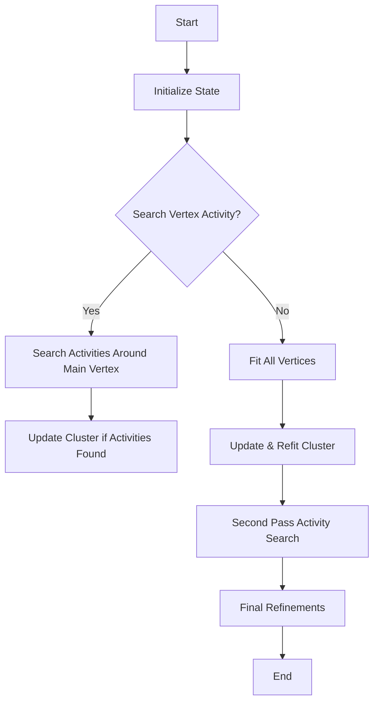
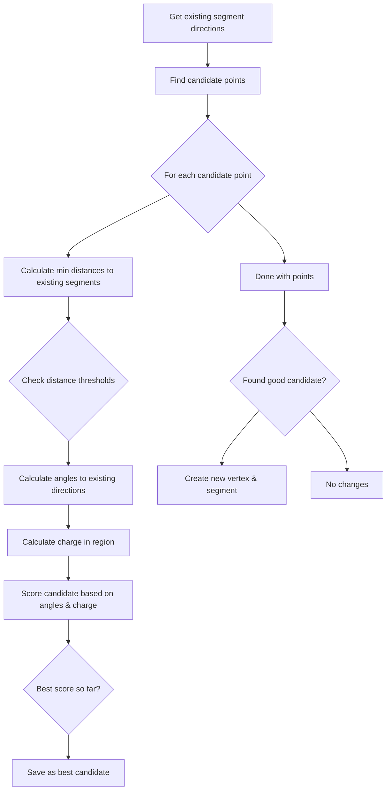
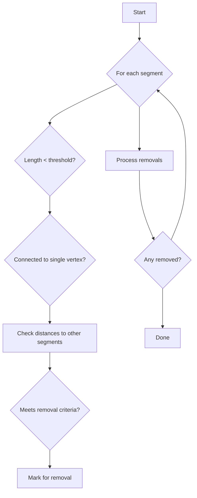
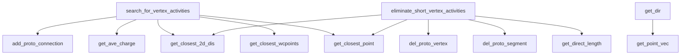

# NeutrinoID::improve_vertex Documentation

## Overview

The `improve_vertex()` function is a complex vertex refinement algorithm used in neutrino event reconstruction. Its main purpose is to improve the accuracy of vertex positions in a cluster of tracks and showers.

## Key Parameters

- `temp_cluster`: The cluster being analyzed
- `flag_search_vertex_activity`: Whether to search for vertex activity 
- `flag_final_vertex`: Whether this is a final vertex fitting pass

## Main Logical Flow



## Key Components

### 1. Initial Setup
```cpp
std::set<WCPPID::ProtoVertex*> fitted_vertices;
std::set<WCPPID::ProtoSegment*> existing_segments;
bool flag_skip_two_legs = false;
```
- Creates sets to track fitted vertices and existing segments
- Determines if vertex with only two legs should be skipped based on track count

### 2. Vertex Activity Search

If `flag_search_vertex_activity` is true:

1. Calls `examine_structure_4()` on main vertex to find vertex activities
2. If activities found:
   ```cpp
   temp_cluster->do_multi_tracking(map_vertex_segments, 
                                 map_segment_vertices,
                                 *ct_point_cloud,
                                 global_wc_map,
                                 flash_time*units::microsecond,
                                 true, true, true);
   ```

### 3. Vertex Fitting Process

For each vertex in the cluster:

1. Checks eligibility:
   - Must be in same cluster
   - Must have enough segments
   - Must have tracks (unless main vertex)

2. Performs fit:
   ```cpp
   bool flag_update = fit_vertex(vtx, it->second, temp_cluster);
   ```

3. If fit successful:
   - Updates cluster geometry
   - Re-examines vertices
   - Updates main vertex if needed

### 4. Secondary Activity Search

If `flag_search_vertex_activity` is true and no activities found in first pass:

1. Searches again with refined vertex positions
2. For vertices with 3 segments, adds to refit list
3. Updates cluster tracking if changes made

## Called Functions

1. **Primary Functions**
   - `fit_vertex()`: Performs mathematical fit of vertex position [more details](./fit_vertex.md)
   - `examine_structure_4()`: Searches for vertex activities [more details](./NeutrinoID_examine_structure.md)
   - `search_for_vertex_activities()`: Detailed vertex activity search
   - `eliminate_short_vertex_activities()`: Removes spurious short activities

2. **Support Functions**
   - `do_multi_tracking()`: Updates cluster tracking [more details](../track_fitting/multi_trajectory_fit.md)
   - `examine_vertices()`: Reviews vertex positions and connections [more details](./examine_vertices.md)
   - `is_shower_topology()`: Determines if segment represents shower [more details](../pattern_recognition/protosegment_is_shower.md)
   - `determine_dir_track()`: Sets track direction [more details](../pattern_recognition/protosegment_get_dQ_dx.md)
   - `determine_dir_shower_trajectory()`: Sets shower direction [more details](../pattern_recognition/protosegment_determine_shower_direction.md)

## Key Algorithms

### Vertex Fitting
The vertex fitting process uses a least-squares minimization approach:

1. Constructs set of points around vertex
2. Creates fitting function based on track/shower topology
3. Minimizes distance between fitted vertex and connected segments
4. Applies constraints to keep vertex near original position

### Activity Search
The activity search looks for:

1. Unassigned track segments near vertex
2. High charge density points
3. Geometrically consistent track/shower patterns
4. Minimum separation from existing tracks

## Usage Example

```cpp
WCPPID::NeutrinoID nid(...);
WCPPID::PR3DCluster* cluster = ...;

// First pass - search activities
nid.improve_vertex(cluster, true, false);

// Final pass - no activity search, final fitting
nid.improve_vertex(cluster, false, true);
```

## Error Handling

- Checks for valid charge values
- Validates fitted vertex positions
- Ensures minimum track/shower quality
- Protects against degenerate geometries

## Performance Considerations

- Computation intensive for complex events
- Multiple passes may be required
- Activity search can be disabled for speed
- Fitting constraints help convergence

# Detailed Analysis of NeutrinoID Vertex Activity Functions

## 1. `get_dir` Function

### Purpose
Returns a unit vector representing the direction from a vertex to a point along a segment at a specified distance.

### Inputs
- `ProtoVertex* vtx`: The vertex to measure from
- `ProtoSegment* sg`: The segment to analyze 
- `double dis`: Target distance along segment to find direction (default distance value not shown)

### Flow
1. Checks if segment is connected to vertex in map_vertex_segments
2. Gets points vector from segment
3. Finds point closest to target distance from vertex
4. Creates and returns normalized direction vector

### Example Use Case
```cpp
// Getting direction 2cm from vertex along segment
TVector3 dir = get_dir(vertex_ptr, segment_ptr, 2.0*units::cm);

// dir will be a normalized vector pointing from vertex to closest point
// approximately 2cm along the segment
```

## 2. `search_for_vertex_activities` Function 

### Purpose
Searches for potential vertex activity (additional particle tracks/showers) around a given vertex by analyzing nearby points and their spatial relationships.

### Inputs
- `ProtoVertex* vtx`: Vertex to analyze
- `ProtoSegmentSet& sg_set`: Set of segments connected to vertex
- `PR3DCluster* temp_cluster`: Cluster containing the vertex
- `double search_range`: Radius to search for activity

### Core Algorithm Flow



### Key Features
1. **Initial Direction Analysis**
   - Gets directions of existing segments connected to vertex
   - Used as reference for analyzing new potential tracks

2. **Two-Pass Candidate Search**
   - First pass: Looks for high-angle, high-charge candidates
   - Second pass: Relaxed criteria if nothing found in first pass

3. **Candidate Scoring**
   - Based on:
     - Distance from existing segments
     - Angular separation from existing tracks
     - Local charge density
     - 2D projective distances (U, V, W planes)

4. **Vertex Creation**
   - If good candidate found, creates new vertex
   - Connects it to existing vertex with new segment

## 3. `eliminate_short_vertex_activities` Function

### Purpose
Removes spurious short segments and their associated vertices that likely don't represent real particle tracks.

### Inputs
- `PR3DCluster* temp_cluster`: Cluster to analyze
- `std::set<ProtoSegment*>& existing_segments`: Known good segments

### Algorithm Flow



### Removal Criteria
1. **Basic Length Checks**
   ```cpp
   // Example criteria
   if (length < 0.36*units::cm) {
     // Very short segment
     remove_if_endpoint();
   } else if (length < 0.5*units::cm && connected_vertices > 3) {
     // Short segment with multiple connections  
     remove_if_endpoint();
   }
   ```

2. **Proximity Checks**
   - Checks if segment points are too close to existing tracks
   - Uses both 3D and 2D (wire plane) distances

3. **Special Cases**
   - More stringent checks near main vertex
   - Different thresholds for segments with different connectivity

### Returns
- `bool`: Whether any segments were removed

### Key Aspects
1. Iterative process - continues until no more removals needed
2. Maintains topology - careful about what can be removed
3. Multiple distance metrics (3D space and wire planes)
4. Special handling near primary vertex

## 4. Function Dependencies

### Key Data Structures Used
- `PR3DCluster`: Represents a 3D cluster of points
- `ProtoVertex`: Represents a vertex in the detector
- `ProtoSegment`: Represents a segment connecting vertices
- `ToyPointCloud`: Point cloud representing detector data
- `WCPointCloud`: Underlying point cloud data structure

### Function Dependency Map


### Called Functions Details

#### Point Cloud Operations
1. `get_closest_wcpoints`
   - **Purpose**: Returns closest points within search radius
   - **Called by**: `search_for_vertex_activities`
   ```cpp
   std::vector<WCPoint> get_closest_wcpoints(Point& p, double radius);
   ```

2. `get_ave_charge`
   - **Purpose**: Calculates average charge in region
   - **Called by**: `search_for_vertex_activities`
   ```cpp
   double get_ave_charge(Point& p, double radius, int plane);
   ```

#### Segment Operations
1. `get_closest_point`
   - **Purpose**: Finds closest point on segment to test point
   - **Called by**: Both activity functions
   ```cpp
   std::pair<double, Point> get_closest_point(const Point& p);
   ```

2. `get_closest_2d_dis`
   - **Purpose**: Gets closest distances in 2D projections
   - **Called by**: Both activity functions
   ```cpp
   std::tuple<double, double, double> get_closest_2d_dis(const Point& p);
   ```

3. `get_direct_length`
   - **Purpose**: Calculates direct length of segment
   - **Called by**: `eliminate_short_vertex_activities`
   ```cpp
   double get_direct_length() {
       return sqrt(pow(points.back().x - points.front().x, 2) + 
                  pow(points.back().y - points.front().y, 2) + 
                  pow(points.back().z - points.front().z, 2));
   }
   ```

#### Graph Management
1. `add_proto_connection`
   - **Purpose**: Adds connection between vertex and segment
   - **Called by**: `search_for_vertex_activities`
   ```cpp
   bool add_proto_connection(ProtoVertex* pv, ProtoSegment* ps, PR3DCluster* cluster);
   ```

2. `del_proto_segment`
   - **Purpose**: Removes segment from graph
   - **Called by**: `eliminate_short_vertex_activities`
   ```cpp
   bool del_proto_segment(ProtoSegment* ps);
   ```

3. `del_proto_vertex`
   - **Purpose**: Removes vertex from graph
   - **Called by**: `eliminate_short_vertex_activities`
   ```cpp
   bool del_proto_vertex(ProtoVertex* pv);
   ```

### Critical Implementation Notes

1. **Point Cloud Access**
   - Most point operations go through `ToyPointCloud` wrapper
   - Cache-friendly implementation for performance
   - Handles both 3D and 2D (wire plane) projections

2. **Graph Maintenance**
   - Careful ordering of deletion operations to maintain graph consistency
   - Reference counting for shared structures
   - Topology preservation checks

3. **Distance Calculations**
   - Multiple distance metrics for different purposes:
     - 3D Euclidean distance
     - 2D wire plane distances
     - Charge-weighted distances

4. **Memory Management**
   - Most objects managed through smart pointers
   - Careful cleanup in deletion operations
   - Reference counting for shared resources