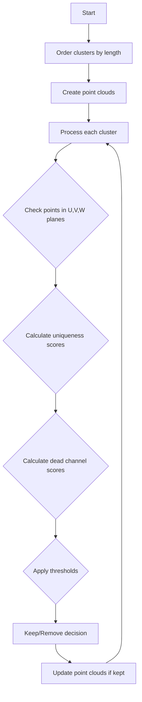

# NeutrinoID Deghosting Functions Documentation

## Overview

The deghosting functionality in NeutrinoID aims to remove "ghost" tracks and clusters that may be artifacts or duplicates in particle detector data. The main function `deghosting()` coordinates two main sub-processes:

1. `deghost_clusters()` - Removes ghost clusters
2. `deghost_segments()` - Removes ghost segments within clusters

## Function Call Structure

```
deghosting()
├── deghost_clusters()
│   ├── order_clusters()
│   │   └── sortbysec() - Helper comparison function
│   └── Multiple point cloud operations
└── deghost_segments() 
    ├── order_clusters()
    │   └── sortbysec() - Helper comparison function
    ├── order_segments()
    │   └── sortbysec1() - Helper comparison function 
    └── Multiple point cloud operations
```

## Detailed Logic

### 1. deghosting()

This is the main coordinating function that:

1. Calls `deghost_clusters()` to remove ghost clusters
2. Calls `deghost_segments()` to remove ghost segments
3. Performs cleanup by removing any vertices that no longer have associated segments

Key code:
```cpp
void WCPPID::NeutrinoID::deghosting() {
    deghost_clusters();
    deghost_segments();
    
    // Cleanup vertices without segments
    std::set<WCPPID::PR3DCluster*> temp_clusters;
    for (auto it = map_cluster_main_vertices.begin(); 
         it!= map_cluster_main_vertices.end(); it++) {
        WCPPID::PR3DCluster *cluster = it->first;
        WCPPID::ProtoVertex *vertex = it->second;
        if (map_vertex_segments.find(vertex)==map_vertex_segments.end()){
            temp_clusters.insert(cluster);
        }
    }
    // Remove clusters without valid vertices
    for (auto it = temp_clusters.begin(); it != temp_clusters.end(); it++){
        map_cluster_main_vertices.erase(*it);
    }
}
```

### 2. deghost_clusters() - Detailed Algorithm

This function removes ghost clusters that are likely artifacts or duplicates. Here's the detailed process:

1. Orders clusters by length (longest to shortest)
2. Creates point clouds for tracking points:
   - global_point_cloud: All points
   - global_steiner_point_cloud: Steiner points
   - global_skeleton_cloud: Skeleton/structure points

3. For each cluster (starting with longest), evaluates potential ghost status by:
   - Checking point proximity in multiple planes (U, V, W)
   - Analyzing dead channels
   - Calculating uniqueness percentages
   - Making removal decisions based on configurable thresholds

Logic Flow:


#### Algorithm Details

1. **Initialization Phase**
   ```cpp
   DynamicToyPointCloud global_point_cloud(angle_u, angle_v, angle_w);
   DynamicToyPointCloud global_steiner_point_cloud(angle_u, angle_v, angle_w);
   DynamicToyPointCloud global_skeleton_cloud(angle_u, angle_v, angle_w);
   ```
   - Creates three point clouds to track different types of points:
     - global_point_cloud: All points in the detector
     - global_steiner_point_cloud: Steiner points (key connection points)
     - global_skeleton_cloud: Basic structure points

2. **Initial Population**
   - Adds points from all clusters not in the ordered list to global_point_cloud
   - Orders remaining clusters by total track length (longest first)

3. **Main Processing Loop**
   For each cluster in order:
   ```cpp
   for (size_t i=0; i!= ordered_clusters.size(); i++) {
       // Process each point in cluster
       for (auto point : cluster_points) {
           for (int plane = 0; plane < 3; plane++) {  // U, V, W planes
               // Check dead channels
               bool is_dead = ct_point_cloud->get_closest_dead_chs(point, plane);
               if (!is_dead) {
                   // Check proximity to existing points
                   check_proximity_and_update_scores();
               }
               update_plane_statistics();
           }
       }
       evaluate_cluster_scores();
   }
   ```

4. **Point Analysis Per Plane**
   - For each point in U, V, W planes:
     - Checks if point is in dead channel region
     - If not dead:
       - Checks distance to nearest point in global_point_cloud
       - Checks distance to nearest point in global_steiner_point_cloud
       - Checks distance to nearest point in global_skeleton_cloud
     - Updates uniqueness counters based on proximity checks

5. **Scoring System**
   ```cpp
   double unique_percent_u = num_unique[0]*1.0/num_total_points;
   double unique_percent_v = num_unique[1]*1.0/num_total_points;
   double unique_percent_w = num_unique[2]*1.0/num_total_points;
   double dead_percent_u = num_dead[0]*1.0/num_total_points;
   // ... similar for v, w
   ```

6. **Decision Criteria**
   A cluster is marked for removal if ANY of these conditions are met:
   ```cpp
   bool should_remove = 
       // Condition 1: High dead channels with low uniqueness
       (max_dead_percent >= 0.8 && max_unique_percent <= 0.35 
           && ave_unique_percent <= 0.16 && min_unique_percent <= 0.08) ||
       // Condition 2: Very low uniqueness overall
       (max_unique_percent <= 0.1 && ave_unique_percent <= 0.05 
           && min_unique_percent <= 0.025) ||
       // Condition 3: Moderate dead channels with very low uniqueness
       (max_dead_percent < 0.8 && max_dead_percent >=0.7 
           && max_unique_percent <= 0.2 && ave_unique_percent <= 0.1 
           && min_unique_percent <= 0.05);
   ```

7. **Additional Safety Check**
   ```cpp
   // Special case: if one plane is completely dead
   if ((num_dead[0]==num_total_points || num_dead[1]==num_total_points 
        || num_dead[2]==num_total_points) &&
       // and two planes have zero unique points
       (num_unique[0]==0 && num_unique[1]==0 || 
        num_unique[0]==0 && num_unique[2]==0 || 
        num_unique[2]==0 && num_unique[1]==0) &&
       // and remaining plane has low uniqueness
       max_unique_percent < 0.75) {
       should_remove = true;
   }
   ```

8. **Point Cloud Updates**
   - If cluster is kept:
     - Adds points to global_point_cloud
     - Adds Steiner points to global_steiner_point_cloud
     - Adds skeleton points to global_skeleton_cloud
   - If removed:
     - Adds to to_be_removed_clusters list for later cleanup

### 3. deghost_segments() - Detailed Algorithm

This function removes ghost segments within clusters, operating at a finer granularity than cluster deghosting. It uses a sophisticated algorithm to identify and remove redundant or artifactual segments while preserving essential track structure:

1. Orders segments by length
2. Creates tracking point clouds
3. Evaluates each segment for:
   - Proximity to other segments
   - Point uniqueness
   - Dead channel patterns
   
#### Algorithm Details

1. **Initialization & Setup**
   ```cpp
   DynamicToyPointCloud global_point_cloud(angle_u, angle_v, angle_w);
   DynamicToyPointCloud global_steiner_point_cloud(angle_u, angle_v, angle_w);
   DynamicToyPointCloud global_skeleton_cloud(angle_u, angle_v, angle_w);
   double dis_cut = 1.2*units::cm;
   ```

2. **Initial Population Phase**
   - Populates global_point_cloud with points from unordered clusters
   - Orders clusters from longest to shortest using order_clusters()
   - Creates mapping of cluster IDs to segments

3. **Segment Analysis Loop**
   For each cluster in order:
   ```cpp
   for (size_t i=0; i!= ordered_clusters.size(); i++) {
       // Get ordered segments for this cluster
       WCPPID::ProtoSegmentSelection ordered_segments;
       order_segments(ordered_segments, 
                     map_cluster_id_segments[ordered_clusters.at(i)->get_cluster_id()]);
       
       // Process each segment
       for (size_t j=0; j!=ordered_segments.size(); j++) {
           WCPPID::ProtoSegment *sg = ordered_segments.at(j);
           process_segment(sg);
       }
   }
   ```

4. **Segment Evaluation Criteria**
   ```cpp
   // Check segment characteristics
   double length = sg->get_length();
   double medium_dQ_dx = sg->get_medium_dQ_dx();
   int start_n = map_vertex_segments[pair_vertices.first].size();
   int end_n = map_vertex_segments[pair_vertices.second].size();
   
   // Special handling for segments with specific characteristics
   if ((start_n==1 || end_n == 1) && 
       medium_dQ_dx < 1.1 * 43e3/units::cm && 
       length > 3.6*units::cm) {
       perform_detailed_analysis();
   }
   ```

5. **Point-by-Point Analysis**
   For each point in the segment:
   ```cpp
   for (size_t k=0; k!=pts.size(); k++) {
       Point test_point = pts.at(k);
       
       // Check each plane (U, V, W)
       for (int plane = 0; plane < 3; plane++) {
           bool flag_dead = ct_point_cloud->get_closest_dead_chs(test_point, plane);
           if (!flag_dead) {
               check_point_proximity(test_point, plane);
           } else {
               num_dead[plane]++;
           }
       }
   }
   ```

6. **Proximity Checking Algorithm**
   ```cpp
   void check_point_proximity(Point& test_point, int plane) {
       bool flag_in = false;
       
       // Check against global points
       auto results = global_point_cloud.get_closest_2d_point_info(
           test_point, plane);
       if (std::get<0>(results) <= dis_cut*2./3.) 
           flag_in = true;
           
       // Check against Steiner points
       if (!flag_in && global_steiner_point_cloud.get_num_points() != 0) {
           results = global_steiner_point_cloud.get_closest_2d_point_info(
               test_point, plane);
           if (std::get<0>(results) <= dis_cut*2./3.) 
               flag_in = true;
       }
       
       // Check against skeleton points
       if (!flag_in && global_skeleton_cloud.get_num_points() != 0) {
           results = global_skeleton_cloud.get_closest_2d_point_info(
               test_point, plane);
           if (std::get<0>(results) <= dis_cut*3./4.) 
               flag_in = true;
       }
       
       if (!flag_in) 
           num_unique[plane]++;
   }
   ```

7. **Segment Protection Rules**
   ```cpp
   // Special protection for segments connected to main vertex
   if (!flag_add_seg) {
       WCPPID::PR3DCluster *tmp_cluster = map_segment_cluster[sg];
       if (map_cluster_main_vertices.find(tmp_cluster) != 
           map_cluster_main_vertices.end()) {
           
           WCPPID::ProtoVertex *tmp_vtx = 
               map_cluster_main_vertices[tmp_cluster];
           if (map_vertex_segments[tmp_vtx].find(sg) != 
               map_vertex_segments[tmp_vtx].end() && 
               map_vertex_segments[tmp_vtx].size()==1) {
               flag_add_seg = true;
           }
       }
   }
   ```

8. **Segment Decision & Update**
   ```cpp
   if (flag_add_seg) {
       // Keep segment, add to skeleton cloud
       global_skeleton_cloud.AddPoints(sg->get_point_vec());
   } else {
       // Remove segment
       std::cout << "Remove Cluster ID " << sg->get_cluster_id() 
                << " segment id " << sg->get_id() << std::endl;
       del_proto_segment(sg);
   }
   ```

9. **Final Cleanup**
   - Updates point clouds with kept segment information
   - Removes vertices that no longer have associated segments
   - Updates cluster and segment mappings

#### Special Protections

1. **Main Vertex Protection**
   - Segments that are sole connections to main vertices are protected
   - Additional checks for segments connected to main vertices

2. **Short Segment Handling**
   - Stricter thresholds for short segments (<5cm)
   - Additional charge density checks for short segments

3. **Multi-Plane Consistency**
   - Requires consistency across multiple detector planes
   - Special handling when one plane is dead

4. **Charge Density Considerations**
   - Higher thresholds for segments with high charge density
   - Special protection for high-charge segments near vertices

Example evaluation code:
```cpp
// Example segment evaluation criteria
if ((start_n==1 || end_n == 1) && 
    medium_dQ_dx < 1.1 * 43e3/units::cm && 
    length > 3.6*units::cm) {
    
    // Check point uniqueness in each plane
    for (size_t k=0; k!=pts.size(); k++) {
        Point test_point = pts.at(k);
        // Check U plane
        bool flag_dead = ct_point_cloud->get_closest_dead_chs(test_point,0);
        if (!flag_dead) {
            bool flag_in = false;
            std::tuple<double, WCP::PR3DCluster*, size_t> results = 
                global_point_cloud.get_closest_2d_point_info(test_point, 0);
            if (std::get<0>(results)<=dis_cut*2./3.) 
                flag_in = true;
            // Similar checks for other point clouds...
        }
        // Similar checks for V and W planes...
    }
}
```

## Important Parameters and Thresholds

- Distance thresholds:
  - Basic proximity: 1.2 cm
  - Point cloud comparison: 0.6-0.8 of basic threshold
  - Skeleton comparison: 1.5 of basic threshold

- Quality thresholds:
  - Minimum segment length: 3.6-5.0 cm
  - Maximum charge density: 1.1 × 43e3/cm
  - Dead channel percentage thresholds: 70-80%
  - Uniqueness score thresholds: Various percentages based on plane combination

## Helper Functions

1. `order_clusters()`: 
   - Orders clusters by total length
   - Creates mapping of cluster IDs to segments
   - Returns ordered list and mappings

2. `order_segments()`:
   - Orders segments within a cluster by length
   - Uses segment length for sorting

3. `sortbysec()` and `sortbysec1()`:
   - Comparison functions for sorting pairs by second element
   - Used in ordering clusters and segments