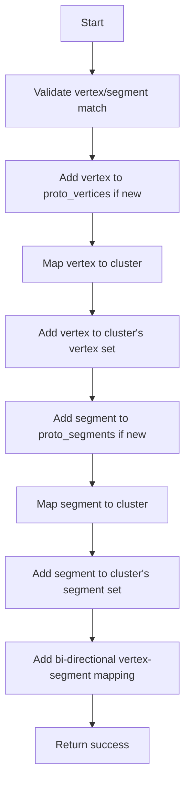

# Proto Connection Functions Documentation

This document explains the key functions used for managing proto vertices, segments, and their connections in the WireCell PID system.

## Overview

The system maintains several maps to track relationships between:
- Proto vertices (representing endpoints/intersections)
- Proto segments (representing track segments)
- Clusters (groupings of related vertices/segments)

The main maps are:
- `map_vertex_segments`: Maps vertices to their connected segments
- `map_segment_vertices`: Maps segments to their connected vertices  
- `map_vertex_cluster`: Maps vertices to their parent cluster
- `map_cluster_vertices`: Maps clusters to their contained vertices
- `map_segment_cluster`: Maps segments to their parent cluster
- `map_cluster_segments`: Maps clusters to their contained segments

## Function Details

### 1. del_proto_connection

```cpp
bool del_proto_connection(ProtoVertex* pv, ProtoSegment* ps)
```

**Purpose**: Removes a connection between a vertex and segment

**Inputs**:
- `pv`: Pointer to the proto vertex
- `ps`: Pointer to the proto segment

**Logic flow**:
1. Check if vertex exists in vertex->segments map
2. Check if segment exists in segment->vertices map 
3. If either doesn't exist, return false
4. Remove segment from vertex's set of segments
5. Remove vertex from segment's set of vertices
6. Return true on success

**Example usage**:
```cpp
// Disconnect vertex v1 from segment s1
bool success = del_proto_connection(v1, s1);

// This removes bi-directional links:
// v1's segments no longer include s1
// s1's vertices no longer include v1
```

### 2. add_proto_connection

```cpp
bool add_proto_connection(ProtoVertex* pv, ProtoSegment* ps, PR3DCluster* cluster)
```

**Purpose**: Establishes a connection between a vertex and segment, managing all related maps/collections

**Inputs**:
- `pv`: Proto vertex to connect
- `ps`: Proto segment to connect  
- `cluster`: Parent cluster they belong to

**Logic flow**:



**Key validations**:
1. Checks vertex index matches one of segment's endpoint indices
2. Maintains both objects' cluster associations 
3. Updates all relevant maps/collections

### 3. del_proto_vertex

```cpp 
bool del_proto_vertex(ProtoVertex* pv)
```

**Purpose**: Fully removes a vertex and all its connections

**Input**:
- `pv`: Vertex to delete

**Logic**:
1. Verify vertex exists in map_vertex_segments
2. For each connected segment:
   - Remove vertex from segment's vertex set
3. Remove vertex from vertex->segments map
4. Clean up cluster mappings:
   - Remove vertex from cluster's vertex set  
   - Remove vertex from vertex->cluster map

**Example effects**:
```cpp
// Before deletion of v1:
map_vertex_segments[v1] = {s1, s2}
map_segment_vertices[s1] = {v1, v3}
map_segment_vertices[s2] = {v1, v4}

// After del_proto_vertex(v1):
map_vertex_segments no longer contains v1
map_segment_vertices[s1] = {v3}
map_segment_vertices[s2] = {v4}
```

### 4. del_proto_segment

```cpp
bool del_proto_segment(ProtoSegment* ps)  
```

**Purpose**: Removes a segment and all its connections

**Input**: 
- `ps`: Segment to delete

**Logic**:
1. Verify segment exists in map_segment_vertices
2. For each connected vertex:
   - Remove segment from vertex's segment set
3. Remove segment from segment->vertices map
4. Clean up cluster mappings:
   - Remove from cluster's segment set
   - Remove from segment->cluster map

The deletions maintain referential integrity across all maps and collections.

## Usage Example

Here's a typical workflow showing how these functions work together:

```cpp
// Create initial connections
add_proto_connection(vertex1, segment1, cluster1);
add_proto_connection(vertex2, segment1, cluster1);

// Later, need to break segment1 into two parts
del_proto_connection(vertex1, segment1);  // Disconnect one end
add_proto_connection(vertex1, segment2, cluster1); // Connect new segment

// Remove vertex entirely 
del_proto_vertex(vertex1);  // Cleans up all connections

// Remove segment
del_proto_segment(segment1);  // Removes all vertex connections
```

## Important Notes

1. All functions maintain bidirectional integrity - when A references B, B must reference A
2. Cluster associations are preserved through all operations
3. Memory management of actual vertex/segment objects is separate from connection management
4. The functions are designed to fail safely if objects don't exist or are already disconnected