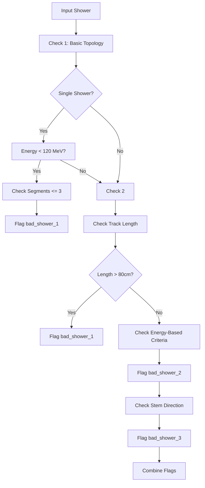
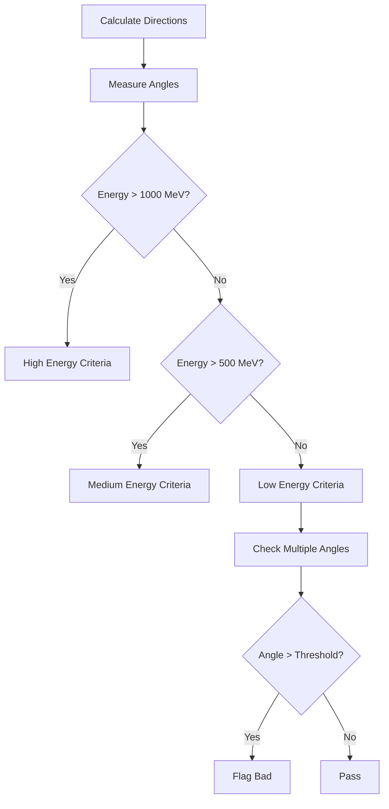
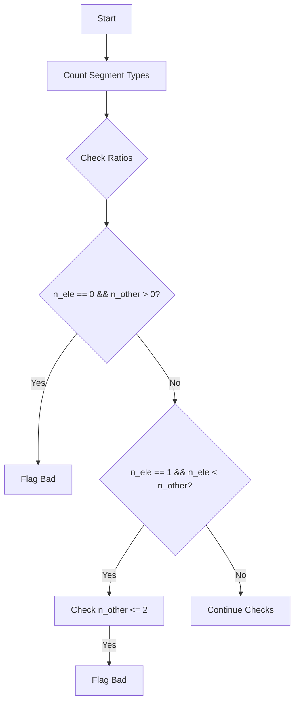

# Bad Reconstruction Functions Analysis - Detailed Algorithm

## Overview

The bad reconstruction functions form a critical component of neutrino event reconstruction in liquid argon TPCs. These functions identify problematic shower reconstructions that could lead to misidentification of neutrino interactions.

## 1. bad_reconstruction()

### Purpose
Primary quality assessment function that combines three independent checks to identify badly reconstructed showers.

### Algorithm Detail



### Key Parameters

1. **Energy Thresholds**:
```cpp
struct EnergyThresholds {
    double very_low = 120 * units::MeV;
    double low = 200 * units::MeV;
    double medium = 500 * units::MeV;
    double high = 800 * units::MeV;
    double very_high = 1500 * units::MeV;
};
```

2. **Length Criteria**:
```cpp
struct LengthCriteria {
    double min_track = 10 * units::cm;
    double max_stem = 80 * units::cm;
    double min_shower = 6 * units::cm;
};
```

### Detailed Check Sequence

1. **Basic Topology Check**:
```cpp
bool check_basic_topology(WCShower* shower) {
    if (shower->get_num_segments() <= 3 && 
        shower->get_kine_charge() < 120 * units::MeV) {
        ProtoSegment* sg = shower->get_start_segment();
        return (!sg->get_flag_shower_topology() && 
                !sg->get_flag_shower_trajectory());
    }
    return false;
}
```

2. **Track Length Analysis**:
```cpp
bool analyze_track_length(WCShower* shower) {
    double total_length = shower->get_total_length();
    double main_length = shower->get_total_length(
        shower->get_start_segment()->get_cluster_id());
    return (main_length/total_length > 0.95 && 
            length/total_length > 0.85);
}
```

## 2. bad_reconstruction_1()

### Purpose
Examines the alignment between shower stem direction and overall shower direction.

### Detailed Algorithm

1. **Direction Calculations**:
```cpp
// Calculate shower direction vectors
TVector3 calc_directions(WCShower* shower) {
    Point vertex_point = get_vertex_point(shower);
    // Main shower direction (30cm scale)
    TVector3 dir_shower = shower->cal_dir_3vector(
        vertex_point, 30*units::cm);
    // Stem direction (5cm scale)
    TVector3 dir_stem = shower->get_start_segment()
        ->cal_dir_3vector(vertex_point, 5*units::cm);
    return {dir_shower, dir_stem};
}
```

2. **Angle Criteria**:


### Energy-Dependent Thresholds

```cpp
struct AngleThresholds {
    struct EnergyBand {
        double main_angle;
        double drift_angle;
        double stem_angle;
    };
    
    map<string, EnergyBand> thresholds = {
        {"high", {30.0, 10.0, 3.0}},
        {"medium", {25.0, 7.5, 5.0}},
        {"low", {20.0, 7.5, 5.0}}
    };
};
```

## 3. bad_reconstruction_2()

### Purpose
Analyzes vertex topology and shower structure for inconsistencies.

### Algorithm Components

1. **Segment Analysis**:
```cpp
struct SegmentAnalysis {
    int n_ele = 0;  // electron-like segments
    int n_other = 0;  // other segments
    
    void analyze_segment(ProtoSegment* sg) {
        double medium_dQ_dx = sg->get_medium_dQ_dx()
            /(43e3/units::cm);
        bool is_electron_like = sg->get_flag_shower_topology() 
            || (sg->get_flag_shower_trajectory() 
                && medium_dQ_dx < 1.3);
        if (is_electron_like) n_ele++;
        else n_other++;
    }
};
```

2. **Topology Checks**:


3. **Length Criteria**:
```cpp
bool check_length_criteria(WCShower* shower) {
    double total_main_length = shower->get_total_length(
        shower->get_start_segment()->get_cluster_id());
    double total_length = shower->get_total_length();
    return (total_main_length/total_length > 0.95);
}
```

## bad_reconstruction_3()

### Purpose
Identifies splitting issues and examines shower component connectivity.

### Major Components

1. **Distance Calculations**:
```cpp
struct DistanceMetrics {
    double calc_separation(Point p1, Point p2) {
        return sqrt(pow(p1.x - p2.x, 2) + 
                   pow(p1.y - p2.y, 2) + 
                   pow(p1.z - p2.z, 2));
    }
    
    vector<double> get_cluster_distances(WCShower* shower) {
        vector<double> distances;
        // Calculate distances between components
        return distances;
    }
};
```

2. **Connectivity Analysis**:
```cpp
struct ConnectivityCheck {
    int count_connections(ProtoVertex* vertex) {
        return vertex->get_connected_segments().size();
    }
    
    double analyze_segment_connectivity(
        ProtoSegment* seg, 
        vector<ProtoVertex*> vertices) {
        // Analyze connectivity metrics
        return connectivity_score;
    }
};
```

### Energy-Based Criteria

```cpp
struct ReconstructionCriteria {
    struct Thresholds {
        double min_separation;
        double max_angle;
        int min_connections;
    };
    
    map<double, Thresholds> energy_thresholds = {
        {150, {5.0, 30.0, 2}},
        {300, {7.0, 35.0, 2}},
        {600, {10.0, 40.0, 3}},
        {1000, {15.0, 45.0, 3}}
    };
};
```

## Implementation Details

### Common Utilities

1. **Direction Calculation**:
```cpp
class DirectionCalculator {
public:
    static TVector3 calculate_shower_direction(
        WCShower* shower, 
        double scale_cm) {
        Point start = shower->get_start_point();
        return shower->cal_dir_3vector(start, 
            scale_cm * units::cm);
    }
    
    static double calculate_angle(
        TVector3 dir1, 
        TVector3 dir2) {
        return dir1.Angle(dir2) * 180.0/3.14159;
    }
};
```

2. **Quality Metrics**:
```cpp
struct QualityMetrics {
    double calculate_length_ratio(
        double main_length, 
        double total_length) {
        return main_length / total_length;
    }
    
    bool check_segment_quality(
        ProtoSegment* seg, 
        double energy) {
        // Quality checks based on energy
        return quality_flag;
    }
};
```

### Error Handling

```cpp
class BadReconstructionHandler {
public:
    void handle_flags(bool flag1, bool flag2, bool flag3) {
        if (flag1 || flag2 || flag3) {
            log_bad_reconstruction();
            set_quality_flag(false);
        }
    }
    
private:
    void log_bad_reconstruction() {
        // Log details for debugging
    }
};
```

## Usage Example

```cpp
void process_shower(WCShower* shower) {
    // Initialize handlers
    BadReconstructionHandler handler;
    QualityMetrics metrics;
    
    // Run checks
    bool flag1 = bad_reconstruction(shower);
    bool flag2 = bad_reconstruction_1(shower);
    bool flag3 = bad_reconstruction_2(shower);
    
    // Handle results
    handler.handle_flags(flag1, flag2, flag3);
    
    // Store metrics
    metrics.store_results(shower);
}
```

## Performance Considerations

1. The algorithms are designed to handle various shower topologies and energies
2. Critical thresholds are energy-dependent
3. Multiple checks provide redundancy and robustness
4. Geometric calculations are optimized for performance

The combination of these functions provides a comprehensive assessment of shower reconstruction quality, essential for accurate neutrino interaction identification.