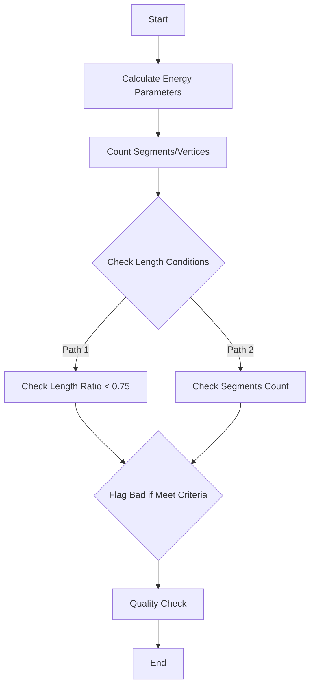
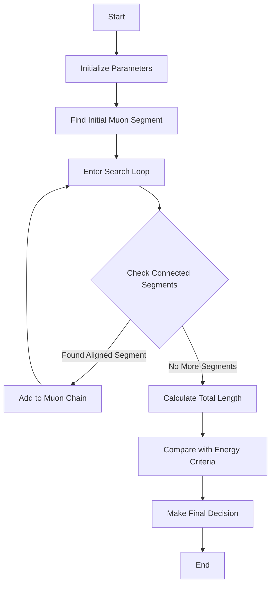

# Analysis of Neutrino ID Functions

## 1. low_energy_michel Function

This function analyzes shower patterns to identify low-energy Michel electrons from muon decays.

### Key Parameters
- `E_range`: Range-based energy calculation
- `E_dQdx`: Energy based on charge deposition per unit length 
- `E_charge`: Total charge-based energy
- `length1`: Total length in main cluster
- `length2`: Total length across all clusters
- `n_3seg`: Number of vertices with 3 or more segments

### Main Logic Flow



### Flag Conditions
1. First Major Condition:
```cpp
if (shower->get_total_length() < 25*units::cm && 
    shower->get_total_length(shower->get_start_segment()->get_cluster_id()) > 0.75 * shower->get_total_length() && 
    n_3seg == 0 ||
    shower->get_total_length() < 18*units::cm && 
    shower->get_total_length(shower->get_start_segment()->get_cluster_id()) > 0.75 * shower->get_total_length() && 
    n_3seg > 0)
```
   - Identifies short showers with most activity in main cluster
   - Different thresholds based on vertex complexity

2. Second Major Condition:
```cpp
if (E_charge < 100*units::MeV && 
    E_dQdx < 0.7 * E_charge && 
    shower->get_num_segments() == shower->get_num_main_segments())
```
   - Identifies low energy showers with specific charge deposition pattern
   - Ensures shower segments are contained in main cluster

## 2. broken_muon_id Function

This function identifies broken muon tracks that might be misidentified as electron showers.

### Key Components

1. **Muon Segment Collection**
   - Builds chain of connected segments that could form a muon track
   - Uses angular alignment to identify segments

2. **Energy and Length Calculations**
   - Accumulates total length of potential muon track
   - Calculates direct length vs. total length ratio
   - Compares with shower energy thresholds

### Algorithm Flow



### Key Conditions
1. **Segment Connection Check**:
```cpp
if (180 - dir1.Angle(dir2)/3.1415926*180. < 15 && 
    sg1->get_length() > 6*units::cm)
```
   - Checks if segments are well-aligned
   - Ensures minimum segment length

2. **Energy-Length Criteria**:
```cpp
if (muon_segments.size() > 1 && 
    (Ep > Eshower * 0.55 || 
     acc_length > 0.65 * shower->get_total_length() || 
     connected_length > 0.95 * shower->get_total_length()) && 
    tmp_ids.size() > 1 &&
    (acc_direct_length > 0.94 * acc_length) && 
    Eshower < 350*units::MeV)
```
   - Compares reconstructed muon energy with shower energy
   - Checks length ratios
   - Applies energy threshold

### Additional Checks

The function includes multiple quality checks:
- Direct vs total length ratio
- Number of segments in muon chain
- Cluster overlap assessment
- Energy consistency checks

### Notes
- Function returns `true` if shower is likely a broken muon
- Uses both geometric and calorimetric information
- Multiple threshold values tuned to detector response
- Includes special handling for edge cases and detector effects