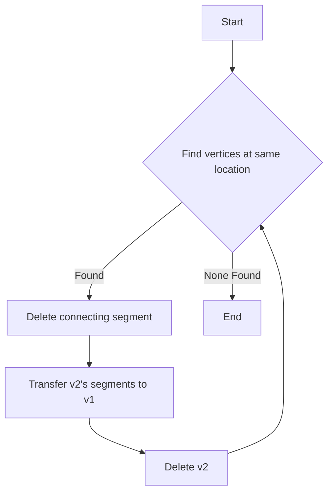

# Detailed Analysis of NeutrinoID Functions

## calc_PCA_main_axis

### Purpose
This function performs Principal Component Analysis (PCA) on a set of 3D points to find the main direction/axis of the point distribution.

### Algorithm Flow
1. Calculate center point:
   - Computes average position of all input points
   - Returns early if less than 3 points

2. Build covariance matrix:
   ```cpp
   TMatrixD cov_matrix(3,3);
   // Fill upper triangle of 3x3 matrix:
   // xx xy xz
   // yx yy yz
   // zx zy zz
   // Where each element is covariance between dimensions
   ```

3. Compute eigenvectors:
   - Uses ROOT's TMatrixDEigen for eigendecomposition 
   - First eigenvector corresponds to direction of maximum variance
   - Normalizes eigenvector to unit length

4. Return:
   ```cpp
   return std::make_pair(center, PCA_main_axis);
   ```

### Usage Example
```cpp
PointVector points; // Collection of 3D points
// Add points...
auto result = calc_PCA_main_axis(points);
Point center = result.first;  
TVector3 main_direction = result.second;
```

## clean_up_maps_vertices_segments

### Purpose
Cleans up the vertex and segment maps by merging vertices that refer to the same physical location and updating segment connections accordingly.

### Algorithm Flow


### Key Steps
1. Iteratively searches for vertices at same location (same index)
2. When found:
   - Deletes segment connecting them
   - Transfers all segments from v2 to v1 
   - Deletes v2
3. Continues until no more vertices to merge

