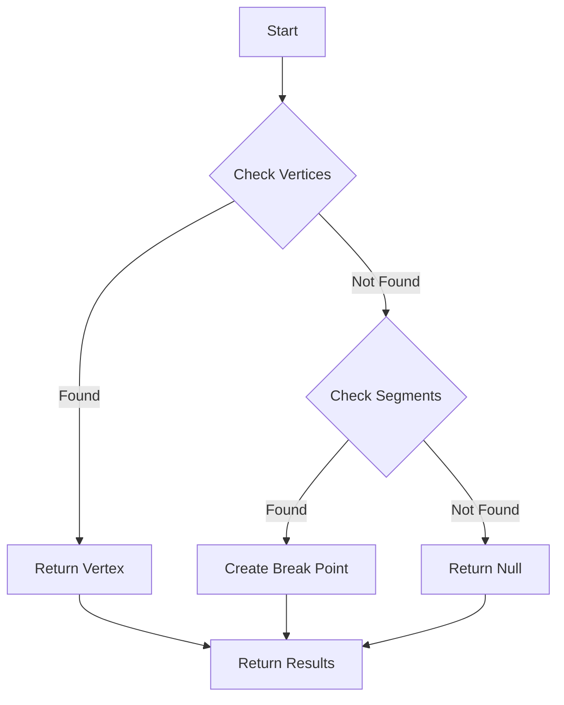

## check_end_segments Function

### Purpose
The `check_end_segments` function examines and potentially removes short track segments at endpoints of tracks, helping clean up track reconstruction artifacts.

### Input Parameters
- `temp_cluster`: PR3DCluster pointer containing the track data

### Logic Flow

1. Main Loop Structure:
```cpp
bool flag_check = true;
while(flag_check) {
    flag_check = false;
    for (auto it = map_segment_vertices.begin(); 
         it!=map_segment_vertices.end(); it++) {
        // Process segments
    }
}
```

2. Segment Evaluation:
   - Checks segment length and connection patterns
   - Evaluates endpoint vertex connectivity
   - Decision diagram:

```
Segment --> Length < 5cm? --> Yes --> Check Vertex Connections
                          --> No --> Keep Segment

Check Vertex --> Single Connection? --> Yes --> Remove Segment
Connections --> Multiple Connections --> No --> Keep Segment
```

3. Removal Criteria:
```cpp
if (sg->get_length() < 5*units::cm) {
    // If endpoint vertex has only this connection
    if (map_vertex_segments[tmp_vtxs.first].size() == 1 && 
        map_vertex_segments[tmp_vtxs.second].size() > 1) {
        del_proto_vertex(tmp_vtxs.first);
        del_proto_segment(sg);
    }
}
```

### Key Features

1. **Short Segment Detection**:
   - Identifies segments shorter than threshold (5cm)
   - Prevents removal of important connection points

2. **Vertex Analysis**:
   - Checks vertex connectivity patterns
   - Preserves vertices with multiple connections

3. **Cleanup Process**:
   - Removes unnecessary short segments
   - Maintains track topology
   - Updates cluster structure

### Example Usage

```cpp
// Typical usage in neutrino reconstruction
WCPPID::PR3DCluster* cluster = ...;
check_end_segments(cluster);

// Results in cleaned track segments
// Short dangling segments removed
// Main track structure preserved
```

## Interaction Between Functions

The `break_segments` and `check_end_segments` functions often work together in track reconstruction:

1. `break_segments` splits long tracks at kinks
2. `check_end_segments` cleans up resulting short segments
3. Together they improve track topology representation

### Output Effects

- More accurate track segmentation
- Cleaned endpoint structure
- Better handling of complex track patterns
- Improved vertex positioning

## Function: `check_end_point`

### Purpose 
Examines endpoints of a tracking path to identify if they connect with existing vertices or segments, helping establish track connectivity.

### Key Parameters
- `temp_cluster`: Cluster being analyzed
- `tracking_path`: Vector of 3D points representing track
- `flag_front`: Whether to check front/back of path
- `vtx_cut1`, `vtx_cut2`: Distance thresholds for vertex matching
- `sg_cut1`, `sg_cut2`: Distance thresholds for segment matching

### Algorithm Steps
1. Establishes search direction and reference points based on flag_front
2. Checks for existing vertices within distance thresholds
3. If no vertex found, searches for closest segments
4. Returns tuple containing:
   - Found/created vertex (if any)
   - Connected segment (if any) 
   - Test point location

### Visual Flow


### Key Code Segment
Example of the vertex distance check logic:
```cpp
double dis1 = sqrt(pow(test_p.x - p1.x,2) + 
                  pow(test_p.y - p1.y,2) + 
                  pow(test_p.z - p1.z,2));
double dis2 = temp_l.closest_dis(p1);

if (std::max(dis1,dis2) < 5*units::cm && 
    (std::min(dis1,dis2) < vtx_cut1 && 
     std::max(dis1,dis2) < vtx_cut2)) {
    // Found valid vertex connection
}
```

### Dependencies and Helper Functions
Both functions rely on several helper methods:
- `get_closest_point`: Finds nearest point on a segment to given point
- `proto_extend_point`: Extends a point along direction vector
- `closest_dis`: Calculates minimum distance between point and line
- `add_proto_connection`: Updates connectivity maps between vertices/segments

### Important Notes
1. Multiple distance thresholds are used to handle different scenarios:
   - Tight thresholds for high-confidence matches
   - Relaxed thresholds for potential matches needing more verification

2. The functions maintain track topology through careful vertex/segment connectivity management

3. Both functions are critical for track reconstruction as they:
   - Establish connectivity between track segments
   - Handle track branching points
   - Maintain clean topological relationships

4. Error handling includes:
   - Validation of distance thresholds
   - Checks for degenerate cases
   - Maintenance of data structure consistency