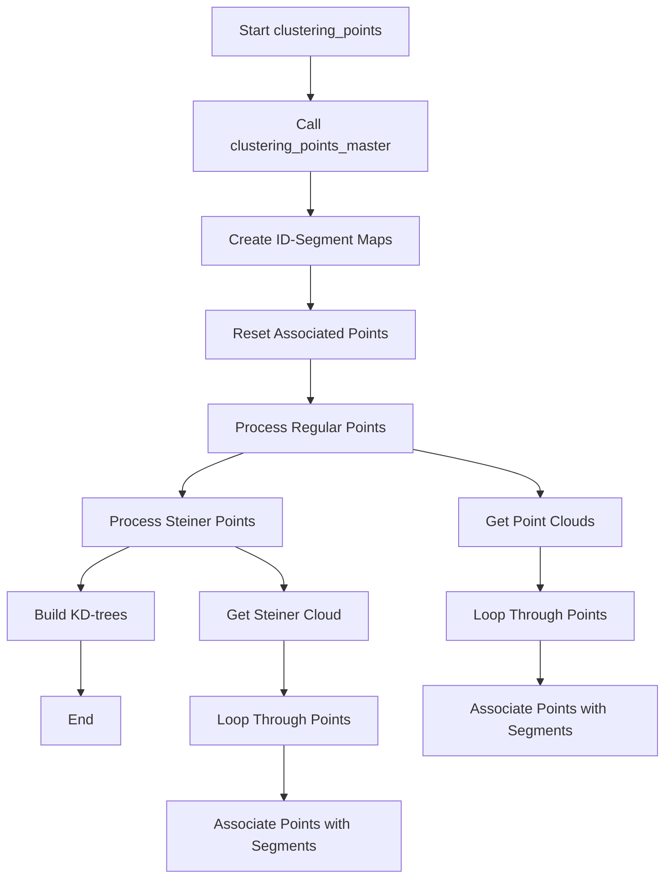
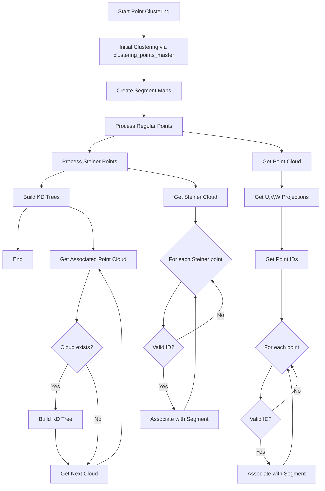

# Understanding the clustering_points Function

## Purpose
The `clustering_points` function in the NeutrinoID class is responsible for organizing and associating points with their corresponding segments in a 3D particle reconstruction system. It handles both regular points and Steiner points (special points used in graph construction).

## Key Components and Flow
1. First calls cluster's `clustering_points_master` function
2. Creates maps between segment IDs and segments
3. Associates regular points with segments
4. Associates Steiner points with segments
5. Builds KD-trees for point clouds

## Logical Flow Diagram


## Key Function Calls
The function makes several important calls:

1. `cluster->clustering_points_master()`: Initial point clustering [see details](./clustering_points_master.md)
2. `sg->reset_associate_points()`: Clears existing point associations [see protosegment](../protosegment.md)
3. `sg->add_associate_point()`: Associates regular points [see protosegment](../protosegment.md)
4. `sg->add_associate_point_steiner()`: Associates Steiner points [see protosegment](../protosegment.md)
5. `pcloud_associate->build_kdtree_index()`: Builds KD-tree for point searching 
6. `pcloud_associate_steiner->build_kdtree_index()`: Builds KD-tree for Steiner points

## Detailed Code Example

Here's a simplified example showing the core logic:

```cpp
void clustering_points(WCPPID::PR3DCluster* temp_cluster) {
    // Initial clustering
    temp_cluster->clustering_points_master(map_vertex_segments, 
                                         map_segment_vertices, 
                                         *ct_point_cloud);

    // Create segment maps
    std::map<int, WCPPID::ProtoSegment*> map_id_seg;
    std::map<WCPPID::ProtoSegment*, int> map_seg_id;
    
    // Initialize maps and reset points
    for (auto it = map_segment_vertices.begin(); 
         it != map_segment_vertices.end(); it++) {
        WCPPID::ProtoSegment *sg = it->first;
        if (sg->get_cluster_id() != temp_cluster->get_cluster_id()) 
            continue;
        
        map_id_seg[sg->get_id()] = sg;
        map_seg_id[sg] = sg->get_id();
        sg->reset_associate_points();
    }

    // Process regular points
    {
        WCP::WCPointCloud<double>& cloud = 
            temp_cluster->get_point_cloud()->get_cloud();
        // ... similar for u,v,w clouds
        
        std::vector<int>& point_sub_cluster_ids = 
            temp_cluster->get_point_sub_cluster_ids();
        
        for (size_t i=0; i < point_sub_cluster_ids.size(); i++) {
            if (point_sub_cluster_ids.at(i) == -1) continue;
            if (map_id_seg.find(point_sub_cluster_ids.at(i)) == 
                map_id_seg.end()) continue;
            
            map_id_seg[point_sub_cluster_ids.at(i)]->add_associate_point(
                cloud.pts[i], 
                cloud_u.pts[i], 
                cloud_v.pts[i], 
                cloud_w.pts[i]
            );
        }
    }

    // Process Steiner points
    {
        WCP::WCPointCloud<double>& cloud = 
            temp_cluster->get_point_cloud_steiner()->get_cloud();
        std::vector<int>& point_steiner_sub_cluster_ids = 
            temp_cluster->get_point_steiner_sub_cluster_ids();
        
        for (size_t i=0; i < point_steiner_sub_cluster_ids.size(); i++) {
            if (point_steiner_sub_cluster_ids.at(i) == -1) continue;
            if (map_id_seg.find(point_steiner_sub_cluster_ids.at(i)) == 
                map_id_seg.end()) continue;
            
            map_id_seg[point_steiner_sub_cluster_ids.at(i)]->
                add_associate_point_steiner(cloud.pts[i]);
        }
    }

    // Build KD-trees
    for (auto it = map_segment_vertices.begin(); 
         it != map_segment_vertices.end(); it++) {
        WCPPID::ProtoSegment *sg = it->first;
        if (sg->get_cluster_id() != temp_cluster->get_cluster_id()) 
            continue;
        
        ToyPointCloud *pcloud_associate = sg->get_associated_pcloud();
        if (pcloud_associate != 0) 
            pcloud_associate->build_kdtree_index();
        
        ToyPointCloud *pcloud_associate_steiner = 
            sg->get_associated_pcloud_steiner();
        if (pcloud_associate_steiner != 0)
            pcloud_associate_steiner->build_kdtree_index();
    }
}
```

## Data Structures Used

1. **Point Clouds:**
   - Regular points cloud (3D + projections in u,v,w planes)
   - Steiner points cloud
   
2. **Maps:**
   - `map_id_seg`: Maps segment IDs to segment objects
   - `map_seg_id`: Maps segment objects to their IDs
   - `map_segment_vertices`: Maps segments to vertices
   - `map_vertex_segments`: Maps vertices to segments

3. **Vectors:**
   - `point_sub_cluster_ids`: IDs for regular points
   - `point_steiner_sub_cluster_ids`: IDs for Steiner points

## Key Points to Note

1. The function handles two types of points:
   - Regular reconstruction points
   - Steiner points (used in graph algorithms)

2. Points are associated with segments based on their cluster IDs

3. KD-trees are built for efficient point searching

4. Error checking is performed at multiple stages:
   - Checking valid cluster IDs
   - Checking valid segment IDs
   - Checking non-null pointers

5. The function maintains both 3D and 2D (u,v,w) projections for regular points

# Flow Diagram
