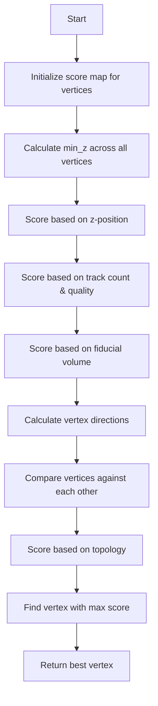

# Understanding the compare_main_vertices_global Function

## Overview

The `compare_main_vertices_global` function is used to compare and select the best vertex among multiple vertex candidates in a neutrino interaction reconstruction. It assigns scores to vertices based on various criteria and returns the vertex with the highest score.

## Logic Flow Diagram



## Scoring Components

### 1. Position Score
```cpp
// Calculate minimum z position
double min_z = 1e9;
for (auto it = vertex_candidates.begin(); it!=vertex_candidates.end(); it++) {
    if ((*it)->get_fit_pt().z < min_z) 
        min_z = (*it)->get_fit_pt().z;
}

// Score based on z position (penalize vertices far from start)
for (auto it = vertex_candidates.begin(); it!=vertex_candidates.end(); it++) {
    WCPPID::ProtoVertex *vtx = *it;
    map_vertex_num[vtx] -= (vtx->get_fit_pt().z - min_z)/(200*units::cm);
}
```

### 2. Track Quality Score
```cpp
// Score based on connected tracks
for (auto it1 = map_vertex_segments[vtx].begin(); it1!= map_vertex_segments[vtx].end(); it1++) {
    WCPPID::ProtoSegment *sg = (*it1);
    if (sg->get_flag_shower()) {
        map_vertex_num[vtx] += 1/4./2.; // shower bonus
    } else {
        map_vertex_num[vtx] += 1/4.; // track bonus
    }
    
    // Bonus for clear proton track
    if (sg->get_particle_type()==2212 && sg->get_flag_dir()!=0 && (!sg->is_dir_weak()))
        map_vertex_num[vtx] += 1/4.;
    else if (sg->get_flag_dir()!=0 && (!sg->get_flag_shower()))
        map_vertex_num[vtx] += 1/4./2.;
}
```

### 3. Fiducial Volume Score
```cpp
// Bonus for vertices in fiducial volume
for (auto it = vertex_candidates.begin(); it!=vertex_candidates.end(); it++) {
    WCPPID::ProtoVertex *vtx = *it;
    if (fid->inside_fiducial_volume(vtx->get_fit_pt(),offset_x) || 
        vtx->get_cluster_id() == main_cluster->get_cluster_id())  
        map_vertex_num[vtx] += 0.5;
}
```

### 4. Topology Score
```cpp
// Compare vertex directions
for (auto it = vertex_candidates.begin(); it!= vertex_candidates.end(); it++) {
    WCPPID::ProtoVertex *vtx = *it;
    for (auto it1 = vertex_candidates.begin(); it1!=vertex_candidates.end(); it1++) {
        WCPPID::ProtoVertex *vtx1 = *it1;
        if (vtx1 == vtx) continue;
        
        TVector3 dir(vtx1->get_fit_pt().x - vtx->get_fit_pt().x,
                    vtx1->get_fit_pt().y - vtx->get_fit_pt().y,
                    vtx1->get_fit_pt().z - vtx->get_fit_pt().z);
                    
        TVector3 dir1 = map_vertex_dir[vtx1];
        
        // Score based on angle between vertices
        double angle = dir.Angle(dir1)/3.1415926*180.;
        if (angle < 15)
            map_vertex_num[vtx] += 0.25;
        else if (angle < 30)
            map_vertex_num[vtx] += 0.25/2.;
    }
}
```

## Helper Functions Called

1. `get_dir(WCPPID::ProtoVertex *vtx, double dis_cut = 5*units::cm)`
   - Calculates direction vector for a vertex
   - Returns a TVector3 representing the direction

2. `inside_fiducial_volume(WCP::Point pt, double offset_x)`
   - Checks if point is inside detector fiducial volume
   - Returns boolean

3. `find_incoming_segment(WCPPID::ProtoVertex *vtx)`
   - Finds segment entering the vertex
   - Returns ProtoSegment pointer

## Example Usage

```cpp
// Create vertex candidates
WCPPID::ProtoVertexSelection vertex_candidates;
for (auto it = map_cluster_main_vertices.begin(); it!= map_cluster_main_vertices.end(); it++) {
    vertex_candidates.push_back(it->second);
}

// Compare vertices and get best one
WCPPID::ProtoVertex* best_vertex = compare_main_vertices_global(vertex_candidates);
```

## Key Points

1. The function uses a weighted scoring system where different features contribute different amounts to the final score.

2. Major scoring components:
   - Z-position (negative score for distance from minimum z)
   - Track count and quality (bonus for good tracks/showers)
   - Fiducial volume location
   - Topological relationship with other vertices

3. Special handling for main cluster vertex:
   - Gets additional bonus points
   - Always considered "in fiducial volume"

4. Angle-based scoring:
   - Compares directions between vertices
   - Higher scores for consistent directions
   - Uses 15° and 30° as key thresholds

5. Returns the vertex with highest total score after all evaluations.