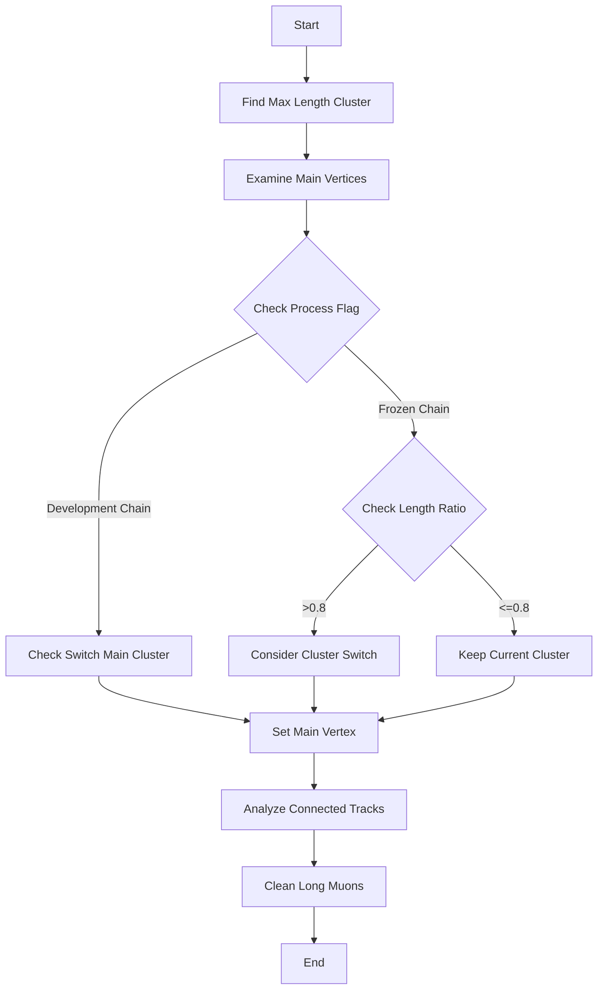

# Determine Overall Main Vertex Function Analysis

## Overview

The `determine_overall_main_vertex()` function is a crucial part of the NeutrinoID class that identifies and establishes the primary interaction vertex in neutrino events. It coordinates between multiple clusters and ensures selection of the most likely neutrino interaction point.

## Key Components

### 1. Finding Maximum Length Cluster
```cpp
PR3DCluster* max_length_cluster = 0;
double max_length = 0;
for (auto it = map_cluster_length.begin(); it!= map_cluster_length.end(); it++){
    double length = it->second;
    if (length > max_length){
        max_length = length;
        max_length_cluster = it->first;
    }
}
```

### 2. Main Vertex Examination
```cpp
// Examine all candidate main vertices
examine_main_vertices();

// Based on neutrino ID process flag
if (flag_neutrino_id_process==1){
    // Development chain
    check_switch_main_cluster();
} else {
    // Frozen chain - only switch if max length significantly larger
    if (max_length > map_cluster_length[main_cluster] * 0.8)
        check_switch_main_cluster(map_cluster_main_vertices[main_cluster], 
                                max_length_cluster);
}
```

### 3. Vertex Assignment & Track Analysis
```cpp
main_vertex = map_cluster_main_vertices[main_cluster];

// Analyze tracks connected to vertex
for (auto it = map_vertex_segments[main_vertex].begin(); 
     it != map_vertex_segments[main_vertex].end(); it++){
    WCPPID::ProtoSegment *sg = *it;
    auto pair_results = calculate_num_daughter_showers(main_vertex, sg, false);
    
    // Proton identification criteria
    if (pair_results.first==1 && 
        sg->get_length() < 1.5*units::cm && 
        sg->get_medium_dQ_dx()/(43e3/units::cm) > 1.6){
        sg->set_particle_type(2212);  // proton PDG code
        sg->set_particle_mass(mp.get_mass_proton());
        sg->cal_4mom();
    }
}
```

## Function Call Tree

1. Primary Function: `determine_overall_main_vertex()`
   - `examine_main_vertices()`
     - `compare_main_vertices_global()`
     - Internal vertex examination functions
   - `check_switch_main_cluster()`
     - `swap_main_cluster()`
   - `calculate_num_daughter_showers()`
   - Memory cleanup functions

[compare_main_vertices_global](./compare_main_vertices_global.md)

[calculate_num_daughter_showers](../NeutrinoID_shower/calculate_num_daughter_showers.md)

## Logical Flow



## Key Functions Called

1. `examine_main_vertices()` 
   - Purpose: Evaluates all candidate vertices to identify the best main vertex
   - Key operations: Track counting, shower analysis, boundary checks

2. `check_switch_main_cluster()`
   - Purpose: Determines if the main cluster should be switched
   - Evaluates cluster properties and shower characteristics

3. `calculate_num_daughter_showers()` [more details](../NeutrinoID_shower/calculate_num_daughter_showers.md)

   - Purpose: Counts daughter particles from a vertex
   - Returns pair of counts and shower information

4. `swap_main_cluster()`
   - Purpose: Performs the actual cluster switch operation
   - Updates relevant cluster lists and maps

## Example Use Case

```cpp
// Initialization
WCPPID::NeutrinoID neutrino_id(main_cluster, other_clusters, ...);

// Process clusters
neutrino_id.process_main_cluster();
neutrino_id.process_other_clusters();

// Determine vertex
neutrino_id.determine_overall_main_vertex();

// Access results
WCPPID::ProtoVertex* main_vertex = neutrino_id.get_main_vertex();
```

## Notes on Implementation

- The function uses multiple criteria to evaluate vertices:
  - Cluster length
  - Number of connected tracks
  - Shower characteristics
  - Boundary conditions
  - Track quality metrics

- Two main processing chains:
  1. Development chain (flag_neutrino_id_process==1)
     - More flexible in cluster switching
     - Uses broader criteria
  
  2. Frozen chain (flag_neutrino_id_process!=1)
     - More conservative
     - Requires significant length difference for switching

- Special handling for protons:
  - Short tracks (<1.5 cm)
  - High charge density
  - Specific particle type assignment

  # NeutrinoID Main Cluster Management Functions Documentation

## Overview

These functions work together to manage and potentially switch the main cluster in the NeutrinoID system. The core functionality revolves around examining vertices and determining if a different cluster should be designated as the main cluster based on certain criteria.

## Function Details

### 1. swap_main_cluster

This is a utility function that handles the mechanics of swapping the main cluster with another cluster.

```cpp
void WCPPID::NeutrinoID::swap_main_cluster(WCPPID::PR3DCluster *new_main_cluster) {
    other_clusters.push_back(main_cluster);     // Add current main to other clusters
    main_cluster = new_main_cluster;            // Set new main cluster
    auto it1 = find(other_clusters.begin(), other_clusters.end(), main_cluster);
    other_clusters.erase(it1);                  // Remove new main from other clusters
}
```

### 2. examine_main_vertices

This is a complex function that evaluates all candidate vertices to determine their suitability as main vertices. Here's the key logic:

1. Initial Length Check
```cpp
double cluster_length_cut = std::min(map_cluster_length[main_cluster]*0.6, 6*units::cm);
```

2. Removal Criteria:
   - Length less than cut threshold
   - Point cloud distance checks
   - Shower/track analysis
   - Topology evaluation

3. Global Checks:
   - Distance to boundaries
   - Connection patterns
   - Angular distributions

Flow Diagram for examine_main_vertices:
```
[Start]
   │
   ▼
[Calculate Length Cut]
   │
   ▼
[For Each Vertex]──────┐
   │                   │
   ▼                   ▼
[Check Length]    [Check Point Cloud]
   │                   │
   ▼                   ▼
[Analyze Segments] [Check Distance]
   │                   │
   ▼                   ▼
[Evaluate Topology]    │
   │                   │
   ▼                   │
[Make Keep/Remove Decision]◄─┘
   │
   ▼
[End]
```

this function calld [compare_main_vertices_global](./compare_main_vertices_global.md)

### 3. check_switch_main_cluster Functions

The check_switch_main_cluster functionality exists in two variants, each serving different use cases in the vertex/cluster evaluation process.

#### Variant 1: Specific Vertex and Cluster Check
```cpp
void check_switch_main_cluster(WCPPID::ProtoVertex *temp_main_vertex, 
                             WCPPID::PR3DCluster *max_length_cluster) {
    bool flag_switch = false;
    
    // Check if current vertex is all showers
    int n_showers = 0;
    for (auto it = map_vertex_segments[temp_main_vertex].begin(); 
         it != map_vertex_segments[temp_main_vertex].end(); it++) {
        if ((*it)->get_flag_shower()) 
            n_showers++;
    }
    
    // Switch if all segments are showers
    if (n_showers == map_vertex_segments[temp_main_vertex].size()) {
        flag_switch = true;
    }

    if (flag_switch) {
        std::cout << "Switch Main Cluster " << main_cluster->get_cluster_id() 
                 << " to " << max_length_cluster->get_cluster_id() << std::endl;
        swap_main_cluster(max_length_cluster);
    }
}
```

This variant is used when:
- A specific vertex and cluster have been identified as candidates
- Only shower-based criteria need to be checked
- A quick decision can be made based on segment characteristics

Key Features:
1. Simple shower counting
2. Binary decision making
3. Direct cluster swapping
4. Logging of cluster changes

#### Variant 2: Comprehensive Check
```cpp
void check_switch_main_cluster() {
    bool flag_switch = false;
    bool flag_all_showers = false;

    // Check current main vertex
    WCPPID::ProtoVertex *temp_main_vertex = 0;
    if (map_cluster_main_vertices.find(main_cluster) != 
        map_cluster_main_vertices.end()) {
        temp_main_vertex = map_cluster_main_vertices[main_cluster];
        
        // Count showers for current main vertex
        int n_showers = 0;
        for (auto it = map_vertex_segments[temp_main_vertex].begin(); 
             it != map_vertex_segments[temp_main_vertex].end(); it++) {
            if ((*it)->get_flag_shower()) 
                n_showers++;
        }
        if (n_showers == map_vertex_segments[temp_main_vertex].size()) 
            flag_all_showers = true;
    } else {
        flag_all_showers = true;
    }

    // If all showers, evaluate alternative vertices
    if (flag_all_showers) {
        WCPPID::ProtoVertexSelection vertex_candidates;
        for (auto it = map_cluster_main_vertices.begin(); 
             it != map_cluster_main_vertices.end(); it++) {
            vertex_candidates.push_back(it->second);
        }

        // Compare vertices globally
        WCPPID::ProtoVertex *temp_main_vertex_1 = 
            compare_main_vertices_global(vertex_candidates);
            
        // Switch if better vertex found
        if (temp_main_vertex_1 != temp_main_vertex) {
            if (temp_main_vertex != 0) {
                std::cout << "Switch Main Cluster " 
                         << temp_main_vertex->get_cluster_id() 
                         << " to " << temp_main_vertex_1->get_cluster_id() 
                         << std::endl;
            }
            
            // Find and swap to new main cluster
            for (auto it = map_cluster_main_vertices.begin(); 
                 it != map_cluster_main_vertices.end(); it++) {
                if (it->second == temp_main_vertex_1) {
                    swap_main_cluster(it->first);
                    break;
                }
            }
        }
    }
}
```

This variant performs a comprehensive evaluation:

1. Initial Assessment:
   - Checks current main vertex status
   - Evaluates shower composition
   - Determines if full evaluation needed

2. Candidate Collection:
   ```cpp
   WCPPID::ProtoVertexSelection vertex_candidates;
   for (auto it = map_cluster_main_vertices.begin(); 
        it != map_cluster_main_vertices.end(); it++) {
       vertex_candidates.push_back(it->second);
   }
   ```
   - Gathers all potential vertex candidates
   - Prepares for global comparison

3. Global Comparison:
   - Uses compare_main_vertices_global for detailed analysis
   - Considers multiple criteria:
     * Vertex quality
     * Cluster characteristics
     * Spatial relationships
     * Track/shower patterns

4. Switch Decision:
   - Based on comprehensive evaluation
   - Handles logging and state updates
   - Maintains system consistency

Key Features:
1. Multi-stage evaluation process
2. Global vertex comparison
3. Comprehensive shower analysis
4. Robust candidate selection
5. Detailed logging

Usage Patterns:
```cpp
// Simple case: Known candidates
if (flag_neutrino_id_process == 1) {
    check_switch_main_cluster();  // Development chain
} else {
    // Frozen chain - uses length comparison
    if (max_length > map_cluster_length[main_cluster] * 0.8)
        check_switch_main_cluster(map_cluster_main_vertices[main_cluster], 
                                max_length_cluster);
}
```

## Example Usage Scenario

Here's a typical scenario showing how these functions work together:

```cpp
// Initial setup
WCPPID::PR3DCluster* cluster_A = /* ... */;
WCPPID::PR3DCluster* cluster_B = /* ... */;

// Examine vertices
examine_main_vertices();

// Check if switch needed
if (some_condition) {
    // Specific cluster switch
    check_switch_main_cluster(vertex_ptr, cluster_B);
} else {
    // General evaluation
    check_switch_main_cluster();
}
```

## Key Considerations

1. **Cluster Length**: A primary factor in decision making
2. **Shower vs Track**: The ratio of shower-like to track-like segments
3. **Topology**: The connectivity and spatial arrangement of segments
4. **Distance Metrics**: Various distance calculations influence decisions
5. **Vertex Quality**: Assessment of vertex characteristics

## Implementation Notes

- The functions use extensive mapping structures to track relationships
- Many calculations are cached to improve performance
- Multiple criteria must be met for a switch to occur
- The system maintains consistency through careful bookkeeping

## Error Handling

The functions include various safeguards:
- Null pointer checks
- Boundary condition handling
- Invalid topology detection
- Consistency verification

## Performance Considerations

- Heavy use of caching for repeated calculations
- Efficient graph traversal patterns
- Minimized memory allocations
- Careful iterator management


