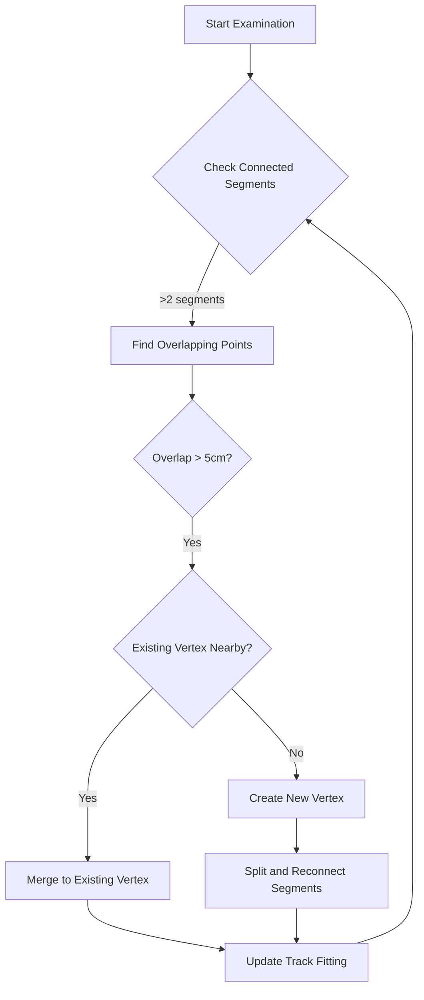
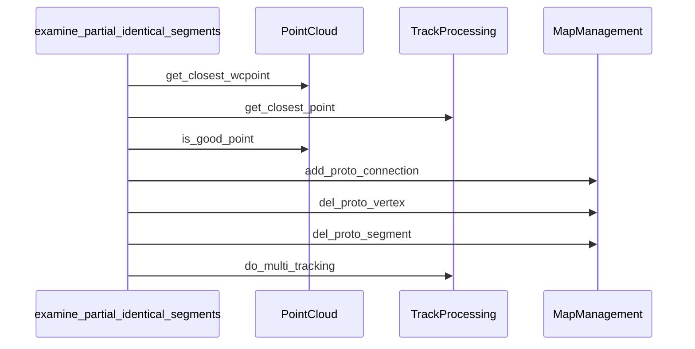

# Analysis of Examine_partial_identical_segments Function

## Purpose
The `examine_partial_identical_segments` function is designed to identify and handle cases where segments in a particle track reconstruction share partially identical paths. This is important for cleaning up redundant or overlapping track segments in 3D particle reconstruction.

## Core Algorithm Flow

1. **Main Loop Structure**
   - The function uses a while loop that continues until no more modifications are needed
   - For each vertex in the cluster, it examines connected segments if there are more than 2 segments

2. **Segment Analysis Process**
   ```cpp
   for (auto it1 = it->second.begin(); it1 != it->second.end(); it1++){
     WCPPID::ProtoSegment *sg1 = *it1;
     
     PointVector& pts_1 = sg1->get_point_vec();
     PointVector test_pts;
     // Create test points based on vertex connection
     if (sg1->get_wcpt_vec().front().index == vtx->get_wcpt().index){
       test_pts = pts_1;
     } else {
       // Reverse points if connected at end
       for (int i=int(pts_1.size())-1; i>=0; i--){
         test_pts.push_back(pts_1.at(i));
       }
     }
   ```

3. **Finding Maximum Overlap**
   - For each pair of segments connected to the vertex:
     - Checks for points that are within 0.3cm of each other
     - Tracks the maximum distance from vertex where overlap occurs
     - Records the involved segments and overlap point

### Key Components

#### 1. Distance Calculation
- Uses a threshold of 0.3cm to determine if points are effectively at the same location
- Maximum distance from vertex is used to determine extent of overlap
- Example:
```cpp
double dis = sqrt(pow(test_pts.at(i).x-vtx->get_fit_pt().x,2)+
                 pow(test_pts.at(i).y-vtx->get_fit_pt().y,2)+
                 pow(test_pts.at(i).z-vtx->get_fit_pt().z,2));
```

#### 2. Segment Merging Logic
If significant overlap is found (> 5cm), the function will:
1. Check if a vertex exists near the overlap point
2. Either:
   - Merge segments to existing vertex if one is found within 0.3cm
   - Create new vertex and split segments if no nearby vertex exists



### Implementation Details

1. **Vertex Finding Phase**
   - Uses `get_closest_wcpoint` to find vertex points in point cloud
   - Handles cases where vertices might need to be created or merged

2. **Track Modification**
   ```cpp
   // Example of track modification
   if (good_segment == 0){
     temp_cluster->cal_shortest_path(vtx->get_wcpt(),2);
     WCPPID::ProtoSegment *sg3 = new WCPPID::ProtoSegment(
       acc_segment_id, 
       temp_cluster->get_path_wcps(), 
       temp_cluster->get_cluster_id()
     ); 
     acc_segment_id++;
     add_proto_connection(min_vertex, sg3, temp_cluster);
     add_proto_connection(vtx, sg3, temp_cluster);
   }
   ```

3. **Connection Management**
   - Manages segment-vertex connections through maps
   - Updates tracking when segments are split or merged

### Error Handling and Edge Cases

1. **Dead Channel Handling**
   - Checks for dead detector channels that might affect reconstruction
   - Uses `ct_point_cloud->get_closest_dead_chs()` for validation

2. **Distance Thresholds**
   - 0.3cm for point matching
   - 5.0cm minimum for significant overlap
   - 1.5cm for vertex proximity checks

## Conclusions

The function serves as a crucial cleanup step in track reconstruction by:
1. Identifying redundant track segments
2. Merging overlapping segments when appropriate
3. Creating new vertices when needed to better represent track topology

This helps create a more accurate and cleaner representation of particle tracks in the detector, which is essential for subsequent physics analysis.

### Best Practices When Using This Function

1. Call it after initial track reconstruction
2. Ensure point cloud data is properly populated
3. Verify vertex and segment maps are consistent
4. Follow up with track refitting for affected segments

## Function Dependencies

The function makes calls to several other methods and utilities:

### Core Function Calls

1. `get_closest_wcpoint`
   - Part of point cloud management
   - Used to find nearest detector point to a given 3D coordinate
   - Returns: WCPointCloud<double>::WCPoint

2. `add_proto_connection(ProtoVertex*, ProtoSegment*, PR3DCluster*)`
   - Manages connections between vertices and segments
   - Establishes topological relationships in track reconstruction
   - Updates internal maps and relationships

3. `del_proto_vertex(ProtoVertex*)`
   - Removes a vertex from the reconstruction
   - Cleans up associated connections and mappings

4. `del_proto_segment(ProtoSegment*)`
   - Removes a segment from the reconstruction
   - Handles cleanup of associated vertex connections

5. `do_multi_tracking`
   - Performs track fitting and reconstruction
   - Parameters include:
     - map_vertex_segments
     - map_segment_vertices
     - ct_point_cloud
     - global_wc_map
     - flash_time
   - Used for final refinement of track geometry

### Helper Functions

1. `get_closest_point`
   - Returns: pair<double, WCP::Point>
   - Finds nearest point on a segment to given coordinate

2. `is_good_point`
   - Part of the point cloud validation
   - Checks if a point is valid in detector space

### Utility Functions

1. `sqrt`, `pow`
   - Standard math functions for distance calculations

2. `round`
   - Used for discretizing distances in point calculations

### Class Member Access

The function relies on several class member variables:
- `acc_vertex_id`
- `acc_segment_id` 
- Various maps including:
  - `map_vertex_segments`
  - `map_segment_vertices`
  - `map_vertex_cluster`
  - `map_cluster_vertices`
  - `map_segment_cluster`
  - `map_cluster_segments`

### Sequence of Typical Function Calls



### Error Handling Dependencies

- `ct_point_cloud->get_closest_dead_chs()`
  - Checks for dead channels in detector
  - Critical for validation of track reconstruction

This comprehensive list of function dependencies shows how `examine_partial_identical_segments` integrates with the larger reconstruction framework and relies on various specialized utilities for its operation.