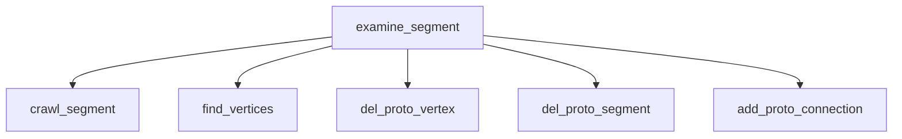
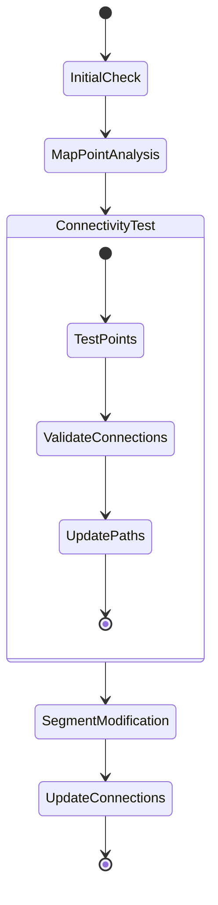

# Detailed Analysis of examine_segment and crawl_segment Functions

## Algorithm Overview

The core algorithms in these functions are part of a larger track reconstruction system for particle physics. They focus on analyzing and optimizing track segments in 3D space, with particular attention to:

1. Handling track kinks and bends
2. Managing vertex connections
3. Optimizing path reconstructions
4. Ensuring physical consistency

### Key Algorithmic Concepts

1. **Track Topology**
   - Segments represent continuous particle tracks
   - Vertices represent track endpoints or interaction points
   - Connections maintain physical relationships between segments

2. **Geometric Constraints**
   - Segments must maintain physical continuity
   - Vertex merging must preserve track topology
   - Path modifications must respect detector geometry

3. **Quality Metrics**
   - Track length and direction
   - Vertex connectivity
   - Path smoothness
   - Physical feasibility

## examine_segment Function Overview

The `examine_segment` function performs quality checks and optimizations on segments within a cluster. It has two main purposes:

1. Examining short segments with specific geometric characteristics
2. Handling vertex merging and segment cleanup

### Detailed Algorithm: examine_segment

The examine_segment function implements a sophisticated track analysis algorithm with several key phases:

1. **Segment Analysis Phase**
   ```cpp
   // Phase 1: Initial segment filtering
   for (auto it = map_segment_vertices.begin(); it!= map_segment_vertices.end(); it++) {
       WCPPID::ProtoSegment *sg = it->first;
       if (sg->get_cluster_id() != temp_cluster->get_cluster_id()) continue;
       
       // Key filtering criteria:
       // 1. Length check (must be < 4cm)
       // 2. Must have exactly 2 vertices
       if (sg->get_length() > 4*units::cm) continue;
       if (map_vertex_segments[pair_vertices.first].size() < 2 || 
           map_vertex_segments[pair_vertices.second].size() < 2) continue;
   }
   ```

2. **Angle Analysis Phase**
   ```cpp
   // Phase 2: Calculate angles between segments
   double max_angle = 0;
   double min_angle = 180;
   TVector3 dir1 = sg->cal_dir_3vector(cand_vertices.at(i)->get_fit_pt(), 2*units::cm);
   
   for (auto it1 = map_vertex_segments[cand_vertices.at(i)].begin(); 
        it1 != map_vertex_segments[cand_vertices.at(i)].end(); it1++) {
       // Skip self comparison
       if (sg1 == sg) continue;
       
       // Calculate angle between segments
       TVector3 dir3 = sg1->cal_dir_3vector(cand_vertices.at(i)->get_fit_pt(), 2*units::cm);
       double angle = dir1.Angle(dir3)/3.1415926*180.;
       
       // Track max/min angles for analysis
       if (max_angle < angle) max_angle = angle;
       if (min_angle > angle) min_angle = angle;
   }
   ```

3. **Vertex Assessment Phase**
   - For each candidate vertex:
     1. Check connection count
     2. Analyze segment angles
     3. Evaluate geometric constraints
   - Decision criteria:
     ```cpp
     // Example criteria for vertex examination
     if (max_angle > 150 && min_angle > 105) {
         // Vertex is a candidate for crawling
         // Further analysis needed
     }
     ```

4. **Segment Modification Phase**
   - When vertex meets criteria:
     1. Call crawl_segment for detailed analysis
     2. Update vertex connections
     3. Modify segment paths
     4. Clean up topology

5. **Cleanup and Validation Phase**
   ```cpp
   // Final cleanup phase
   std::set<WCPPID::ProtoVertex*> vertices_to_be_removed;
   for (auto it = map_vertex_segments.begin(); it!= map_vertex_segments.end(); it++) {
       if (it->second.size() == 0) vertices_to_be_removed.insert(it->first);
   }
   
   // Remove invalid vertices
   for (auto it = vertices_to_be_removed.begin(); it != vertices_to_be_removed.end(); it++) {
       del_proto_vertex(*it);
   }
   ```

1. **Initial Segment Filtering**
   ```cpp
   // Loop through all segments in the cluster
   for (auto it = map_segment_vertices.begin(); it!= map_segment_vertices.end(); it++) {
       WCPPID::ProtoSegment *sg = it->first;
       // Skip if not in current cluster
       if (sg->get_cluster_id() != temp_cluster->get_cluster_id()) continue;
       // Skip longer segments
       if (sg->get_length() > 4*units::cm) continue;
   }
   ```

2. **Vertex Analysis**
   - Checks segments connected to multiple vertices
   - Analyzes angles between segments
   - Makes decisions about merging or modifying vertices

3. **Vertex Cleanup**
   - Removes redundant vertices
   - Merges vertices that share the same index
   - Cleans up any orphaned segments

### Function Call Graph for examine_segment



## crawl_segment Function Overview

The `crawl_segment` function performs detailed analysis of a segment's trajectory and potential modifications. It's particularly focused on handling cases where segments may need to be split or modified based on geometric properties.

### Detailed Algorithm: crawl_segment

The crawl_segment function implements a sophisticated path analysis and modification algorithm:

1. **Initialization and Setup**
   ```cpp
   // Setup phase
   std::map<WCPPID::ProtoSegment*, Point> map_segment_point;
   bool flag_start = (v1->get_wcpt().index == curr_sg->get_wcpt_vec().front().index);
   
   // Initialize test points
   PointVector pts_to_be_tested;
   if (flag_start) {
       for (size_t i=1; i+1<pts.size(); i++) {
           pts_to_be_tested.push_back(pts.at(i));
       }
   } else {
       for (int i=int(pts.size())-1; i>0; i--) {
           pts_to_be_tested.push_back(pts.at(i));
       }
   }
   ```

2. **Path Analysis Algorithm**
   ```cpp
   double step_size = 0.3*units::cm;  // Fine-grained step size for analysis
   
   for (size_t i=0; i!=pts_to_be_tested.size(); i++) {
       int n_bad = 0;  // Track invalid points
       Point end_p = pts_to_be_tested.at(i);
       
       // Analyze each connected segment
       for (auto it = map_segment_point.begin(); 
            it != map_segment_point.end(); it++) {
           Point start_p = it->second;
           
           // Calculate number of steps needed
           int ncount = std::round(sqrt(pow(start_p.x - end_p.x,2) + 
                                      pow(start_p.y - end_p.y,2) + 
                                      pow(start_p.z - end_p.z,2))/step_size);
           
           // Validate each point along path
           for (int j=1; j<ncount; j++) {
               Point test_p = calculateInterpolatedPoint(start_p, end_p, j, ncount);
               if (!isValidPoint(test_p)) n_bad++;
           }
       }
   }
   ```

3. **Path Modification Process**
   When a valid modification point is found:
   ```cpp
   // Update current segment
   if (flag_start) {
       // Forward direction updates
       updateSegmentPath(curr_sg, vtx_new_wcp, true);
   } else {
       // Reverse direction updates
       updateSegmentPath(curr_sg, vtx_new_wcp, false);
   }
   
   // Update connected segments
   for (auto it = map_segment_point.begin(); 
        it != map_segment_point.end(); it++) {
       WCPPID::ProtoSegment *sg = it->first;
       updateConnectedSegment(sg, v1, vtx_new_wcp);
   }
   ```

4. **Vertex Update Process**
   ```cpp
   // Update vertex position
   v1->set_wcpt(vtx_new_wcp);
   
   // Refit surrounding segments
   temp_cluster->do_multi_tracking(map_vertex_segments, 
                                 map_segment_vertices,
                                 *ct_point_cloud,
                                 global_wc_map, 
                                 flash_time*units::microsecond,
                                 true, true, true);
   ```

5. **Path Validation Criteria**
   Key checks include:
   - Point validity in detector space
   - Path continuity
   - Physical feasibility of modifications
   - Preservation of track topology

### Key Features

1. **Point Analysis Along Segment**
   ```cpp
   PointVector pts_to_be_tested;
   if (flag_start) {
       // Test points from start to end
       for (size_t i=1; i+1<pts.size(); i++) {
           pts_to_be_tested.push_back(pts.at(i));
       }
   } else {
       // Test points from end to start
       for (int i=int(pts.size())-1; i>0; i--) {
           pts_to_be_tested.push_back(pts.at(i));
       }
   }
   ```

2. **Connectivity Testing**
   - Tests connectivity between points
   - Validates segment modifications
   - Ensures path continuity

3. **Segment Modification**
   - Updates vertex connections
   - Modifies segment paths
   - Maintains cluster consistency

### Detailed Flow Diagram



### Function Dependencies

1. Called by:
   - `examine_segment`

2. Calls to:
   - `get_closest_wcpoint`
   - `is_good_point`
   - `get_point_vec`
   - `get_wcpt_vec`
   - `do_multi_tracking`

### Key Parameters and Variables

- `curr_sg`: The current segment being analyzed
- `v1`: The vertex being examined
- `temp_cluster`: The cluster containing the segments
- `map_segment_point`: Maps segments to their significant points
- `flag_start`: Boolean indicating direction of analysis

### Important Considerations

1. **Step Size**
   - Uses a step size of 0.3 cm for detailed point analysis
   - Critical for accurate trajectory mapping

2. **Point Validation**
   ```cpp
   // Point validation example
   if (!ct_point_cloud->is_good_point(test_p, 0.2*units::cm, 0, 0)) {
       n_bad++;
   }
   ```

3. **Segment Updates**
   - Maintains segment continuity
   - Preserves cluster topology
   - Updates vertex connections properly

## Error Handling and Edge Cases

1. **Null Checks**
   ```cpp
   if (curr_sg->get_cluster_id() != v1->get_cluster_id() || 
       curr_sg->get_cluster_id() != temp_cluster->get_cluster_id()) 
       return flag;
   ```

2. **Boundary Conditions**
   - Handles segment endpoints carefully
   - Validates vertex connections
   - Checks for degenerate cases

3. **Path Continuity**
   - Ensures modified paths maintain connectivity
   - Validates geometric constraints
   - Preserves cluster topology

## Algorithm Complexity and Performance Analysis

### Time Complexity

1. **examine_segment**
   - Primary loop: O(S) where S is number of segments
   - Vertex analysis: O(V) where V is number of vertices per segment
   - Total complexity: O(S * V)

2. **crawl_segment**
   - Point analysis: O(P) where P is number of points in segment
   - Path validation: O(P * N) where N is number of test points
   - Total complexity: O(P * N)

### Space Complexity

1. **examine_segment**
   ```cpp
   // Key space usage:
   std::set<WCPPID::ProtoVertex*> vertices_to_be_removed;  // O(V)
   std::vector<WCPPID::ProtoSegment*> tmp_segments;        // O(S)
   ```

2. **crawl_segment**
   ```cpp
   // Key space usage:
   std::map<WCPPID::ProtoSegment*, Point> map_segment_point;  // O(S)
   PointVector pts_to_be_tested;                              // O(P)
   ```

## Performance Considerations

1. **Memory Management**
   - Creates temporary point vectors
   - Manages segment/vertex maps efficiently
   - Cleans up modified segments

2. **Computational Efficiency**
   - Uses efficient point lookup
   - Minimizes redundant calculations
   - Optimizes path updates

## Summary of Key Functions Called

1. **Geometry Functions**
   - `get_closest_point`
   - `get_closest_wcpoint`
   - `is_good_point`

2. **Segment Management**
   - `add_proto_connection` [more detials](./add_other_connection.md)
   - `del_proto_segment`
   - `del_proto_vertex`

3. **Cluster Operations**
   - `do_multi_tracking` [more details](../track_fitting/multi_trajectory_fit.md)
   - `get_point_cloud_steiner`
   - `get_wcpt_vec`

4. **Utility Functions**
   - `find_vertices` [more details](./find_vertices.md)
   - `find_other_vertex` [more details](./find_other_vertex.md)
   - `find_segment` [more details](./find_segment.md)