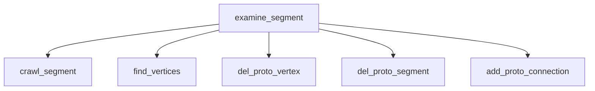
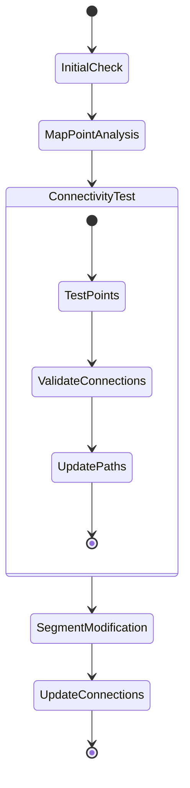

# Detailed Analysis of examine_segment and crawl_segment Functions

## examine_segment Function Overview

The `examine_segment` function performs quality checks and optimizations on segments within a cluster. It has two main purposes:

1. Examining short segments with specific geometric characteristics
2. Handling vertex merging and segment cleanup

### Key Steps in examine_segment

1. **Initial Segment Filtering**
   ```cpp
   // Loop through all segments in the cluster
   for (auto it = map_segment_vertices.begin(); it!= map_segment_vertices.end(); it++) {
       WCPPID::ProtoSegment *sg = it->first;
       // Skip if not in current cluster
       if (sg->get_cluster_id() != temp_cluster->get_cluster_id()) continue;
       // Skip longer segments
       if (sg->get_length() > 4*units::cm) continue;
   }
   ```

2. **Vertex Analysis**
   - Checks segments connected to multiple vertices
   - Analyzes angles between segments
   - Makes decisions about merging or modifying vertices

3. **Vertex Cleanup**
   - Removes redundant vertices
   - Merges vertices that share the same index
   - Cleans up any orphaned segments

### Function Call Graph for examine_segment



## crawl_segment Function Overview

The `crawl_segment` function performs detailed analysis of a segment's trajectory and potential modifications. It's particularly focused on handling cases where segments may need to be split or modified based on geometric properties.

### Key Features

1. **Point Analysis Along Segment**
   ```cpp
   PointVector pts_to_be_tested;
   if (flag_start) {
       // Test points from start to end
       for (size_t i=1; i+1<pts.size(); i++) {
           pts_to_be_tested.push_back(pts.at(i));
       }
   } else {
       // Test points from end to start
       for (int i=int(pts.size())-1; i>0; i--) {
           pts_to_be_tested.push_back(pts.at(i));
       }
   }
   ```

2. **Connectivity Testing**
   - Tests connectivity between points
   - Validates segment modifications
   - Ensures path continuity

3. **Segment Modification**
   - Updates vertex connections
   - Modifies segment paths
   - Maintains cluster consistency

### Detailed Flow Diagram



### Function Dependencies

1. Called by:
   - `examine_segment`

2. Calls to:
   - `get_closest_wcpoint`
   - `is_good_point`
   - `get_point_vec`
   - `get_wcpt_vec`
   - `do_multi_tracking`

### Key Parameters and Variables

- `curr_sg`: The current segment being analyzed
- `v1`: The vertex being examined
- `temp_cluster`: The cluster containing the segments
- `map_segment_point`: Maps segments to their significant points
- `flag_start`: Boolean indicating direction of analysis

### Important Considerations

1. **Step Size**
   - Uses a step size of 0.3 cm for detailed point analysis
   - Critical for accurate trajectory mapping

2. **Point Validation**
   ```cpp
   // Point validation example
   if (!ct_point_cloud->is_good_point(test_p, 0.2*units::cm, 0, 0)) {
       n_bad++;
   }
   ```

3. **Segment Updates**
   - Maintains segment continuity
   - Preserves cluster topology
   - Updates vertex connections properly

## Error Handling and Edge Cases

1. **Null Checks**
   ```cpp
   if (curr_sg->get_cluster_id() != v1->get_cluster_id() || 
       curr_sg->get_cluster_id() != temp_cluster->get_cluster_id()) 
       return flag;
   ```

2. **Boundary Conditions**
   - Handles segment endpoints carefully
   - Validates vertex connections
   - Checks for degenerate cases

3. **Path Continuity**
   - Ensures modified paths maintain connectivity
   - Validates geometric constraints
   - Preserves cluster topology

## Performance Considerations

1. **Memory Management**
   - Creates temporary point vectors
   - Manages segment/vertex maps efficiently
   - Cleans up modified segments

2. **Computational Efficiency**
   - Uses efficient point lookup
   - Minimizes redundant calculations
   - Optimizes path updates

## Summary of Key Functions Called

1. **Geometry Functions**
   - `get_closest_point`
   - `get_closest_wcpoint`
   - `is_good_point`

2. **Segment Management**
   - `add_proto_connection` [see details](./add_other_connection.md)
   - `del_proto_segment`
   - `del_proto_vertex`

3. **Cluster Operations**
   - `do_multi_tracking` [see details](../track_fitting/multi_trajectory_fit.md)
   - `get_point_cloud_steiner`
   - `get_wcpt_vec`

4. **Utility Functions**
   - `find_vertices` [see details](./find_vertices.md)
   - `find_other_vertex` 
   - `find_segment`