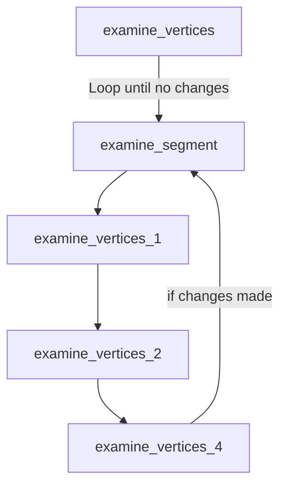
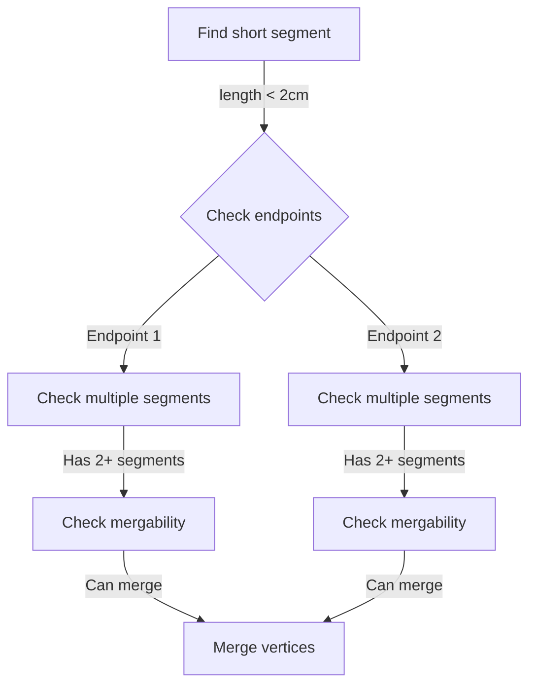

# Detailed Analysis of examine_vertices Functions: Algorithmic Deep Dive

## Overview
The examine_vertices functions are a series of related functions in the NeutrinoID class that analyze and potentially modify vertex-segment relationships in 3D particle trajectories. The main purpose is to clean up and optimize the vertex structure by merging vertices when appropriate.

## Core Functions and Algorithms

### Data Structures
Before diving into the algorithms, let's understand the key data structures:

```cpp
struct ProtoVertex {
    WCPoint wcpt;          // 3D point in detector coordinates
    Point fit_pt;          // Fitted point position
    int cluster_id;        // Associated cluster ID
};

struct ProtoSegment {
    vector<WCPoint> wcpt_vec;  // Track points
    vector<Point> point_vec;   // 3D points
    int cluster_id;            // Associated cluster ID
};

// Key maps maintained
map<ProtoVertex*, ProtoSegmentSet> map_vertex_segments;  // Segments connected to each vertex
map<ProtoSegment*, ProtoVertexSet> map_segment_vertices; // Vertices connected to each segment
```

### Algorithmic Overview
The vertex examination process follows a hierarchical strategy:

1. **Topology Analysis**: Examines connectivity patterns
2. **Geometry Analysis**: Studies spatial relationships
3. **Track Quality**: Evaluates track properties in multiple views
4. **Merger Decisions**: Uses multiple criteria to decide on vertex merging

### examine_vertices
```cpp
void examine_vertices(WCPPID::PR3DCluster* temp_cluster)
```

This is the main coordinating function that orchestrates the vertex examination process. It operates in a loop until no more modifications are needed, calling several specialized sub-functions:

1. `examine_segment()`: First pass examination of segments
2. `examine_vertices_1()`: Checks for vertex merging based on track trajectories 
3. `examine_vertices_2()`: Merges very close vertices
4. `examine_vertices_4()`: Handles more complex vertex merging cases



### examine_vertices_1: Track Trajectory Analysis

The algorithm analyzes the trajectory continuity in multiple wire planes using a sophisticated multi-step process:

1. **Initial Vertex Selection**
```cpp
// Pseudocode for vertex selection
for (vertex in map_vertex_segments) {
    if (vertex.segments.size() == 2) {  // Look for vertices with exactly 2 segments
        for (segment in vertex.segments) {
            if (segment.length < 4 * units::cm) {
                // Candidate for merging
                analyze_wire_plane_projections(vertex, segment);
            }
        }
    }
}
```

2. **Wire Plane Projection Analysis**
For each wire plane (U, V, W):
```cpp
struct PlaneProjection {
    double vertex1_coord;  // Projected coordinate in plane
    double vertex2_coord;  // Projected coordinate of second vertex
    double time_coord1;    // Time coordinate of first vertex
    double time_coord2;    // Time coordinate of second vertex
};

// Analyze projections
for (plane in [U, V, W]) {
    PlaneProjection proj = project_to_plane(vertex1, vertex2, plane);
    
    // Check three conditions:
    bool is_continuous = false;
    
    // 1. Close in wire-time view
    if (distance_2D(proj) < 2.5) {
        is_continuous = true;
    }
    
    // 2. Check for dead channels
    else if (check_dead_channels(proj, plane)) {
        is_continuous = true;
    }
    
    // 3. Check for linearity
    else if (analyze_track_linearity(proj)) {
        is_continuous = true;
    }
    
    continuity_score[plane] = is_continuous;
}
```

3. **Decision Making**
```cpp
// At least two planes must show continuity
int continuous_planes = count_true(continuity_score);
if (continuous_planes >= 2) {
    // Additional topology checks
    if (validate_topology(vertex1, vertex2)) {
        perform_vertex_merger(vertex1, vertex2);
    }
}
```

This function analyzes vertices that could potentially be merged based on track topology. It focuses on cases where:

1. A vertex connects exactly two segments
2. One of those segments is short (<4cm)
3. The tracks appear to be continuous in multiple wire planes

Key logic:
```cpp
// Simplified pseudocode
if (vertex.segments.size() == 2) {
    for (segment in vertex.segments) {
        if (segment.length < 4cm) {
            // Check continuity in U, V, W planes
            if (continuousInTwoPlanes()) {
                mergeVertices();
            }
        }
    }
}
```

The function uses wire plane projections to determine if tracks are continuous. A track is considered continuous if:
- The distance between vertices in wire-time view is small (<2.5 units), or
- The track passes through dead channels, or
- The tracks form a nearly straight line (angle < 30°)

### examine_vertices_2: Proximity-Based Merging

The algorithm implements a sophisticated proximity-based merging strategy:

1. **Distance Calculation**
```cpp
struct VertexPair {
    ProtoVertex* v1;
    ProtoVertex* v2;
    double distance;
    bool qualifies_for_merge;
};

vector<VertexPair> find_merge_candidates(cluster) {
    vector<VertexPair> candidates;
    
    // Examine all vertex pairs
    for (auto seg : map_segment_vertices) {
        auto vertices = find_vertices(seg.first);
        if (!vertices.first || !vertices.second) continue;
        
        VertexPair pair;
        pair.v1 = vertices.first;
        pair.v2 = vertices.second;
        pair.distance = calculate_3D_distance(pair.v1, pair.v2);
        
        // Apply merging criteria
        pair.qualifies_for_merge = 
            (pair.distance < 0.45 * units::cm) ||
            (pair.distance < 1.5 * units::cm && 
             map_vertex_segments[pair.v1].size() == 2 &&
             map_vertex_segments[pair.v2].size() == 2);
             
        if (pair.qualifies_for_merge) {
            candidates.push_back(pair);
        }
    }
    return candidates;
}
```

2. **Topology Validation**
```cpp
bool validate_merger_topology(VertexPair pair) {
    // Check if merger would create invalid track configurations
    for (auto seg1 : map_vertex_segments[pair.v1]) {
        for (auto seg2 : map_vertex_segments[pair.v2]) {
            if (seg1 == seg2) continue;
            
            // Check angle between segments
            double angle = calculate_segment_angle(seg1, seg2);
            if (angle < MIN_ALLOWED_ANGLE) return false;
            
            // Check for track crossings
            if (would_create_crossing(seg1, seg2)) return false;
        }
    }
    return true;
}
```

3. **Merging Process**
```cpp
void perform_vertex_merger(VertexPair pair) {
    // Determine which vertex to keep (prefer main vertex)
    ProtoVertex* keep_vertex = 
        (pair.v1 == main_vertex) ? pair.v1 : 
        (pair.v2 == main_vertex) ? pair.v2 : 
        (map_vertex_segments[pair.v1].size() >= 
         map_vertex_segments[pair.v2].size()) ? pair.v1 : pair.v2;
    ProtoVertex* merge_vertex = 
        (keep_vertex == pair.v1) ? pair.v2 : pair.v1;
        
    // Reconnect segments
    vector<ProtoSegment*> segments_to_reconnect = 
        get_segments(merge_vertex);
    
    for (auto seg : segments_to_reconnect) {
        // Create new path to kept vertex
        recalculate_segment_path(seg, keep_vertex);
        
        // Update connectivity
        del_proto_connection(merge_vertex, seg);
        add_proto_connection(keep_vertex, seg, cluster);
    }
    
    // Remove merged vertex
    del_proto_vertex(merge_vertex);
}

This function focuses on merging vertices that are physically very close to each other. Key criteria:

1. Vertices must be closer than 0.45cm, or
2. Vertices must be closer than 1.5cm AND both have exactly 2 connected segments

```cpp
// Simplified logic
if (distance(v1, v2) < 0.45cm ||
    (distance(v1, v2) < 1.5cm && 
     v1.segments.size() == 2 && 
     v2.segments.size() == 2)) {
    mergeVertices(v1, v2);
}
```

### examine_vertices_4: Complex Topology Analysis

This function handles complex cases involving multiple segments and vertices. It implements a sophisticated decision tree:

1. **Segment Qualification**
```cpp
struct SegmentAnalysis {
    ProtoSegment* segment;
    double length;
    double angle_with_drift;
    bool qualifies;
    vector<ProtoVertex*> endpoints;
};

vector<SegmentAnalysis> find_qualifying_segments(cluster) {
    vector<SegmentAnalysis> candidates;
    
    for (auto seg_pair : map_segment_vertices) {
        SegmentAnalysis analysis;
        analysis.segment = seg_pair.first;
        analysis.length = calculate_length(analysis.segment);
        analysis.angle_with_drift = 
            calculate_angle_with_drift_direction(analysis.segment);
        analysis.endpoints = find_vertices(analysis.segment);
        
        // Check qualifying conditions
        analysis.qualifies = 
            (analysis.length < 2.0 * units::cm) ||
            (analysis.length < 3.5 * units::cm && 
             abs(analysis.angle_with_drift - 90) < 10);
             
        if (analysis.qualifies) {
            candidates.push_back(analysis);
        }
    }
    return candidates;
}
```

2. **Endpoint Analysis**
```cpp
struct EndpointEvaluation {
    ProtoVertex* vertex;
    vector<ProtoSegment*> connected_segments;
    bool can_be_merged;
    double min_segment_angle;
    double max_segment_length;
};

EndpointEvaluation analyze_endpoint(ProtoVertex* vertex) {
    EndpointEvaluation eval;
    eval.vertex = vertex;
    eval.connected_segments = get_connected_segments(vertex);
    
    if (eval.connected_segments.size() < 2) {
        eval.can_be_merged = false;
        return eval;
    }
    
    // Calculate geometric properties
    for (auto seg1 : eval.connected_segments) {
        for (auto seg2 : eval.connected_segments) {
            if (seg1 == seg2) continue;
            
            double angle = calculate_segment_angle(seg1, seg2);
            eval.min_segment_angle = 
                min(eval.min_segment_angle, angle);
                
            double length = max(
                calculate_length(seg1),
                calculate_length(seg2)
            );
            eval.max_segment_length = 
                max(eval.max_segment_length, length);
        }
    }
    
    // Determine if endpoint can be merged
    eval.can_be_merged = 
        eval.min_segment_angle > MIN_ALLOWED_ANGLE &&
        eval.max_segment_length > MIN_REQUIRED_LENGTH &&
        !is_main_vertex(vertex);
        
    return eval;
}
```

3. **Track Connection Analysis**
```cpp
struct TrackConnection {
    ProtoSegment* track1;
    ProtoSegment* track2;
    double connection_angle;
    double connection_distance;
    bool is_valid;
};

TrackConnection analyze_track_connection(
    ProtoSegment* seg1, 
    ProtoSegment* seg2, 
    ProtoVertex* common_vertex
) {
    TrackConnection conn;
    conn.track1 = seg1;
    conn.track2 = seg2;
    
    // Calculate connection geometry
    Point intersection = common_vertex->get_fit_pt();
    TVector3 dir1 = calculate_direction(seg1, intersection);
    TVector3 dir2 = calculate_direction(seg2, intersection);
    
    conn.connection_angle = dir1.Angle(dir2);
    conn.connection_distance = 
        calculate_closest_approach(seg1, seg2);
        
    // Validate connection
    conn.is_valid = 
        conn.connection_angle > MIN_ANGLE &&
        conn.connection_angle < MAX_ANGLE &&
        conn.connection_distance < MAX_DISTANCE;
        
    return conn;
}
```

4. **Merging Decision**
```cpp
void process_complex_merger(SegmentAnalysis seg_analysis) {
    // Analyze both endpoints
    EndpointEvaluation eval1 = 
        analyze_endpoint(seg_analysis.endpoints[0]);
    EndpointEvaluation eval2 = 
        analyze_endpoint(seg_analysis.endpoints[1]);
        
    if (!eval1.can_be_merged && !eval2.can_be_merged) {
        return;
    }
    
    // Choose endpoint to merge
    ProtoVertex* merge_vertex = 
        eval1.can_be_merged ? 
        seg_analysis.endpoints[0] : 
        seg_analysis.endpoints[1];
    ProtoVertex* keep_vertex = 
        eval1.can_be_merged ? 
        seg_analysis.endpoints[1] : 
        seg_analysis.endpoints[0];
        
    // Analyze all track connections
    vector<TrackConnection> connections;
    for (auto seg1 : eval1.connected_segments) {
        for (auto seg2 : eval2.connected_segments) {
            connections.push_back(
                analyze_track_connection(
                    seg1, seg2, merge_vertex
                )
            );
        }
    }
    
    // Make final decision
    if (validate_connections(connections)) {
        perform_complex_merger(
            merge_vertex, 
            keep_vertex,
            seg_analysis.segment
        );
    }
}

This is the most complex merging function, handling cases where:

1. Segment length is < 2.0cm or
2. Segment is < 3.5cm AND aligned with drift direction

The function carefully considers:
- Track topology
- Connection to other segments
- Angular relationships
- Charge deposition patterns

Example flow:


## Vertex Merging Process

When vertices are merged, several steps occur:

1. The connecting segment is deleted
2. All other segments connected to the merged vertex are reconnected
3. New paths are calculated between remaining vertices
4. Track fits are updated

```cpp
// Example merging process
del_proto_segment(connecting_segment);
for (auto other_segment : merged_vertex.segments) {
    // Create new segment connecting to surviving vertex
    ProtoSegment* new_segment = calculate_new_path(
        other_segment.far_vertex, 
        surviving_vertex
    );
    add_proto_connection(
        other_segment.far_vertex, 
        new_segment, 
        cluster
    );
}
del_proto_vertex(merged_vertex);
```

## Advanced Algorithmic Considerations

### 1. Track Quality Metrics

The algorithms use several track quality metrics:

```cpp
struct TrackQuality {
    double dQ_dx;           // Charge deposition per unit length
    double straightness;    // Measure of track straightness
    double isolation;       // Distance to nearest other track
    double continuity;      // Measure of hit continuity
};

TrackQuality assess_track_quality(ProtoSegment* segment) {
    TrackQuality quality;
    
    // Calculate charge deposition
    quality.dQ_dx = calculate_dQ_dx(segment);
    
    // Calculate straightness using PCA
    quality.straightness = 
        calculate_track_straightness(segment);
    
    // Calculate isolation
    quality.isolation = 
        calculate_track_isolation(segment);
    
    // Calculate hit continuity
    quality.continuity = 
        calculate_hit_continuity(segment);
        
    return quality;
}
```

### 2. Dead Channel Handling

The algorithms implement sophisticated dead channel handling:

```cpp
struct DeadChannelAnalysis {
    vector<bool> dead_u_wires;
    vector<bool> dead_v_wires;
    vector<bool> dead_w_wires;
    
    bool explains_gap(Point p1, Point p2) {
        // Project points to wire planes
        auto u_proj = project_to_u_plane(p1, p2);
        auto v_proj = project_to_v_plane(p1, p2);
        auto w_proj = project_to_w_plane(p1, p2);
        
        // Check if

The functions incorporate several important checks:

1. **Dead Channel Handling**: Checks if track gaps are explained by dead/noisy channels
2. **3D Consistency**: Verifies track continuity in multiple 2D projections
3. **Main Vertex Protection**: Avoids merging the primary neutrino interaction vertex
4. **Topology Preservation**: Ensures merging doesn't create unrealistic track configurations

## Usage Example

```cpp
// Example usage in reconstruction
WCPPID::NeutrinoID neutrino_id(...);
PR3DCluster* cluster = ...;

// Initial vertex finding
neutrino_id.find_proto_vertex(cluster);

// Clean up and optimize vertex structure
neutrino_id.examine_vertices(cluster);

// Continue with particle identification
neutrino_id.separate_track_shower();
```

This process helps create a more robust vertex structure for subsequent particle identification and event reconstruction.