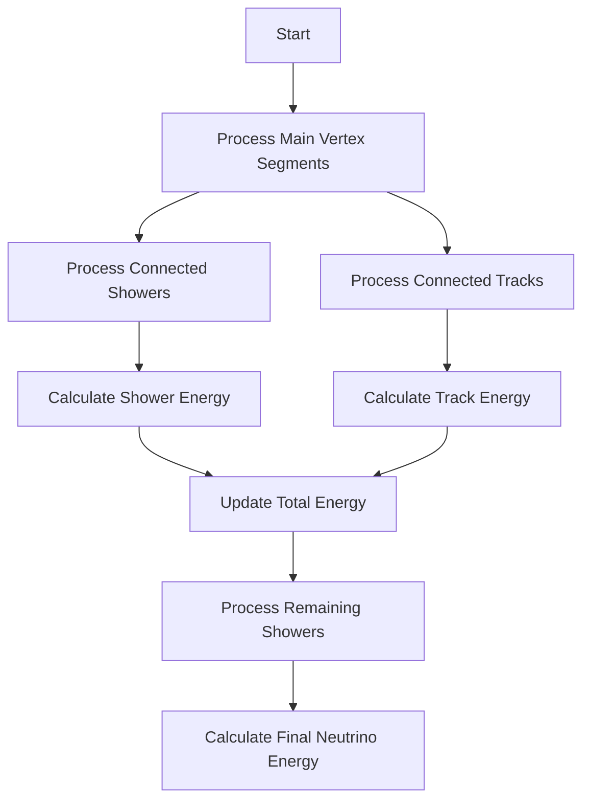

I'll create a markdown overview of these functions from the NeutrinoID class:

# NeutrinoID Function Overview

### fill_fit_parameters()
- Organizes vertex and segment information for clusters 
- Sets fit parameters for all clusters in the reconstruction
- Updates point sub-cluster IDs and flags across clusters

### fill_reco_tree()
- Fills reconstruction tree information for individual segments and showers
- Stores particle tracks, momentum, energy, directionality and other kinematic information 
- Two overloaded versions - one for ProtoSegments and one for WCShowers

### fill_pi0_reco_tree()  
- Specialized function for π⁰ reconstruction
- Records π⁰ decay products and kinematics
- Tracks parent-child relationships between particles
- Returns identification info for the reconstructed π⁰

### fill_psuedo_reco_tree()
- Creates and fills "pseudo" particle entries in reconstruction tree
- Used for particles that are inferred but not directly reconstructed
- Handles both photons and neutrons
- Returns an ID for the created pseudo particle

### fill_reco_simple_tree()
- Simplified version of reconstruction tree filling
- Only processes main cluster information
- Records basic track/segment information without complex relationships

### fill_particle_tree()
- Comprehensive particle hierarchy reconstruction
- Establishes parent-child relationships between particles
- Handles both directly reconstructed and inferred particles
- Tracks particle interactions and decays

[find_incoming_segment](./find_incoming_segment.md)

### fill_proto_main_tree()
- Similar to fill_reco_simple_tree but focuses on proto-vertices
- Maps relationships between segments in the main cluster
- Establishes particle hierarchy within main cluster

### fill_skeleton_info_magnify()
- Detailed geometric reconstruction information
- Enhanced version of skeleton info with additional detail
- Handles both vertex and segment information
- Includes charge/energy deposit information

### fill_skeleton_info()
- Basic geometric reconstruction information
- Records vertex and segment positions
- Tracks charge deposits and path information
- Base version without magnification

### fill_point_info()
- Records individual 3D points in reconstruction
- Associates points with clusters and segments
- Tracks shower vs track classification for points

### init_tagger_info()
- Initializes all particle identification flags and variables
- Sets up cosmic ray tagging parameters
- Initializes neutrino interaction classification variables
- Prepares shower/track discrimination parameters
- Sets up π⁰ reconstruction variables

These functions collectively handle the full reconstruction chain, from basic geometric information to complex particle hierarchies and interactions, while maintaining classification and identification information throughout the process.


# Understanding fill_kine_tree Function

## Overview
The `fill_kine_tree` function is responsible for calculating and storing kinematic information about neutrino interactions. It processes tracks, showers, and various particle-related data to reconstruct the neutrino energy and other kinematic properties.

## Key Components

### 1. Neutrino Vertex Calculation
```cpp
Point nu_vtx = main_vertex->get_fit_pt();
Point corr_nu_vtx = mp.func_pos_SCE_correction(nu_vtx);
ktree.kine_nu_x_corr = corr_nu_vtx.x/units::cm;
ktree.kine_nu_y_corr = corr_nu_vtx.y/units::cm;
ktree.kine_nu_z_corr = corr_nu_vtx.z/units::cm;
```
- Gets the neutrino interaction vertex position
- Applies space charge effect (SCE) corrections
- Stores corrected coordinates in the kinematic tree

### 2. Data Structures and Constants
- `used_vertices`: Set of processed vertices
- `used_segments`: Set of processed segments
- `used_showers`: Set of processed showers
- `map_sg_shower`: Maps segments to their corresponding showers
- `ave_binding_energy`: Set to 8.6 MeV for nuclear binding energy

### 3. Main Processing Flow



### 4. Energy Calculation Logic

The function calculates energy contributions from multiple sources:

1. **Track Energy**:
   - Range-based calculation
   - Charge-based calculation
   - dQ/dx-based calculation
   
2. **Shower Energy**:
   - Uses best kinematic estimate
   - Falls back to charge-based calculation if best estimate unavailable

3. **Additional Energy**:
   - Adds particle mass for non-electron particles
   - Adds binding energy for protons (8.6 MeV)

### 5. Pi0 Reconstruction
The function also handles pi0 reconstruction information:
- Stores pi0 mass
- Records energies of both decay photons
- Stores angular information (theta, phi)
- Calculates opening angle between photons

## Key Methods Called

1. **Vertex/Segment Related**:
   - `get_fit_pt()`
   - `find_other_vertex()` [more details](./find_other_vertex.md)
   - `get_particle_type()`
   - `get_particle_mass()`

2. **Shower Related**:
   - `get_kine_best()` [more details shower kinematics](../pattern_recognition/wcshower_kinematics.md)
   - `get_kine_charge()`
   - `get_kine_dQdx()`
   - `get_kine_range()`
   - `get_start_segment()`
   - `get_start_vertex()`

3. **Energy Calculation**:
   - `cal_kine_charge()` [more details on protosegment](../protosegment.md)
   - `cal_kine_dQdx()`  [more details on wcshower](../wcshower.md)
   - `cal_kine_range()`

4. **Map/Set Operations**:
   - `fill_sets()`
   - Various STL container operations

## Algorithm Steps

1. **Initialization**
   ```cpp
   ktree.kine_reco_Enu = 0;
   ktree.kine_reco_add_energy = 0;
   ```

2. **Main Processing Loop**
   - Process segments connected to main vertex
   - For each segment:
     - Check if it's part of a shower
     - Calculate and store energy information
     - Add binding energy if needed
     - Track particle masses

3. **Recursive Processing**
   - Follow connected segments
   - Process daughter particles
   - Handle particle hierarchies

4. **Final Energy Calculation**
   ```cpp
   ktree.kine_reco_Enu = 0;
   for (size_t i=0; i!=ktree.kine_energy_particle.size(); i++) {
       ktree.kine_reco_Enu += ktree.kine_energy_particle.at(i);
   }
   ktree.kine_reco_Enu += ktree.kine_reco_add_energy;
   ```

## Special Cases

1. **Proton Handling**
   ```cpp
   if (curr_sg->get_particle_type()==2212) { // proton 
       ktree.kine_reco_add_energy += ave_binding_energy/units::MeV;
   }
   ```

2. **Shower Energy Selection**
   ```cpp
   float kine_best = shower->get_kine_best();
   if (kine_best == 0) kine_best = shower->get_kine_charge();
   ```

## Error Handling

The function includes several checks:
- Verification of particle types
- Energy calculation method selection
- Boundary checks for connected segments
- Validation of shower-segment relationships

## Configuration Parameters

Important parameters used:
- Nuclear binding energy: 8.6 MeV
- Distance units: centimeters
- Energy units: MeV
- Various threshold values for energy calculations