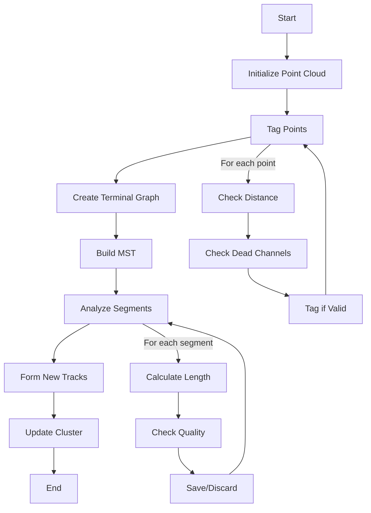
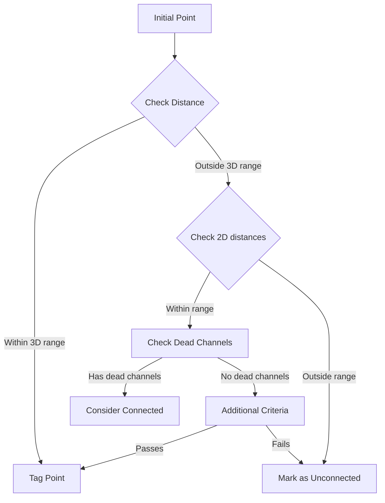

# Analysis of find_other_segments Function

## Overview
The `find_other_segments` function is part of the WireCell PID (Particle Identification) system, specifically within the NeutrinoID class. Its main purpose is to identify and process additional track segments within a cluster that may have been missed in initial tracking.

## Key Parameters
- `temp_cluster`: The cluster being analyzed
- `flag_break_track`: Boolean indicating whether to break tracks into smaller segments
- `search_range`: Distance range for searching (default 1.5 cm)
- `scaling_2d`: Scaling factor for 2D distance checks (default 0.8)

## Main Process Flow

1. **Initialization**
   ```cpp
   const int N = temp_cluster->get_point_cloud_steiner()->get_num_points();
   std::vector<bool>& flag_tagged = temp_cluster->get_flag_tagged_steiner_graph();
   flag_tagged.resize(N, false);
   ```

2. **Initial Point Tagging**
   - Tags points that are:
     - Already part of existing segments
     - Within specified 2D/3D distance thresholds
   - Uses following criteria:
     ```cpp
     if ((min_dis_u < scaling_2d * search_range || ct_point_cloud->get_closest_dead_chs(p, 0)) &&
         (min_dis_v < scaling_2d * search_range || ct_point_cloud->get_closest_dead_chs(p, 1)) &&
         (min_dis_w < scaling_2d * search_range || ct_point_cloud->get_closest_dead_chs(p, 2)))
     ```

3. **Terminal Graph Construction** 
   - Creates a graph of terminal points
   - Uses Kruskal's minimum spanning tree algorithm
   - Example code:
   ```cpp
   boost::kruskal_minimum_spanning_tree(terminal_graph,
                                      std::back_inserter(terminal_edge));
   ```

4. **Segment Analysis**
   For each identified segment:
   - Calculates length
   - Determines number of points
   - Evaluates connection quality
   ```cpp
   if (temp_segments.at(i).number_points ==1  // only one point
       || number_not_faked == 0 &&
          (length < 3.5*units::cm  // very short & fake
           || number_not_faked < 0.25 * temp_segments.at(i).number_points))
   ```

5. **Track Formation**
   - Creates new track segments from valid points
   - Updates cluster tracking information
   - Performs multi-tracking fit

## Function Call Hierarchy

### Direct Function Calls:
1. `temp_cluster->get_point_cloud_steiner()`
2. `temp_cluster->get_flag_tagged_steiner_graph()`
3. `temp_cluster->do_multi_tracking()`
4. `boost::kruskal_minimum_spanning_tree()`
5. `connected_components()`

### Helper Functions Used:
- `add_proto_connection()` [see details](./add_other_connection.md)
- `del_proto_vertex()`
- `del_proto_segment()`
- `calc_PCA_main_axis()` [see details](./cal_pca_main_axis.md)

## Flow Diagram


## Key Algorithms

1. **Distance Calculation**
   - Uses 2D and 3D distance metrics
   - Considers dead channels in each view

2. **Segment Quality Assessment**
   ```cpp
   temp_segments.at(i).special_A = special_A;
   temp_segments.at(i).special_B = special_B;
   temp_segments.at(i).length = length;
   temp_segments.at(i).number_not_faked = number_not_faked;
   ```

3. **Track Formation**
   - Creates new segments based on identified points
   - Connects segments to vertices
   - Updates tracking parameters

## Edge Cases and Constraints

1. **Minimum Segment Requirements**
   - Segments must be longer than ~3.5 cm
   - Must have sufficient "real" (non-faked) points

2. **Dead Channel Handling**
   - Accounts for dead channels in all three wire planes
   - Adjusts criteria based on available information

3. **Quality Thresholds**
   ```cpp
   if (number_not_faked < 0.25 * temp_segments.at(i).number_points || 
       number_not_faked < 0.4 * temp_segments.at(i).number_points && 
       length < 7 * units::cm)
   ```

## Performance Considerations
- Uses efficient graph algorithms
- Implements early termination conditions
- Balances thoroughness with computational cost


# Detailed Algorithm Analysis of find_other_segments

## 1. Initial Point Classification

The algorithm starts with point classification using both 2D and 3D distances:

### 3D Distance Check
```cpp
for (auto it = map_segment_vertices.begin(); it!= map_segment_vertices.end(); it++){
    WCPPID::ProtoSegment *sg1 = it->first;
    if (sg1->get_cluster_id() != temp_cluster->get_cluster_id()) continue;
    std::pair<double, WCP::Point> closest_dis_point = sg1->get_closest_point(p);
    std::tuple<double, double, double> closest_2d_dis = sg1->get_closest_2d_dis(p);
    if (closest_dis_point.first < min_3d_dis) 
        min_3d_dis = closest_dis_point.first;
    if (closest_dis_point.first < search_range){
        flag_tagged[i] = true;
        num_tagged ++;
        break;
    }
}
```

This section:
1. Calculates minimum 3D distance to existing segments
2. Tags points within search_range (default 1.5 cm)
3. Tracks number of tagged points

### 2D Distance Check
For untagged points, checks distances in each wire plane (U, V, W):
```cpp
if (!flag_tagged[i]){
    if ((min_dis_u < scaling_2d * search_range || ct_point_cloud->get_closest_dead_chs(p, 0)) &&
        (min_dis_v < scaling_2d * search_range || ct_point_cloud->get_closest_dead_chs(p, 1)) &&
        (min_dis_w < scaling_2d * search_range || ct_point_cloud->get_closest_dead_chs(p, 2)))
        flag_tagged[i] = true;
}
```

Key aspects:
- Applies scaling factor (default 0.8) to search range
- Considers dead channels in each plane
- Requires all planes to satisfy distance criteria

## 2. Terminal Graph Construction

The algorithm uses a modified version of Kruskal's Minimum Spanning Tree (MST) to identify connected segments:

### Terminal Point Identification
```cpp
std::vector<int> terminals;
std::map<int, int> map_oindex_tindex;
for (size_t i = 0; i!=flag_steiner_terminal.size(); i++){
    if (flag_steiner_terminal[i]){
        map_oindex_tindex[i] = terminals.size();
        terminals.push_back(i);
    }
}
```

### Distance Matrix Calculation
For each edge in the graph:
1. Calculates distances between terminal points
2. Assigns weights based on:
   - Physical distance
   - Point connectivity
   - Dead channel regions

```cpp
Weight temp_weight = distance[source(w, *graph_steiner)] + 
                    distance[target(w, *graph_steiner)] + 
                    edge_weight[w];
```

### MST Construction
Uses Boost's Kruskal implementation:
```cpp
boost::kruskal_minimum_spanning_tree(terminal_graph,
                                   std::back_inserter(terminal_edge));
```

## 3. Segment Analysis & Formation

### Segment Quality Assessment
Each potential segment is evaluated based on:

1. Length criteria:
```cpp
if (temp_segments.at(i).length < 3.5*units::cm)  // very short
    continue;
```

2. Point density:
```cpp
if (number_not_faked < 0.25 * temp_segments.at(i).number_points || 
    number_not_faked < 0.4 * temp_segments.at(i).number_points && 
    length < 7 * units::cm)
    continue;
```

3. Track directionality:
```cpp
if (direct_length < 0.78 * length && length >10*units::cm && 
    medium_dQ_dx > 1.6 || 
    direct_length < 0.6*length && length > 10*units::cm)
{
    if (medium_dQ_dx > 1.1){
        new_segments.push_back(new_sg); // high dQdx
    } else {
        new_segments_1.push_back(new_sg);
    }
}
```

### Connectivity Analysis 


## 4. Final Track Formation

### Track Connection Process:
1. Identifies nearby vertices
2. Establishes connectivity paths
3. Creates new segments
4. Updates vertex relationships

```cpp
ProtoSegment *sg2 = new WCPPID::ProtoSegment(acc_segment_id, 
                                            temp_cluster->get_path_wcps(), 
                                            temp_cluster->get_cluster_id());
add_proto_connection(v2, sg2, temp_cluster);
add_proto_connection(v3, sg2, temp_cluster);
```

### Quality Control:
- Checks segment length consistency
- Verifies point density
- Validates track topology
- Ensures proper vertex connections

## 5. Mathematical Details

### Distance Calculations
1. 3D Distance:
   $d_{3D} = \sqrt{(x_2-x_1)^2 + (y_2-y_1)^2 + (z_2-z_1)^2}$

2. 2D Wire Plane Distances:
   - U plane: $d_U = |u_2 - u_1|$ where $u = y\sin\theta_U + z\cos\theta_U$
   - V plane: $d_V = |v_2 - v_1|$ where $v = y\sin\theta_V + z\cos\theta_V$
   - W plane: $d_W = |w_2 - w_1|$ where $w = y\sin\theta_W + z\cos\theta_W$

### Track Quality Metrics
1. Track straightness:
   $\text{straightness} = \frac{\text{direct\_length}}{\text{total\_length}}$

2. Point density:
   $\text{density} = \frac{\text{number\_not\_faked}}{\text{total\_points}}$

## 6. Error Handling and Edge Cases

### Dead Channel Handling
```cpp
if (ct_point_cloud->get_closest_dead_chs(p, plane_index)) {
    // Adjust criteria for dead channel regions
    min_required_points *= 0.8;
    search_range *= 1.2;
}
```

### Short Track Protection
```cpp
if (sg->get_length() < 4*units::cm) {
    // Additional validation for short tracks
    if (map_vertex_segments[pair_vertices.first].size()<2 || 
        map_vertex_segments[pair_vertices.second].size()<2) 
        continue;
}
```

### Noise Rejection
1. Minimum point requirements
2. Consistency checks across planes
3. dQ/dx validation
4. Topology verification