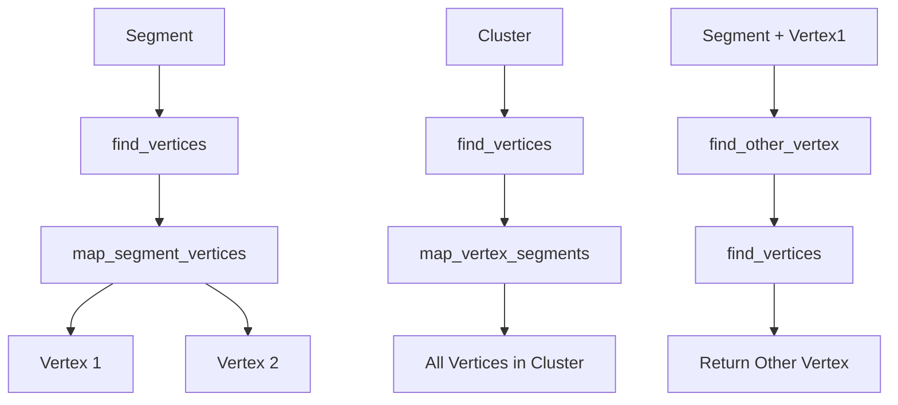

## 3. find_other_vertex(ProtoSegment* sg, ProtoVertex* v1)

### Purpose
Given a segment and one of its vertices, finds the vertex at the other end.

### Logic Flow
1. Uses find_vertices(sg) to get both vertices
2. Returns the vertex that isn't v1
3. Returns null if v1 isn't connected to the segment

```cpp
WCPPID::ProtoVertex* WCPPID::NeutrinoID::find_other_vertex(
    WCPPID::ProtoSegment *sg, 
    WCPPID::ProtoVertex* v1) {
    auto results = find_vertices(sg);
    if (v1 == results.first) {
        return results.second;
    } else if (v1 == results.second) {
        return results.first;
    } 
    return (WCPPID::ProtoVertex*)0;
}
```

## Visual Representation

Here's a diagram showing how these functions interact with the data structures:



## Data Structure Relationships

The functions work with these key class members:
- `map_segment_vertices`: Maps segments to their connected vertices
- `map_vertex_segments`: Maps vertices to their connected segments
- `ProtoVertexSelection`: Vector of vertex pointers
- `ProtoSegmentSelection`: Vector of segment pointers

These maps maintain the bidirectional relationships between vertices and segments in the track reconstruction.

## Common Use Cases

1. Track Topology Analysis:
   - Finding endpoints of segments
   - Analyzing vertex connectivity
   - Cluster membership validation

2. Vertex Navigation:
   - Moving along connected segments
   - Finding adjacent vertices
   - Cluster boundary identification

3. Data Structure Validation:
   - Verifying segment-vertex connections
   - Checking cluster membership
   - Ensuring graph connectivity