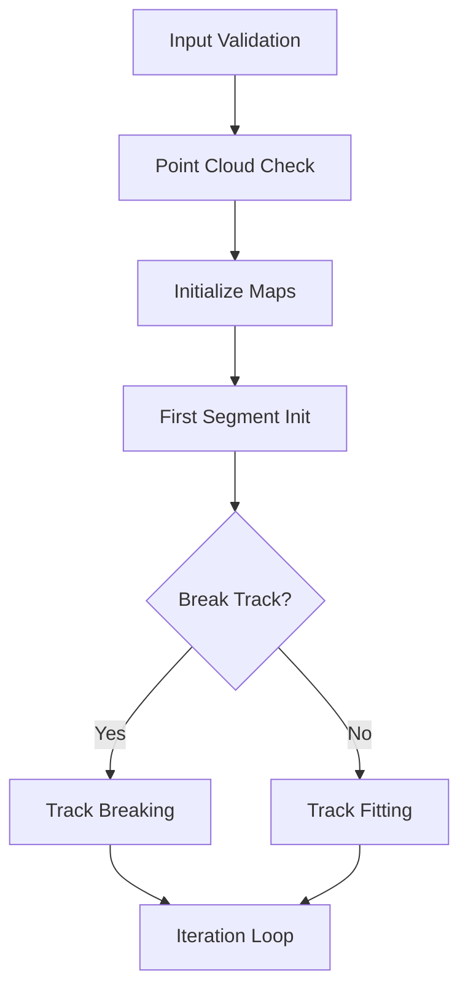
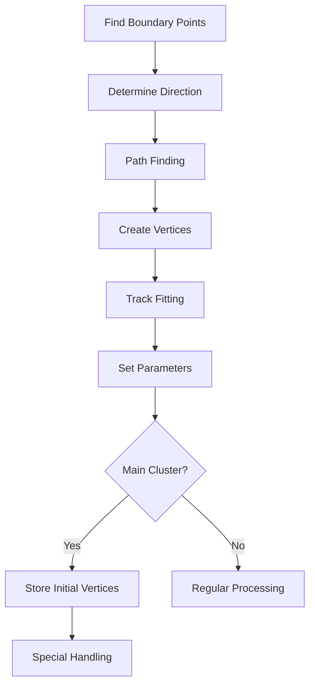
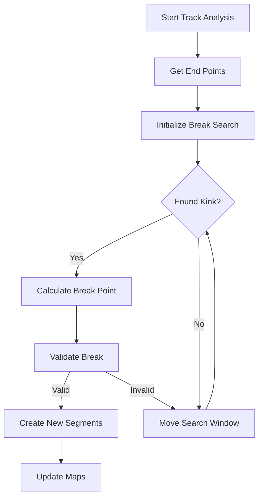

# Proto-Vertex Finding Algorithm Analysis

## Overview

The `find_proto_vertex` function implements a sophisticated algorithm for finding vertices in 3D particle tracks. It's a key component in particle trajectory reconstruction, used to identify interaction points and track segment endpoints.

## Main Function Components

# Detailed Algorithm Components

## 1. Initialization & Prerequisites

```cpp
bool find_proto_vertex(WCPPID::PR3DCluster *temp_cluster, 
                      bool flag_break_track, 
                      int nrounds_find_other_tracks, 
                      bool flag_back_search)
```

### Input Validation
1. Point Cloud Check
```cpp
if (temp_cluster->get_point_cloud_steiner()==0) return false;
if (temp_cluster->get_point_cloud_steiner()->get_num_points()<2) return false;
```

### Parameters
- **temp_cluster**: Target cluster containing 3D points
  - Must have Steiner point cloud initialized
  - Contains vertex/segment maps
- **flag_break_track**: Controls track segmentation
  - true: breaks long tracks at curve points
  - false: maintains original tracks
- **nrounds_find_other_tracks**: Search iteration count
  - Each round attempts to find more segments
  - Typically 2-3 rounds sufficient
- **flag_back_search**: Search direction control
  - true: searches from downstream
  - false: searches from upstream

### Internal Data Structure Setup
```cpp
// Vertex mappings
map_vertex_segments[vertex] = set<segments>;
map_segment_vertices[segment] = set<vertices>;

// Cluster relationships
map_cluster_vertices[cluster] = set<vertices>;
map_vertex_cluster[vertex] = cluster;
```

### Algorithm Flow


## 2. Initial Track Finding

The algorithm begins track reconstruction by identifying the first track segment and establishing initial vertices. This process uses several sophisticated methods to ensure robust track initialization.

### Initial Segment Algorithm [more details](./init_first_segment.md)
```cpp
WCPPID::ProtoSegment* init_first_segment(WCPPID::PR3DCluster *temp_cluster, bool flag_back_search) {
    // 1. Find boundary points
    std::pair<WCPoint, WCPoint> wcps = temp_cluster->get_two_boundary_wcps(2);
    
    // 2. Determine direction based on cluster type
    if (temp_cluster == main_cluster) {
        // Handle main cluster - start from downstream point
        if (flag_back_search) {
            if (wcps.first.z < wcps.second.z) {
                swap(wcps.first, wcps.second);
            }
        }
    } else {
        // Handle secondary clusters - start from closest point to main
        double dis1 = main_cluster->get_closest_dis(wcps.first);
        double dis2 = main_cluster->get_closest_dis(wcps.second);
        if (dis2 < dis1) swap(wcps.first, wcps.second);
    }
    
    // 3. Perform path finding
    temp_cluster->dijkstra_shortest_paths(wcps.first, 2);
    temp_cluster->cal_shortest_path(wcps.second, 2);
}
```

### Vertex Creation Process
1. Initial Point Selection
```cpp
// Create initial vertices
ProtoVertex *v1 = new ProtoVertex(acc_vertex_id++, wcps.first, cluster_id);
ProtoVertex *v2 = new ProtoVertex(acc_vertex_id++, wcps.second, cluster_id);
```

2. Track Fitting
```cpp
// Fit track parameters
temp_cluster->collect_charge_trajectory(*ct_point_cloud);
temp_cluster->do_tracking(*ct_point_cloud, global_wc_map, 
                         flash_time*units::microsecond, 
                         true, true);
```

3. Vertex Parameter Setting
```cpp
// Set vertex parameters using fitted track
v1->set_fit(temp_cluster->get_fine_tracking_path().front(),
            temp_cluster->get_dQ().front(),
            temp_cluster->get_dx().front(),
            temp_cluster->get_pu().front(),
            temp_cluster->get_pv().front(),
            temp_cluster->get_pw().front(),
            temp_cluster->get_pt().front(),
            temp_cluster->get_reduced_chi2().front());
```

### Main Cluster Handling
```cpp
if (temp_cluster == main_cluster) {
    // Store initial vertices for later analysis
    main_cluster_initial_pair_vertices = find_vertices(sg1);
    
    // Special handling for main vertex
    if (sg1->get_wcpt_vec().size() > 1) {
        // Track length checks
        // Direction analysis
        // Additional vertex fitting
    }
}
```

[see details](./find_vertices.md)

### Algorithm Flow


### Quality Checks
1. Track Length Validation
```cpp
if (sg1->get_length() < min_length) {
    // Handle short tracks
    delete v1; delete v2; delete sg1;
    return nullptr;
}
```

2. Track Quality Metrics
- Point density analysis
- Path smoothness check
- Charge distribution validation

## 3. Track Breaking Process

The track breaking component handles the complex task of segmenting long or curved tracks into smaller, more manageable pieces. This process is crucial for accurate vertex identification and track reconstruction.

### Main Breaking Algorithm  [see details](./break_segments.md)
```cpp
void break_segments(std::vector<WCPPID::ProtoSegment*>& remaining_segments,
                   WCPPID::PR3DCluster* temp_cluster,
                   float dis_cut = 0) {
    
    // Process segments until none remain or max iterations reached
    while(remaining_segments.size() != 0 && count < 2) {
        ProtoSegment* curr_sg = remaining_segments.back();
        remaining_segments.pop_back();
        
        // Find start and end vertices
        ProtoVertex *start_v = find_start_vertex(curr_sg);
        ProtoVertex *end_v = find_end_vertex(curr_sg);
        
        // Initialize breaking point search
        WCPoint break_wcp = start_v->get_wcpt();
        Point test_start_p = curr_sg->get_point_vec().front();
        
        // Distance cut handling
        if (dis_cut > 0) {
            adjust_start_point(curr_sg, test_start_p, dis_cut);
        }
        
        // Main breaking loop
        while(conditions_met(start_v, end_v, break_wcp)) {
            // Search for kink
            auto kink_tuple = curr_sg->search_kink(test_start_p);
            if (process_kink(kink_tuple, break_wcp)) {
                // Create new segments
                create_break_segments(temp_cluster, start_v, end_v, break_wcp);
            }
        }
    }
}
```

### Kink Detection Algorithm [see details](../pattern_recognition/protosegment_search_kink.md)
```cpp
std::tuple<Point, TVector3, TVector3, bool> search_kink(Point& start_p) {
    const int window_size = 5;  // points to examine
    double angle_threshold = 15; // degrees
    
    for(size_t i = 0; i < points.size() - window_size; i++) {
        // Calculate local direction vectors
        TVector3 dir1 = calc_local_direction(i, window_size/2);
        TVector3 dir2 = calc_local_direction(i + window_size/2, window_size/2);
        
        // Check angle between directions
        double angle = dir1.Angle(dir2) * 180/M_PI;
        if(angle > angle_threshold) {
            return std::make_tuple(points[i + window_size/2],
                                 dir1, dir2, true);
        }
    }
    return std::make_tuple(Point(), TVector3(), TVector3(), false);
}
```

### Break Point Processing [see details](../pattern_recognition/protosegment_break_segment_at_point.md)
```cpp
bool process_break_point(WCPoint& break_wcp, 
                        ProtoVertex* start_v,
                        ProtoVertex* end_v,
                        PR3DCluster* cluster) {
                        
    std::list<WCPoint> wcps_list1, wcps_list2;
    
    // Determine break type based on endpoint proximity
    bool flag_break;
    if (close_to_endpoint(end_v, break_wcp) && 
        single_connection(end_v)) {
        flag_break = cluster->proto_break_tracks(
            start_v->get_wcpt(), break_wcp, end_v->get_wcpt(),
            wcps_list1, wcps_list2, true);
    } else {
        flag_break = cluster->proto_break_tracks(
            start_v->get_wcpt(), break_wcp, end_v->get_wcpt(),
            wcps_list1, wcps_list2);
    }
    
    return flag_break;
}
```

### Track Analysis Flow


### Break Point Validation
1. Angle Criteria
```cpp
bool validate_break_angle(const TVector3& dir1, 
                        const TVector3& dir2,
                        double min_angle = 10,
                        double max_angle = 170) {
    double angle = dir1.Angle(dir2) * 180/M_PI;
    return angle > min_angle && angle < max_angle;
}
```

2. Point Density Check
```cpp
bool check_point_density(const std::list<WCPoint>& points,
                        double min_density = 0.5) {
    double length = calc_path_length(points);
    double density = points.size() / length;
    return density >= min_density;
}
```

3. Break Point Quality Metrics
```cpp
struct BreakQuality {
    double angle_score;      // Based on kink angle
    double density_score;    // Point density around break
    double trajectory_score; // Path smoothness
    double charge_score;     // dQ/dx consistency
    
    double get_total_score() {
        return angle_score * 0.4 +
               density_score * 0.2 +
               trajectory_score * 0.2 +
               charge_score * 0.2;
    }
};
```

## 4. Iterative Track Finding

The iterative track finding process systematically searches for and reconstructs additional track segments connecting to existing vertices. This multi-pass approach ensures comprehensive track reconstruction.

### Main Iteration Loop [see details](./find_other_segments.md)
```cpp
void find_other_segments(WCPPID::PR3DCluster* temp_cluster,
                        bool flag_break_track = true,
                        double search_range = 1.5*units::cm,
                        double scaling_2d = 0.8) {
                        
    // Initialize point tracking
    const int N = temp_cluster->get_point_cloud_steiner()->get_num_points();
    std::vector<bool>& flag_tagged = 
        temp_cluster->get_flag_tagged_steiner_graph();
    flag_tagged.resize(N, false);
    
    // Tag points near existing segments
    tag_points_near_segments(temp_cluster, flag_tagged, search_range);
    
    // Find terminal points
    std::vector<int> terminals = find_terminal_points(temp_cluster);
    
    // Process remaining untagged points
    process_untagged_points(temp_cluster, flag_tagged, terminals);
}
```

### Point Tagging Algorithm
```cpp
void tag_points_near_segments(PR3DCluster* cluster,
                            std::vector<bool>& flag_tagged,
                            double search_range) {
    WCPointCloud<double>

### 5. Vertex Examination

Multiple vertex analysis steps:
1. `examine_vertices_3()`: Analyzes initial vertex pair
2. `examine_vertices_1()`: Checks single-skippable segments
3. `examine_vertices_2()`: Merges close vertices
4. `examine_vertices_4()`: Analyzes multi-segment vertices

[see details](./examine_vertices.md)

### 6. Final Processing

- Final tracking update
- Vertex/segment map cleanup
- Returns success/failure status

## Key Helper Functions

1. **init_first_segment** [see details](./init_first_segment.md)
   - Creates initial track segment
   - Sets up first vertex pair
   - Returns initial ProtoSegment

2. **break_segments** [see details](./break_segments.md)
   - Breaks long tracks into segments
   - Creates new vertices at break points
   - Updates tracking maps

3. **find_other_segments** [see details](./find_other_segments.md)
   - Searches for additional track segments
   - Uses spatial proximity criteria
   - Updates segment collections

4. **examine_vertices_[1-4]**  [see details](./examine_vertices.md)
   - Different vertex analysis methods
   - Merges/splits vertices as needed
   - Updates vertex-segment relationships

5. **crawl_segment**  [see details](./examine_segment.md)
   - Follows segment path
   - Identifies connected points
   - Updates segment geometry

## Data Structures Used

1. **Vertex-Segment Maps**
```cpp
Map_Proto_Vertex_Segments map_vertex_segments;
Map_Proto_Segment_Vertices map_segment_vertices;
```

2. **Track Point Collections**
```cpp
WCP::PointVector pts;  // 3D points
std::vector<WCP::WCPointCloud<double>::WCPoint> wcps;  // Wire chamber points
```

3. **Cluster Maps**
```cpp
std::map<PR3DCluster*, ProtoVertexSet> map_cluster_vertices;
std::map<ProtoVertex*, PR3DCluster*> map_vertex_cluster;
```

## Algorithm Flow Example

For a typical track:

1. Initial state:
```
Track points: [P1, P2, ..., Pn]
Initial vertices: V1, V2
```

2. After breaking:
```
Segments: [S1, S2, S3]
Vertices: [V1, V_break1, V_break2, V2]
```

3. After merging close vertices:
```
Final segments: [S1, S2]
Final vertices: [V1, V_merged, V2]
```

## Performance Considerations

- Computation scales with number of track points
- Memory usage depends on segment count
- Vertex merging reduces complexity
- Track breaking increases vertex count

## Usage Example

```cpp
// Initialize cluster
PR3DCluster* cluster = new PR3DCluster();
// Add points to cluster
// ...

// Find vertices
bool success = find_proto_vertex(cluster, 
                               true,  // break tracks
                               2,     // 2 rounds
                               false  // forward search
                               );

if (success) {
    // Process found vertices
    auto vertices = find_vertices(cluster);
    for (auto vertex : vertices) {
        // Use vertex information
    }
}
```

## Limitations and Edge Cases

1. Minimum Point Requirements
   - Needs at least 2 points
   - Better results with more points

2. Track Quality Impact
   - Noisy tracks may split incorrectly
   - Missing points affect vertex finding

3. Performance vs Accuracy
   - More rounds increase accuracy but slow performance
   - Track breaking adds complexity

4. Special Cases
   - Very short tracks may not break
   - Parallel tracks need careful handling
   - Vertex merging may lose detail