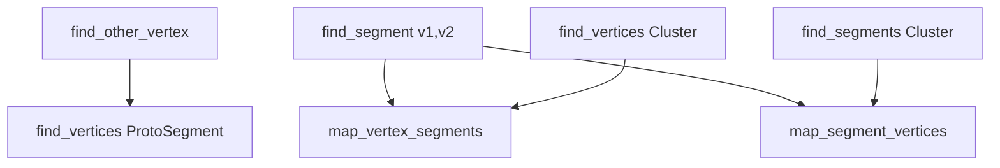

# Analysis of find_segment Functions in NeutrinoID

## Overview
The code contains several related `find_segment` functions that are used to navigate and query the relationships between vertices and segments in the reconstruction. These functions work with the following key data structures:

- ProtoVertex: Represents vertices in the reconstruction
- ProtoSegment: Represents segments/tracks connecting vertices
- map_vertex_segments: Maps vertices to their connected segments
- map_segment_vertices: Maps segments to their connected vertices

## Key Functions

### 1. find_segment(ProtoVertex* v1, ProtoVertex* v2)

**Purpose**: Finds a segment that connects two given vertices.

**Logic Flow**:
1. Iterates through all segments connected to v1
2. For each segment, checks if v2 is also connected to it
3. Returns the first segment found that connects both vertices, or null if none exists

```cpp
WCPPID::ProtoSegment* find_segment(WCPPID::ProtoVertex *v1, WCPPID::ProtoVertex *v2) {
    WCPPID::ProtoSegment* sg = 0;
    for (auto it1 = map_vertex_segments[v1].begin(); 
         it1 != map_vertex_segments[v1].end(); it1++) {
        sg = *it1;
        if (map_segment_vertices[sg].find(v2) == map_segment_vertices[sg].end()) {
            sg = 0;
        } else {
            break;
        }
    }
    return sg;
}
```

### 2. find_vertices(ProtoSegment* sg)

**Purpose**: Finds both vertices connected to a given segment.

**Logic Flow**:
1. Checks if segment exists in map_segment_vertices
2. Iterates through connected vertices of segment
3. Returns pair of vertices (v1, v2)

```cpp
std::pair<WCPPID::ProtoVertex*, WCPPID::ProtoVertex*> find_vertices(ProtoSegment* sg) {
    if (map_segment_vertices.find(sg) == map_segment_vertices.end())
        return std::make_pair((WCPPID::ProtoVertex*)0, (WCPPID::ProtoVertex*)0);

    WCPPID::ProtoVertex *v1 = 0, *v2 = 0;
    for (auto it = map_segment_vertices[sg].begin(); 
         it != map_segment_vertices[sg].end(); it++) {
        if (v1==0) {
            v1 = *it;
        } else {
            v2 = *it;
        }
    }
    return std::make_pair(v1,v2);
}
```

### 3. find_other_vertex(ProtoSegment* sg, ProtoVertex* v1)

**Purpose**: Given a segment and one of its vertices, finds the vertex at the other end.

**Logic Flow**:
1. Gets both vertices of segment using find_vertices()
2. Returns whichever vertex is not v1
3. Returns null if v1 is not connected to segment

```cpp
WCPPID::ProtoVertex* find_other_vertex(ProtoSegment *sg, ProtoVertex* v1) {
    auto results = find_vertices(sg);
    if (v1 == results.first) {
        return results.second;
    } else if (v1 == results.second) {
        return results.first;
    }
    return (WCPPID::ProtoVertex*)0;
}
```

### 4. find_vertices(PR3DCluster* temp_cluster)

**Purpose**: Finds all vertices belonging to a specific cluster.

**Logic Flow**:
1. Iterates through map_vertex_segments
2. Collects vertices that match the cluster ID
3. Returns vector of matching vertices

### 5. find_segments(PR3DCluster* temp_cluster)

**Purpose**: Finds all segments belonging to a specific cluster.

**Logic Flow**:
1. Iterates through map_segment_vertices
2. Collects segments that match the cluster ID
3. Returns vector of matching segments

## Function Call Relationships



## Usage Example

Here's a typical usage pattern showing how these functions work together:

```cpp
// Find a segment between two vertices
ProtoSegment* sg = find_segment(vertex1, vertex2);

// Get both vertices of that segment
auto vertex_pair = find_vertices(sg);

// Find the other end of a segment given one vertex
ProtoVertex* other_end = find_other_vertex(sg, vertex1);

// Get all vertices in a cluster
ProtoVertexSelection cluster_vertices = find_vertices(cluster);

// Get all segments in a cluster
ProtoSegmentSelection cluster_segments = find_segments(cluster);
```

## Key Points to Note

1. The functions make heavy use of maps (map_vertex_segments and map_segment_vertices) to maintain bidirectional relationships between vertices and segments.

2. Most functions include null checks since segments or vertices might not exist or be connected as expected.

3. These functions are fundamental building blocks used by more complex algorithms in the reconstruction process.

4. The code assumes a consistent state between map_vertex_segments and map_segment_vertices - if a vertex is connected to a segment, that segment must also be connected to the vertex.

## Additional Considerations

- Performance: The functions use map lookups which are O(log n), making them efficient for typical use cases.
- Memory: The bidirectional maps ensure quick lookups but require more memory to maintain the relationships.
- Error Handling: The functions generally return null/empty results rather than throwing exceptions when relationships don't exist.