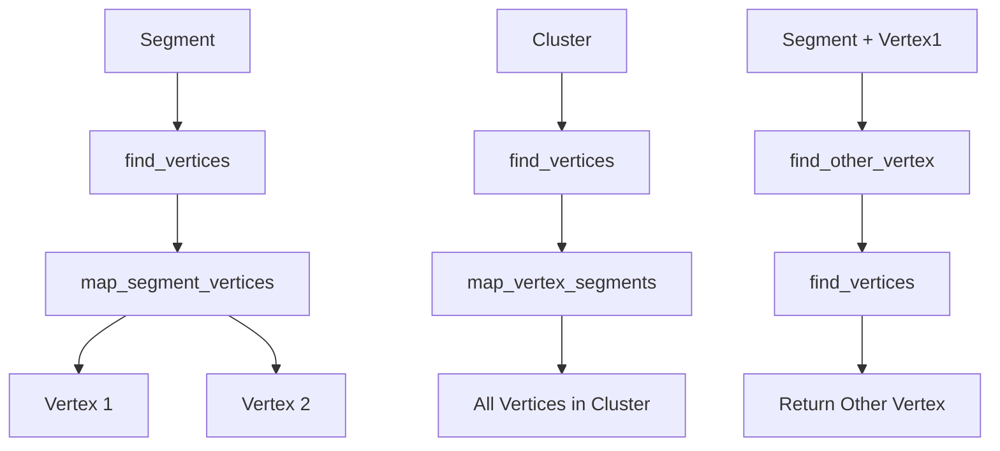

# Analysis of Find Vertices Functions

## Overview

There are three overloaded `find_vertices` functions in the NeutrinoID class, each serving a different purpose:

1. `find_vertices(ProtoSegment* sg)` - Finds the two vertices connected to a segment
2. `find_vertices(PR3DCluster* temp_cluster)` - Finds all vertices in a cluster
3. `find_other_vertex(ProtoSegment* sg, ProtoVertex* v1)` - Finds the vertex on the other end of a segment

## 1. find_vertices(ProtoSegment* sg)

### Purpose
Finds both vertices that are connected to a given segment in the track reconstruction.

### Logic Flow
1. First checks if the segment exists in the vertex map
2. If found, retrieves both vertices connected to this segment
3. Returns a pair of ProtoVertex pointers

### Code Example
```cpp
std::pair<WCPPID::ProtoVertex*, WCPPID::ProtoVertex*> WCPPID::NeutrinoID::find_vertices(WCPPID::ProtoSegment* sg) {
    // Check if segment exists in map
    if (map_segment_vertices.find(sg) == map_segment_vertices.end())
        return std::make_pair((WCPPID::ProtoVertex*)0, (WCPPID::ProtoVertex*)0);

    WCPPID::ProtoVertex *v1 = 0;
    WCPPID::ProtoVertex *v2 = 0;
    
    // Iterate through vertices connected to segment
    for (auto it = map_segment_vertices[sg].begin(); 
         it != map_segment_vertices[sg].end(); 
         it++) {
        if (v1==0) {
            v1 = *it;
        } else {
            v2 = *it;
        }
    }

    return std::make_pair(v1,v2);
}
```

### Key Data Structures Used
- `map_segment_vertices`: Maps segments to their connected vertices
- Returns `std::pair<ProtoVertex*, ProtoVertex*>`

## 2. find_vertices(PR3DCluster* temp_cluster)

### Purpose
Returns all vertices associated with a given cluster.

### Logic Flow
1. Creates a temporary vector to store vertices
2. Iterates through vertex map
3. Checks cluster ID match
4. Collects matching vertices

### Code Example
```cpp
WCPPID::ProtoVertexSelection WCPPID::NeutrinoID::find_vertices(WCPPID::PR3DCluster* temp_cluster) {
    WCPPID::ProtoVertexSelection tmp_vertices;
    for (auto it = map_vertex_segments.begin(); 
         it!= map_vertex_segments.end(); 
         it++) {
        if (temp_cluster->get_cluster_id() == (it->first)->get_cluster_id()) 
            tmp_vertices.push_back(it->first);
    }
    return tmp_vertices;
}
```

### Key Data Structures Used
- `map_vertex_segments`: Maps vertices to their connected segments
- Returns `ProtoVertexSelection` (vector of ProtoVertex pointers)

## 3. find_other_vertex(ProtoSegment* sg, ProtoVertex* v1)

### Purpose
Given a segment and one of its vertices, finds the vertex at the other end.

### Logic Flow
1. Uses find_vertices(sg) to get both vertices
2. Returns the vertex that isn't v1
3. Returns null if v1 isn't connected to the segment

```cpp
WCPPID::ProtoVertex* WCPPID::NeutrinoID::find_other_vertex(
    WCPPID::ProtoSegment *sg, 
    WCPPID::ProtoVertex* v1) {
    auto results = find_vertices(sg);
    if (v1 == results.first) {
        return results.second;
    } else if (v1 == results.second) {
        return results.first;
    } 
    return (WCPPID::ProtoVertex*)0;
}
```

## Visual Representation

Here's a diagram showing how these functions interact with the data structures:



## Function Dependencies

Each function depends on the following class members:

### find_vertices(ProtoSegment*)
- `map_segment_vertices`

### find_vertices(PR3DCluster*)
- `map_vertex_segments`

### find_other_vertex()
- `find_vertices(ProtoSegment*)`

## Data Structure Relationships

The functions work with these key class members:
- `map_segment_vertices`: Maps segments to their connected vertices
- `map_vertex_segments`: Maps vertices to their connected segments
- `ProtoVertexSelection`: Vector of vertex pointers
- `ProtoSegmentSelection`: Vector of segment pointers

These maps maintain the bidirectional relationships between vertices and segments in the track reconstruction.

## Common Use Cases

1. Track Topology Analysis:
   - Finding endpoints of segments
   - Analyzing vertex connectivity
   - Cluster membership validation

2. Vertex Navigation:
   - Moving along connected segments
   - Finding adjacent vertices
   - Cluster boundary identification

3. Data Structure Validation:
   - Verifying segment-vertex connections
   - Checking cluster membership
   - Ensuring graph connectivity