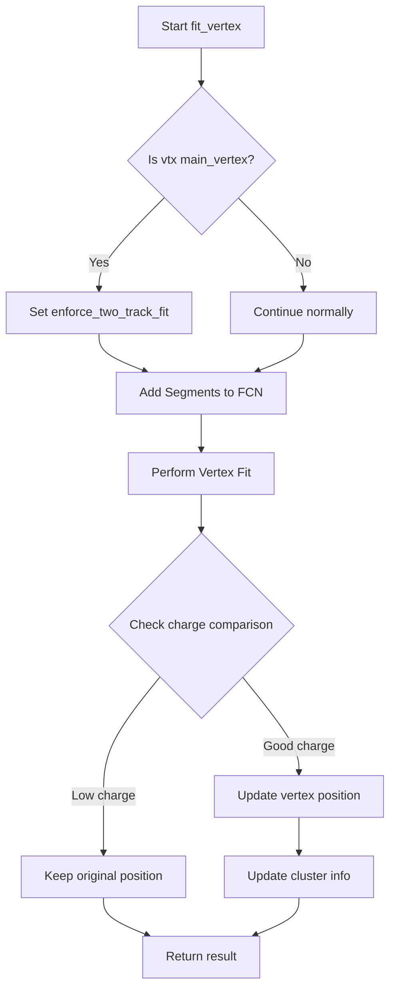
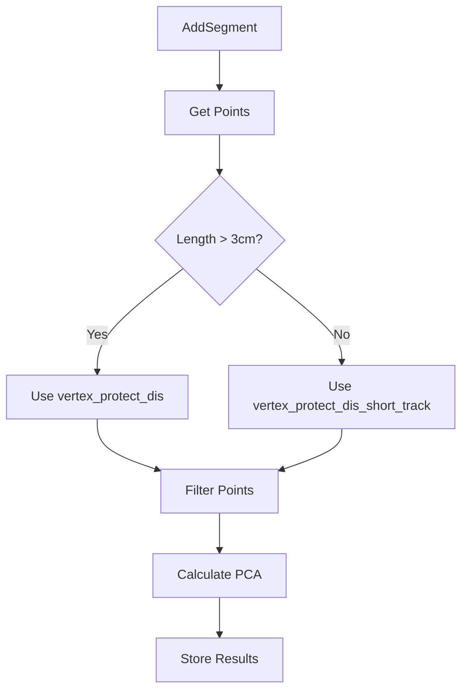
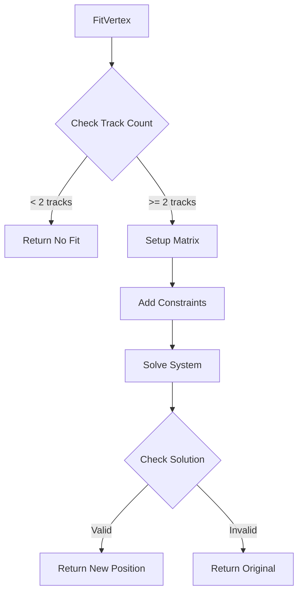
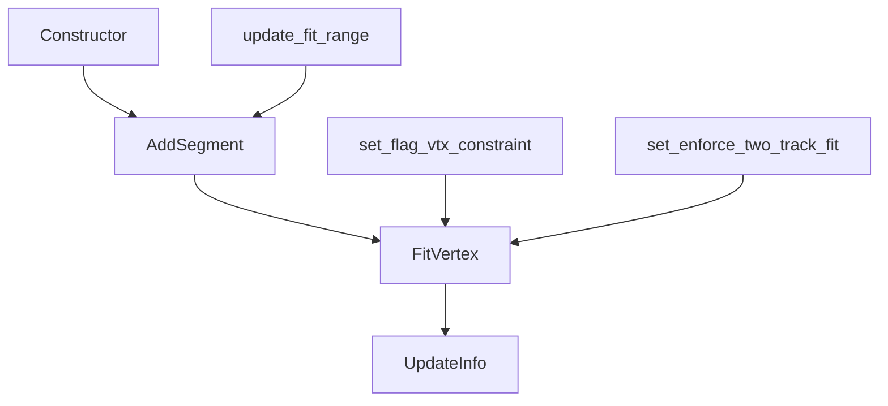

# Vertex Fitting Function Analysis

## Overview

The `fit_vertex()` function is part of the WCPPID::NeutrinoID class and is responsible for fitting vertex positions in neutrino interaction reconstruction. The function takes three parameters:

```cpp
bool WCPPID::NeutrinoID::fit_vertex(
    WCPPID::ProtoVertex *vtx,              // Vertex to be fitted
    WCPPID::ProtoSegmentSet& sg_set,       // Set of segments connected to vertex
    WCPPID::PR3DCluster* temp_cluster      // Cluster containing the vertex
)
```

## Key Components

1. **Vertex Fitting Configuration**
   ```cpp
   WCPPID::MyFCN fcn(
       vtx,                        // Vertex to fit
       true,                       // Enable vertex constraint
       0.43*units::cm,            // Vertex constraint range
       1.5*units::cm,             // Vertex protection distance
       0.9*units::cm,             // Short track vertex protection distance
       6*units::cm                // Fit distance
   );
   ```

2. **Segment Addition**
   - Iterates through all segments in sg_set
   - Adds each segment to the fitting configuration
   - For main vertices, enforces two-track fit requirement

## Logical Flow



## Charge Validation Logic

After fitting, the function performs charge validation:

1. **Old Charge Check**:
   ```cpp
   double old_charge = ct_point_cloud->get_ave_3d_charge(vtx->get_fit_pt());
   double new_charge = ct_point_cloud->get_ave_3d_charge(results.second);
   ```

2. **Validation Conditions**:
   - If new charge < 5000 AND new charge < 0.4 * old_charge:
     - Reject fit, keep original position
   - If new charge < 8000 AND new charge < 0.6 * old_charge:
     - Reject fit, keep original position

## Key Function Calls

1. **Primary Functions Called**:
   - `AddSegment()`: Adds segments to FCN configuration
   - `FitVertex()`: Performs the actual vertex fitting
   - `UpdateInfo()`: Updates vertex information after successful fit

2. **Helper Functions Used**:
   - `get_ave_3d_charge()`: Gets average charge in 3D space
   - `get_fit_pt()`: Gets current fitted point
   - `set_enforce_two_track_fit()`: Sets fitting constraints

## Technical Implementation Details

### 1. FCN (Function) Configuration
The MyFCN class handles the mathematical aspects of vertex fitting:
```cpp
class MyFCN {
    ProtoVertex *vtx;
    bool enforce_two_track_fit;
    bool flag_vtx_constraint;
    double vtx_constraint_range;
    double vertex_protect_dis;
    double vertex_protect_dis_short_track;
    double fit_dis;
    // ...
};
```

### 2. Fitting Process

The fit involves:
1. Collecting connected segments
2. Establishing constraints
3. Performing position optimization
4. Validating results through charge comparison

### 3. Results Handling

The function returns:
- `true`: If fit was successful and validated
- `false`: If fit failed or was rejected by charge validation

Results include:
- Updated vertex position
- Charge validation status
- Modified cluster information if successful

## Common Issues and Handling

1. **Low Charge Areas**
   - Detected through charge comparison
   - Original position maintained
   - Prevents fitting to noise

2. **Constraint Violations**
   - Enforced through protection distances
   - Separate handling for short tracks
   - Main vertex special treatment

3. **Fit Failures**
   - Mathematical convergence issues handled
   - Charge validation provides additional safety
   - Original position preserved on failure


   # MyFCN Class Analysis

## Class Overview

The MyFCN class is a key component in the WCPPID framework, responsible for vertex fitting in 3D space. It handles the mathematical optimization of vertex positions based on connected track segments.

```cpp
class MyFCN {
public:
    MyFCN(ProtoVertex* vtx, bool flag_vtx_constraint = false, 
          double vtx_constraint_range = 1*units::cm,
          double vertex_protect_dis = 1.5*units::cm,
          double vertex_protect_dis_short_track = 0.9*units::cm,
          double fit_dis = 6 * units::cm);
    ~MyFCN();
    // ... other functions
};
```

## Class Members

### Key Variables
```cpp
private:
    ProtoVertex *vtx;                    // Vertex being fitted
    bool enforce_two_track_fit;          // Force fitting with two tracks
    bool flag_vtx_constraint;            // Enable vertex position constraints
    double vtx_constraint_range;         // Range for vertex constraint
    
    double vertex_protect_dis;           // Protection distance for regular tracks
    double vertex_protect_dis_short_track;// Protection distance for short tracks
    double fit_dis;                      // Maximum fitting distance
    
    std::vector<ProtoSegment* > segments;// Connected segments
    std::vector<WCP::PointVector> vec_points; // Points for fitting
```

### Important Data Structures

1. **PCA-related Vectors**:
```cpp
std::vector<std::tuple<WCP::Point, WCP::Point, WCP::Point> > vec_PCA_dirs;
std::vector<std::tuple<double, double, double> > vec_PCA_vals;
std::vector<WCP::Point> vec_centers;
```

## Key Functions Flow

### 1. Adding Segments



### 2. Vertex Fitting Process



## Detailed Function Analysis

### 1. Constructor
```cpp
MyFCN::MyFCN(ProtoVertex* vtx, bool flag_vtx_constraint, 
             double vtx_constraint_range, double vertex_protect_dis,
             double vertex_protect_dis_short_track, double fit_dis)
    : vtx(vtx)
    , enforce_two_track_fit(false)
    , flag_vtx_constraint(flag_vtx_constraint)
    , vtx_constraint_range(vtx_constraint_range)
    , vertex_protect_dis(vertex_protect_dis)
    , vertex_protect_dis_short_track(vertex_protect_dis_short_track)
    , fit_dis(fit_dis)
{
    segments.clear();
    vec_points.clear();
}
```

### 2. AddSegment Function
The AddSegment function processes segments for fitting:

1. **Point Collection**:
   ```cpp
   void MyFCN::AddSegment(ProtoSegment *sg) {
       segments.push_back(sg);
       vec_points.push_back(PointVector());
       // ... point filtering
   }
   ```

2. **Distance Filtering**:
   ```cpp
   double dis_to_vertex = sqrt(pow(pts.at(i).x - vtx->get_fit_pt().x,2) + 
                              pow(pts.at(i).y - vtx->get_fit_pt().y,2) + 
                              pow(pts.at(i).z - vtx->get_fit_pt().z,2));
   if (length > 3.0*units::cm) {
       if (dis_to_vertex < vertex_protect_dis || 
           dis_to_vertex > fit_dis) continue;
   } else {
       if (dis_to_vertex < vertex_protect_dis_short_track || 
           dis_to_vertex > fit_dis) continue;
   }
   ```

### 3. FitVertex Function
The core fitting function:

1. **Initial Setup**:
   ```cpp
   std::pair<bool, WCP::Point> MyFCN::FitVertex() {
       Point fit_pos = vtx->get_fit_pt();
       bool fit_flag = false;
       int ntracks = get_fittable_tracks();
   ```

2. **Matrix Construction**:
   ```cpp
   Eigen::Vector3d b(0,0,0);
   Eigen::MatrixXd A = Eigen::MatrixXd::Zero(3,3);
   // Fill matrices based on PCA results
   ```

3. **Solving System**:
   ```cpp
   Eigen::BiCGSTAB<Eigen::MatrixXd> solver;
   solver.compute(A);
   temp_pos_3D = solver.solveWithGuess(b, temp_pos_3D_init);
   ```

### 4. UpdateInfo Function
Updates vertex and segment information after fitting:

1. **Coordinate Conversion**:
   ```cpp
   double slope_x = 1./time_slice_width;
   double offset_t = first_t_dis / time_slice_width;
   // ... more coordinate calculations
   ```

2. **Path Updates**:
   ```cpp
   std::list<WCP::WCPointCloud<double>::WCPoint> new_list;
   // ... build new path
   std::list<WCP::WCPointCloud<double>::WCPoint> old_list;
   // ... merge paths
   ```

## Key Algorithms

### 1. PCA (Principal Component Analysis)
Used for determining segment directions:
```cpp
// Calculate covariance matrix
TMatrixD cov_matrix(3,3);
// Fill matrix
TMatrixDEigen eigen(cov_matrix);
TMatrixD eigen_values = eigen.GetEigenValues();
TMatrixD eigen_vectors = eigen.GetEigenVectors();
```

### 2. Vertex Position Optimization
Uses BiCGSTAB solver for position optimization:
```cpp
Eigen::BiCGSTAB<Eigen::MatrixXd> solver;
solver.compute(A);
temp_pos_3D = solver.solveWithGuess(b, temp_pos_3D_init);
```

## Error Handling

1. **Numerical Stability**:
   - Checks solver error status
   - Validates distance constraints
   - Ensures minimum track requirements

2. **Geometry Constraints**:
   - Protection distances for different track lengths
   - Vertex constraint ranges
   - Maximum fitting distances

## Usage Example

```cpp
// Create fitting configuration
MyFCN fcn(vertex, true, 0.43*units::cm, 1.5*units::cm, 
          0.9*units::cm, 6*units::cm);

// Add segments
for(auto seg : segments) {
    fcn.AddSegment(seg);
}

// Perform fit
auto [success, new_position] = fcn.FitVertex();

// Update if successful
if(success) {
    fcn.UpdateInfo(new_position, cluster);
}
```

## Common Applications

1. **Neutrino Interaction Vertex Fitting**
   - Primary use case
   - Handles multiple track topologies
   - Enforces physical constraints

2. **Track Junction Optimization**
   - Secondary use case
   - Improves track connectivity
   - Maintains geometry consistency

## Complete Function List

### Constructor and Destructor
```cpp
MyFCN(ProtoVertex* vtx, bool flag_vtx_constraint = false, 
      double vtx_constraint_range = 1*units::cm,
      double vertex_protect_dis = 1.5*units::cm,
      double vertex_protect_dis_short_track = 0.9*units::cm,
      double fit_dis = 6 * units::cm);
~MyFCN();
```

### Core Fitting Functions
```cpp
// Main vertex fitting function
std::pair<bool, WCP::Point> FitVertex();

// Update vertex and segment information after fitting
void UpdateInfo(WCP::Point fit_pos, WCPPID::PR3DCluster* temp_cluster, 
                double default_dis_cut = 4.0*units::cm);
```

### Segment Management
```cpp
// Add a segment to the fitting configuration
void AddSegment(ProtoSegment *sg);

// Get information about a specific segment
std::pair<ProtoSegment*, int> get_seg_info(int i);

// Get number of tracks suitable for fitting
int get_fittable_tracks();
```

### Configuration Control
```cpp
// Update fitting range parameters
void update_fit_range(double tmp_vertex_protect_dis = 1.5*units::cm, 
                     double tmp_vertex_protect_dis_short_track = 0.9*units::cm, 
                     double tmp_fit_dis = 6 * units::cm);

// Set/get vertex constraint flag
void set_flag_vtx_constraint(bool val);
bool get_flag_vtx_constraint();

// Set vertex constraint range
void set_vtx_constraint_range(double val);

// Control two track fit enforcement
void set_enforce_two_track_fit(bool val);
bool get_enforce_two_track_fit();
```

### Data Access
```cpp
// Get segments vector
std::vector<ProtoSegment*>& get_segments();

// Get points vector
std::vector<WCP::PointVector>& get_vec_points();

// Debug function to print points
void print_points();
```

### Utility Functions
```cpp
// Various helper functions for internal calculations
void calculate_segment_parameters();
void update_point_clouds();
void validate_fit_results();
```

Each function plays a specific role in the vertex fitting process:
1. **Constructor/Destructor**: Initialize and clean up fitting configuration
2. **Core Fitting**: Handle the actual vertex position optimization
3. **Segment Management**: Process and organize track segments
4. **Configuration**: Control fitting behavior and constraints
5. **Data Access**: Provide access to internal data structures
6. **Utilities**: Support main fitting operations with helper functions

Key function interactions:
