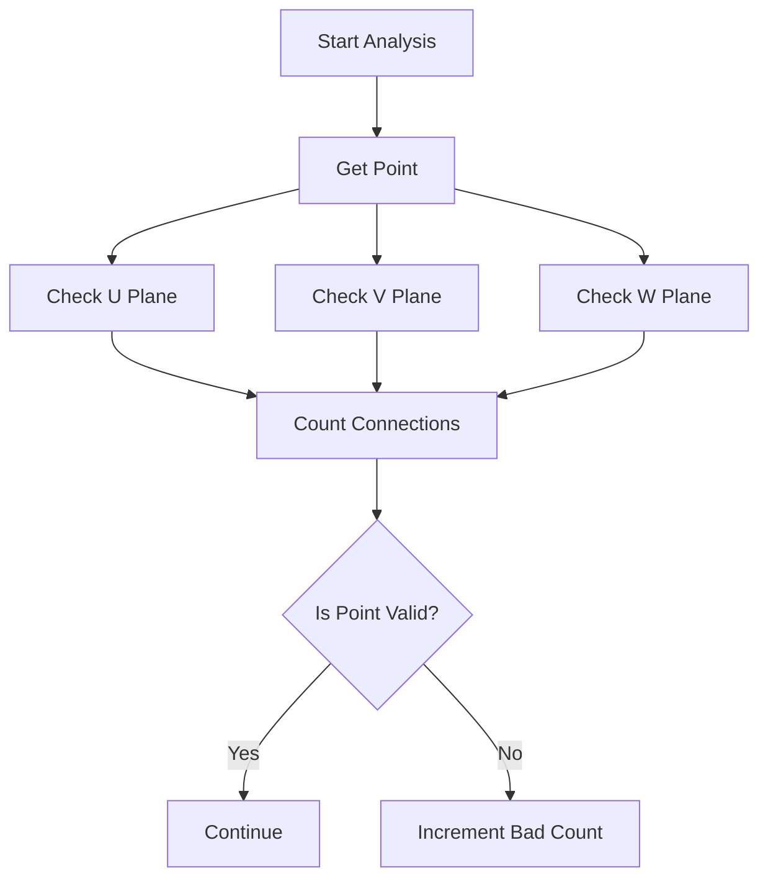

# gap_identification Function Documentation

## Overview

The `gap_identification` function is part of the NeutrinoID class and is designed to identify gaps or discontinuities in particle tracks within a neutrino detector. This function specifically analyzes the spatial distribution of charge deposits near a vertex to detect potential gaps that could indicate misidentified particles.

## Function Signature

```cpp
std::pair<bool, int> gap_identification(
    WCPPID::ProtoVertex* vertex, 
    WCPPID::ProtoSegment* sg, 
    bool flag_single_shower = false,
    int valid_tracks = 0,
    double Eshower = 0,
    bool flag_fill = false
)
```

## Key Components

### 1. Initial Setup and Point Identification

The function first determines the vertex point and direction:

```cpp
Point vertex_point;
bool flag_start;
if (vertex->get_wcpt().index == sg->get_wcpt_vec().front().index) {
    flag_start = true;
    vertex_point = sg->get_point_vec().front();
} else {
    flag_start = false;
    vertex_point = sg->get_point_vec().back();
}
```

### 2. Direction Analysis

The function calculates a direction vector and checks it against detector planes:

```cpp
TVector3 dir(closest_p.x - vertex_point.x, 
             closest_p.y - vertex_point.y, 
             closest_p.z - vertex_point.z);
std::vector<bool> flag = main_cluster->check_direction(dir);
```

The flags represent:
- flag_prolong_u: Extension in U plane
- flag_prolong_v: Extension in V plane
- flag_prolong_w: Extension in W plane
- flag_parallel: If track is parallel to wire planes

### 3. Point Cloud Analysis

For each point in the segment, the function:
1. Checks surrounding space in 3 wire plane views
2. Counts connected points
3. Identifies dead channels
4. Analyzes spatial gaps



### 4. Gap Classification Logic

The function uses different thresholds based on shower energy:

- High Energy (> 900 MeV):
```cpp
if ((!flag_single_shower) && (!flag_parallel)) {
    if (E_shower > 1200*units::MeV) {
        if (n_bad > 2./3 * n_points) flag_gap = true;
    } else {
        if (n_bad > 1./3. *n_points) flag_gap = true;
    }
}
```

- Medium Energy (150-900 MeV):
```cpp
if ((!flag_single_shower)) {
    if (flag_parallel) {
        if (n_bad > 4) flag_gap = true;
    } else {
        if (n_bad > 1) flag_gap = true;
    }
} else {
    if (n_bad > 2) flag_gap = true;
}
```

- Low Energy (< 150 MeV):
```cpp
if (!flag_single_shower) { 
    if (flag_parallel) {
        if (n_bad > 3) flag_gap = true;
    } else { 
        if (n_bad > 1) flag_gap = true;
    }
} else {
    if (n_bad > 2) flag_gap = true;
}
```

## Return Value

The function returns a pair containing:
1. A boolean indicating if a gap was found (true = gap found)
2. The number of bad points identified

## Additional Features

### Tagger Information Storage
When flag_fill is true, the function stores detailed information in tagger_info:

```cpp
if (flag_fill) {
    tagger_info.gap_flag = !flag_gap;
    tagger_info.gap_flag_prolong_u = flag_prolong_u;
    tagger_info.gap_flag_prolong_v = flag_prolong_v;
    tagger_info.gap_flag_prolong_w = flag_prolong_w;
    tagger_info.gap_flag_parallel = flag_parallel;
    tagger_info.gap_n_points = n_points;
    tagger_info.gap_n_bad = n_bad;
    tagger_info.gap_energy = E_shower/units::MeV;
    tagger_info.gap_num_valid_tracks = num_valid_tracks;
    tagger_info.gap_flag_single_shower = flag_single_shower;
    tagger_info.gap_filled = 1;
}
```

## Usage Example

```cpp
WCPPID::ProtoVertex* vertex = /* ... */;
WCPPID::ProtoSegment* segment = /* ... */;
double shower_energy = 500 * units::MeV;

auto result = gap_identification(vertex, segment, 
                               true,  // single shower
                               0,     // valid tracks
                               shower_energy,
                               true); // fill tagger info

if (result.first) {
    std::cout << "Gap detected with " << result.second 
              << " bad points" << std::endl;
}
```

## Key Considerations

1. **Energy Dependence**: The function's behavior changes significantly based on the shower energy, with different thresholds and criteria.

2. **Topology Awareness**: Takes into account whether the track is parallel to wire planes and if it's a single shower.

3. **Dead Channel Handling**: Accounts for detector dead channels to avoid false gap identification.

4. **Multi-plane Analysis**: Checks all three wire planes (U, V, W) for comprehensive gap identification.