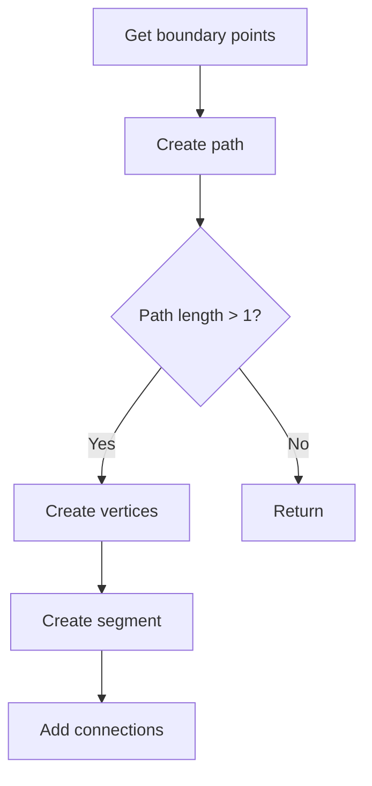

## init_first_segment

### Purpose
Initializes the first segment of a cluster by finding optimal endpoints and creating corresponding vertices and segment.

### Algorithm Flow
1. Get boundary points:
   ```cpp
   auto wcps = temp_cluster->get_two_boundary_wcps(2);
   ```

2. Special handling for main cluster:
   - If main cluster, ensures downstream point is first
   - Otherwise, chooses point closest to main cluster

3. Create path:
   - Uses Dijkstra's shortest path between endpoints
   - Creates vertices and segment if path has >1 point

4. Set tracking info:
   - Collects charge trajectory
   - Performs tracking through point cloud
   - Sets fit parameters for vertices and segment

### Return Value
Returns created ProtoSegment or nullptr if creation fails

## init_point_segment 

### Purpose
Simpler version of init_first_segment that creates initial vertices and segment for trajectories.

### Key Differences from init_first_segment
1. Uses simpler boundary point finding (mode=1)
2. No special handling of main cluster
3. No charge collection or tracking
4. Only basic connectivity established

### Algorithm Steps
1. Get boundary points
2. Create path between them
3. Create vertices at endpoints
4. Create segment along path
5. Establish vertex-segment connections

The main flow can be visualized as:



## Key Differences Between Initialization Functions

| Feature | init_first_segment | init_point_segment |
|---------|-------------------|-------------------|
| Boundary Mode | 2 | 1 |
| Main Cluster Handling | Yes | No |
| Charge Collection | Yes | No |
| Tracking | Yes | No |
| Fit Parameters | Yes | No |
| Complexity | High | Low |