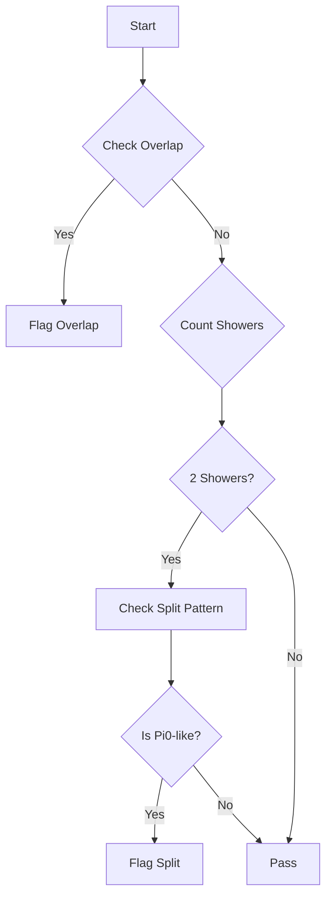
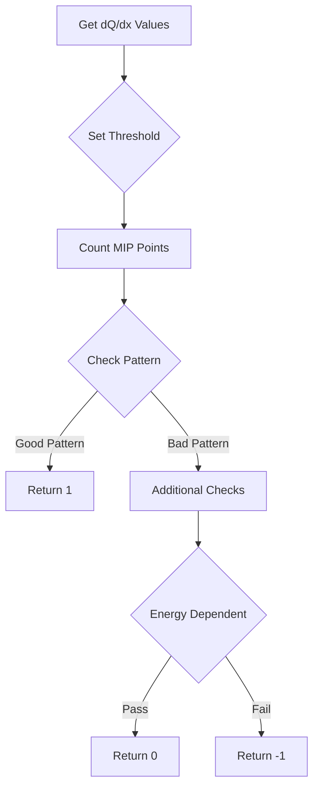

# Understanding MIP Quality and Identification Functions

This document explains the logic behind the MIP (Minimum Ionizing Particle) quality and identification functions used in neutrino event reconstruction.

## MIP Quality Function

The `mip_quality` function assesses the quality of MIP candidate showers by examining various geometric and topological features.

### Function Signature
```cpp
bool mip_quality(WCPPID::ProtoVertex* vertex, WCPPID::ProtoSegment *sg, 
                WCPPID::WCShower *shower, bool flag_print = false, bool flag_fill = false)
```

### Key Parameters

- vertex: Starting vertex of the shower
- sg: Starting segment of the shower
- shower: The shower object being evaluated
- flag_print: Debug printing flag
- flag_fill: Flag to fill tagger information

### Main Logic Flow

1. **Overlapping Check**
   - Examines first few points of shower start to check for overlapping segments
   - Checks segments within 0.3cm in all three 2D projections (U,V,W)
   ```cpp
   if (min_u < 0.3*units::cm && min_v < 0.3*units::cm && min_w < 0.3*units::cm)
   ```

2. **Shower Counting**
   - Counts number of electromagnetic showers
   - Counts number of protons and tracks
   - Identifies connected showers and pi0 candidates

3. **Split Shower Analysis**
   - If exactly 2 showers with no tracks:
   - Measures angle between showers
   - Checks shower lengths
   - Special handling for pi0 candidates

### Key Rejection Criteria

1. Low energy overlapping segments (E < 800 MeV)
2. Split showers with specific angular patterns
3. Pi0-like topologies



## MIP Identification Function

The `mip_identification` function determines if a shower candidate matches MIP behavior through detailed dQ/dx analysis.

### Function Signature
```cpp
int mip_identification(WCPPID::ProtoVertex* vertex, WCPPID::ProtoSegment *sg, 
                      WCPPID::WCShower *shower, bool flag_single_shower, 
                      bool flag_strong_check, bool flag_print, bool flag_fill)
```

### Return Values
- 1: Good MIP candidate
- -1: Bad MIP candidate
- 0: Uncertain

### Key Analysis Steps

1. **dQ/dx Threshold Setting**
   ```cpp
   double dQ_dx_cut = 1.45;  // Base threshold
   if (Eshower > 1200*units::MeV) dQ_dx_cut = 1.85;
   else if (Eshower > 1000*units::MeV) dQ_dx_cut = 1.6;
   else if (Eshower < 550*units::MeV) dQ_dx_cut = 1.3;
   ```

2. **Initial Point Analysis**
   - Get stem dQ/dx values
   - Count points above/below threshold
   - Find first MIP-like point sequence

3. **Pattern Recognition**
   - Analyze reduction patterns
   - Check for continuous MIP sections
   - Identify transitions between MIP and non-MIP regions

### Decision Flow



### Key Variables

1. **n_first_mip**: Number of initial MIP-like points
2. **n_first_non_mip**: Position of first non-MIP point
3. **lowest_dQ_dx**: Minimum dQ/dx value
4. **highest_dQ_dx**: Maximum dQ_dx value

### Energy-Dependent Criteria

```cpp
if (mip_id == 1 && map_vertex_segments[vertex].size() ==1 && Eshower < 500*units::MeV) {
    if (Eshower < 180*units::MeV || n_first_mip>0 || 
        vec_dQ_dx.front() > 1.15 && n_end_reduction >= n_first_mip && 
        Eshower < 360*units::MeV)
        mip_id = 0;
}
```

### Additional Quality Checks

1. **Track Counting**
   - Count good tracks connected to vertex
   - Adjust criteria based on track multiplicity

2. **Directional Analysis**
   - Check shower direction relative to beam
   - Analyze drift direction alignment

3. **Energy-Based Validation**
   - Different criteria for different energy ranges
   - Special handling for high-energy cases

## Usage Examples

```cpp
// Basic usage example
bool quality_check = mip_quality(vertex, segment, shower);

// MIP identification with strong checks
int mip_result = mip_identification(vertex, segment, shower, 
                                  true, // single shower
                                  true, // strong check
                                  false, // no printing
                                  true); // fill info
```

## Key Considerations

1. **Energy Dependence**
   - Different thresholds and criteria for different energy ranges
   - More stringent checks for low energy showers

2. **Topology Importance**
   - Single shower vs multiple shower scenarios
   - Track multiplicity effects

3. **Pattern Recognition**
   - MIP-like section identification
   - Transition region analysis

4. **Quality Metrics**
   - Overlap checking
   - Split shower identification
   - Pi0 contamination checks