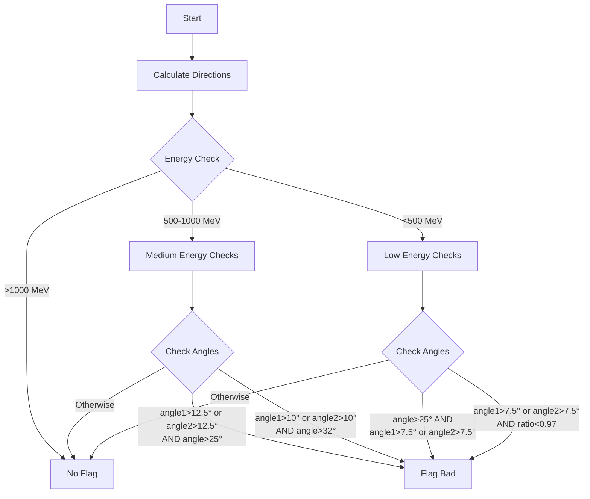
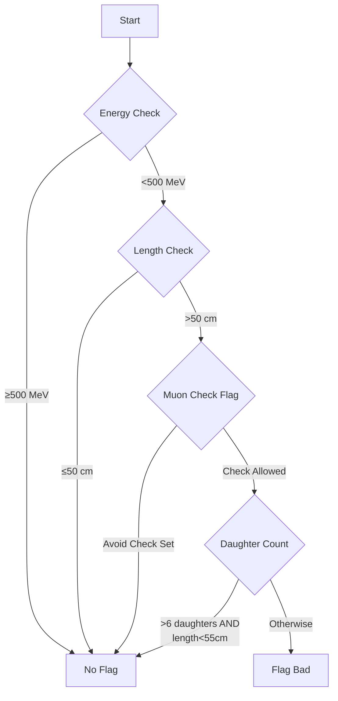
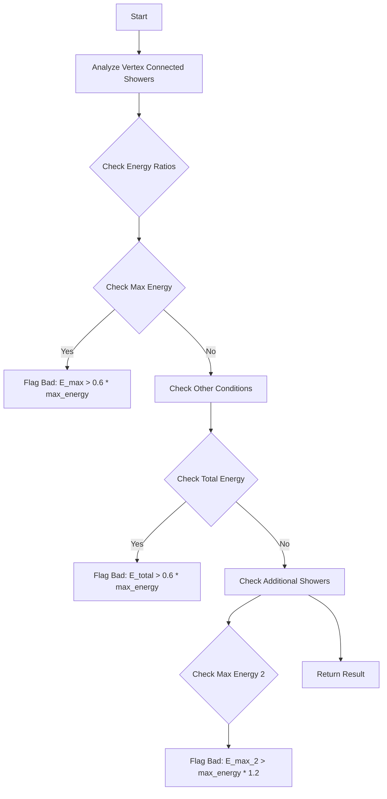
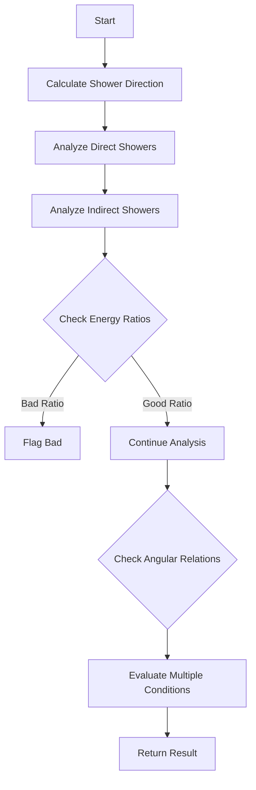
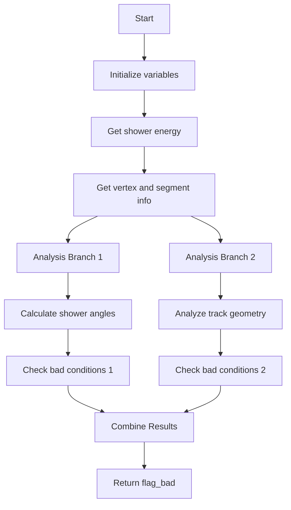
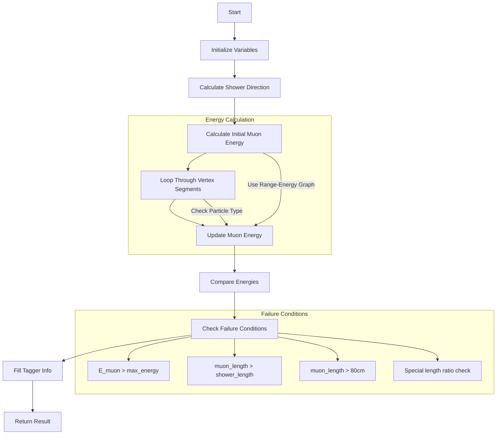

# Shower Analysis Algorithm Documentation

## Overview
This document details two key functions used in particle identification within neutrino detectors: `stem_direction` and `stem_length`. These functions are crucial for distinguishing electron showers from other particles, particularly muons.

## 1. Stem Direction Analysis

### Purpose
The `stem_direction` function analyzes the directional characteristics of a particle shower to identify potential misclassifications. It's particularly focused on identifying showers that may have muon-like characteristics.

### Algorithm Details

#### Input Parameters
- `max_shower`: The shower being analyzed
- `max_energy`: The energy of the shower
- `flag_print`: Debug flag for printing
- `flag_fill`: Flag to determine if results should be stored

#### Key Direction Calculations
1. **Initial Directions**
   - Drift direction (1,0,0)
   - Main PCA axis from shower points
   - Initial segment direction (from first 5-15cm)
   - Overall shower direction (from first 30-100cm)

2. **Critical Angles**
   - `angle`: Angle between PCA axis and segment direction
   - `angle1`: Angle between drift direction and extended shower direction
   - `angle2`: Deviation from perpendicular to drift direction
   - `angle3`: Angle between initial direction and overall shower direction
   - `ratio`: Direct length / total length in initial segment

### Decision Flow



### Energy-Based Criteria

1. **High Energy (>1000 MeV)**
   - Generally accepted as electron shower
   - No directional cuts applied

2. **Medium Energy (500-1000 MeV)**
   - Flagged if:
     - `angle > 25°` AND (`angle1 > 12.5°` OR `angle2 > 12.5°`)
     - OR `angle > 32°` AND (`angle1 > 10°` OR `angle2 > 10°`)
   - Additional check: `angle3 > 3°` required for final flag

3. **Low Energy (<500 MeV)**
   - Stricter criteria applied
   - Flagged if:
     - `angle > 25°` AND (`angle1 > 7.5°` OR `angle2 > 7.5°`)
     - OR (`angle1 > 7.5°` OR `angle2 > 7.5°`) AND `ratio < 0.97`

## 2. Stem Length Analysis

### Purpose
The `stem_length` function examines the initial segment of a shower to identify potential muon tracks misidentified as electron showers.

### Algorithm Details

#### Input Parameters
- `max_shower`: The shower being analyzed
- `max_energy`: The energy of the shower
- `flag_print`: Debug flag
- `flag_fill`: Storage flag

### Decision Flow



### Key Criteria

1. **Energy Threshold**
   - Only applies to showers < 500 MeV
   - Higher energy showers are assumed to be properly identified

2. **Length Criteria**
   - Primary trigger: stem length > 50 cm
   - Exception case: length < 55 cm with > 6 daughter tracks

3. **Additional Checks**
   - Considers `flag_avoid_muon_check` status
   - Evaluates number of daughter tracks
   - Looks at daughter track lengths

### Implementation Details

```python
def is_problematic_stem(shower, energy, daughter_info):
    segment = shower.get_start_segment()
    
    # Basic checks
    if energy >= 500 * units::MeV:
        return False
        
    if segment.length <= 50 * units::cm:
        return False
        
    if segment.get_flag_avoid_muon_check():
        return False
    
    # Exception case
    if (daughter_info.num_daughters > 6 and 
        segment.length < 55 * units::cm):
        return False
        
    return True
```

## Usage Notes

1. Both functions are part of a larger particle identification system
2. They work together to identify potential misclassifications
3. Results are typically used as input to machine learning classifiers
4. Function outputs can be stored in tagger_info structure for later use

## Common Failure Modes

1. **Stem Direction**
   - High angle dispersion in initial segments
   - Irregular shower development patterns
   - Multiple strong directional changes

2. **Stem Length**
   - Long, track-like initial segments
   - Low energy deposits with muon-like characteristics
   - Insufficient daughter particle activity


# Analysis of Shower Classification Functions

## 1. multiple_showers Function
This function analyzes multiple shower events to identify potential bad shower reconstructions.

### Purpose
- Evaluates relationships between multiple showers connected to main vertex
- Compares energies between showers to identify misclassifications
- Flags potentially bad shower reconstructions

### Key Parameters
```cpp
bool multiple_showers(WCPPID::WCShower *max_shower, double max_energy, bool flag_print, bool flag_fill)
```
- `max_shower`: Primary shower being evaluated
- `max_energy`: Maximum energy of the shower
- `flag_print`: Debug printing flag
- `flag_fill`: Flag to fill tagger information

### Logic Flow



### Key Conditions

1. Primary Energy Comparison:
```cpp
if ((E_max_energy > 0.6 * max_energy || 
     E_max_energy > 0.45 * max_energy && 
     max_energy - E_max_energy < 150*units::MeV))
```

2. Total Energy and Count Check:
```cpp
if ((E_total > 0.6*max_energy || 
     max_energy < 400*units::MeV && 
     nshowers >=2 && 
     E_total > 0.3 * max_energy))
```

3. Other Energy Comparisons:
```cpp
if (E_max_energy_2 > max_energy *1.2 && max_energy < 250*units::MeV)
```

## 2. other_showers Function
This function analyzes relationships between the main shower and other showers in the event.

### Purpose
- Evaluates shower energies and geometric relationships
- Identifies potential shower misclassifications
- Flags problematic shower configurations

### Key Parameters
```cpp
bool other_showers(WCPPID::WCShower *shower, bool flag_single_shower, bool flag_print, bool flag_fill)
```

### Logic Flow



### Key Analysis Components

1. Direct Shower Analysis:
```cpp
if (pair_result.second == 1) {
    E_direct_total_energy += E_shower1;
    if (E_shower1 > E_direct_max_energy) {
        E_direct_max_energy = E_shower1;
    }
}
```

2. Indirect Shower Analysis:
```cpp
if (pair_result.second == 2) {
    double dis = sqrt(pow(vertex_point.x - shower1->get_start_point().x,2) + 
                     pow(vertex_point.y - shower1->get_start_point().y,2) + 
                     pow(vertex_point.z - shower1->get_start_point().z,2));
    // Apply distance-based scaling factors
}
```

3. Key Decision Logic:
```cpp
if (E_indirect_max_energy > Eshower + 350*units::MeV || 
    E_direct_max_energy > Eshower) {
    flag_bad = true;
}

if (Eshower < 1000*units::MeV && 
    n_direct_showers >0 && 
    E_direct_max_energy > 0.33 * Eshower) {
    flag_bad = true;
}
```

## Relationship Between Functions

The two functions work together to provide comprehensive shower analysis:

1. `multiple_showers`: Focuses on energy relationships and multiplicities
2. `other_showers`: Analyzes geometric relationships and shower patterns

They complement each other by:
- Providing different perspectives on shower relationships
- Using different criteria for bad shower identification
- Contributing to overall shower classification accuracy

## Common Features

Both functions share:
1. Energy ratio comparisons
2. Geometric relationship analysis
3. Multiple-threshold decision making
4. Support for debug printing
5. Tagger information filling

## Usage Notes

1. Both functions should be used together for comprehensive analysis
2. Energy thresholds are carefully tuned based on detector parameters
3. Geometric relationships consider detector-specific characteristics
4. Debug flags provide valuable insight into decision-making process

# Vertex Inside Shower Analysis Function

## Purpose
The `vertex_inside_shower` function determines if a vertex is incorrectly placed inside a shower by analyzing shower and track geometry. It returns `true` if the vertex is likely misplaced (bad).

## Function Parameters
- `shower`: Pointer to WCShower object being analyzed
- `flag_print`: Boolean for debug printing
- `flag_fill`: Boolean to control filling of tagger information

## Core Logic Flow



## Key Components

### 1. Initial Setup
```cpp
bool flag_bad = flag_bad1 || flag_bad2;
TVector3 drift_dir(1,0,0);
TVector3 beam_dir(0,0,1);
```

### 2. Energy Calculation
- Uses best kinematic energy if available
- Falls back to charge-based energy if needed

### 3. First Analysis Branch (flag_bad1)
Checks for:
- Vertex segment count (≥3)
- Shower energy < 500 MeV
- Maximum angles between segments
- Track lengths and quality

Key conditions for flag_bad1:
- Case 1: ≥3 segments, E<500 MeV, no good tracks, angle>150°
- Case 2: 2 segments, E<500 MeV, angle>150°, muon-like track

### 4. Second Analysis Branch (flag_bad2)
Analyzes:
- Track angles relative to shower direction
- Track angles relative to drift direction
- Track quality metrics (dQ/dx)
- Track lengths

Key conditions for flag_bad2:
1. Two-segment case:
   - Small angles (<25° with weak track or <20°)
   - Beam direction angle >50°
2. Three-segment case:
   - Multiple angle and track quality checks
   - Special cases for weak tracks

## Important Metrics
- `min_angle`: Minimum angle between tracks
- `max_angle`: Maximum angle between tracks
- `medium_dQ_dx`: Track charge deposition
- Track lengths and directionality
- Angles relative to drift and beam directions

## Output
- Returns `flag_bad` (true if vertex is likely misplaced)
- Fills tagger information if flag_fill is true
- Includes debugging output if flag_print is true


# Muon-Shower Energy Comparison Function Analysis

## Purpose
The `compare_muon_energy` function compares muon track energy with shower energy to help identify potential misclassifications between muons and electromagnetic showers in neutrino interactions.

## Function Parameters
- `max_shower`: Pointer to the main shower being analyzed
- `max_energy`: Maximum energy of the shower
- `muon_length`: Length of the muon track
- `flag_print`: Boolean for debug printing
- `flag_fill`: Boolean to control tagger information filling

## Logic Flow Diagram



## Key Components

### 1. Direction Calculations
```cpp
TVector3 dir_drift(1,0,0);
TVector3 dir_beam(0,0,1);
```

### 2. Shower Direction Calculation Logic
```cpp
TVector3 dir_shower;
if (max_shower->get_start_segment()->get_length() > 12*units::cm) {
    dir_shower = max_shower->get_start_segment()->cal_dir_3vector(vertex_point, 15*units::cm);
} else {
    dir_shower = max_shower->cal_dir_3vector(vertex_point, 15*units::cm);
}
// Adjust direction for specific cases
if (fabs(dir_shower.Angle(dir_drift)/3.1415926*180.-90)<10 || max_energy > 800*units::MeV) {
    dir_shower = max_shower->cal_dir_3vector(vertex_point, 25*units::cm);
}
```

### 3. Muon Energy Calculation
- Uses range-to-kinetic energy conversion
- Iterates through vertex segments to find maximum muon energy
- Applies dQ/dx cuts for track quality

### 4. Failure Conditions
The function returns `true` (flag_bad) if any of these conditions are met:
```cpp
flag_bad = true if:
1. E_muon > max_energy && max_energy < 550 MeV
2. muon_length > shower_total_length
3. muon_length > 80 cm
4. muon_length > 0.6 * shower_total_length && max_energy < 500 MeV
```

## Important Metrics

| Metric | Description |
|--------|-------------|
| E_muon | Calculated muon energy from range |
| max_energy | Maximum shower energy |
| muon_length | Length of muon track |
| shower_total_length | Total length of shower |
| dQ_dx_cut | Quality cut for track selection |

## Code Implementation Details

### Key Energy Calculation
```cpp
double E_muon = g_range->Eval(muon_length/units::cm) * units::MeV;

// Update E_muon based on segment analysis
for (auto it1 = map_vertex_segments[main_vertex].begin(); 
     it1 != map_vertex_segments[main_vertex].end(); it1++) {
    WCPPID::ProtoSegment *sg1 = *it1;
    if (sg1->get_particle_type()==13 || sg1->get_particle_type()==2212) {
        double length = sg1->get_length();
        double medium_dQ_dx = sg1->get_medium_dQ_dx();
        double dQ_dx_cut = 0.8866+0.9533 *pow(18*units::cm/length, 0.4234);
        
        if (medium_dQ_dx < dQ_dx_cut * 43e3/units::cm) {
            double tmp_energy = g_range->Eval(sg1->get_length()/units::cm) * units::MeV;
            if (tmp_energy > E_muon) E_muon = tmp_energy;
        }
    }
}
```

## Output
- Returns `flag_bad` indicating if energy comparison suggests misclassification
- Fills tagger information if flag_fill is true:
  - Muon energy
  - Shower energy
  - Track/shower lengths
  - Beam angle
  - Classification result

