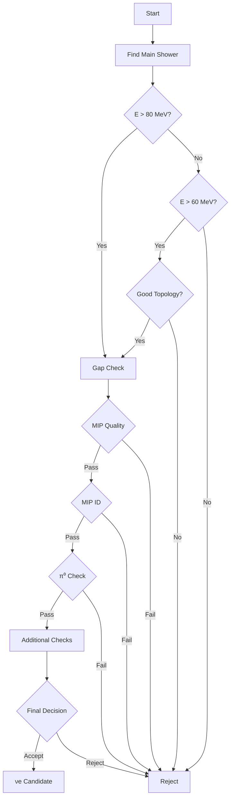

# NeutrinoID nue_tagger() Function Documentation

## Overview
The `nue_tagger()` function is designed to identify electron neutrino (νe) interactions in a detector. This document provides comprehensive documentation of the main function and all its dependencies.

## Main Logic Flow

1. First, it examines the main vertex and searches for good showers:
   - Looks for showers with energy > 80 MeV or showers with energy > 60 MeV that have specific topological characteristics
   - Identifies the highest energy shower as the main shower candidate

2. If a good shower candidate is found, it performs several checks:
   - Gap identification
   - MIP quality checks
   - MIP identification
   - π⁰ identification
   - Multiple shower analysis
   - Distance to wall checks
   - Track reconstruction quality

## Core Function Calls

### 1. gap_identification()  [more details](./gap_identification.md)
```cpp
std::pair<bool, int> gap_identification(
    WCPPID::ProtoVertex* vertex,
    WCPPID::ProtoSegment* sg,
    bool flag_single_shower,
    int valid_tracks,
    double E_shower,
    bool flag_fill
)
```

#### Purpose
- Identifies discontinuities in energy deposition
- Helps distinguish between continuous shower development and track-like segments

#### Key Logic
```cpp
if (E_shower > 900*units::MeV) { 
    if ((!flag_single_shower) && (!flag_parallel)){
        if (E_shower > 1200*units::MeV){
            if (n_bad > 2./3 * n_points) flag_gap = true;
        }else{
            if (n_bad > 1./3. *n_points) flag_gap = true;
        }
    }
}
```

#### Returns
- bool: true if gap found
- int: number of bad points

### 2. mip_quality()  [more details](./mip_quality_identification.md)
```cpp
bool mip_quality(
    WCPPID::ProtoVertex* vertex,
    WCPPID::ProtoSegment* sg,
    WCPPID::WCShower* shower,
    bool flag_print,
    bool flag_fill
)
```

#### Purpose
- Evaluates shower consistency with MIP hypothesis
- Checks shower development characteristics

#### Key Checks
1. **Overlap Analysis**
   ```cpp
   if (min_u < 0.3*units::cm && 
       min_v < 0.3*units::cm && 
       min_w < 0.3*units::cm) {
       flag_overlap = true;
   }
   ```

2. **Track/Shower Counting**
   ```cpp
   int n_showers = 0;
   int n_tracks = 0;
   for (auto it1 = it->second.begin(); it1 != it->second.end(); it1++){
       if ((*it1)->get_particle_type()==11) n_showers++;
       else n_tracks++;
   }
   ```

### 3. mip_identification() [more details](./mip_quality_identification.md)
```cpp
int mip_identification(
    WCPPID::ProtoVertex* vertex,
    WCPPID::ProtoSegment* sg,
    WCPPID::WCShower* shower,
    bool flag_single_shower,
    bool flag_strong_check,
    bool flag_print,
    bool flag_fill
)
```

#### Purpose
- Detailed MIP vs shower discrimination
- Energy deposition pattern analysis

#### Key Components
1. **dQ/dx Analysis**
   ```cpp
   std::vector<double> vec_dQ_dx = shower->get_stem_dQ_dx(vertex, sg, 20);
   double dQ_dx_cut = 1.45;
   if (Eshower > 1200*units::MeV) dQ_dx_cut = 1.85;
   else if (Eshower > 1000*units::MeV) dQ_dx_cut = 1.6;
   ```

2. **Pattern Recognition**
   ```cpp
   int n_first_mip = 0;
   for (size_t i=0; i!= vec_dQ_dx.size();i++){
       n_first_mip = i;
       if (vec_threshold.at(i) ==0 ) break;
   }
   ```

### 4. pi0_identification() [more details](./pio_identification.md)
```cpp
bool pi0_identification(
    WCPPID::ProtoVertex* vertex,
    WCPPID::ProtoSegment* sg,
    WCPPID::WCShower* shower,
    double threshold,
    bool flag_fill
)
```

#### Purpose
- Identifies π⁰ decay signatures
- Mass reconstruction and topology analysis

#### Key Checks
1. **Mass Check**
   ```cpp
   if (fabs(mass_pair.first - 135*units::MeV) < 35*units::MeV && 
       mass_pair.second == 1 || 
       fabs(mass_pair.first - 135*units::MeV) < 60*units::MeV && 
       mass_pair.second == 2)
   ```

2. **Energy Balance**
   ```cpp
   if (std::min(Eshower_1, Eshower_2) > 15*units::MeV && 
       fabs(Eshower_1 - Eshower_2)/(Eshower_1 + Eshower_2) < 0.87)
   ```

### 5. single_shower_pio_tagger()  [more details](./pio_identification.md)
```cpp
bool single_shower_pio_tagger(
    WCPPID::WCShower* shower,
    bool flag_single_shower,
    bool flag_print,
    bool flag_fill
)
```

#### Purpose
- Specialized π⁰ identification for single shower topology
- Handles cases where one photon may be missed

#### Key Features
1. **Direction Analysis**
   ```cpp
   TVector3 dir_shower;
   if (shower->get_start_segment()->get_length() > 12*units::cm){
       dir_shower = shower->get_start_segment()->cal_dir_3vector(vertex_point,15*units::cm);
   }else{
       dir_shower = shower->cal_dir_3vector(vertex_point,15*units::cm);
   }
   ```

2. **Energy Thresholds**
   ```cpp
   if (Eshower < 300*units::MeV || 
       Eshower < 500*units::MeV && shower_angle > 120 || 
       Eshower >= 500*units::MeV && shower_angle > 150)
   ```

### 6. shower_to_wall() [more details](./single_shower.md)
```cpp
bool shower_to_wall(
    WCPPID::WCShower* shower,
    double shower_energy,
    bool flag_single_shower,
    bool flag_print,
    bool flag_fill
)
```

#### Purpose
- Evaluates shower proximity to detector boundaries
- Ensures shower containment

#### Key Logic
1. **Distance Calculation**
   ```cpp
   Point test_p;
   test_p.x = vertex_point.x + step * dir.X();
   test_p.y = vertex_point.y + step * dir.Y();
   test_p.z = vertex_point.z + step * dir.Z();
   while (fid->inside_fiducial_volume(test_p, offset_x))
   ```

2. **Energy-dependent Criteria**
   ```cpp
   if (shower_energy < 300*units::MeV && 
       dis < 15*units::cm && 
       max_dQ_dx < 2.6 && 
       flag_single_shower) 
   ```

### 7. low_energy_michel() [more details](./broken_muon_id.md)
```cpp
bool low_energy_michel(
    WCPPID::WCShower* shower,
    bool flag_print,
    bool flag_fill
)
```

#### Purpose
- Identifies Michel electron signatures
- Helps remove cosmic muon decay backgrounds

#### Key Checks
```cpp
if (shower->get_total_length() < 25*units::cm && 
    shower->get_total_length(shower->get_start_segment()->get_cluster_id()) > 
    0.75 * shower->get_total_length() && n_3seg == 0)
```

### 8. broken_muon_id() [more details](./broken_muon_id.md)
```cpp
bool broken_muon_id(
    WCPPID::WCShower* shower,
    bool flag_print,
    bool flag_fill
)
```

## single_shower
[single_shower](./single_shower.md)

## angular_cut
[angular_cut](./single_shower.md)

## Stem_direction
[Stem_direction](./nue_functions.md#Stem_direction)

## Multiple_showers
[Multiple_showers](./nue_functions.md#Multiple_showers)

## Other_showers
[Other_showers](./nue_functions.md#Other_showers)

## Stem_length
[Stem_length](./nue_functions.md#Stem_length)

## Vertex_inside_shower
[Vertex_inside_shower](./nue_functions.md#Vertex_inside_shower)

## Compare_muon_energy
[Compare_muon_energy](./nue_functions.md#Compare_muon_energy)

## bad_reconstruction
[bad_reconstruction](./bad_reconstruction.md)

## High_energy_overlapping
[High_energy_overlapping](./overlapping_overclustering.md)

## Low_energy_overlapping
[Low_energy_overlapping](./overlapping_overclustering.md)

## Track_overclustering
[Track_overclustering](./overlapping_overclustering.md)


#### Purpose
- Identifies broken/misreconstructed muon tracks
- Helps remove cosmic muon backgrounds

#### Key Features
1. **Track Finding**
   ```cpp
   for (auto it = muon_segments.begin(); it!= muon_segments.end(); it++){
       stem_length += (*it)->get_length();
   }
   ```

2. **Energy Checks**
   ```cpp
   if (muon_segments.size()>1 && 
       (Ep > Eshower * 0.55 || 
        acc_length > 0.65 * shower->get_total_length()))
   ```

## Performance Considerations

### Memory Usage
- Heavy use of geometric calculations
- Multiple data structures for topology

### Speed Optimization
- Early rejection of clear backgrounds
- Efficient track/shower reconstruction

### Threshold Tuning
- Energy-dependent criteria
- Detector-specific parameters

## Usage Example

```cpp
WCPPID::NeutrinoID neutrino_id(...);
bool is_nue = neutrino_id.nue_tagger(muon_length);

// Example of accessing results
if (is_nue) {
    auto vertex = neutrino_id.get_main_vertex();
    auto shower = find_main_shower(vertex);
    double shower_energy = shower->get_kine_best();
    // Further analysis...
}
```

## Flow Diagram



## Conclusion

The nue_tagger() function implements a sophisticated series of checks to identify electron neutrino interactions while rejecting various backgrounds. Its effectiveness relies on the careful tuning of multiple parameters and thresholds, as well as the proper functioning of numerous helper functions that perform specific aspects of the analysis.