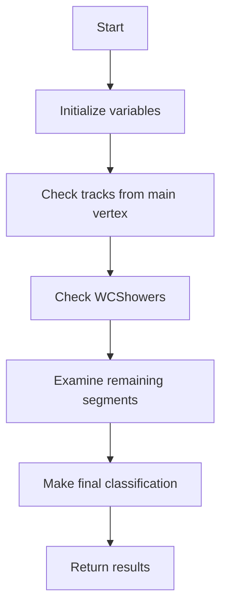

# NeutrinoID NuMu Tagger Documentation

## Overview
The NuMu tagger is responsible for identifying muon neutrino charged current (νμCC) interactions in the detector. The core logic is implemented across several functions in NeutrinoID_numu_tagger.h.

## Main Function: numu_tagger()

### Purpose
Identifies muon neutrino charged current interactions by finding a primary muon track and analyzing event topology.

### Algorithm Flow



### Detailed Steps

1. **Initialization**
   - Set initial flags: `flag_long_muon = false`
   - Define geometric directions (beam, drift, vertical)
   - Set distance cut: 5cm for minimum useful muon length
   - Initialize max_muon_length = 0

2. **First Round Check (Connected to Main Vertex)**
   ```cpp
   for (auto it = map_vertex_segments[main_vertex].begin(); 
        it != map_vertex_segments[main_vertex].end(); it++) {
       WCPPID::ProtoSegment *sg = *it;
       // Check segment properties
       double length = sg->get_length();
       double direct_length = sg->get_direct_length();
       double medium_dQ_dx = sg->get_medium_dQ_dx();
       
       // Calculate dQ/dx cut threshold
       double dQ_dx_cut = 0.8866 + 0.9533 * pow(18*units::cm/length, 0.4234);
       
       // Count daughters
       auto pair_result = count_daughters(sg);
       int n_daughter_tracks = pair_result.first;
       int n_daughter_all = pair_result.second;
       
       // Apply muon criteria
       if ((abs(sg->get_particle_type())==13 && 
            length > dis_cut && 
            medium_dQ_dx < dQ_dx_cut * 43e3/units::cm && 
            (length > 40*units::cm || 
             length <= 40*units::cm && direct_length > 0.925 * length)) && 
           (!(n_daughter_tracks >1 || n_daughter_all - n_daughter_tracks > 2))) {
           flag_numu_cc_1 = true;
       }
   }
   ```

3. **WCShower Check**
   - Loop through all showers
   - Look for long muon-like tracks within showers
   - Check properties:
     - Particle type == 13 (muon)
     - Length > 18cm
     - Limited number of daughter particles
   - Update max_muon_length if longer track found

4. **Additional Segment Examination**
   - Check remaining segments not connected to main vertex
   - Apply similar criteria but with some adjustments
   - Handle special cases (e.g., pions vs muons)
   - Consider track topology and connectivity

5. **Final Classification**
   ```cpp
   flag_numu_cc = flag_numu_cc_1_save || flag_numu_cc_2_save || flag_numu_cc_3;
   
   if ((max_muon_length > 100*units::cm || 
        max_length_all > 120*units::cm) && 
       flag_numu_cc) {
       flag_long_muon = true;
   }
   
   if (flag_numu_cc) {
       neutrino_type |= 1UL << 2; // numu
   } else {
       neutrino_type |= 1UL << 3; // nc
   }
   ```

## Supporting Functions

### count_daughters()
Two implementations for different input types:

1. **ProtoSegment Version**
   ```cpp
   std::pair<int, int> count_daughters(ProtoSegment* max_muon) {
       int n_daughter_tracks = 0;
       int n_daughter_all = 0;
       
       if (max_muon != 0) {
           auto pair_vertices = find_vertices(max_muon);
           // Find vertex further from main vertex
           // Count tracks and showers from that vertex
           // Subtract self from counts
       }
       
       return std::make_pair(n_daughter_tracks, n_daughter_all);
   }
   ```

2. **WCShower Version**
   - Similar logic but handles shower objects
   - Uses shower-specific vertex finding
   - Considers shower topology

### Key Selection Criteria

1. **Track Properties**
   - Minimum length requirements
   - dQ/dx below muon threshold
   - Direct length ratio for straightness
   - Particle type consistency

2. **Topology Requirements**
   - Limited number of daughter tracks
   - Limited number of daughter showers
   - Connection to primary vertex
   - Track direction relative to beam

3. **Background Rejection**
   - Cosmic ray rejection using multiple BDT scores
   - Special handling of pion vs muon tracks
   - Consideration of event containment

## BDT Scoring System

The tagger uses multiple BDT scores for classification:

1. **numu_1_score**
   - Individual track properties
   - Particle type
   - Track length
   - dQ/dx measurements

2. **numu_2_score**
   - Shower properties
   - Total length
   - Number of daughter particles

3. **numu_3_score**
   - Overall event topology
   - Maximum track lengths
   - Accumulated track length
   - Daughter particle counts

4. **Cosmic Scores**
   - Multiple specialized cosmic ray taggers
   - Different topology checks
   - Direction and angle measurements

## Output

The tagger returns two key pieces of information:
1. Whether a long muon was found (bool)
2. The length of the longest muon track (double)

Additionally, it sets internal flags for:
- Neutrino type classification
- Various BDT scores
- Detailed track/shower properties