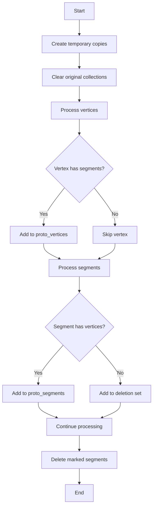

# organize_vertices_segments Function Analysis

## Purpose
The `organize_vertices_segments` function is responsible for organizing and cleaning up the collections of vertices and segments in a neutrino interaction reconstruction. It ensures that only valid vertices and segments that have proper connections are kept in the final collections.

## Main Components

### Input Data Structures
- `proto_vertices`: Vector of ProtoVertex pointers containing all vertices
- `proto_segments`: Vector of ProtoSegment pointers containing all segments 
- `map_vertex_segments`: Map linking vertices to their connected segments
- `map_segment_vertices`: Map linking segments to their connected vertices

### Key Steps

1. **Initialization**
```cpp
WCPPID::ProtoVertexSelection temp_vertices = proto_vertices;
WCPPID::ProtoSegmentSelection temp_segments = proto_segments;
proto_vertices.clear();
proto_segments.clear();
```
- Creates temporary copies of vertex and segment collections
- Clears the original collections for rebuilding

2. **Sets for Tracking**
```cpp
WCPPID::ProtoVertexSet temp_vset;
WCPPID::ProtoSegmentSet temp_sset;
WCPPID::ProtoSegmentSet temp_delset;
```
- `temp_vset`: Tracks processed vertices
- `temp_sset`: Tracks processed segments
- `temp_delset`: Tracks segments to be deleted

3. **Vertex Processing**
```cpp
for (auto it = temp_vertices.begin(); it!=temp_vertices.end(); it++) {
    if (map_vertex_segments.find(*it)!=map_vertex_segments.end() &&
        temp_vset.find(*it)==temp_vset.end()) {
        proto_vertices.push_back(*it);
        temp_vset.insert(*it);
    }
}
```
- Only keeps vertices that:
  - Have connected segments (exist in map_vertex_segments)
  - Haven't been processed before (not in temp_vset)

4. **Segment Processing**
```cpp
for (auto it = temp_segments.begin(); it!=temp_segments.end(); it++) {
    if (map_segment_vertices.find(*it)!=map_segment_vertices.end()) {
        if (temp_sset.find(*it)==temp_sset.end()) {
            proto_segments.push_back(*it);
            temp_sset.insert(*it);
        }
    } else {
        temp_delset.insert(*it);
    }
}
```
- Processes segments and either:
  - Keeps segments with valid vertex connections
  - Marks disconnected segments for deletion

5. **Cleanup**
```cpp
for (auto it = temp_delset.begin(); it!=temp_delset.end();it++){
    delete *it;
}
```
- Deletes all segments marked for removal

## Logical Flow Diagram


## Key Features

1. **Data Validation**
- Ensures vertices have valid segment connections
- Ensures segments have valid vertex connections
- Removes orphaned elements

2. **Memory Management**
- Properly deletes unused segments
- Prevents memory leaks

3. **Collection Organization**
- Rebuilds collections with only valid elements
- Maintains proper vertex-segment relationships

## Called Functions/Methods

The function itself is relatively self-contained and primarily uses standard container operations:

1. Standard Container Methods:
- `clear()`
- `push_back()`
- `find()`
- `begin()`
- `end()` 

2. Memory Operations:
- `delete` operator

## Usage Example

```cpp
WCPPID::NeutrinoID neutrino_id;

// Before organization:
// proto_vertices might contain disconnected vertices
// proto_segments might contain orphaned segments

neutrino_id.organize_vertices_segments();

// After organization:
// - proto_vertices contains only vertices with valid segment connections
// - proto_segments contains only segments with valid vertex connections
// - Orphaned segments have been deleted
```

## Important Considerations

1. **Memory Management**
- Function takes ownership of memory management for segments
- Only deletes segments without vertex connections
- Vertices are not deleted by this function

2. **Data Integrity**
- Ensures consistency between vertex and segment collections
- Maintains bidirectional relationships between vertices and segments

3. **Performance**
- Uses sets for efficient lookup operations
- Minimizes redundant processing through tracking sets

4. **Safety**
- Preserves valid connections
- Only removes definitively orphaned elements