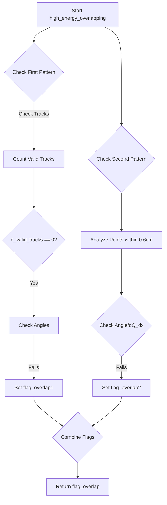
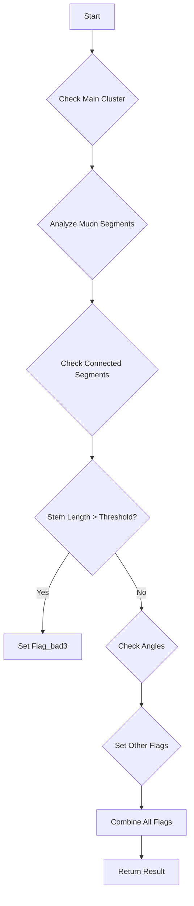

# Analysis of NeutrinoID Functions

## high_energy_overlapping Function

This function detects high-energy shower overlapping patterns that could indicate misidentified particles or incorrect clustering.

### Key Components

1. **Main Flag Structure**
   - Uses two primary flags (flag_overlap1, flag_overlap2)
   - Combines into final flag_overlap = flag_overlap1 || flag_overlap2

2. **First Pattern Check (flag_overlap1)**
   ```cpp
   TVector3 dir1 = sg->cal_dir_3vector(curr_muon_vertex->get_fit_pt(), 15*units::cm);
   int n_valid_tracks = 0;
   double min_angle = 180;
   double min_length = 0;
   ```
   
   - Checks shower direction against vertex
   - Counts valid tracks based on particle type and length
   - Tracks considered valid if:
     * Not weak direction OR
     * Particle type is proton OR
     * Length > 20cm

3. **Second Pattern Check (flag_overlap2)**
   - Analyzes overlap points within the first 0.6cm
   - Counts overlapping points near start of track
   - Flags if:
     * min_angle < 15° and medium_dQ_dx > 0.95 and ncount > 5
     * min_angle < 7.5° and medium_dQ_dx > 0.8 and ncount > 8
     * min_angle < 5° and ncount > 12 and medium_dQ_dx > 0.5

### Flow Diagram



## low_energy_overlapping Function

Identifies low-energy shower patterns that might indicate misidentified particles.

### Key Components

1. **Initial Setup**
   ```cpp
   bool flag_overlap_1 = false;
   bool flag_overlap_2 = false;
   bool flag_overlap_3 = false;
   ```

2. **Vertex Analysis**
   - Analyzes vertex segments
   - Checks shower topology
   - Computes angles between segments

3. **Energy-Based Conditions**
   - Different criteria for different energy ranges:
     * E < 150 MeV
     * 150 MeV < E < 300 MeV
     * E > 300 MeV

### Key Checks

1. **First Pattern**
   - Checks two segments at vertex
   - Angle between segments < 36°
   - Total shower segments = 2
   - Energy < 150 MeV

2. **Second Pattern**
   - Checks track direction pattern
   - Track length constraints
   - Angle between tracks

3. **Third Pattern**
   - Beam angle > 60°
   - No valid tracks
   - Minimum angle < 80°
   - Multiple vertex segments

## track_overclustering Function

Identifies incorrectly clustered tracks that should be separate.

### Main Components

1. **Muon Segment Analysis**
   ```cpp
   std::set<WCPPID::ProtoSegment*> muon_segments;
   ProtoSegment *curr_muon_segment = shower->get_start_segment();
   ```

2. **Direction Analysis**
   - Computes segment directions
   - Analyzes angles between segments
   - Checks for continuity

3. **Length Calculations**
   ```cpp
   double stem_length = 0;
   for (auto it = muon_segments.begin(); it != muon_segments.end(); it++){
       stem_length += (*it)->get_length(); 
   }
   ```

### Pattern Recognition

1. **Flag_bad1**: Segments in main cluster
2. **Flag_bad2**: Connected segments analysis
3. **Flag_bad3**: Total stem length check
4. **Flag_bad4**: Angle and topology check
5. **Flag_bad5**: Multiple segment analysis

### Decision Tree



## Detailed Algorithms

### High Energy Overlapping Algorithm

1. **Initialization Phase**
   ```cpp
   bool flag_overlap = false;
   bool flag_overlap1 = false;  // First pattern check
   bool flag_overlap2 = false;  // Second pattern check
   ```

2. **Energy Calculation**
   ```cpp
   double Eshower = (shower->get_kine_best() != 0) ? 
                    shower->get_kine_best() : 
                    shower->get_kine_charge();
   ```

3. **First Pattern Detection Algorithm**
   ```pseudocode
   FOR each vertex segment:
       IF segment == shower start segment:
           CONTINUE
       
       Calculate direction vector
       IF direction_vector valid:
           angle = calculate_angle(direction_vector, shower_direction)
           IF angle < min_angle:
               min_angle = angle
               min_length = segment.length
       
       IF !segment.is_dir_weak OR segment.particle_type == proton OR 
          segment.length > 20*cm:
           n_valid_tracks++
   ```

4. **Second Pattern Detection Algorithm**
   ```pseudocode
   ncount = 0
   FOR each point in segment:
       min_dis = INFINITY
       FOR each vertex segment:
           IF segment != current_segment:
               dis = calculate_closest_distance(point, segment)
               IF dis < min_dis:
                   min_dis = dis
       
       IF min_dis < 0.6*cm:
           ncount++
       ELSE:
           BREAK
   ```

### Low Energy Overlapping Algorithm

1. **Vertex Analysis Algorithm**
   ```pseudocode
   FOR each vertex in shower:
       n_sum = 0
       n_out = 0
       dir1 = calculate_direction(vertex, 15*cm)
       
       FOR each vertex_segment:
           dir2 = calculate_direction(segment)
           angle = calculate_angle(dir1, dir2)
           n_sum++
           IF angle > 15 degrees:
               n_out++
   ```

2. **Energy-based Pattern Recognition**
   ```cpp
   // Example thresholds for different energy ranges
   if (Eshower < 150*MeV) {
       if (total_main_length/total_length > 0.95 && 
           (n_ele == 0 && n_other > 0 || 
            n_ele == 1 && n_ele < n_other && n_other <= 2)) {
           flag_bad2 = true;
       }
   }
   ```

3. **Track Direction Analysis**
   ```pseudocode
   FOR each segment in vertex:
       IF segment == shower_start_segment:
           CONTINUE
       
       dir2 = calculate_direction(segment, vertex_point, 5*cm)
       angle = calculate_angle(dir1, dir2)
       
       IF segment.length < threshold AND angle < angle_threshold:
           SET_FLAG_BAD(conditions)
   ```

### Track Overclustering Algorithm

1. **Muon Segment Collection**
   ```pseudocode
   muon_segments = empty_set
   current_segment = shower.start_segment
   current_vertex = find_other_vertex(current_segment, vertex)
   
   WHILE continue_flag:
       dir1 = calculate_direction(current_segment, current_vertex)
       
       FOR each connected_segment:
           IF segment not in muon_segments:
               dir2 = calculate_direction(segment, current_vertex)
               angle = calculate_angle(dir1, dir2)
               
               IF angle < 15° AND segment.length > 6cm:
                   add_to_muon_segments(segment)
                   update_current_segment_and_vertex()
   ```

2. **Length Analysis**
   ```cpp
   double stem_length = 0;
   double acc_direct_length = 0;
   for (auto it = muon_segments.begin(); it != muon_segments.end(); it++) {
       stem_length += (*it)->get_length();
       acc_direct_length += (*it)->get_direct_length();
   }
   ```

3. **Pattern Matching Criteria**
   ```cpp
   // Example of complex pattern matching
   if (muon_segments.size() > 1 && 
       (Ep > Eshower * 0.55 || 
        acc_length > 0.65 * shower->get_total_length() || 
        connected_length > 0.95 * shower->get_total_length()) && 
       tmp_ids.size() > 1 && 
       (acc_direct_length > 0.94 * acc_length) && 
       Eshower < 350*units::MeV) {
       // Additional checks for track overclustering
   }
   ```

4. **Angle Analysis Algorithm**
   ```pseudocode
   FOR each segment_pair in muon_segments:
       angle = calculate_angle(segment_pair)
       IF angle > max_angle:
           max_angle = angle
           max_length = calculate_total_length(segment_pair)
       
       IF angle meets_criteria AND length meets_criteria:
           SET_FLAG_BAD(conditions)
   ```

### Key Algorithmic Concepts

1. **Distance Calculations**
   - Euclidean distance between points
   - Projected distances along directions
   - Minimum distances between segments

2. **Angle Calculations**
   ```cpp
   TVector3 dir1 = calculate_direction(point1, point2);
   TVector3 dir2 = calculate_direction(point3, point4);
   double angle = dir1.Angle(dir2) * 180.0/3.14159;
   ```

3. **Energy Thresholds**
   ```cpp
   if (Eshower < 200*units::MeV) {
       threshold = 36*units::cm;
   } else if (Eshower < 400*units::MeV) {
       threshold = 45*units::cm;
   } else {
       threshold = 55*units::cm;
   }
   ```

4. **Track Quality Metrics**
   ```cpp
   double quality_score = segment->get_medium_dQ_dx()/(43e3/units::cm);
   bool is_good_track = (!segment->is_dir_weak() || 
                        segment->get_particle_type() == 2212 || 
                        segment->get_length() > 20*units::cm);
   ```

## Common Elements

All three functions share these characteristics:

1. **Energy-Based Thresholds**
   - Different criteria for different energy ranges
   - Stricter checks for low-energy cases

2. **Angle Analysis**
   - Multiple angle calculations between segments
   - Direction analysis relative to beam/drift

3. **Segment Properties**
   - Length checks
   - dQ/dx analysis
   - Topology consideration

4. **BDT Integration**
   - All functions feed into Boosted Decision Tree
   - Fill tagger_info structure for machine learning

5. **Error Handling**
   - Conservative approach to flagging
   - Multiple validation steps
   - Cross-checks between different metrics