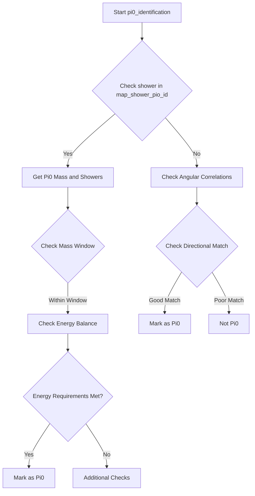
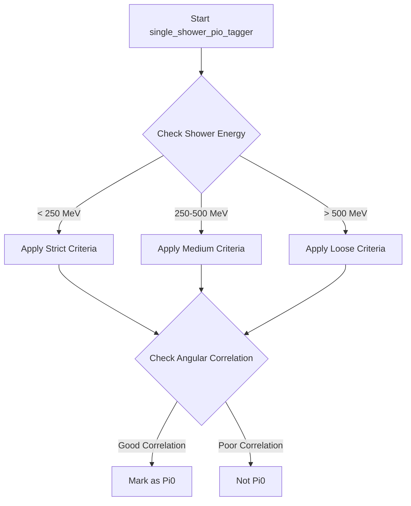
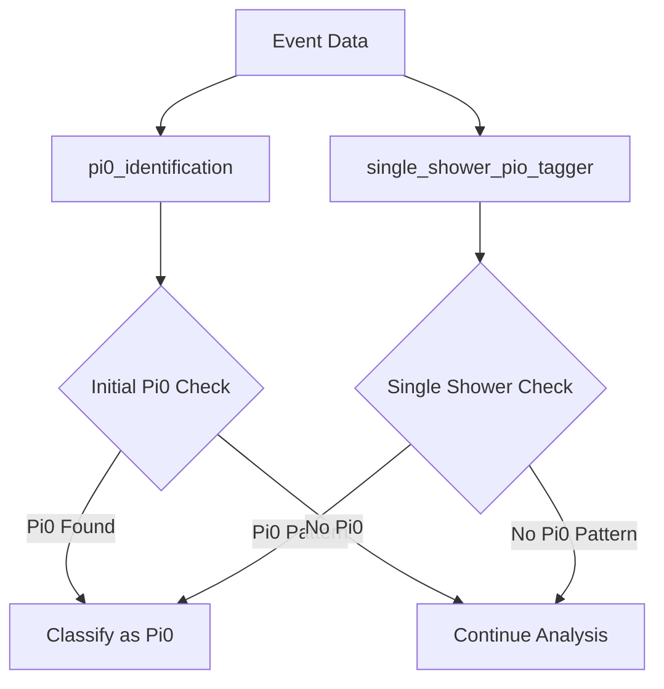

# Pi0 Identification Algorithms in WCP-PID

This document explains the two main functions used for identifying pi0 particles in the Wire-Cell detector data processing:

1. `pi0_identification`
2. `single_shower_pio_tagger`

## `pi0_identification` Function

### Purpose
The function aims to identify pi0 particles by analyzing electromagnetic showers and their relationships to vertices.

### Key Components

#### 1. Map-Based Pi0 Identification
```cpp
auto it = map_shower_pio_id.find(shower);
if (it != map_shower_pio_id.end()) {
    // Process mapped pi0 candidates
    std::vector<WCShower*> tmp_pi0_showers = map_pio_id_showers[it->second];
    auto mass_pair = map_pio_id_mass[it->second];
    // ... further processing
}
```

#### 2. Decision Logic for Pi0 Candidates

The function uses several criteria to identify pi0s:

1. **Mass Window Check**:
   - For vertex-connected pi0s (type 1): |mass - 135 MeV| < 35 MeV
   - For displaced pi0s (type 2): |mass - 135 MeV| < 60 MeV

2. **Energy Balance Criteria**:
   ```cpp
   if (std::min(Eshower_1, Eshower_2) > 15*units::MeV && 
       fabs(Eshower_1 - Eshower_2)/(Eshower_1 + Eshower_2) < 0.87) {
       flag_pi0_1 = true;
   }
   ```

3. **Distance and Energy Correlations**:
   - Checks shower distances from vertex
   - Evaluates energy asymmetry between showers
   - Considers total energy threshold



### Secondary Identification Method

When no direct map entry exists, the function uses geometric and angular correlations:
- Analyzes shower directions relative to vertices
- Checks for characteristic two-shower topology
- Evaluates accumulated track lengths

## `single_shower_pio_tagger` Function

### Purpose
This function focuses on identifying pi0 events in cases where only one shower is clearly visible.

### Main Components

#### 1. Angle and Distance Analysis
```cpp
flag_bad1 = false;
if (dir1.Angle(dir2)/3.1415926*180. < 30 && flag_single_shower && 
    Eshower < 250*units::MeV && Eshower1 > 60*units::MeV) {
    flag_bad1 = true;
}
```

The function analyzes:
- Angular correlations between showers
- Distance relationships
- Energy thresholds

#### 2. Energy-Based Decisions

Different energy ranges have specific criteria:
- Low energy: E < 250 MeV
- Medium energy: 250 MeV < E < 500 MeV
- High energy: E > 500 MeV



### Key Decision Points

1. **Single Shower Check**
   - Evaluates if the event appears as a single shower
   - Considers track multiplicity

2. **Direction Analysis**
   - Compares shower direction with beam direction
   - Analyzes angular distributions of secondary particles

3. **Energy Validation**
   - Checks energy thresholds for both primary and secondary showers
   - Evaluates energy ratios between components

## Combined Decision Making

The two functions work together to provide comprehensive pi0 identification:



### Validation Metrics

Both functions use several validation metrics:
1. Mass reconstruction accuracy
2. Energy balance between showers
3. Geometric correlations
4. Track multiplicity
5. Vertex associations

These metrics ensure robust pi0 identification while minimizing false positives.

## Example Usage

```cpp
// Example of using both functions
void analyze_event(WCPPID::WCShower* shower, bool flag_single_shower) {
    // First check for pi0 signature
    bool is_pi0 = pi0_identification(vertex, sg, shower, 0);
    
    // If not found, check single shower case
    if (!is_pi0) {
        is_pi0 = !single_shower_pio_tagger(shower, flag_single_shower);
    }
    
    // Process result
    if (is_pi0) {
        // Handle pi0 event
    }
}
```

This comprehensive approach ensures high efficiency in pi0 identification across various event topologies.