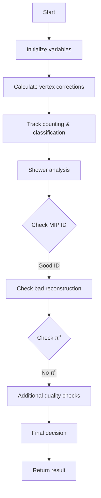
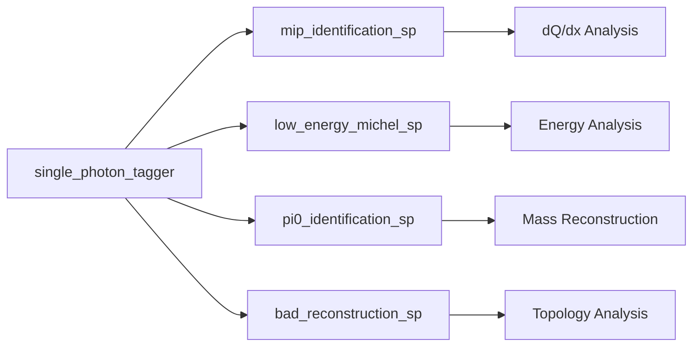
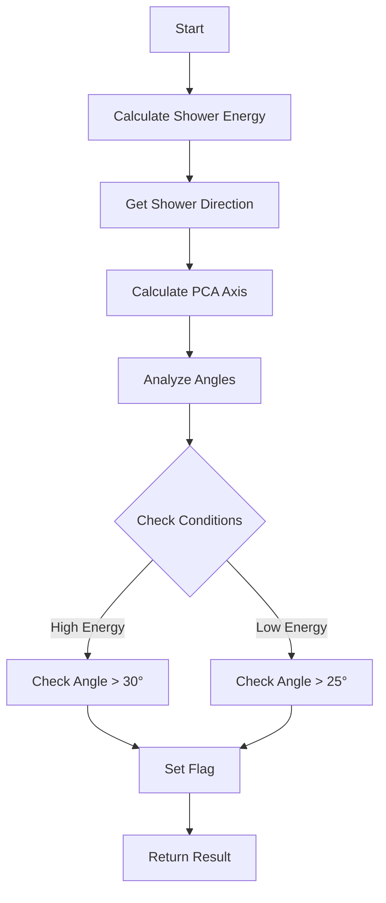
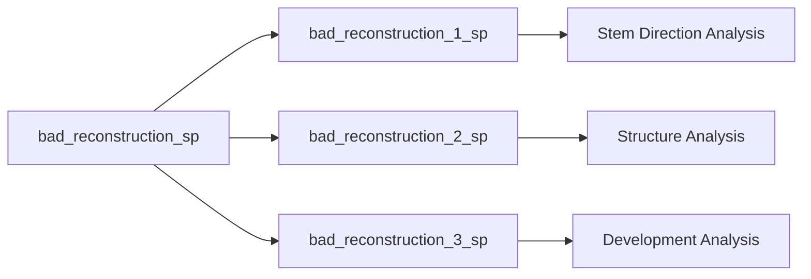
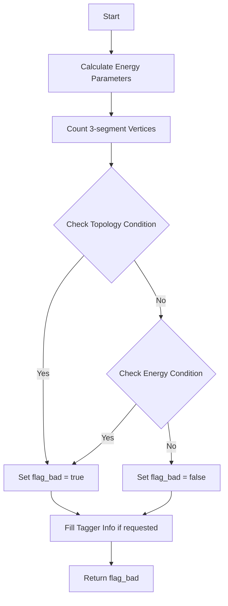
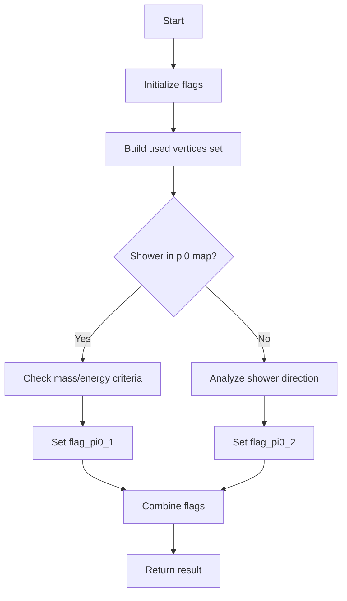
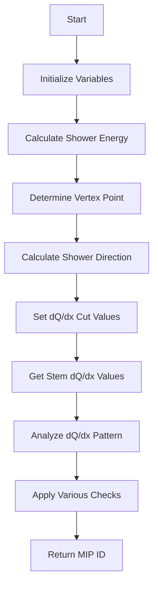

# Single Photon Tagger Documentation

## Overview

The `single_photon_tagger()` function is designed to identify and tag single photon events in particle physics data. It analyzes shower characteristics and other properties to determine if an event matches the signature of a single photon.

## Function Call Structure

The main function calls several sub-functions for different aspects of the analysis:

- `mip_identification_sp()` - Analyzes minimum ionizing particle characteristics
- `low_energy_michel_sp()` - Checks for low energy Michel electron signatures
- `pi0_identification_sp()` - Identifies potential π⁰ decays
- `bad_reconstruction_sp()` - Checks for badly reconstructed events
- `bad_reconstruction_1_sp()` - Additional reconstruction quality checks
- `bad_reconstruction_2_sp()` - Additional topological checks
- `bad_reconstruction_3_sp()` - Further geometry and topology analysis
- `high_energy_overlapping_sp()` - Checks for overlapping high energy showers

## Main Logic Flow



## Key Components

### 1. Vertex Analysis
```cpp
Point nu_vtx = main_vertex->get_fit_pt();
TPCParams& mp = Singleton<TPCParams>::Instance();
Point corr_nu_vtx = mp.func_pos_SCE_correction(nu_vtx);
```
- Retrieves vertex position
- Applies space charge effect corrections

### 2. Track Analysis
The code tracks several key metrics:
- Number of good showers (`num_good_shws`)
- Number of >20 MeV showers (`num_20mev_shws`)
- Various types of badly reconstructed showers (`num_badreco1_shws` through `num_badreco4_shws`)
- Track characteristics like proton length and dQ/dx

### 3. Shower Selection Criteria

Key selection criteria include:
1. Number of MIP tracks ≤ 1
2. Number of good showers = 1
3. Number of 20 MeV + bad reconstruction type 1 showers ≤ 1

### 4. Quality Checks

Several quality checks are performed:
1. MIP (Minimum Ionizing Particle) identification
2. Energy-based checks
3. Geometric/topological analysis
4. Reconstruction quality assessment

## Critical Parameters

Important thresholds and parameters:

| Parameter | Value | Purpose |
|-----------|--------|----------|
| Energy threshold | 20 MeV | Minimum shower energy |
| Track limit | 1 | Maximum allowed MIP tracks |
| dE/dx median | 2.3 | Maximum allowed median energy loss |
| Track distance | 2 cm | Minimum track separation |

## Return Value Interpretation

The function returns a boolean value:
- `true` = Event is identified as single photon
- `false` = Event fails single photon criteria

## Example Usage

```cpp
bool is_single_photon = singlephoton_tagger(muon_length);
```

## Performance Considerations

Key factors affecting performance:
1. Number of tracks/showers to process
2. Complexity of event topology
3. Quality of reconstruction

## Common Issues and Solutions

### 1. False Positives
- Main cause: Overlapping showers
- Solution: Strict isolation requirements

### 2. Missed Events
- Main cause: Energy threshold cuts
- Solution: Careful tuning of energy parameters

### 3. Reconstruction Issues
- Main cause: Complex event topologies
- Solution: Multi-stage reconstruction validation

## Key Variables and Their Functions

### Track Counting
```cpp
float num_protons = 0;
float num_mip_tracks = 0;
float num_muons = 0;
float num_pions = 0;
```
These variables keep track of different particle types identified in the event.

### Quality Metrics
```cpp
float num_good_shws = 0;
float num_20mev_shws = 0;
float num_badreco1_shws = 0;
float num_badreco2_shws = 0;
float num_badreco3_shws = 0;
float num_badreco4_shws = 0;
```
These track various quality metrics for the showers.

## Detailed Function Dependencies



## Quality Control Flags

The function uses multiple flags to track various quality metrics:
1. `flag_sp` - Main single photon flag
2. `flag_print` - Debug printing control
3. `flag_print_detail` - Detailed debug information
4. `flag_fill` - Controls tagger info filling

## Conclusion

The single photon tagger is a complex algorithm that combines multiple analysis techniques to identify single photon events. Its effectiveness depends on careful tuning of parameters and thresholds based on the specific detector configuration and physics requirements.

# Understanding the Shower Overlap Analysis Functions

## Overview

The high_energy_overlapping_sp and low_energy_overlapping_sp functions are part of a neutrino event reconstruction system that analyzes potential overlapping shower patterns in particle detectors. These functions help identify misclassified particle tracks by examining geometric and energy-based characteristics.

## 1. High Energy Overlapping Analysis (high_energy_overlapping_sp)

### Purpose
This function identifies high-energy shower overlaps by analyzing:
- Angular relationships between tracks
- Track clustering patterns
- Energy deposition patterns

### Key Components

#### 1. Initial Flags and Variables
```cpp
bool flag_overlap = false;
bool flag_overlap1 = false;
bool flag_overlap2 = false;

double Eshower = shower->get_kine_best() != 0 ? 
                 shower->get_kine_best() : 
                 shower->get_kine_charge();
```

#### 2. Main Analysis Flow

1. **First Check (flag_overlap1)**:
   - Examines shower direction relative to beam
   - Analyzes track counts and angles
   - Checks for valid tracks using criteria:
   ```cpp
   if ((!(*it)->is_dir_weak() || 
       (*it)->get_particle_type() == 2212 || 
       ((*it)->get_length() > 20*units::cm)) && 
       (!(*it)->get_flag_shower())) 
   {
       n_valid_tracks++;
   }
   ```

2. **Second Check (flag_overlap2)**:
   - Studies shower clustering metrics
   - Analyzes dQ/dx patterns
   - Example condition:
   ```cpp
   if (min_angle < 15 && medium_dQ_dx > 0.95 && 
       ncount > 5 && Eshower < 1500*units::MeV) {
       flag_overlap2 = true;
   }
   ```

### Decision Flow Diagram
```
[Start] -> [Calculate Shower Energy]
     |
     v
[Check Track Angles] -----> [Count Valid Tracks]
     |                           |
     v                           v
[Analyze dQ/dx] <----- [Check Clustering]
     |
     v
[Final Overlap Decision]
```

## 2. Low Energy Overlapping Analysis (low_energy_overlapping_sp)

### Purpose
Identifies overlapping patterns specific to low-energy showers by examining:
- Segment connections
- Angular relationships
- Energy deposition patterns

### Key Components

#### 1. Multiple Flag System
```cpp
bool flag_overlap = false;
bool flag_overlap_1 = false;  bool flag_overlap_1_save = false;
bool flag_overlap_2 = false;  bool flag_overlap_2_save = false;
bool flag_overlap_3 = false;
```

#### 2. Analysis Steps

1. **Segment Analysis**:
   - Examines connected segments
   - Studies topology patterns
   ```cpp
   // Example of segment analysis
   if (Eshower < 100*units::MeV && 
       total_main_length/total_length > 0.95 && 
       length/total_length > 0.95) {
       // Flag potential overlap
   }
   ```

2. **Angle Examination**:
   - Checks relative angles between segments
   - Analyzes beam direction alignment

3. **Energy Pattern Analysis**:
   - Studies energy deposition patterns
   - Examines clustering characteristics

### Key Thresholds and Conditions

1. **Energy-based Conditions**:
   - Low energy: < 100 MeV
   - Medium energy: 100-300 MeV
   - Higher energies: > 300 MeV

2. **Geometric Conditions**:
   - Minimum segment length: 10 cm
   - Angular thresholds: 15°, 30°, 60°
   - Connection distance: 5 cm

### Common Analysis Patterns

Both functions share these analysis patterns:
1. Energy threshold checks
2. Geometric relationship analysis
3. Track/segment counting
4. dQ/dx pattern examination

## Implementation Notes

### Error Handling
- Functions use flag-based error tracking
- Multiple condition checks ensure robust classification
- Saves intermediate states for debugging

### Performance Considerations
1. Uses efficient geometric calculations
2. Implements early exit conditions
3. Reuses calculated values where possible

### Validation Metrics
Both functions track:
- Segment counts
- Angular relationships
- Energy deposits
- Track characteristics

## Usage Example

```cpp
// Example usage of high energy overlap check
void check_shower_overlap(WCShower* shower) {
    if (shower->get_kine_best() > 300*units::MeV) {
        bool has_overlap = high_energy_overlapping_sp(shower, false, true);
        if (has_overlap) {
            // Handle high energy overlap case
        }
    } else {
        bool has_overlap = low_energy_overlapping_sp(shower, false, true);
        if (has_overlap) {
            // Handle low energy overlap case
        }
    }
}
```

## Impact on Shower Classification

The analysis from these functions affects:
1. Particle identification confidence
2. Energy reconstruction accuracy
3. Event topology understanding
4. Track-shower disambiguation

Their results are crucial for:
- Neutrino interaction classification
- Background rejection
- Energy measurement accuracy
- Topology reconstruction

# Analysis of bad_reconstruction*_sp Functions

## Overview
The bad_reconstruction*_sp functions are a set of functions used to identify potentially problematic shower reconstructions in particle physics data. These functions analyze different aspects of shower characteristics and label them as "bad" if they match certain criteria.

## Main Functions

### 1. bad_reconstruction_sp
This is the primary function that analyzes shower characteristics to determine if the reconstruction is potentially problematic.

#### Key Components:
- Evaluates three main conditions (flag_bad_shower_1, flag_bad_shower_2, flag_bad_shower_3)
- Checks shower energy, segment length, and topology

```cpp
bool flag_bad_shower = false;
if (pair_result.second == 1 && map_vertex_segments[vtx].size() == 1 
    && Eshower < 120*units::MeV && map_seg_vtxs.size()<=3) {
    if ((!sg->get_flag_shower_topology()) && (!sg->get_flag_shower_trajectory()) 
        && sg->get_length() > 10*units::cm)
        flag_bad_shower_1 = true;
}
```

#### Critical Checks:
1. Single vertex with low energy (<120 MeV)
2. Long segments (>80 cm) are flagged as bad
3. Shower topology and trajectory characteristics

### 2. bad_reconstruction_1_sp
This function specifically focuses on analyzing the relationship between shower stem direction and overall shower direction.

#### Key Logic Flow:


#### Important Angle Checks:
1. angle1: Drift angle difference
2. angle2: PCA axis angle with drift direction
3. angle3: Shower direction vs segment direction

### 3. bad_reconstruction_2_sp
Focuses on evaluating shower structure and segmentation problems.

#### Key Features:
- Analyzes main cluster characteristics
- Evaluates vertex connections
- Checks segment lengths and directions

#### Key Thresholds:
```cpp
// Example threshold values
if (Eshower < 300*units::MeV && total_main_length/total_length > 0.95) {
    // Check for misidentified tracks
}

if (main_length < 0.4*total_length && min_dis > 40*units::cm) {
    flag_bad1 = true;
}
```

### 4. bad_reconstruction_3_sp
This function analyzes potential problems in shower development and clustering.

#### Main Analysis Points:
1. **Shower Length Analysis**
   - Compares main shower length vs total length
   - Evaluates distance between segments

2. **Angular Distribution**
   - Checks shower spread
   - Analyzes segment orientations

3. **Energy-dependent Criteria**
```cpp
if (Eshower < 200*units::MeV) {
    if (main_length < 0.4*total_length && min_dis > 40*units::cm) 
        flag_bad1 = true;
    if (main_length < 0.25*total_length && min_dis > 33*units::cm) 
        flag_bad1 = true;
}
```

## Common Parameters Across Functions

### Energy Thresholds
- Very Low Energy: < 200 MeV
- Low Energy: 200-600 MeV
- Medium Energy: 600-1000 MeV
- High Energy: > 1000 MeV

### Length Criteria
- Short segments: < 10 cm
- Medium segments: 10-30 cm
- Long segments: > 30 cm

### Angle Thresholds
- Small angles: < 15°
- Medium angles: 15-45°
- Large angles: > 45°

## Function Interdependencies



## Usage Example

Here's a typical usage pattern:

```cpp
WCPPID::WCShower* shower = /* shower object */;
bool flag_single_shower = true;
int num_valid_tracks = 0;

// Check basic reconstruction quality
bool is_bad = bad_reconstruction_sp(shower, false, false);

// If basic check passes, do more detailed analysis
if (!is_bad) {
    is_bad = bad_reconstruction_1_sp(shower, flag_single_shower, 
                                   num_valid_tracks, false);
}

// Further checks if needed
if (!is_bad) {
    is_bad = bad_reconstruction_2_sp(vertex, shower, false, false);
    is_bad |= bad_reconstruction_3_sp(vertex, shower, false, false);
}
```

## Conclusion
These functions form a comprehensive system for identifying problematic shower reconstructions. The multi-layered approach allows for detailed analysis of different aspects of shower characteristics, with each function focusing on specific potential issues.

# Analysis of low_energy_michel_sp Function

This function aims to identify potential Michel electrons (electrons from muon decay) that may be incorrectly identified as electromagnetic showers. 

## Function Overview

```cpp
bool WCPPID::NeutrinoID::low_energy_michel_sp(
    WCPPID::WCShower* shower,   // The shower to analyze
    bool flag_print,            // Debug printing flag
    bool flag_fill             // Fill tagger info flag
)
```

## Key Parameters Checked

1. **Energy Measurements**
   - E_range: Kinetic energy from range
   - E_dQdx: Energy from charge deposition (dQ/dx)  
   - E_charge: Total charge energy

2. **Shower Geometry**
   - Total shower length
   - Main cluster length (length within start segment's cluster)
   - Number of 3-segment vertices (n_3seg)
   - Number of segments and main segments

## Logic Flow



## Identification Criteria

### 1. Topology-based Check
The function flags a shower as potential Michel electron if either condition is met:

```cpp
if (shower->get_total_length() < 25*units::cm && 
    shower->get_total_length(shower->get_start_segment()->get_cluster_id()) > 0.75 * shower->get_total_length() && 
    n_3seg == 0)
    // OR
if (shower->get_total_length() < 18*units::cm && 
    shower->get_total_length(shower->get_start_segment()->get_cluster_id()) > 0.75 * shower->get_total_length() && 
    n_3seg > 0)
```

This checks for:
- Short total length (<25cm or <18cm)
- Most of length (>75%) in main cluster
- Presence/absence of 3-segment vertices

### 2. Energy-based Check
Additionally checks low energy characteristics:

```cpp
if (E_charge < 100*units::MeV && 
    E_dQdx < 0.7 * E_charge && 
    shower->get_num_segments() == shower->get_num_main_segments())
```

This identifies:
- Low charge energy (<100 MeV)
- Low dQ/dx energy relative to charge energy
- All segments are main segments

## Tagger Information

The function stores various metrics in the tagger_info structure:
- Shower length measurements
- Energy measurements
- Segment counts
- Final classification flag

## Example Use Case

Consider a shower with these properties:
```cpp
shower_length = 20 cm
main_cluster_length = 18 cm  // 90% of total
n_3seg = 0
E_charge = 80 MeV
E_dQdx = 40 MeV
num_segments = 5
num_main_segments = 5
```

This would be flagged as a potential Michel electron because:
- Length < 25 cm
- Main cluster contains >75% of length
- No 3-segment vertices
- Low energy with E_dQdx < 0.7 * E_charge

## Performance Impact

This check helps reduce background from Michel electrons that could contaminate the neutrino interaction sample, particularly important for low-energy electromagnetic shower studies.


# Pi0 Identification Function Analysis

## Purpose
The `pi0_identification_sp` function aims to identify potential π⁰ particles by analyzing shower characteristics and geometric relationships between shower segments. It serves as a key component in distinguishing electron showers from π⁰ decay photons.

## Function Overview

```cpp
bool WCPPID::NeutrinoID::pi0_identification_sp(
    WCPPID::ProtoVertex* vertex,      // Input vertex
    WCPPID::ProtoSegment *sg,         // Input segment
    WCPPID::WCShower *shower,         // Input shower
    double threshold,                  // Energy threshold 
    bool flag_fill                     // Flag to fill tagger info
)
```

## Core Logic Flow



## Key Components

### 1. Pi0 Mass Check
When a shower is identified in the pi0 map:
- Checks invariant mass around π⁰ mass (135 MeV)
- Two mass windows:
  ```cpp
  // Type 1: Tight window
  fabs(mass - 135*MeV) < 35*MeV
  
  // Type 2: Loose window
  fabs(mass - 135*MeV) < 60*MeV
  ```

### 2. Energy Asymmetry Check
For potential π⁰ candidates:

```cpp
// Energy asymmetry calculation
double asymmetry = fabs(Eshower_1 - Eshower_2)/(Eshower_1 + Eshower_2);

// Conditions for π⁰ identification
if (min_energy > 15*MeV && asymmetry < 0.87) {
    flag_pi0_1 = true;
}

if (min_energy > max(10*MeV, threshold) && 
    max_energy < 400*MeV) {
    flag_pi0_1 = true;
}
```

### 3. Special Case Rejection
Handles edge cases that could be misidentified:

```cpp
// Reject cases with specific geometry/energy patterns
if (min_energy < 30*MeV && 
    max_distance > 80*cm && 
    energy_asymmetry > 0.87) {
    flag_pi0_1 = false;
}
```

### 4. Directional Analysis
For showers not in pi0 map:
- Analyzes shower direction relative to vertex
- Checks for consistent geometric patterns
- Key geometric criteria:
  ```cpp
  if (direction_magnitude < 36*cm && 
      angle < 7.5_degrees && 
      accumulated_length > 0) {
      flag_pi0_2 = true;
  }
  ```

## Example Case

Consider a π⁰ decay scenario:
```cpp
// Sample values
mass = 140 MeV
Eshower_1 = 200 MeV
Eshower_2 = 180 MeV
distance_1 = 30 cm
distance_2 = 35 cm

// This would be identified as π⁰ because:
// 1. Mass within 35 MeV of π⁰ mass
// 2. Energy asymmetry = (200-180)/(200+180) = 0.053 < 0.87
// 3. Both energies above threshold
// 4. Distances reasonable for π⁰ decay
```

## Performance Considerations

1. **Efficiency**
   - Uses pre-calculated maps for quick lookup
   - Geometric calculations only performed when necessary

2. **False Positive Mitigation**
   - Multiple validation criteria
   - Energy and geometric constraints
   - Special case handling for edge scenarios

3. **Limitations**
   - Dependent on shower reconstruction quality
   - May miss highly asymmetric decays
   - Limited by detector resolution

## Output Information

The function fills various tagger information when flag_fill is true:
- Mass information
- Energy measurements
- Distance measurements
- Angular relationships
- Final classification flags

# MIP Identification Function Analysis

This document provides a detailed analysis of the `mip_identification_sp` function from the NeutrinoID class, which is used to identify Minimum Ionizing Particles (MIPs) in particle physics detection.

## Function Overview

The function `mip_identification_sp` analyzes shower characteristics to determine if a particle track exhibits MIP-like behavior. It returns an integer value:
- 1: Good MIP candidate
- 0: Uncertain/borderline case
- -1: Not a MIP candidate

## Key Parameters

```cpp
WCPPID::NeutrinoID::mip_identification_sp(
    WCPPID::ProtoVertex* vertex,      // Vertex point
    WCPPID::ProtoSegment *sg,         // Track segment
    WCPPID::WCShower *shower,         // Shower object
    bool flag_single_shower,          // Single shower flag
    bool flag_strong_check,           // Strong check flag
    bool flag_print,                  // Debug printing flag
    bool flag_fill                    // Fill info flag
)
```

## Core Logic Flow



## Key Components Analysis

### 1. Energy Determination
```cpp
double Eshower = 0;
if (shower->get_kine_best() != 0) {
    Eshower = shower->get_kine_best();
} else {
    Eshower = shower->get_kine_charge();
}
```
The function first determines the shower energy using either the best kinematic measurement or charge-based measurement.

### 2. dQ/dx Cut Determination
```cpp
double dQ_dx_cut = 1.45;
if (Eshower > 1200*units::MeV) dQ_dx_cut = 1.85;
else if (Eshower > 1000*units::MeV) dQ_dx_cut = 1.6;
else if (Eshower < 550*units::MeV) dQ_dx_cut = 1.3;
if (Eshower < 300*units::MeV) dQ_dx_cut = 1.3;
```
The dQ/dx cut value is set based on the shower energy, with higher energy showers having higher cut values.

### 3. Pattern Recognition and dQ/dx Analysis

The function performs sophisticated pattern recognition on the dQ/dx values to identify MIP-like behavior. Here's a detailed breakdown:

1. **Initial dQ/dx Processing**
```cpp
std::vector<double> vec_dQ_dx = shower->get_stem_dQ_dx(vertex, sg, 20);
std::vector<int> vec_threshold(vec_dQ_dx.size(), 0);
for (size_t i=0; i!=vec_dQ_dx.size(); i++) {
    if (vec_dQ_dx.at(i)>dQ_dx_cut) vec_threshold.at(i) = 1;
}
```
- Gets dQ/dx values for the first 20 points of the shower stem
- Creates a binary threshold vector (1 for above cut, 0 for below)

2. **Pattern Analysis Points**

a) **Initial MIP Region (n_first_mip)**
```cpp
int n_first_mip = 0;
for (size_t i=0; i!= vec_dQ_dx.size(); i++) {
    n_first_mip = i;
    if (vec_threshold.at(i) ==0 ) break;
}
```
- Finds first point where dQ/dx drops below threshold
- Important for identifying start of MIP-like behavior

b) **First Non-MIP Point (n_first_non_mip)**
```cpp
int n_first_non_mip = n_first_mip;
for (size_t i=n_first_non_mip; i<vec_dQ_dx.size(); i++) {
    n_first_non_mip = i;
    if (vec_threshold.at(i)==1) break;
}
```
- Finds next point where dQ/dx goes above threshold
- Marks end of initial MIP-like region

c) **Extended Pattern Recognition**
```cpp
int n_first_non_mip_1 = n_first_mip;
// Looks for first point where two consecutive points are above threshold
int n_first_non_mip_2 = n_first_mip;
// Looks for first point where three consecutive points are above threshold
```

3. **Energy Reduction Analysis**
```cpp
int n_end_reduction = 0;
double prev_vec_dQ_dx = vec_dQ_dx.front();
for (size_t i=1; i<vec_dQ_dx.size(); i++) {
    if (vec_dQ_dx.at(i) < prev_vec_dQ_dx) {
        n_end_reduction = i;
        prev_vec_dQ_dx = vec_dQ_dx.at(i);
        if (vec_dQ_dx.at(i) < dQ_dx_cut) break;
    }
}
```
- Tracks continuous reduction in dQ/dx values
- Helps identify energy deposition patterns

4. **Pattern Interpretation**

The combination of these patterns helps identify different particle behaviors:

```
MIP-like Pattern:
[High dQ/dx] -> [Consistent low dQ/dx] -> [Possible rise]
     ↓              ↓                         ↓
  Initial      MIP-like region          Shower development
   peak    
```

Non-MIP Pattern Examples:
- Immediate fluctuations in dQ/dx
- No clear MIP-like region
- Rapid transitions between high/low dQ/dx

5. **Statistical Analysis**
```cpp
double lowest_dQ_dx = 100;
double highest_dQ_dx = 0;
int n_below_threshold = 0;
int n_below_zero = 0;
```
- Tracks extremal values and statistics of dQ/dx distribution
- Used for quality control and pattern validation

### 4. Quality Metrics

The function calculates several quality metrics:

1. **Energy-based Checks**
```cpp
if (Eshower < 600*units::MeV) {
    if (n_good_tracks >1 && n_first_non_mip_2 <=2) mip_id = -1;
}
```

2. **Geometric Checks**
```cpp
TVector3 dir = shower->cal_dir_3vector(vertex_point, 15*units::cm);
if (Eshower < 300*units::MeV) {
    if (dir.Angle(dir_beam)/3.1415926*180. > 40) {
        // Various angle-based checks
    }
}
```

3. **dQ/dx Pattern Analysis**
```cpp
double lowest_dQ_dx = 100;
double highest_dQ_dx = 0;
int n_below_threshold = 0;
int n_below_zero = 0;
```

## Decision Making Process

The MIP identification follows this general logic:

1. **Initial Classification**
   - Based on early track characteristics
   - Number of points below threshold
   - Energy considerations

2. **Refinement Steps**
   - Angle with respect to beam
   - Pattern of dQ/dx values
   - Track length and topology

3. **Special Cases**
   - Single shower scenarios
   - High energy considerations
   - Geometric configurations

## Example Scenarios

### Scenario 1: Clear MIP
```cpp
// Example conditions for clear MIP
if (n_first_mip <= 2 && 
    n_first_non_mip_2 - n_first_mip >= 2 && 
    Eshower < 600*units::MeV) {
    mip_id = 1;
}
```

### Scenario 2: Clear Non-MIP
```cpp
// Example conditions for clear non-MIP
if (lowest_dQ_dx < 0 && 
    Eshower < 800*units::MeV && 
    n_below_zero > 2) {
    mip_id = -1;
}
```

## Performance Considerations

1. **Energy Dependence**
   - Different criteria for different energy ranges
   - More stringent checks for high energy showers

2. **Geometric Factors**
   - Angle with respect to beam direction
   - Track length and segmentation

3. **Quality Metrics**
   - dQ/dx pattern analysis
   - Transition point characteristics

## Additional Features

1. **Debug Information**
   - Extensive debug printing capabilities
   - Quality metric tracking

2. **Data Collection**
   - Comprehensive information storage when flag_fill is true
   - Statistical analysis support

## Conclusion

The mip_identification_sp function employs a sophisticated multi-step analysis to identify MIP-like behavior in particle tracks. It considers:
- Energy deposits (dQ/dx patterns)
- Geometric characteristics
- Track topology
- Energy ranges
- Special case handling

The function's complexity reflects the challenges in reliable MIP identification in particle physics detectors.
