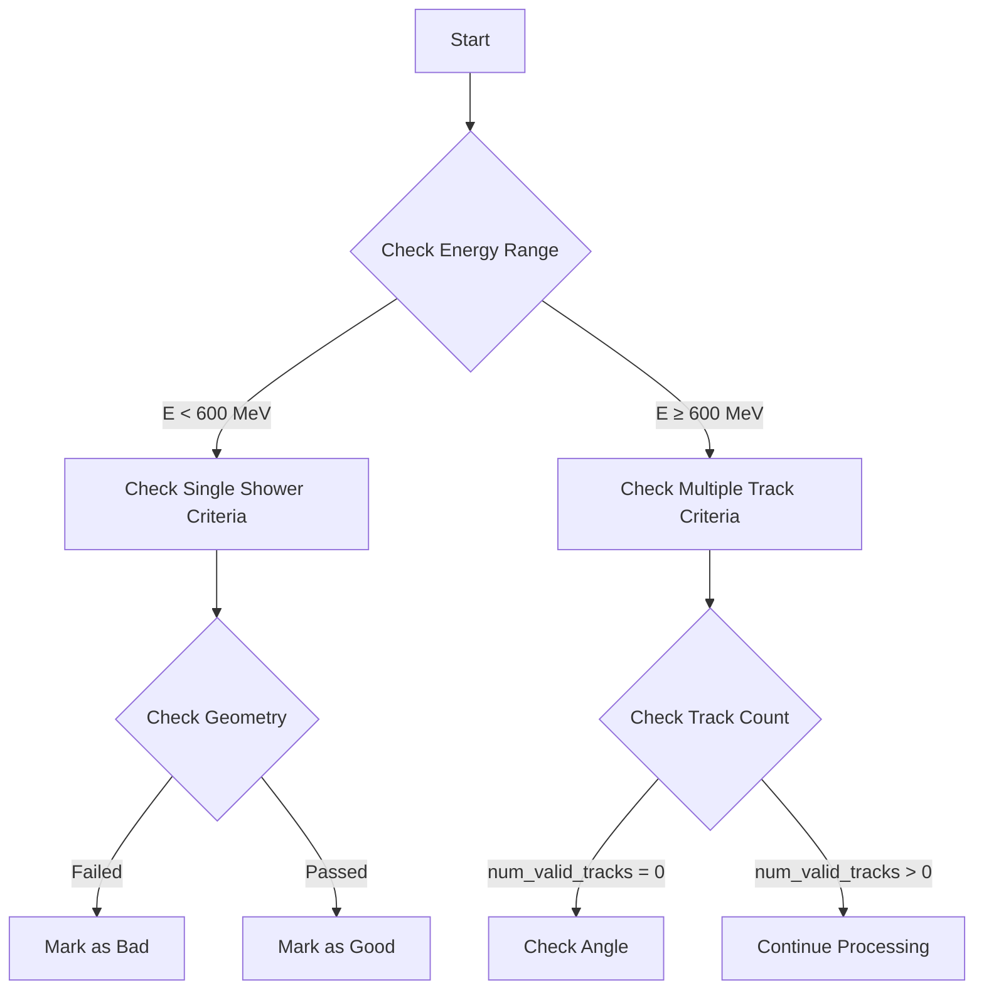
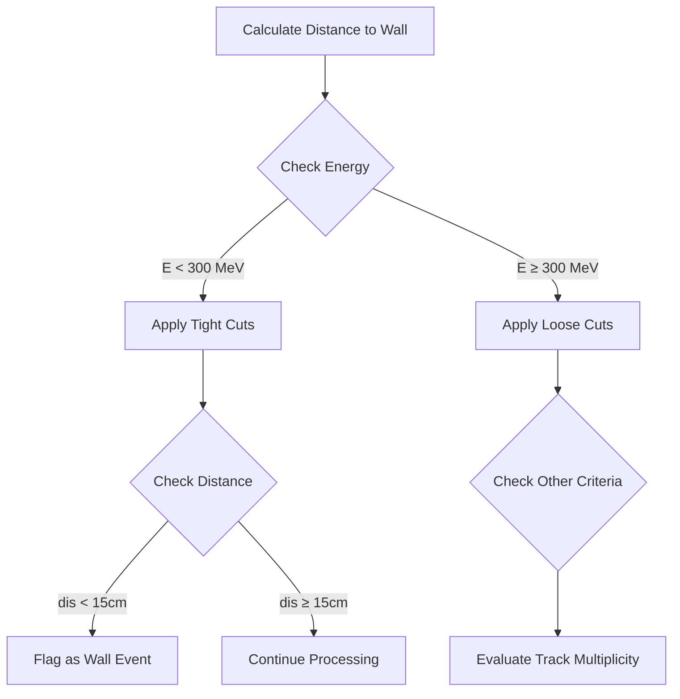

# Analysis of WCPPNeutrinoPID Shower Functions

This document analyzes three key functions from the Wire-Cell Neutrino ID code that handle shower identification and classification: `single_shower()`, `angular_cut()`, and `shower_to_wall()`. These functions are part of the neutrino event reconstruction chain.

## 1. single_shower()

### Purpose
The `single_shower()` function analyzes isolated shower events to determine if they match expected neutrino interaction patterns. It evaluates geometric and energy characteristics to identify potential misclassifications.

### Key Parameters
- `flag_single_shower`: Boolean indicating if this is an isolated shower event
- `Eshower`: Shower energy in MeV
- `angle_beam`: Angle between shower direction and beam direction
- `angle_vertical`: Angle between shower direction and vertical axis
- `angle_drift`: Angle between shower direction and drift direction

### Logic Flow


### Key Conditions

1. Single Shower Case (`flag_single_shower = true`):
```cpp
if (Eshower < 600*units::MeV && 
    shower->get_total_length(sg->get_cluster_id()) < 0.1 * shower->get_total_length() && 
    angle_beam > 40) {
    flag_bad = true;
}
```

2. Multiple Track Case:
```cpp
if (num_valid_tracks == 0 && 
    angle_beam > 60 && 
    map_vertex_segments[vertex].size() <= 3) {
    flag_bad = true;
}
```

## 2. angular_cut()

### Purpose
This function evaluates the angular relationships between shower components and beam/drift directions to identify potential cosmic rays or other background events.

### Key Parameters
- `shower`: WCShower object containing shower information
- `energy`: Total shower energy
- `angle`: Angle between shower and reference direction
- `main_length`: Length of main shower segment
- `total_length`: Total length including all associated segments

### Logic Flow

1. Angular Rejection Criteria:
   - High angle relative to beam direction (>135° for E<650 MeV)
   - High angle with significant length disparity
   - Limited forward-going components

```cpp
// Example of key angular criteria
if (energy < 650*units::MeV && angle > 135 && max_angle > 170 && max_length > 12*units::cm || 
    energy < 650*units::MeV && angle > 135 && 
    (acc_forward_length < 0.8 * acc_backward_length)) {
    flag_bad = true;
}
```

2. Geometry Checks:
```cpp
bool flag_main_outside = false;
for (auto it = map_vtx_segs.begin(); it != map_vtx_segs.end(); it++) {
    if (!fid->inside_fiducial_volume(vtx1->get_fit_pt(), offset_x)) {
        flag_main_outside = true;
        break;
    }
}
```

## 3. shower_to_wall()

### Purpose
Identifies showers that may be entering from outside the detector volume by analyzing their proximity and orientation relative to detector boundaries.

### Key Components

1. Distance Calculation:
```cpp
// Calculate distance to wall along shower direction
Point test_p = vertex_point;
while (fid->inside_fiducial_volume(test_p, offset_x)) {
    test_p.x += step * dir.X();
    test_p.y += step * dir.Y();
    test_p.z += step * dir.Z();
}
double dis = sqrt(pow(test_p.x-vertex_point.x,2) + 
                 pow(test_p.y-vertex_point.y,2) + 
                 pow(test_p.z-vertex_point.z,2));
```

### Decision Tree


### Key Criteria

1. Low Energy Case:
```cpp
if (shower_energy < 300*units::MeV && 
    dis < 15*units::cm && 
    max_dQ_dx < 2.6 && 
    flag_single_shower) {
    flag_bad = true;
}
```

2. Multiple Shower Case:
```cpp
if ((n_pi0 < 2 || shower_energy > 1000*units::MeV) && 
    dis < 5*units::cm && 
    flag_single_shower) {
    flag_bad = true;
}
```

## Key Considerations

1. Energy Dependence:
   - Different criteria are applied based on shower energy
   - Stricter cuts for low energy events
   - More lenient cuts for high energy events

2. Geometric Factors:
   - Angular relationships with beam and drift directions
   - Distance to detector boundaries
   - Track multiplicity and shower segment patterns

3. Quality Metrics:
   - dQ/dx measurements
   - Track/shower separation
   - Vertex connectivity
   - Shower containment

These functions form a crucial part of the neutrino identification chain, working together to reject backgrounds while maintaining high efficiency for genuine neutrino interactions.