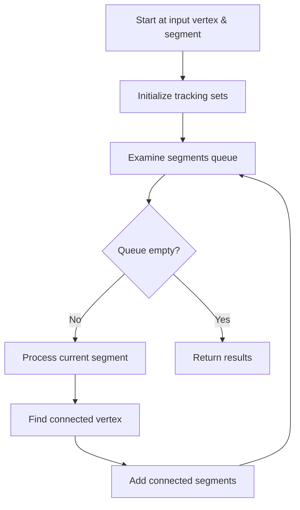

# Daughter Shower and Track Calculation Functions

This document describes two key functions in the NeutrinoID class that calculate the number and total length of daughter showers and tracks.

## Function Overview

1. `calculate_num_daughter_showers`: Counts shower segments and their total length
2. `calculate_num_daughter_tracks`: Counts track segments and their total length

## Detailed Logic

### Common Structure
Both functions share a similar graph traversal algorithm structure:



### calculate_num_daughter_showers

**Purpose**: Counts shower-like segments starting from a given vertex and segment.

**Parameters**:
- `vtx`: Starting ProtoVertex
- `sg`: Starting ProtoSegment
- `flag_count_shower`: Boolean flag controlling counting behavior

**Algorithm Steps**:
1. Initialize counters and tracking sets
2. Start with initial vertex-segment pair
3. For each segment:
   - Skip if already processed
   - Count if it's a shower segment (or if flag_count_shower is false)
   - Find connected vertex and segments
   - Add new segments to examination queue

**Called Functions**:
- `find_other_vertex(segment, vertex)`: Finds the vertex at the other end of a segment
- Accesses `map_vertex_segments`: Class member mapping vertices to connected segments

### calculate_num_daughter_tracks

**Purpose**: Counts track-like segments with length above threshold.

**Parameters**:
- `vtx`: Starting ProtoVertex
- `sg`: Starting ProtoSegment
- `flag_count_shower`: Boolean flag controlling counting behavior
- `length_cut`: Minimum length threshold for tracks

**Key Differences from Shower Function**:
```cpp
// Track counting condition
if ((!current_sg->get_flag_shower()) || flag_count_shower) {
    double length = current_sg->get_length();
    if (length > length_cut) {
        acc_length += length;
        number_tracks++;
    }
}
```

**Data Structures Used**:
- `std::set<ProtoVertex*>`: Tracks visited vertices
- `std::set<ProtoSegment*>`: Tracks processed segments
- `std::vector<std::pair<ProtoVertex*, ProtoSegment*>>`: Queue of segments to examine

## Return Value
Both functions return a `std::pair<int, double>`:
- First element: Number of counted segments
- Second element: Accumulated length of counted segments
