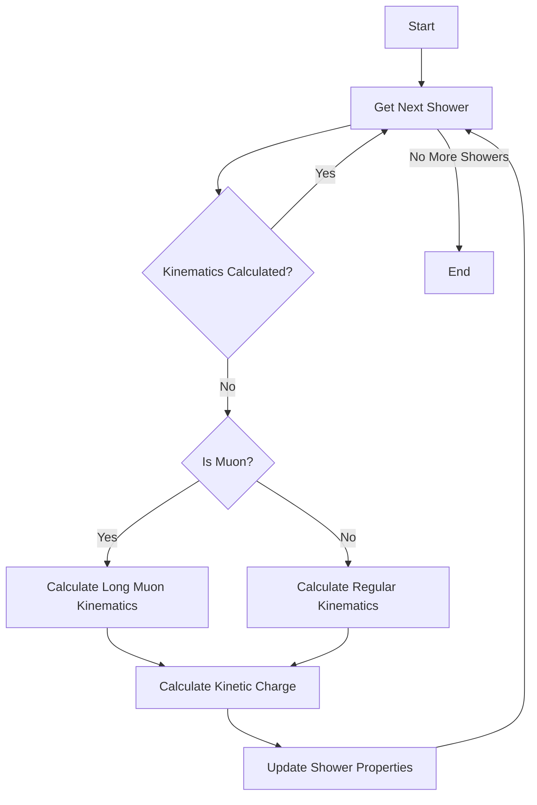

## calculate_shower_kinematics()

This function handles the calculation of shower kinematic properties, with specialized handling for different particle types. It iterates through all showers and updates their kinematic information if not already calculated.

### Algorithm Details

1. **Shower Type Detection**
   - Regular showers (electron-like, |particle_type| != 13)
   - Long muon showers (|particle_type| = 13)

2. **Regular Shower Processing** [see details](../pattern_recognition/wcshower_kinematics.md)
   ```cpp
   if (|particle_type| != 13) {
      shower->calculate_kinematics();
      double kine_charge = cal_kine_charge(shower);
      // Set properties
   }
   ```
   - Calculates basic kinematics including:
     * Energy deposition patterns
     * Direction vectors
     * Momentum reconstruction
     * Shower shape parameters

3. **Long Muon Processing** [see details](../pattern_recognition/wcshower_kinematics.md)
   ```cpp
   if (|particle_type| == 13) {
      shower->calculate_kinematics_long_muon(segments_in_long_muon);
      double kine_charge = cal_kine_charge(shower);
      // Set properties
   }
   ```
   - Special handling for muon tracks:
     * Uses segment information from long_muon container
     * Takes into account track length
     * Considers energy deposition along track
     * Handles multiple scattering effects

4. **Charge Calculations**
   - For all shower types:
     * Calculates kinetic charge using cal_kine_charge()
     * Updates shower charge property
     * Sets kinematic flag to true

### Key Properties Updated

1. **Kinematic Flag**
   - Tracks whether kinematics have been calculated
   - Prevents redundant calculations
   - Set to true after processing

2. **Kinetic Charge**
   - Represents energy deposition
   - Calculated differently for muons vs other particles
   - Stored in shower object

3. **Shower Parameters**
   - Direction vectors
   - Energy profiles
   - Track/shower shape characteristics

### Implementation Flow



### Integration with Other Functions

- Works closely with `examine_merge_showers()`
- Provides input for particle identification
- Essential for shower clustering algorithms
- Feeds into neutrino interaction reconstruction

### Performance Considerations

1. **Computational Efficiency**
   - Only calculates when needed (flag check)
   - Different algorithms for different particle types
   - Optimized charge calculations

2. **Memory Management**
   - Updates existing shower objects
   - No temporary storage needed
   - Efficient property updates

3. **Accuracy**
   - Specialized handling improves precision
   - Particle-type specific calculations
   - Proper treatment of edge cases

This function is crucial for accurate particle energy reconstruction and subsequent physics analysis in the Wire-Cell pattern recognition chain.