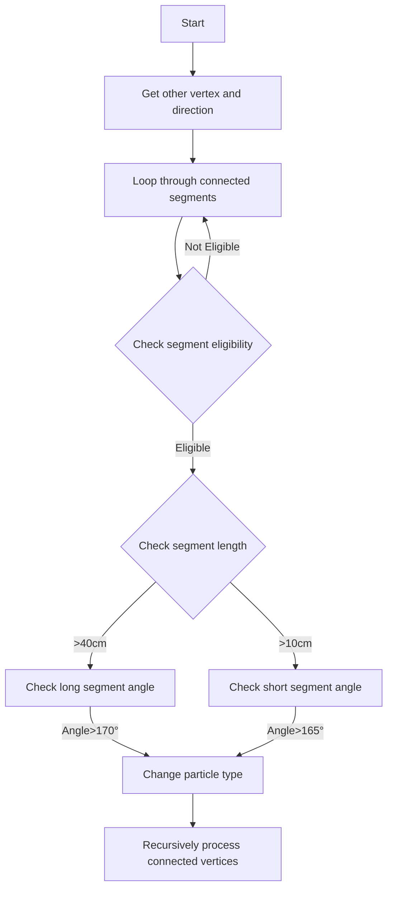

# NeutrinoID::change_daughter_type Function Documentation

## Purpose
This function recursively changes the particle type of connected segments in a track/shower chain based on certain geometric criteria. It's typically used to propagate particle type identification through connected segments.

## Function Parameters
- `vtx`: Source ProtoVertex from which to start checking
- `sg`: Source ProtoSegment 
- `particle_type`: New particle type to assign
- `mass`: New particle mass to assign

## Logic Flow



## Detailed Steps

1. **Initial Setup**
   - Get the opposite vertex of the input segment
   - Calculate direction vector of source segment
   
2. **Segment Filtering**
   - Skip segments that:
     - Are the same as input segment
     - Already have target particle type
     - Have shower trajectory flag or non-weak direction
   
3. **Long Segment Processing** (>40cm)
   ```cpp
   if (sg1->get_flag_shower_topology() && sg1->get_flag_dir() == 0 && 
       sg1->get_length() > 40*units::cm) {
       // Check angle between segments
       if (angle > 170°) {
           // Change particle properties
       }
   }
   ```

4. **Short Segment Processing** (>10cm)
   ```cpp
   if (sg1->get_length() > 10*units::cm) {
       // Check angle between segments
       if (angle > 165°) {
           // Change particle properties
       }
   }
   ```

## Property Changes Applied
When a segment meets the criteria:
1. Set new particle type
2. Set new particle mass
3. Disable shower topology flag (for long segments)
4. Recursively apply changes to connected segments

## Called Functions  [ProtoSegment](../protosegment.md)

1. `find_other_vertex()`
   - Parameters: ProtoSegment, ProtoVertex
   - Returns: Opposite ProtoVertex of the segment
   
2. `cal_dir_3vector()`
   - Parameters: Point, distance
   - Returns: TVector3 direction vector

3. `set_particle_type()`
   - Parameters: particle type (int)
   
4. `set_particle_mass()`
   - Parameters: mass (double)

5. `set_flag_shower_topology()`
   - Parameters: bool flag

## Key Angles
- For long segments (>40cm): Must exceed 170° to trigger change
- For short segments (>10cm): Must exceed 165° to trigger change

## Important Notes

- Function is recursive and will propagate changes through the track/shower chain
- Different angle thresholds for different segment lengths
- Only processes segments without strong directional indicators
- Designed to handle topology changes in shower-like structures
