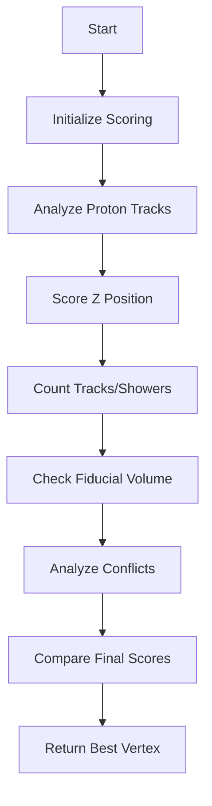

# Analysis of compare_main_vertices Function

## Overview
The `compare_main_vertices` function is responsible for selecting the most likely neutrino interaction vertex from a set of candidate vertices. It uses a scoring system that considers multiple factors to make this determination.

## Key Components

### 1. Proton Track Analysis
```cpp
// Find proton tracks going in/out of each vertex
for (auto it = vertex_candidates.begin(); it!=vertex_candidates.end(); it++) {
    WCPPID::ProtoVertex *vtx = *it;
    int n_proton_in = 0;
    int n_proton_out = 0;
    // ... examine connected segments
    // More protons going in is considered favorable
    if (n_proton_in > n_proton_out) {
        map_vertex_num[vtx] -= (n_proton_in - n_proton_out)/4.;
    } else {
        map_vertex_num[vtx] -= (n_proton_in - n_proton_out)/4. - (n_proton_in+n_proton_out)/8.;
    }
}
```

This section:
- Counts protons entering and leaving each vertex
- Favors vertices with more incoming protons
- Applies penalties for outgoing protons
- Uses fractional penalties to fine-tune the scoring

### 2. Z-Position Scoring

```cpp
// Find most upstream vertex
double min_z = 1e9;
for (auto it = vertex_candidates.begin(); it!=vertex_candidates.end(); it++) {
    if (vtx->get_fit_pt().z < min_z) min_z = vtx->get_fit_pt().z;
}

// Score based on z position
for (auto it = vertex_candidates.begin(); it!=vertex_candidates.end(); it++) {
    map_vertex_num[vtx] -= (vtx->get_fit_pt().z - min_z)/(200*units::cm);
}
```

This component:
- Identifies the most upstream vertex (smallest z coordinate)
- Penalizes vertices based on their distance from the most upstream position
- Uses a 200cm scale factor to normalize the penalties

### 3. Track and Shower Analysis

For each vertex, the function analyzes connected segments:
```cpp
for (auto it1 = map_vertex_segments[vtx].begin(); it1!= map_vertex_segments[vtx].end(); it1++) {
    if (sg->get_flag_shower()) {
        map_vertex_num[vtx] += 1/4./2.; // Shower bonus
        // Additional bonus for long showers (>45cm)
        if (pair_results.second > 45*units::cm)
            map_vertex_num[vtx] += 1/4./2.;
    } else {
        map_vertex_num[vtx] += 1/4.; // Track bonus
    }
}
```

Points awarded for:
- Number of connected tracks and showers
- Length of showers
- Clear proton tracks
- Tracks with definite direction

### 4. Fiducial Volume Check
```cpp
if (fid->inside_fiducial_volume(vtx->get_fit_pt(),offset_x))
    map_vertex_num[vtx] += 0.5; // Bonus for being inside fiducial volume
```

### 5. Conflict Analysis
The function calculates potential conflicts in track/shower topology:
```cpp
double num_conflicts = calc_conflict_maps(vtx);
map_vertex_num[vtx] -= num_conflicts/4.;
```

Conflicts include:
- Multiple particles entering a vertex
- Incompatible angles between tracks
- Topology inconsistencies

## Logic Flow Diagram



## Scoring System Summary

1. Base Points:
   - Track: +0.25 points
   - Shower: +0.125 points
   - Long shower (>45cm): +0.125 additional points
   - Clear proton track: +0.25 points
   - Directional track: +0.125 points

2. Penalties:
   - Z-position: -(δz/200cm) points
   - Proton imbalance: Various fractional penalties
   - Topological conflicts: -0.25 points per conflict

3. Bonuses:
   - Fiducial volume: +0.5 points
   - Long muon track: +0.125 points

## Example Score Calculation

Consider a vertex with:
- 2 tracks (2 × 0.25 = 0.5)
- 1 shower (1 × 0.125 = 0.125)
- Inside fiducial volume (+0.5)
- 20cm from upstream position (-0.1)
- 1 conflict (-0.25)

Total Score = 0.5 + 0.125 + 0.5 - 0.1 - 0.25 = 0.775

## Final Selection
The vertex with the highest total score is selected as the main neutrino interaction vertex:

```cpp
double max_val = -1e9;
WCPPID::ProtoVertex* max_vertex = 0;
for (auto it = vertex_candidates.begin(); it!=vertex_candidates.end(); it++) {
    if (map_vertex_num[vtx] > max_val) {
        max_val = map_vertex_num[vtx];
        max_vertex = vtx;
    }
}
return max_vertex;
```

## Function Dependencies

### Direct Function Calls

1. `calc_conflict_maps(ProtoVertex* vtx)` [see details](./calc_conflict_maps.md)
   - Purpose: Calculates topological conflicts for a given vertex
   - Returns: float (number of conflicts)
   - Used in: Main scoring calculation

2. `inside_fiducial_volume(Point pt, double offset_x)`
   - Called via: `fid->inside_fiducial_volume()`
   - Purpose: Checks if vertex is within detector fiducial volume
   - Returns: bool
   - Used in: Fiducial volume scoring

3. `calculate_num_daughter_showers(ProtoVertex* vtx, ProtoSegment* sg)` [see details](./calculate_num_daughter_showers.md)
   - Purpose: Counts shower-like segments connected to vertex
   - Returns: pair<int, double> (count and total length)
   - Used in: Shower analysis scoring

4. `find_other_vertex(ProtoSegment* sg, ProtoVertex* v1)` 
   - Purpose: Gets the other vertex connected to a segment
   - Returns: ProtoVertex*
   - Used in: Track/shower connection analysis

### Helper Functions/Methods Used  [ProtoSegment](../protosegment.md)

1. `get_fit_pt()`
   - Called on: ProtoVertex objects
   - Purpose: Gets the 3D position of vertex
   - Used in: Z-position scoring

2. `get_flag_shower()`
   - Called on: ProtoSegment objects
   - Purpose: Checks if segment is shower-like
   - Used in: Track/shower classification

3. `get_length()`
   - Called on: ProtoSegment objects
   - Purpose: Gets length of track segment
   - Used in: Track length analysis

4. `get_particle_type()`
   - Called on: ProtoSegment objects
   - Purpose: Gets PDG code of particle type
   - Used in: Proton track identification

5. `is_dir_weak()`
   - Called on: ProtoSegment objects
   - Purpose: Checks if direction assignment is weak
   - Used in: Track direction analysis

6. `get_flag_dir()`
   - Called on: ProtoSegment objects
   - Purpose: Gets direction flag of segment
   - Used in: Track direction analysis

### Map/Collection Access
The function heavily relies on these data structures:
- `map_vertex_segments`: Maps vertices to connected segments
- `map_segment_vertices`: Maps segments to connected vertices
- `map_vertex_num`: Stores scoring results for vertices