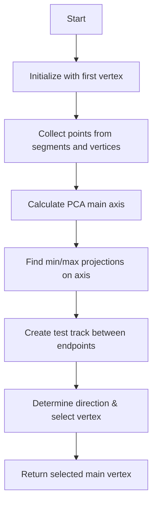

# Understanding compare_main_vertices_all_showers Function

## Purpose
The `compare_main_vertices_all_showers` function is designed to identify the most likely main vertex from a collection of candidate vertices in a particle shower scenario. This is particularly important for neutrino interaction reconstruction where all tracks are identified as showers.

## High-Level Algorithm Flow



## Detailed Implementation Analysis

### 1. Initial Setup
```cpp
WCPPID::ProtoVertex *temp_main_vertex = vertex_candidates.front();
PointVector pts;
```
- Function takes input candidate vertices and initializes with the first one
- Creates empty vector to store points for analysis

### 2. Point Collection
```cpp
// Collect points from segments
for (auto it = map_segment_vertices.begin(); it!= map_segment_vertices.end(); it++) {
    WCPPID::ProtoSegment *sg = it->first;
    if (sg->get_cluster_id() != temp_main_vertex->get_cluster_id()) continue;
    if (sg->get_point_vec().size() > 2) {
        for(size_t i = 1; i+1 < sg->get_point_vec().size(); i++) {
            pts.push_back(sg->get_point_vec().at(i));
        }
    }
}

// Add vertex points
for (auto it = map_vertex_segments.begin(); it!= map_vertex_segments.end(); it++) {
    WCPPID::ProtoVertex *vtx = it->first;
    if (vtx->get_cluster_id() != temp_main_vertex->get_cluster_id()) continue;
    pts.push_back(vtx->get_fit_pt());
}
```

This section:
- Collects interior points from all segments (excluding endpoints)
- Collects points from all vertices
- Filters to ensure points belong to same cluster ID

### 3. Principal Component Analysis
If enough points are collected (>3), the function:
- Calculates the principal axis using PCA (Principal Component Analysis)
- Finds the center point and main direction of the shower

### 4. Vertex Selection
The function then:
1. Projects all candidate vertices onto the principal axis
2. Finds vertices with minimum and maximum projections
3. Handles special cases for short segments (<1cm)
4. Uses a weighted scoring system considering:
   - Distance from center
   - Position along principal axis
   - Number of connected segments

### 5. Direction Determination
```cpp
if (tmp_sg->get_flag_dir()==1) {
    temp_main_vertex = max_vtx;
} else if (tmp_sg->get_flag_dir()==-1) {
    temp_main_vertex = min_vtx;
} else {
    // Default to forward vertex if direction unclear
    if (max_vtx->get_fit_pt().z < min_vtx->get_fit_pt().z) {
        temp_main_vertex = max_vtx;
    } else {
        temp_main_vertex = min_vtx;
    }
}
```

The function determines the main vertex based on:
- The direction flag of the test track
- Z-coordinate position when direction is unclear
- Special handling for very large showers (>80cm)

## Special Considerations

1. **Short Track Handling**
```cpp
if (map_vertex_segments[*it].size()==1 && 
    (*map_vertex_segments[*it].begin())->get_length()<1*units::cm) {
    if (val >0) val -= 0.5*units::cm;
    else if (val <0) val += 0.5*units::cm;
}
```
Short segments receive special treatment to avoid biasing the vertex selection.

2. **Large Shower Handling**
```cpp
if (tmp_sg->get_length() > 80*units::cm && 
    fabs(max_vtx->get_fit_pt().z - min_vtx->get_fit_pt().z) > 40*units::cm) {
    // Select forward vertex
}
```
Very large showers (>80cm) get special handling with preference for the forward vertex.

## Return Value
The function returns a single ProtoVertex pointer representing the selected main vertex of the shower system.

## Function Dependencies

The function calls several other methods to accomplish its task:

1. **Point Cloud Operations**
   - `get_point_cloud_steiner()`: Gets the Steiner tree point cloud
   - `get_closest_wcpoint()`: Finds closest point in the cloud to a given position
   - `get_cloud()`: Retrieves the point cloud data

2. **Path Finding**
   - `dijkstra_shortest_paths()`: Finds shortest paths using Dijkstra's algorithm
   - `cal_shortest_path()`: Calculates the shortest path between points

3. **Vertex/Segment Operations**
   - `find_vertices()`: Gets vertices connected to a segment 
   - `find_other_vertex()`: Finds the other vertex connected to a segment
   - `get_wcpt()`: Gets the wire-cell point of a vertex
   - `get_fit_pt()`: Gets the fitted point position

4. **Geometry Functions**
   - `calc_PCA_main_axis()`: Calculates Principal Component Analysis axis
   - `cal_dir_3vector()`: Calculates direction vector
   - `get_length()`: Gets length of segment
   - `inside_fiducial_volume()`: Checks if point is inside fiducial volume

5. **Track Processing** [PR3DCluster](../PR3DCluster_multi_tracking.md)
   - `do_multi_tracking()`: Performs multi-track reconstruction
   - `build_pcloud_fit()`: Builds point cloud fit
   - `add_associate_point()`: Associates points with track
   - `build_kdtree_index()`: Builds k-d tree for point searching
   - `determine_shower_direction()`: Determines shower direction [see details](../pattern_recognition/protosegment_determine_shower_direction.md)

These dependencies show that the function relies heavily on:
- Point cloud processing
- Path finding algorithms
- Geometric calculations
- Track reconstruction tools

Understanding these dependencies is crucial for maintaining and modifying the code, as changes to any of these functions could impact the vertex comparison logic.

## Usage Example
```cpp
WCPPID::ProtoVertexSelection candidates;
// ... populate candidates ...
WCPPID::ProtoVertex* main_vertex = compare_main_vertices_all_showers(candidates, cluster);
```