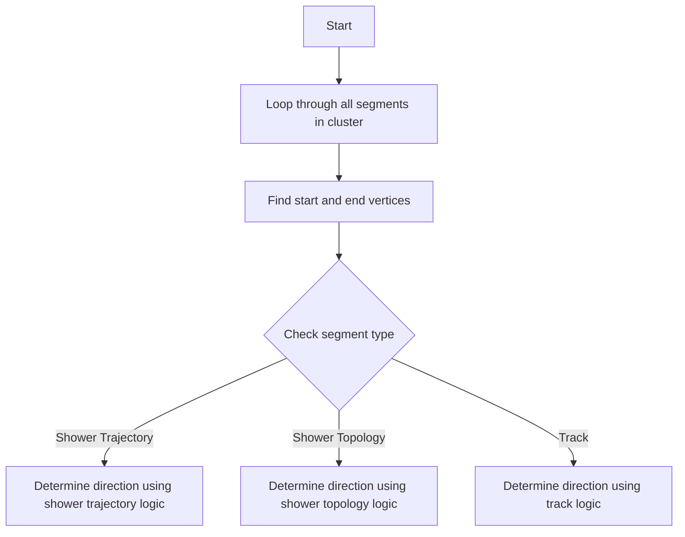

# NeutrinoID::determine_direction Function Documentation

## Purpose
This function determines the direction of all segments in a cluster, handling both shower-like and track-like segments differently.

## Logic Flow



## Detailed Steps

1. Loop through all segments in the cluster's map_segment_vertices
2. For each segment:
   - Find start vertex (corresponding to segment's front point)
   - Find end vertex (corresponding to segment's back point)
   - Based on segment type, call appropriate direction determination method

## Key Decision Points

The function branches into three different direction determination methods based on the segment's flags:

1. `get_flag_shower_trajectory()` - For shower-like segments identified by trajectory analysis
2. `get_flag_shower_topology()` - For shower-like segments identified by topology 
3. Neither flag set - Treated as a track

## Called Functions [ProtoSegment](../protosegment.md)

1. `determine_dir_shower_trajectory()` [see details](../pattern_recognition/protosegment_determine_shower_direction.md)
   - Parameters:
     - Number of connected segments at start vertex
     - Number of connected segments at end vertex
     - Debug print flag
   - Used for shower segments identified by trajectory

2. `determine_dir_shower_topology()` [see details](../pattern_recognition/protosegment_determine_shower_direction.md)
   - Parameters: 
     - Number of connected segments at start vertex
     - Number of connected segments at end vertex  
     - Debug print flag
   - Used for shower segments identified by topology

3. `determine_dir_track()` [see details](../pattern_recognition/protosegment_track.md)
   - Parameters:
     - Number of connected segments at start vertex
     - Number of connected segments at end vertex
     - Debug print flag
   - Used for track-like segments

## Error Handling

The function includes basic error checking for missing vertices:
```cpp
if (start_v==0 || end_v==0){
    std::cout << "Error in finding vertices for a segment " << std::endl; 
}
```

## Important Notes

- The function uses vertex connectivity (number of connected segments at each vertex) as a key input for direction determination
- Direction determination is segment-specific, with different logic for showers vs tracks
- The function maintains debug print capabilities that can be enabled per segment
