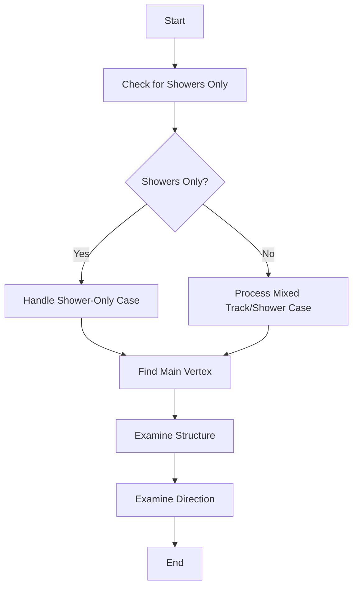

# determine_main_vertex Function Documentation

## Overview
The `determine_main_vertex` function is responsible for identifying the primary interaction vertex in a neutrino event. This is a crucial step in neutrino event reconstruction as it determines the starting point of the interaction and helps identify the outgoing particles.

## High-Level Logic Flow


## Key Components

### 1. Initial Flag Setting
```cpp
bool flag_save_only_showers = true;
for (auto it = map_vertex_segments.begin(); it!= map_vertex_segments.end(); it++) {
    WCPPID::ProtoVertex *vtx = it->first;
    if (vtx->get_cluster_id() != temp_cluster->get_cluster_id()) continue;
    auto results = examine_main_vertex_candidate(vtx);
    bool flag_in = std::get<0>(results);
    int ntracks = std::get<1>(results), nshowers = std::get<2>(results);
    if (!flag_in) {
        if (ntracks > 0) {
            flag_save_only_showers = false;
            break;
        }
    }
}
```
This code determines if the cluster contains only showers or has tracks as well. This is crucial for determining how to proceed with vertex identification.

### 2. Vertex Candidate Selection
The function creates a map of vertices to their associated tracks and showers:
```cpp
std::map<ProtoVertex*, std::pair<int, int>> map_vertex_track_shower;
WCPPID::ProtoVertexSelection main_vertex_candidates;
```

Selection logic differs based on whether we're dealing with:
- Shower-only case
- Mixed track/shower case

### 3. Shower-Only Case
In the shower-only case:
- All vertices with single connections are considered
- Additional vertices from track/shower map are included
- The function calls `compare_main_vertices_all_showers()`

[compare_main_vertices_all_showers](./compare_main_vertices_all_showers.md)

### 4. Mixed Track/Shower Case
For mixed cases:
1. Improves vertex mapping
2. Fixes track/shower mappings
3. Examines the structure of connections
4. Calls `compare_main_vertices()`

[compare_main_vertices](./compare_main_vertices.md)

### 5. Structure Examination
After main vertex selection:
```cpp
if (!flag_save_only_showers) {
    examine_structure_final(temp_cluster);
}
```
This examines the overall event structure to ensure consistency.

### 6. Direction Examination
```cpp
bool flag_check = examine_direction(main_vertex);
if (!flag_check) {
    std::cout << "Wrong: inconsistency for track directions in cluster " 
              << main_vertex->get_cluster_id() << std::endl;
}
```
Verifies that particle directions are consistent with physics expectations.

## Key Decision Points

### Main Vertex Candidate Selection
1. **For Shower-Only Events:**
   - Focus on topology and shower properties
   - Consider vertex connectivity
   - Look at spatial distribution

2. **For Mixed Events:**
   - Track momentum and direction
   - Vertex multiplicity
   - Track/shower ratios
   - Particle identification information

### Vertex Quality Metrics
The function uses several metrics to evaluate vertex quality:
- Number of connected tracks/showers
- Fiducial volume position
- Track/shower directions
- Particle identification scores
- Topological features

## Example Use Case

Consider a typical neutrino interaction:
```cpp
// Example vertex configuration
WCPPID::ProtoVertex* vertex = new ProtoVertex();
// Connected segments
map_vertex_segments[vertex].insert(track1);  // muon track
map_vertex_segments[vertex].insert(track2);  // proton track
map_vertex_segments[vertex].insert(shower1); // electron shower

// Function evaluates:
// 1. Track directions (should point outward)
// 2. Particle types (consistent with physics)
// 3. Topology (vertex position, segment connections)
// 4. Overall event structure
```

## Important Considerations

1. **Physics Constraints**
   - Conservation of momentum
   - Particle identification consistency
   - Track/shower characteristics

2. **Geometric Constraints**
   - Fiducial volume requirements
   - Track/shower angular distributions
   - Vertex position relative to detector boundaries

3. **Algorithmic Robustness**
   - Handles both simple and complex topologies
   - Accounts for detector effects
   - Manages ambiguous cases

## Common Challenges

1. **Multiple Vertex Candidates**
   - Solution: Scoring system based on physics and topology

2. **Ambiguous Track/Shower Classification**
   - Solution: Multiple metrics for particle identification

3. **Complex Event Topologies**
   - Solution: Hierarchical examination of event structure

## Function Call Hierarchy

### Direct Function Calls

1. `examine_main_vertex_candidate(ProtoVertex* vertex)` [more details](./examine_main_vertex_candidate.md)
   - Purpose: Evaluates if a vertex is a good candidate for being the main vertex
   - Returns: Tuple of (bool flag_in, int ntracks, int nshowers)
   - Key logic: Checks incoming/outgoing particles and their types

2. `improve_vertex(temp_cluster, false)` [more details](../NeutrinoID/NeutrinoID_improve_vertex.md)
   - Purpose: Refines vertex position and connections
   - Called only for main cluster when not in shower-only mode
   - Takes flag parameter for vertex activity search

3. `fix_maps_shower_in_track_out(temp_cluster->get_cluster_id())` [more details](./fix_maps.md)
   - Purpose: Corrects topology where showers enter and tracks exit
   - Called for main cluster in mixed track/shower case
   - Ensures physics consistency

4. `compare_main_vertices_all_showers(main_vertex_candidates, temp_cluster)` [more details](./compare_main_vertices_all_showers.md)
   - Purpose: Selects best vertex in shower-only case
   - Compares vertices based on shower characteristics
   - Returns selected main vertex

5. `examine_main_vertices(main_vertex_candidates)` [more details](../NeutrinoID/compare_main_vertices_global.md)
   - Purpose: Examines vertex candidates in mixed track/shower case
   - Prepares vertices for comparison

6. `compare_main_vertices(main_vertex_candidates)` [more details](./compare_main_vertices.md)
   - Purpose: Selects best vertex in mixed track/shower case
   - Uses physics and topology criteria
   - Returns selected main vertex

7. `examine_structure_final(temp_cluster)` [more details](../NeutrinoID/NeutrinoID_final_structure.md)
   - Purpose: Final check of event structure
   - Verifies consistency after vertex selection
   - Makes final adjustments if needed

8. `examine_direction(main_vertex)` [more details](./examine_direction.md)
   - Purpose: Verifies particle directions
   - Ensures physics consistency
   - Returns bool indicating success

9. `find_vertices(ProtoSegment*)`  [more details](../NeutrinoID/find_vertices.md)
   - Purpose: Gets vertices connected to a segment
   - Helper function for topology analysis
   - Returns pair of vertices

### Helper Functions Called Indirectly

1. `calculate_num_daughter_showers` [more details](./calculate_num_daughter_showers.md)
   - Called by examine functions
   - Counts shower-like segments

2. `find_other_vertex` [more details](../NeutrinoID/find_other_vertex.md)
   - Navigation helper
   - Finds opposite vertex of a segment

3. `cal_dir_3vector` [more details](../protosegment.md)
   - Calculates direction vectors
   - Used in topology analysis

4. `get_length`
   - Gets segment lengths
   - Used in multiple comparisons

5. `get_medium_dQ_dx`
   - Gets energy deposition
   - Used in particle identification

### Example Call Flow
```cpp
determine_main_vertex()
├── examine_main_vertex_candidate()  // Initial screening
├── improve_vertex()                 // If mixed case
├── fix_maps_shower_in_track_out()   // If mixed case
├── compare_main_vertices()          // Or compare_main_vertices_all_showers()
├── examine_structure_final()        // Final checks
└── examine_direction()              // Direction verification
```

## Conclusion
The `determine_main_vertex` function employs a sophisticated combination of topological, calorimetric, and particle identification information to identify the primary neutrino interaction vertex. Its modular structure allows for handling various event types while maintaining physics consistency.