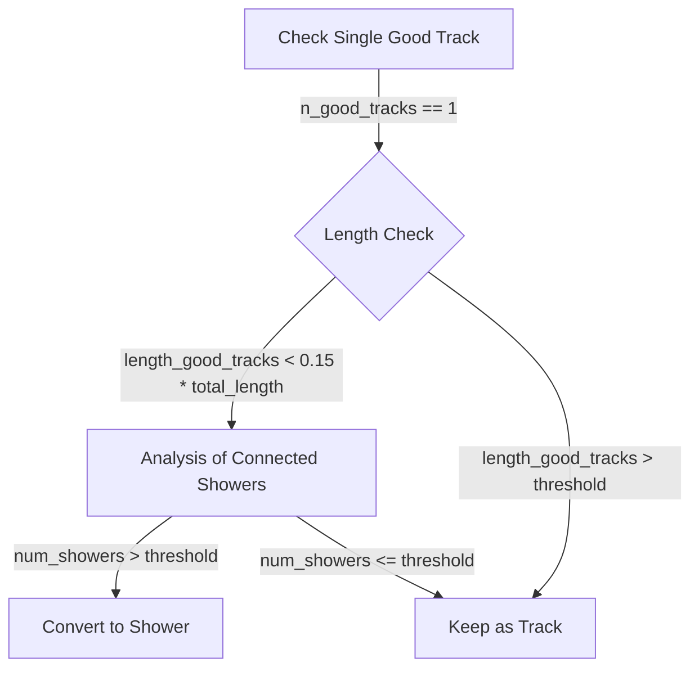

# Analysis of examine_all_showers() Function

## Overview
The `examine_all_showers()` function is a complex method in the Wire-Cell neutrino reconstruction code that analyzes and classifies segments in a cluster as either showers or tracks. It performs several key tasks:

1. Counts and measures segments in the cluster
2. Analyzes segment properties (length, direction, connection patterns)
3. Makes decisions about reclassifying segments between shower and track types

## Key Concepts

### Track vs Shower Classification
- **Tracks**: Long, straight segments typically from muons or protons
- **Showers**: Branching, spread-out segments typically from electrons/photons

### Important Parameters
```cpp
// Key length thresholds
double length_good_tracks = 0;  // Total length of tracks with clear direction
double length_tracks = 0;      // Total length of other tracks  
double length_showers = 0;     // Total length of shower segments

// Counting segments
int n_good_tracks = 0;   // Number of tracks with clear direction
int n_tracks = 0;        // Number of other tracks
int n_showers = 0;       // Number of shower segments
```

## Main Analysis Flow

### 1. Initial Segment Analysis
```cpp
// First pass - count and measure segments
for (auto it = map_segment_vertices.begin(); it != map_segment_vertices.end(); it++) {
    WCPPID::ProtoSegment *sg = it->first;
    double length = sg->get_length();
    
    if (sg->get_flag_shower()) {
        n_showers++;
        length_showers += length;
    } else {
        if (sg->get_flag_dir()!=0 && (!sg->is_dir_weak())) {
            n_good_tracks++;
            length_good_tracks += length;
        } else {
            n_tracks++; 
            length_tracks += length;
        }
    }
}
```

### 2. Decision Logic for Reclassification

The function uses several criteria to decide if segments should be reclassified:

#### A. Single Good Track Analysis


#### B. All-Shower Check
If the cluster appears to be all showers:
```cpp
if (flag_save_only_showers) {
    for (auto it = map_segment_vertices.begin(); it != map_segment_vertices.end(); it++) {
        WCPPID::ProtoSegment *sg = it->first;
        if (!sg->get_flag_shower()) {
            sg->set_particle_type(11);  // Convert to electron shower
        }
    }
}
```

### 3. Length-Based Criteria
Segments are reclassified based on length ratios:

- If `length_tracks < 1/3 * length_showers`:
  - Short tracks likely part of shower
- If `length_tracks < 35*units::cm && length_tracks + length_showers < 50*units::cm`:
  - Compact cluster analysis

## Special Cases

### 1. Main Vertex Connected Segments
Special handling for segments connected to the main neutrino interaction vertex:
```cpp
if (temp_cluster == main_cluster) {
    // Additional checks for main cluster segments
    if (flag_only_showers) {
        // Convert undetermined segments to showers
    } else {
        // More rigorous track/shower separation
    }
}
```

### 2. Track Score Analysis
Uses a particle score system:
```cpp
double tracks_score = 0;
for (auto it = map_segment_vertices.begin(); it != map_segment_vertices.end(); it++) {
    WCPPID::ProtoSegment *sg = it->first;
    if (!sg->get_flag_shower() && sg->get_particle_score()!=100) {
        tracks_score += sg->get_particle_score();
    }
}
```

## Outcome
After analysis, segments are classified as:
- Electron showers (particle_type = 11)
- Muon tracks (particle_type = 13)
- Proton tracks (particle_type = 2212)

## Common Reclassification Scenarios

1. **Short Track to Shower**
   - Track length < 1/3 shower length
   - Low track score
   - Multiple shower connections

2. **Shower to Track**
   - Long straight segment
   - High dQ/dx
   - Few shower-like daughters

3. **Ambiguous Cases**
   - Uses angle and connectivity information
   - Considers pattern of connected segments
   - Evaluates total cluster properties

## Function Dependencies

### Called Methods
The `examine_all_showers()` function calls several other methods to perform its analysis:

1. **Segment Property Methods:**  [ProtoSegment](../protosegment.md)
   - `sg->get_length()`: Get segment length
   - `sg->get_cluster_id()`: Get cluster identifier
   - `sg->get_flag_shower()`: Check if segment is marked as shower
   - `sg->get_flag_dir()`: Get direction flag
   - `sg->is_dir_weak()`: Check if direction determination is weak
   - `sg->get_particle_score()`: Get particle identification score
   - `sg->get_particle_type()`: Get particle type
   - `sg->set_particle_type()`: Set particle type
   - `sg->set_particle_mass()`: Set particle mass
   - `sg->get_medium_dQ_dx()`: Get average charge deposition
   - `sg->get_direct_length()`: Get direct length between endpoints

2. **Vertex Analysis Methods:**
   - `find_vertices()`: Find connected vertices [see details](../NeutrinoID/find_vertices.md)
   - `find_other_vertex()`: Find vertex at other end of segment [see details](../NeutrinoID/find_other_vertex.md)
   - `calculate_num_daughter_showers()`: Count shower-like daughter segments [see details](./calculate_num_daughter_showers.md)
   ```cpp
   auto pair_result = calculate_num_daughter_showers(pair_vertices.first, sg);
   // Returns: pair<int num_showers, double total_length>
   ```

3. **Direction Analysis Methods:**
   - `sg->cal_dir_3vector()`: Calculate direction vector
   ```cpp
   TVector3 dir1 = sg->cal_dir_3vector(vtx->get_fit_pt(), 15*units::cm);
   ```

4. **Momentum Calculation:**
   - `sg->cal_4mom()`: Calculate 4-momentum after classification changes
   ```cpp
   if (sg->get_particle_4mom(3)>0) {
       sg->cal_4mom();
   }
   ```

### Helper Methods

The function also uses several helper methods to support its analysis:

1. **find_vertices(ProtoSegment* sg)**
```cpp
std::pair<ProtoVertex*, ProtoVertex*> find_vertices(ProtoSegment* sg) {
    // Returns pair of vertices connected to segment
    return std::make_pair(start_vertex, end_vertex);
}
```

2. **calculate_num_daughter_showers(ProtoVertex* vtx, ProtoSegment* sg)**
```cpp
std::pair<int, double> calculate_num_daughter_showers(
    ProtoVertex* vtx, 
    ProtoSegment* sg,
    bool flag_count_shower = true
) {
    // Returns number of shower-like daughters and total length
    return std::make_pair(number_showers, acc_length);
}
```

### Utility Functions

Several utility functions are used for measurements and calculations:

1. **Length and Distance Calculations:**
   ```cpp
   double direct_length = sg->get_direct_length();
   double length = sg->get_length();
   ```

2. **Angle Calculations:**
   ```cpp
   double angle = dir1.Angle(dir2)/3.1415926*180.;
   ```

3. **Charge Measurements:**
   ```cpp
   double dQ_dx_ratio = sg->get_medium_dQ_dx()/(43e3/units::cm);
   ```

## Example Scenarios

### Scenario 1: Short Track with Many Shower Connections
```cpp
// Example threshold checks
if (length < 5*units::cm && 
    nshowers >= 2 && 
    length_tracks < 0.18 * length_showers) {
    // Convert to shower
    sg->set_particle_type(11);
    sg->set_particle_mass(mp.get_mass_electron());
}
```

### Scenario 2: Long Track Analysis
```cpp
if (length > 35*units::cm && 
    !sg->get_flag_shower() &&
    sg->get_medium_dQ_dx() > threshold) {
    // Likely a muon track
    sg->set_particle_type(13);
    sg->set_particle_mass(mp.get_mass_muon());
}
```